# Тени Арго

## Оглавление
- [Глава первая. Мур-муры](#глава-первая-мур-муры)
- [Глава вторая. Ценный груз с запахом](#глава-вторая-ценный-груз-с-запахом)
- [Глава третья. Предел прочности](#глава-третья-предел-прочности)
- [Глава четвёртая. Незапланированно-контролируемое отделение](#глава-четвёртая-незапланированно-контролируемое-отделение)
- [Глава пятая. Холодная война за горячую воду](#глава-пятая-холодная-война-за-горячую-воду)
- [Глава шестая. Стихотворный десант](#глава-шестая-стихотворный-десант)
- [Глава седьмая. Легионер в космосе](#глава-седьмая-легионер-в-космосе)
- [Глава восьмая. Две тени за спиной капитана](#глава-восьмая-две-тени-за-спиной-капитана)
- [Глава девятая. Жребий брошен, или Рубикон длиной в коридор](#глава-девятая-жребий-брошен-или-рубикон-длиной-в-коридор)
- [Глава десятая. Цирк уехал, клоуны остались](#глава-десятая-цирк-уехал-клоуны-остались)
- [Глава одиннадцатая. Один за всех...](#глава-одиннадцатая-один-за-всех)
- [Глава двенадцатая. Коэффициент сплочённости](#глава-двенадцатая-коэффициент-сплочённости)
- [Глава тринадцатая. Круг доверия или Шифрование уровня БОГ](#глава-тринадцатая-круг-доверия-или-шифрование-уровня-бог)
- [Глава четырнадцатая. Сокровища тишины](#глава-четырнадцатая-сокровища-тишины)
- [Глава пятнадцатая. Выгода любой ценой](#глава-пятнадцатая-выгода-любой-ценой)
- [Глава шестнадцатая. Доверяй, но проверяй](#глава-шестнадцатая-доверяй-но-проверяй)
- [Глава семнадцатая. Чёрная метка](#глава-семнадцатая-чёрная-метка)
- [Глава восемнадцатая. Из мира света — в царство теней](#глава-восемнадцатая-из-мира-света-—-в-царство-теней)
- [Глава девятнадцатая. Призрачный гарнизон](#глава-девятнадцатая-призрачный-гарнизон)
- [Глава двадцатая. ...И все за одного](#глава-двадцатая-и-все-за-одного)
- [Глава двадцать первая. Зов совести](#глава-двадцать-первая-зов-совести)
- [Глава двадцать вторая. Курс молодого бойца, или Принцип зажмуривания](#глава-двадцать-вторая-курс-молодого-бойца-или-принцип-зажмуривания)
- [Глава двадцать третья. У порога](#глава-двадцать-третья-у-порога)
- [Глава двадцать четвёртая. Симфония души](#глава-двадцать-четвёртая-симфония-души)

---

## Глава первая. Мур-муры

Коммуникатор запищал и выдал сообщение:

— Капитан, на поверхности тихо и спокойно. Никаких следов активности. Если это и был когда-то домашний мир Ммрнмхрм, то теперь он больше похож на свалку металлолома. Только сломанные запчасти наших Мур-муров, песок, пыль, запустение.

Я медленно опустился в кресло, уставившись на экран коммуникатора.

«Куда подевались эти Мур-муры?» — пронеслось в голове.

Земляне издавна прозвали Ммрнмхрм Мур-мурами. Ещё в мою бытность курсантом я спросил командира, откуда взялось это название. Он усмехнулся: «А ты сам попробуй выговорить Ммрнмхрм!.. А почему именно Мур-муры, уже никто, наверное, и не вспомнит. Вероятно, искали что-то созвучное и простое».

«Короче, Мур-муров нет, и куда делись — непонятно», — подумал я и снова нажал кнопку коммуникатора.

— Билли, больше ничего интересного не нашли?

— Ну как сказать, капитан. Нашли их материнский ковчег. Но особо интересным это, пожалуй, не назовёшь, потому что он сломан. Его массивные двери заблокированы. Внутри никаких признаков активности. Ни звуков, ни шорохов. Вот только на главных створках нацарапаны английские буквы с точками: «B.S.S.» и всё.

— Что ещё за B.S.S.? Black SS? Негры-эсэсовцы, что ли?!

— Вам виднее, капитан. Может, и негры-эсэсовцы, — в селекторе послышались тихие смешки и едва различимый шёпот лейтенанта Билли: — Тихо, парни, тш-ш-ш!

— Ладно, Билли. Возвращайтесь. Отбой.

Остаток дня я крутил эту аббревиатуру в уме так и эдак...

Bad Signal Syndrome — Плохой Сигнальный Синдром?

Busy Sleeping Students — Занятые Спящие Студенты?

Bearded Scientists Society — Общество Бородатых Ученых?

Bigger Snack Strategy — Стратегия Большого Перекуса?

— Так, хватит! — сказал я себе, вконец измучившись. — На перекусах и остановимся. Давно пора перекусить.

***

Следующие несколько дней мы провели в гипере. Улов был неплохим, и мы возвращались домой, чтобы пополнить запасы и немного перевести дух.

И вот уже Солнце вырастает на радарах корабля, и вот Земля с её до сих пор непривычным красным сиянием, и станция — наш «Последний Рубеж сопротивления» и в то же время  колыбель «Нового Альянса Свободных Звёзд».

И как всегда спокойный голос Хейса: «С возвращением, капитан!»

И наше стандартное: «Командор, у меня трюмы полны минералов!»

И едва заметная улыбка в уголках глаз Хейса: «А другого я от вас и не ждал, капитан!»

***

Разгрузили нас довольно быстро. Ещё немного подлатают, заправят... Хейс сказал, что за время нашего отсутствия был построен ещё один земной крейсер, и это хорошо. Дополнительная огневая мощь нам явно не помешает. С каждым разом мы забираемся всё дальше и дальше в гипер. Старых союзников найти не удаётся. Времени проходит всё больше, а жить становится всё страшнее...

Надо будет в следующий раз поискать в другом направлении. Не могли же все провалиться сквозь землю. Может, Шофиксти или Йехаты живы и согласятся примкнуть к нашей борьбе.

Трель звонка прервала тишину.

— Сим-сим, откройся, — скомандовал я входной двери.

Дверь быстро скользнула в сторону. А в проёме стоял Хейс с поднятыми вверх руками. В одной он держал заварник, в другой — две кружки. И эта едва уловимая улыбка в уголках глаз, которую почему-то никто не видит.

— Салют, дружище! Ни за что не угадаешь, что я тебе сегодня принёс! — радостно воскликнул Хейс.

— Дай догадаюсь, зелёный чай?

— Зелёный чай, — лицо Хейса вдруг тронула тень удивления. — А ты откуда знаешь?

— Да встретил тут твоего подчинённого, которого ты «раскулачил».

Хейс сел напротив, налил чай и протянул одну чашку мне.

— Ну, ты скажешь тоже — «раскулачил»! Так, по-дружески отсыпал немного... Давай рассказывай, что нового удалось обнаружить?

— Да вот удалось обнаружить, что ты всегда как-то хитро, но по-доброму улыбаешься краешком глаз. Но удалось обнаружить это только мне, а другим это почему-то обнаружить не удаётся. Не знаешь почему?

Хейс захохотал.

— Да они просто не на то смотрят. Они смотрят в глаза, а ты — внутрь. Может, поэтому я тебе и поверил, при первой нашей встрече... Поверил, что если кто и сможет собрать новый альянс и поставить Ур-Куанов на их эквиваленты коленей, как ты тогда остроумно выразился, то только ты. — Хейс скинул обувь, а на мой вопросительный взгляд добавил: — Затекают. Ты же не против?

— Да на здоровье! Нам нужно, чтобы всё было в максимально рабочем состоянии. И станция, и пушки, и ноги.

— Ну так что вам удалось найти? — вернул наш разговор в конструктивное русло Хейс.

— Извини, друг, не хочется тебя расстраивать, но похвастаться особо нечем. Сначала мы направились к Ченджесу, по тем координатам, которые ты дал. Ну, ты нас и отправил в муравейник, я тебе скажу! Вернее, в паучятник. Ильрафы на каждом шагу. Хорошо, что они тихоходные, но пару раз всё равно не получилось уйти и пришлось принимать бой. Ты же пробоины на нашем корабле видел? Те, что в виде художественного орнамента на правом борту?

— Видел, — он на мгновение погрузился в свои мысли.

Я глотнул чаю, чтобы немного смочить горло.

— А чай очень даже ничего!

Хейс улыбнулся:

— При нашем скудном рационе любое разнообразие — праздник.

Он откинулся на спинку кресла. Было видно, что напряжение, которое постоянно держит его в тонусе, начало немного отступать. Всё-таки тысячи людей в подчинении, и всем ты за отца, за мать. Хейс — на станции, я — на корабле. Наверное, поэтому мы и смогли так быстро найти общий язык и сдружиться.

— Да ты рассказывай, не томи, — решил поторопить мои мысли Хейс.

— А что рассказывать? Ну, дошли мы до Проциона. Нашли такой же рабский щит, как на Земле, только в отличие от нас, у них ещё и станция не работает. Полностью в автоматическом режиме и роботы охраняют. Пришлось лететь дальше.

— К Мур-мурам? — Хейс улыбнулся так, будто это он сам когда-то придумал им это прозвище. — Там рядом.

Там действительно было недалеко, поэтому достижение «Провидец» я Хейсу не засчитал.

— К ним... Рабского щита нет, — продолжил я. — Спустились. Там сломанные запчасти Мур-муров, материнский ковчег, похоже, тоже сломан. На главном входе какие-то негры свои инициалы нацарапали.

— Какие негры? — удивился Хейс.

— А я откуда знаю, какие? Эсэсовцы какие-то. Я весь обратный полёт ломал голову, что бы это могло значить, но, как говорится, никаких идей.

У Хейса выражение лица становилось всё удивлённей и удивлённей.

— А что конкретно там было написано?

— Три английские буквы с точками, аббревиатура «B.S.S.».

Я потянулся за кружкой. Захотелось сделать пару глотков и тоже откинуться на спинку, как Хейс, и расслабиться.

— B.S.S.?

И в этот момент выражение лица Хейса вновь стало привычным: спокойным, уверенным, с его фирменной, едва уловимой улыбкой в уголках глаз.

— Да. B.S.S.

— Black Spathi Squadron? Чёрный эскадрон Спасси?

«Да-а-а-а! ДА! Да!»

«Как я сам не догадался!? Ай да Хейс! Ай да молодчина!»

Мгновенно перед моим взором пронеслись все открывающиеся перспективы!

«Извините, Шофиксти, извините, Йехаты. Но, кажется, вам придётся подождать.»

После того как Спасси трусливо спрятались под рабским щитом, мы потеряли львиную долю своей мощи. Под рабским щитом им не нужны были корабли, они их и не взяли. А обидней всего было то, что все корабли оставались в рабочем состоянии, но не было тех, кто поднимет их в небо. И если примитивную работу — принеси-подай — могли делать люди, то за пульт управления всё равно требовался Спасси. У нас был огромный флот Спасских «Зайцев», не было только самих «зайцев». Но, кажется, теперь мы можем получить огромный флот Спасских «Клинков»!

Надо только найти этих негров-эсэсовцев.

«Не знаю, в какую дыру вы забрались, но я уже иду за вами!»

------------

------------
------------
------------

## Глава вторая. Ценный груз с запахом

Коммуникатор запищал с таким надрывом, будто его оскорбили лично.

— Капитан, вы бы хоть пояснили, что мы ищем? — раздался голос Билли.

«Ох, Билли, — мысленно вздохнул я. — Если бы у меня было хоть малейшее представление о том, что мы ищем...»

Ну, то есть я, конечно, знал. В теории. Мы ищем Чёрный Эскадрон Спасси. Но вот незадача — мы уже были здесь, на луне их родного мира, и не увидели ровным счётом ничего, кроме всеобщего запустения. А было это ещё тогда, когда все Спасси дружно вспомнили, что забыли выключить дома утюг и с позором рванули на родную планету, захлопнув за собой рабский щит — штуку настолько непробиваемую, что сквозь неё не пролезают даже дурные мысли, не то что корабли. И всё, что осталось нам, — это разводить руками и чесать затылок.

«Если бы я знал, что мы ищем», — снова повторил я сам себе.

Билли, разумеется, ждал внятного ответа, а не моих философских терзаний.

— Билли, мы ищем зацепки, — сказал я, стараясь, чтобы голос звучал уверенно. — Поройтесь во всём, что выглядит хоть сколько-нибудь подозрительно. В компьютерных базах, в архивах, мусорных вёдрах, под половицами, если придётся. Ты же сам понимаешь, насколько это важно.

— Понимаю, капитан. Не переживайте, мы поищем. Заглянем в каждую щель, если понадобится. Отбой.

***

Коммуникатор умолк, оставив меня наедине с тягостным чувством безнадёжности. «Ну, сколько шансов, что они там что-то найдут? Мы же уже всё обшарили в прошлый раз. С другой стороны, больше никаких зацепок всё равно нет. Так что и выбора нет... Будем искать.»

Билли был командиром разведки и руководил всеми нашими вылазками на планеты. У меня никогда не было нареканий к его работе. Он всё и всегда делал тщательно, качественно и в срок. Если кто-то что-то там и сможет найти, то это Билли с его командой.

«Будем искать...» — снова мысленно повторил я.

За минутами тянулись минуты. За часами — часы. Время шло, и ожидание становилось всё тягостнее. Ведь для чего нужен капитан на нашем корабле в момент исследовательской миссии на планете?

Правильно! Ни для чего!

Корабль никуда не летит. Процессы все остановлены. Единственная активность сейчас на планете, где всем мастерски заправляет Билли. Капитану же остаётся сидеть, бездельничать, ногой качать и дырки на скатерти изучать... Надо бы какого-нибудь котёнка завести, что ли. Для моральной поддержки.

Да где его взять?

Все котята под рабским щитом на Земле. И вроде в войне с Ур-Куанами не участвовали, а тоже оказались под арестом!

«Преступники-рецидивисты!» — подумал я и сам рассмеялся от этой нелепой аналогии.

Кажется, я уже много раз про это упоминал в нашей кают-компании и, похоже, всех порядком утомил этими разговорами.

И тут наконец-то мои многочасовые мучения прервал сигнал коммуникатора.

«А вот и Билли, — подумал я, и на лице сама собой расплылась улыбка. — Хороший он парень».

Я активировал канал связи и подался вперёд.

— Ну что там, Билли? Есть хорошие новости?

Я всё ещё лелеял слабую надежду, что мы хоть что-то найдём. Улетать с пустыми руками не хотелось категорически, ведь других версий, где искать этих чёрно-красных есаулов, у нас не было.

— Извините, капитан, но порадовать вас нечем, — в голосе Билли слышалась неподдельная досада. — Понятно, что мы не можем заглянуть в каждый дом, под каждый куст и в каждую норку местной фауны, но все самые важные точки мы прошерстили тщательнейшим образом. Командный пункт, космодром, правительственные здания... Компьютеры, которые смогли найти, распечатки, стикеры на стенах... Никаких следов Чёрного Эскадрона. Никаких упоминаний о нём.

— Вы сейчас где, Билли?

— Около гиперволнового передатчика, который мы в прошлый раз не смогли забрать. Вы же помните, мы тогда под завязку были забиты, даже в проходах ящики с минералами стояли, некуда было ставить эту громадину с трёхэтажный дом...

Билли выдержал паузу. Он частенько так делал, давая возможность сказать мне что-либо важное, но сейчас мне сказать было нечего. Надежды приобрести флот Спасских «Клинков» утекали, как вода сквозь пальцы.

— Ну так что, мы его грузим? Капитан?

— Да, Билли. Грузите. Вещь полезная, в хозяйстве пригодится. Отбой.

***

Голова опять включилась в работу. Снова настаёт моё время. Я должен решить, куда нам лететь и с какой целью.

«Итак, — сказал я сам себе. — Кто может знать, где искать Эскадрон? Мелнормы? Возможно. Но, как известно, их информация стоит дороже, чем золотой унитаз командующего Ур-Куанов, так что пока отложим этот вариант. Кто-то из соседей Спасси? Умга? Возможно. Эти весельчаки-хохмачи сначала обрадуются тебе, как старому другу, потом по-дружески расскажут пару сотен неуместных шуток, а потом так же по-дружески поджарят тебе зад из дезинтегратора. Боя с ними не избежать в любом случае. Радует одно — поболтать они любят, так что можно попытаться их разговорить. Что мы имеем в сухом остатке? Мелнормы с их оверпрайсом и Умга с дезинтегратором. Замечательные расценки в этом супермаркете, — я рассмеялся. — Прямо даже и не знаю, что выбрать?»

Но тут мои невесёлые размышления прервал сигнал ЭКСТРЕННОГО вызова.

«А это что-то новенькое», — подумал я и нажал кнопку.

— Да, Билли? Что у вас стряслось?

— Капитан, мы тут вам котёнка нашли... — Билли выдержал паузу, достойную мхатовской сцены.

— Ну чего молчишь? Говори! — сказал Билли куда-то в сторону.

— Привет, капитан! Привет, мои самые лучшие друзья человреки! — На меня смотрел огромный, знакомый до слёз зелёный глаз, в котором читалась смесь паники и надежды.

— Фвиффо, ты?!

— Я, капитан! Я!.. Как я рад, что вы снова прилетели спасти меня и заботиться обо мне, и оберегать...

— Стоп, стоп, стоп, Фвиффо! Мы совсем не за этим сюда прилетели.

Фвиффо, казалось, выглядел расстроенным после таких слов, хотя как быть уверенным, что написано у него на лице, если и лица-то у него нет. Один большой глаз на всё лицо.

— Билли, где вы его нашли?

Билли явно оживился:

— О, капитан, это самое интересное! Мы начали поднимать гиперволновой передатчик, чтобы загрузить его в челнок, а под ним — вход в бункер. Открываем, а там этот Барсик сидит. Перепуганный, чумазый, запах оттуда идёт, я вам скажу... Сильно, короче, он испугался. Не розами пахнет. Ну, вы поняли. И смотрит на нас сиротским глазом, явно с надеждой, что не запечатаем бункер снова. Прямо как осиротевший котёнок.

Я снова перевёл взгляд на Фвиффо.

— Слышишь, Фвиффо? Говорят, ты как бездомный котёнок.

— Мяу, капитан, — не растерялся Фвиффо.

«Ну, понятное дело, — подумал я. — Он сейчас готов хоть мяукать, хоть на задних лапках танцевать, лишь бы его не оставили в этом пахучем убежище».

— Так, Билли, грузите передатчик, берите этого Барсика и возвращайтесь. Бункер обследовали?

— Так точно, капитан. Там была пара компьютеров, мы их не успели изучить, но берём с собой. В остальном всё чисто. Больше ничего.

— Принял, Билли. Конец связи.

***

Люк челнока открылся с шипящим звуком, и в коридор повалил тот самый знаменитый «аромат» бункера. А следом за ним, пугливо озираясь своим единственным глазом, трусливо выполз Фвиффо. Он замер посреди помещения, дрожа всеми щупальцами.

«Что ж, — вздохнул я. — Самое время выяснить, как этот “котёнок” умудрился загреметь под домашний арест с таким солидным замком».

Я устало провёл рукой по лицу.

— Ну что, Фвиффо, пришло время ответить на главный вопрос. Как ты оказался в этом бункере? Только, ради бога, не начинай свою историю с большого взрыва, постарайся изложить историю немного покороче.

Его глаз заморгал с такой частотой, словно он передавал сигнал бедствия на азбуке Морзе.

— О, капитан! Мой самый мудрый и, я уверен, милосердный спаситель! Этот вопрос пронзает моё бедное, трепещущее сердце острой пикой ностальгии и... и лёгкой, совсем крошечной обиды! Но я не виню их! Нет-нет, ни в коем случае! Они, мои дорогие, любимые, единственные сородичи действовали из самых лучших, ну, или, по крайней мере, из самых понятных побуждений! Видишь ли, после того небольшого... э-э-э... недоразумения с координатами, после которого прямиком к нашему тайному убежищу на луне Глиб-Глаб прилетели вы, наш дорогой спаситель и благодетель...

— Фвиффо, к делу. Бункер.

— Да, бункер! Конечно! Прекрасное, хоть и немного душное местечко, если честно. Запах, конечно... напоминает мне о том времени, когда мой бедный двоюродный брат, Фвоффо, решил спрятаться в вентиляционной шахте от Воображаемого Монстра Тьмы и пролежал там три цикла, пока его не нашли по... О, это совсем другая история! Так вот, они сказали, а сказали это мне на Совете Старейших, знаете ли, их глаза были наполнены... ну, не слезами, у нас нет слёзных желёз, скорее, это была особая влажная печаль... они сказали: «Фвиффо, наш дорогой, хоть и неизлечимо бестолковый собрат! Твоя способность навлекать беду достигла такого величия, что мы в целях всеобщего блага, а также для твоей же личной безопасности...»

— ...решили запереть тебя.

— ЗАПЕРЕТЬ? О, нет-нет-нет! Это такое грубое слово! Они... обеспечили мне максимально безопасную, контролируемую среду обитания! Да! Без окон, без дверей, без каких-либо случайных гиперпространственных коммуникаторов, которые могли бы случайно активироваться от моего чиха и послать оскорбительное сообщение прямо Верховному Командующему Ур-Куанов! Это был акт высшей заботы! Правда, единственный выход они заблокировали тем самым гиперволновым передатчиком... Ты только вдумайся, капитан! Целым передатчиком! Таким большим, ценным и... и тяжёлым! Они так беспокоились, что я могу его случайно сдвинуть, что приложили титанические усилия, чтобы привалить его прямо к люку! Вот что значит истинная братская любовь! Они буквально похоронили меня в заботе! Ну, в метафорическом смысле, конечно. Хотя, если подумать о запахе и полном одиночестве...

Я смотрел на него, и у меня начинала болеть голова.

— Погоди. Ты хочешь сказать, что тебя посадили в бункер и завалили единственный выход передатчиком размером с дом... чтобы ты «больше не навлекал беду»?

— Именно! Наконец-то ты понял! Это был не акт отчаяния или жестокости, а продуманная, превентивная... изоляционная тактика! Они даже оставили мне несколько компьютеров! Правда, без доступа в сеть... и всего с одной игрой — «Угадай, в какой трубе прячется Смертоносный Космический Монстр». Я проиграл все десять тысяч раз. Это было утомительно. Но зато я был в безопасности! И все остальные были в безопасности от меня! Все в выигрыше! Ну, кроме, возможно, моего чувства клаустрофобии и социальной потребности в общении, но кто сейчас учитывает такие мелочи в эпоху галактической угрозы?

Я вздохнул и потёр переносицу.

— Понятно. В общем, тебя выкинули с корабля, как балласт.

— «Выкинули»... О, опять это челомбрячье отсутствие тонкости! Я же говорю, меня... э-э-э ... тактически разместили в наземном стабилизаторе непредвиденных обстоятельств! И знаешь, что я понял, сидя там в тишине, под периодический скрежет песка о металл, который мне казался шагами Огромного Космического Муравья-Убийцы?.. Я понял, что они были правы! Абсолютно, на все сто процентов, безоговорочно правы! Лучше сидеть в бункере, чем быть причиной... активации Протокола Эскалации Ненависти у Ильрафов! Это же чистый, ничем не разбавленный ужас! Представь: я всего лишь хотел послать им поздравительную голограмму по случаю Великого Праздника Сорока Четырёх Очей, когда Догар взирает на все сорок четыре плоскости бытия, а Казон слушает сорок четыре шёпота забвения, а мой дрожащий щупалец случайно зацепил настройки, и вместо «поздравляю» они получили развернутую схему бомбардировки их священной паутины... с пометками «одобрено и проверено Спасси»! Они до сих пор ищут виновного, капитан! И у них очень, ОЧЕНЬ острые когти! Ну, ты знаешь... Капитан, ты же сейчас не передумаешь и не выбросишь меня обратно, правда? Я буду тихим! Я буду полезным! Я могу... мяукать! Мяу! Смотри, как у меня получается!

Я смотрел на это прыгающее и мяукающее существо и чувствовал, как во мне борются смех и отчаяние.

— Хорошо, но я буду звать тебя Фиво, а то от твоего имени у меня уже язык болит.

Его единственный глаз засиял, как миниатюрная зелёная звезда.

— О, капитан, это отличная идея! Я всеми своими щупальцами за! Я даже могу быть Барсиком, если хотите! Мяу! Смотрите, я уже почти освоил этот сложный земной диалект!

— Нет, достаточно лишь немного упростить твоё имя. А Барсиком теперь тебя и так уже будет называть весь экипаж. Они все слышали шутку Билли. Так что ты уж не обижайся. Но лично для меня это перебор. Я торжественно нарекаю тебя Фиво! Отныне и навеки веков... А теперь к делу. Ты, как видный представитель своего... э-э-э... беспокойного народа, не слыхал ли, где может находиться Чёрный Эскадрон Спасси?

Он издал тихий, похожий на свист чайника, звук.

— О-о-о... Вы говорите о... них. О тех, чьи имена мы произносим шёпотом, предварительно заперев все люки и выключив свет! Безумные отступники! Головная боль наших старейшин и живое воплощение кошмара для любого здравомыслящего Спасси! Их философия — это извращение самой сути нашего бытия! Зачем бежать навстречу опасности, когда можно бежать от неё, желательно по сложной траектории и с громкими воплями?

— Философию оставим на потом. Просто скажи, где их искать, если знаешь.

Так вот в чём дело! Мы не могли найти следы не потому, что их не было, а потому, что их просто стёрли. Не из компьютеров — из памяти. Эти «безумцы» оказались настолько чужеродной идеей для своего народа, что само их существование стало табу. Забавный парадокс: самый трусливый народ в галактике проявил редкую решительность, единодушно вычеркнув тех, кто отважился сражаться. Жутковатое единство, основанное на общем страхе перед самим понятием «храбрость».

— Ну, если подумать... мой бедный, перепуганный мозг пытается выудить из глубин памяти хоть что-то полезное... Ах да! Была одна история! Древняя, как реликтовое излучение, но весьма показательная! Я слышал, что у вас, челдабреков, есть поговорка: «Гром не грянет, мужик не перекрестится». Так вот, Чёрный Эскадрон живёт по принципу: «Гром ещё даже не родился в грозовой туче, а мы уже крестимся, превентивно запускаем ракеты по туче, а затем эвакуируем всю звёздную систему на всякий случай»!

— И к чему это всё?

— А к тому, капитан! Ярчайший пример — история с этими... э-э-э... Мур-мурами, да. Они, представьте себе, попытались основать колонию в системе Бета Геркулеса! А система эта, по нашему скромному мнению, исторически, культурно и, главное, идеологически, считалась сферой влияния Спасси! Мы, разумеется, не стали устраивать сцен. Нет! Мы вежливо, очень вежливо, почти на цыпочках подползли к ним и объяснили, что здесь... витает одно очень, очень древнее и крайне недоброе проклятие. Мы не знаем, чьё оно и откуда, но оно наводит порчу на все технологические системы и приносит неудачу любым долгосрочным начинаниям. Корабли глохнут, компьютеры сходят с ума, а чай вечно остывает на полминуты раньше, чем нужно! Цивилизованному существу здесь просто не выжить! Они, надо отдать должное, всё поняли и любезно улетели. И больше никогда нас не беспокоили. Вот что значит истинная цивилизованность!

— И что, Эскадрону этого было мало?

— О, капитан, для обычного Спасси инцидент был исчерпан! Но для них, этих чёрно-красных психопатов, это стало сигналом тревоги! Они провели своё собственное, очень «глубокое» расследование и пришли к выводу, что если побеспокоили один раз, то побеспокоят и второй! И решили, что лучшая защита — это нападение! Или, в их случае — упреждающее, тотальное и демонстративное устранение даже самой призрачной угрозы раз и навсегда! Они посчитали Мур-муров «явной и нарастающей опасностью»! Так что, если где-то и можно искать их следы, так это на Бете Геркулеса.

— А могли они там организовать свою базу, чтобы... как бы это поточнее сказать... «мониторить угрозу»?

— С точки зрения обычного Спасси, это полное нарушение всех инстинктов, капитан! Это противоречит самой природе здравомыслия! — он возмущённо взмахнул щупальцем. — Нормальное существо, почуяв опасность в галактике, бежит без оглядки в противоположную сторону от этой галактики! А эти... эти безумцы... Только настоящий безумец может поселиться рядом с тем, что он считает источником потенциальной опасности! Но я с прискорбием вынужден признать, что они пропитаны, нет, промаринованы этим всепоглощающим безумием, и если они где и есть, то... — он понизил голос до испуганного шёпота, — ...где-то там. Прячутся в астероидном поясе или в атмосфере газового гиганта, строят свои мрачные планы и красят корабли в этот тревожный, абсолютно не камуфляжный чёрно-красный цвет! Ужас! Но, капитан, это всё, что я знаю! Клянусь этим глазом, который видел, как захлопывалась крышка моего бункера! Я никогда не интересовался их перемещениями! Интересоваться ими — всё равно что составлять каталог змей, будучи мышонком в террариуме.

Я смотрел на него, на этого дрожащего, мяукающего «мышонка», и мне стало его жалко. Что ж, это единственная ниточка, которая у нас есть на данный момент.

— Спасибо, Фиво! — поблагодарил я его. — Значит, Бета Геркулеса... Это уже кое-что.

— О, капитан! Пожалуйста, только не летите туда сразу! Дайте мне сначала спуститься в самый защищённый отсек! И, возможно, запереть себя на несколько замков! И написать завещание! И... вы же не оставите бедного Барсика одного в этой жестокой вселенной, правда?

— Боюсь Фиво, тебе срочно пора писать завещание. Мы выдвигаемся!

------------

------------
------------
------------

## Глава третья. Предел прочности

Я сидел в кают-компании после ночной смены. Вытянул ноги, налил чай из запасов, подаренных мне Хейсом, и уже потянулся сделать первый, самый вкусный глоток и насладиться ни с чем не сравнимым ощущением аромата и тепла, которое разольётся по всему телу, как увидел старшего помощника Александра Малинина, целенаправленно идущего в мою сторону. Наверное, моё лицо перекосила какая-то непроизвольная гримаса, потому что Малинин даже на секунду замер на полпути.

Характер Малинина я классифицировал как педант-террорист — по моей же собственной, одобренной мной же и мной же утверждённой классификации. Ключевой чертой этого характера была склонность маскировать субъективные придирки и вкусовщину под объективный логический анализ. И создание иллюзии конструктивной критики под соусом учтивости и обходительности, которая на деле являлась навязыванием своих личных стандартов и предпочтений.

— Капитан, разрешите к вам присоединиться? — спросил Малинин и, не дожидаясь ответа, сел и тут же перешёл в атаку. — Капитан, мне кажется, вы как-то халатно подходите к своей работе! Я уже давно хотел вам это сказать.

Он выдержал паузу и продолжил так, будто зачитывал служебную записку:

— Я бы на вашем месте напрягся, что кто-то оставил аббревиатуру английскими буквами на створках ковчега. Вряд ли при повсеместном использовании автопереводчика в нашей Вселенной Спасси решили бы оставить надпись на английском, либо это намеренно ложный след... — Он сделал паузу для придания драматизма, явно ожидая ответа.

Я пристально посмотрел на него и ответил, тщательно выговаривая слова:

— А может, просто они хотели оставить сообщение для тех, у кого английский является официальным языком? Альянсу Свободных Звёзд, например? — Я приподнял бровь, глядя на него.

Было видно, как он замялся. Этого он совсем не учёл в своих рассуждениях. Но смущение, как обычно, длилось долю секунды, и Малинин снова пошёл в словесную атаку с, как ему казалось, железобетонными аргументами, стоящими на фундаменте логики из титана.

— Ну, хорошо, — тут же переключился он, — а почему вы решили переименовать Фвиффо?!

Мысленно я сделал фейспалм. Боже, началось. Опять...

Но внешне спокойно ответил:

— Потому что сложно произносить Фвиффо.

— А я вот считаю, что Фвиффо вполне выговариваемо. Я бы понял, если бы имя превратилось в «Фифу», но не в «Фиво».

Я вздохнул, чувствуя, как накатывает знакомая усталость.

— Ну, вот ты считаешь, что выговариваемо, а я так не считаю. Каждый раз, когда нужно было к нему обратиться, у меня начинался лёгкий спазм лицевого нерва. Тебе, кстати, никто не запрещает его называть Фвиффо.

Было ощущение, что он даже не особо обращал внимание на то, что я отвечаю, и невозмутимо продолжил:

— Тем более немного странно, что только сейчас вы, капитан, решили «переназвать» Фвиффо. Почему вы раньше этого не сделали? Ещё тогда, на Плутоне?

— А что, должен был? — уточнил я тоном человека, у которого только что спросили, почему он до сих пор не выучил язык китов.

— Я что, давал повышенные обязательства по переименованию всех живых существ в Галактике при первой встрече?

«Каждый раз в таких ситуациях я надеялся, что он, заливаясь смехом, укажет на меня пальцем со словами: «Купился! Капитан, ха-ха-ха! Ты бы видел своё лицо!»

Но не такой человек был Александр Малинин!

Скала! Кремень! Титан!!!

Стараясь, чтобы голос был ровным и спокойным, я продолжил:

— Ну, тогда терпел как-то. А когда случилось повторное обретение Фиво, понял, что больше этого не вынесу. Могло быть так?

— Кстати, это далеко не первое «переназвание» чего-либо, — он закинул ногу на ногу, приняв вид человека, ведущего стратегические дебаты. — Это начинает настораживать. Вам не кажется, что это формирует опасный прецедент? Если что, извините — характер у меня такой.

«Ну спасибо, кэп. Как я сам-то не догадался...» — промелькнуло у меня в голове.

— И раз уж мы заговорили о прецедентах. Капитан, насчёт вашего... стиля руководства. А именно — шуток.

Он сложил пальцы домиком, принимая вид лектора.

— Возьмём, к примеру, вашу зацикленность на котиках. С точки зрения теории управления, однотипные шутки должны «стрелять» не более двух раз. Вы же зачастую эксплуатируете один приём снова и снова! Это создаёт когнитивный диссонанс. Команда, наблюдая подобную ригидность мышления, неизбежно начинает задаваться вопросом о вменяемости капитана!

Он сделал многозначительную паузу.

— Мягко говоря, не самое обнадёживающее впечатление, когда во главе корабля, предназначенного для такой великой миссии, — он многозначительно поднял палец вверх, — находится человек, демонстрирующий такое вопиющее непонимание принципов управления коллективом, а также приверженность к единственному, притом далеко не самому остроумному, юмористическому шаблону. — Подобная шаблонность — прямая дорога к потере авторитета, а в перспективе и к угрозе боеспособности экипажа.

Он откинулся на спинку кресла с видом мастера, снисходительно предложившего ученику прикоснуться к великому знанию.

— Сначала — потеря авторитета. Потом — снижение боеспособности. А затем — гибель корабля. И в конечном счете — уничтожение Земли и исчезновение человечества как вида! Можете поверить моему богатому жизненному опыту, всё это может начаться с безобидной, казалось бы, шаблонной шутки, капитан. Цепная реакция некомпетентности. Вам стоит пересмотреть ваш юмористический арсенал.

Он сделал небольшую паузу, давая мне осознать весь масштаб грядущих бедствий.

— Меня, знаете ли, тоже когда-то вела дорога остроумия, пока мне не... кхм! Пока я не разделил для себя понятия «остроумие командира» и «остроумие рядового состава».

Он плавно провёл ладонью по поверхности стола, сметая невидимые пылинки.

— Вы, судя по всему, всё ещё путаете эти категории, — затем он снисходительно посмотрел на меня, как на нерадивого ученика. — Это может быть позволительно для рядового, но для капитана...

Он развёл руками, изображая крах всех надежд.

— Так вот с высоты этого опыта могу сказать: все эти ваши «Барсики» — это какофония, а не мелодия. Настоящий юмор — это хирургический инструмент. Вам стоит серьёзно поработать над своим отношением к делу. Если хотите, я могу вас проконсультировать. У меня сохранились кое-какие наработки, — он выдержал паузу. — Короче, если мои комментарии не требуются, вы просто скажите.

Он поднялся, не дожидаясь ответа, и неторопливым, полным достоинства шагом направился к выходу.

Старпома надо менять, — твёрдо решил я, наконец-то делая глоток остывшего чая. — Больше я этого не вынесу.

------------

## Глава четвёртая. Незапланированно-контролируемое отделение

Система Бета Геркулеса встретила нас неожиданным сюрпризом.

— Капитан, вам презент, — сообщил штурман Басов.

Синий электрический зонд, похожий на вращающиеся и искрящие во все стороны шестерёнки, плавно скользил в пустоте. Он казался безмятежным и совершенно не обращал на нас внимания.

— Опять этот зонд, который называет себя Слайландро, — не отводя взгляд от объекта, констатировал Басов.

Я смотрел на навигационный экран. Зонд двигался к последней планете системы Беты Геркулеса.

— Алекс, он нас ещё не видит?

— Нет, капитан.

— Это ненадолго. Скоро увидит.

Я на мгновение задумался.

— Так, Алекс. Срочно поднимай по тревоге командиров «Дымящегося» и «Сокрушительного».

Пока Басов занимался делом, я смотрел на синюю точку зонда...

«Дымящийся» и «Сокрушительный» были земными крейсерами и, по сути, нашей единственной огневой мощью. Когда мы только отбыли с Велы на Землю, чтобы узнать, почему вдруг связь с Землёй оборвалась, на нашем флагмане тоже было установлено ионное орудие. Но мы так остро нуждались в грузовых отсеках и дополнительных топливных баках и для дальних экспедиций, что по моему указанию его демонтировали.

Это было как вчера...

Каждый на нашей маленькой колонии на Веле догадывался, что произошло с Землёй. Последние новости с фронтов были, мягко говоря, не обнадёживающими. Линия фронта держалась на честном слове, и слово это, похоже, оказалось не очень честным. Поэтому ничего хорошего мы не ждали...

Так и оказалось. Ур-Куаны и их Иерархия «воинов-невольников» прорвали оборону... Земле был поставлен ультиматум: либо мы становимся так называемыми «воинами-невольниками» Ур-Куанов, сохраняем флот и некоторую автономию, но сражаемся за них по первому требованию. Либо Землю накрывают рабским щитом, сквозь который ничто не может пройти, кроме солнечного света и кораблей Ур-Куанов, обладающих нужной технологией. А на орбите создаётся космическая станция с экипажем из людей, исключительно для обслуживания кораблей Иерархии.

И Земля выбрала второе... Никто не хотел называть «друзьями» тех, кто ещё вчера были нашими врагами.

Что стало с Ченджесу, мы уже тоже знаем. Не знаем только, почему их станция, в отличие от Земной, законсервирована. Что стало с Мур-мурами, мы как раз пытаемся выяснить. А про остальных членов Альянса свободных звёзд узнать пока ничего не удалось.

Где Шофиксти и Йехаты?

Что стало с Сиренами?

Куда пропали Арилу?

Вполне возможно, их постигла та же участь, что и Землю... Все воспоминания начала нашего пути пронеслись в памяти за одно мгновение.

«Да... как вчера...» — мысленно повторил я.

— Алекс, полную инспекцию всех систем Спасского «Зайца» провели?

Мы прихватили его в системе Спасси... Так что теперь наша огневая мощь скакнула до небес с таким бравым капитаном, как Фиво.

— Да, капитан. Всё проверили, заправили, смазали… Лямки ремней безопасности под нашего Барсика подогнали.

— И что, он даже не возражал?

— О, он возражал! — Басов оставался невозмутимым, а его лицо не выражало ничего, кроме служебного рвения. — Сначала заявил, что любое давление на его грудную клетку может вызвать спонтанную панику, ведущую к непроизвольному залпу всех орудий. Потом уверял, что по древней традиции Спасси первый полет на новом боевом корабле должен совершаться только в присутствии старейшины, который проведёт «обряд благословения двигателей». Потом клялся, что системы целеуказания «Зайца» работают на частоте, вызывающей у него мигрень, и ему требуется предварительная многомесячная демегренизация под наблюдением врача. Он даже попытался симулировать техническую некомпетентность, заявив, что его познания в управлении ограничиваются «теоретическим курсом для пацифистов», который он провалил. «Я же вас подведу!» — почти рыдал он.

— И что, уговорили? — поинтересовался я.

— Никак нет, капитан. Уговоры на субъект не подействовали. Он перешёл к тактике саботажа под предлогом заботы о технике. Утверждал, что системы жизнеобеспечения «Зайца» требуют предварительной «биологической калибровки», якобы ему нужно провести не менее ста пятидесяти часов в неподвижной медитации в кабине для «синхронизации с контурами корабля», иначе корабль не примет его как пилота и приступит к процедуре самоликвидации. При этом категорически запрещалось не только прикасаться к нему, но даже наблюдать за процессом.

Но когда понял, что тактические аргументы не работают, перешёл к стратегическому уровню. «Давайте просто поставим «Зайца» на якорь и будем использовать как стационарную оборонительную платформу! Это гениально! Все преимущества огневой мощи — и ноль риска для пилота!»

Но когда и это не сработало, он предложил радикальное решение: Он пытался доказать, что его истинная ценность в качестве «тактического советника на безопасном расстоянии», а не боевого пилота.

Но самым отчаянным его предложением была идея «символического капитана». Он говорил, что его «моральная поддержка» будет куда эффективнее, чем прямое участие в бою. Когда же ему напомнили, что системы «Зайца» реагируют только на биометрию Спасси, он на полном серьёзе предложил отрезать ему одно щупальце («самое незначительное!») и прикрепить к креслу — «пусть оно думает, что я там есть».

— И что вы сделали?

— Мы его внимательно выслушали, после чего сообщили субъекту, что отменяем все замеры и оставляем его в покое. Он вздохнул с облегчением, решив, что ему удалось избежать непосредственного назначения. После чего нами был разработан и осуществлён план под кодовым названием «Барсик-1».

Я поднял бровь.

— «Барсик-1»? Звучит как название секретной миссии.

— Так и есть, капитан. Через некоторое время лейтенант Билли ворвался в каюту Фиво и срывающимся голосом кричал, что отовсюду надвигается опасность и единственный способ спастись — это воспользоваться челноком, чтобы переждать самое страшное за его бронёй или в крайнем случае эвакуироваться на какую-нибудь ближайшую планету.

— И что же это за опасность такая, которая надвигается прямо отовсюду? — поинтересовался я.

— Этого мы не стали уточнять, — невозмутимо парировал Басов. — Когда он оказался в шлюзе, рядовой Гомес, предварительно размещённый в челноке у пульта управления стан-пушкой...

— Вы его что, оглушили?! — Я ошалело смотрел на Басова.

— Так точно, капитан. Рядовой Гомес кратковременно активировал стан-пушку челнока на минимальной мощности. Что привело к временной дезориентации без вреда для здоровья.

В соседнем отсеке нами предусмотрительно была размещена «тактическая группа захвата» во главе с главным техником сержантом Фридманом, и пока субъект приходил в себя, его переместили в кабину «Зайца» и подогнали все лямки безопасности в соответствии с техрегламентом.

Когда он очнулся, процесс был завершён. На что он заявил, что это «варварские методы, травмирующие хрупкую психику расы Спасси», после чего его вежливо попросили ознакомиться с инструкцией по эксплуатации под расписку.

— Вы прямо целую спецоперацию провели! — не смог сдержать я смеха.

В уголке рта штурмана едва заметно дрогнул мускул. Эквивалент гомерического хохота по шкале Басова.

— Для обеспечения боеготовности эскадры все средства хороши, капитан, — абсолютно серьёзным тоном парировал Басов. — Субъект был доставлен по назначению, формальности соблюдены. После ознакомления с инструкцией он заявил, что будет подавать жалобу в межгалактический суд по правам разумных существ, но поскольку мы не предоставили ему бланк для жалобы и не указали адрес суда, процесс зашёл в тупик. В настоящее время Фиво проходит курс адаптации в кабине «Зайца», который заключается в его попытках договориться с бортовым компьютером о предоставлении ему статуса «невовлечённого наблюдателя».

Я смотрел на Басова с растущим уважением. В его исполнении даже самый абсурдный план обретал черты железной военной логики.

В дверях рубки показались командиры крейсеров — подтянутый и жизнерадостный лейтенант Игорь Волков с «Сокрушительного» и лейтенант Лиза Чен с «Дымящегося», чьё хладнокровие в бою уже стало легендой.

— В общем, вам уже сообщили про нашего синего друга, — начал я, не теряя времени. — Опыт подсказывает, что мирный диалог с ним невозможен. Его логика неизменно приводит к тому, что он начинает разбирать нас «на составляющие компоненты». Мы попробуем поговорить, но вряд ли стоит ожидать от него другого поведения.

Я обвёл взглядом собравшихся.

— Ваша задача: Лиза, видишь этот астероид в секторе D13, прямо по курсу и чуть правее?

— Так точно! — отчеканила Лиза Чен.

— Подойдёте к нему аккуратно, так чтобы постоянно оставаться в его тени для зонда. И ждите моего сигнала, — плавным движением пальца я провёл по карте траекторию. — Всё ясно?

— Так точно, капитан! — ещё более рьяно отрапортовала Лиза.

— Игорь, ваша цель — вот этот астероид в секторе D7, прямо по курсу и левее, — я поставил метку на навигационном экране, отмечая нужное место. — Сделаете то же самое, что и Лиза.

— Подойти в тени. Ждать дальнейших указаний, — кивнул Волков.

— Теперь слушайте внимательно, план такой: наши крейсера слишком тихоходные в сравнении с зондом. Вы и сами помните это по прошлым стычкам. Не мне вам объяснять, какой урон мы получаем при прямом столкновении с этими электрическими «друзьями», — я посмотрел на командиров кораблей. — Раз уж мы обзавелись таким грозным активом, — я кивнул в сторону изображения Спасского «Зайца» на мониторах корабля, — пора его применить. Как только «Дымящийся» и «Сокрушительный» займут позиции, начинаем манёвр «Барсик-2».

— А что, «Барсик-1» уже был? — поинтересовался Волков.

— Был, — я мельком бросил взгляд на Басова. — Вы долго шли и всё пропустили. Басов потом вам расскажет... после смены.

— Капитан, — Басов посмотрел на меня, сдвинув брови так, будто я был маленьким, наивным ребёнком, — мы же не сможем уговорить его подключиться к атаке.

— А нам это и не надо, — я многозначительно посмотрел на Басова и хитро улыбнулся. — Субъект же сейчас в корабле?.. Осваивается?

— Сейчас проверю, — Басов наклонился к монитору. — Так точно, всё ещё там.

— Вот и отлично! Прямо сейчас разгерметизируй отсек, где стоит «Заяц», чтобы он уже никуда не делся с корабля. А в нужный момент, по моей команде, мы открываем створки отсека и катапультируем «Зайца» в сторону Слайландро. А дальше он уже сам будет делать то, что у его расы получается лучше всего — драпать. Как он там дальше говорил?.. — Я поднял голову и посмотрел на подчинённых.

— По сложной траектории и с громкими воплями! — захохотал Волков.

— Вот именно, — кивнул я.

То, что отчебучивал Фиво, моментально передавалось из уст в уста и становилось местным фольклором.

— У «Зайца» скорость очень хорошая. С зондом, конечно, не сравнится, но приличная. А ещё замечательная манёвренность и очень, очень крепкий корпус.

«Спасси другой сделать и не могли, с их патологическим стремлением к защищённости», — подумал я.

— А так же у него есть ракетная установка в кормовой части корабля. Будет отстреливаться.

Чен и Волков, похоже, очень живо представили эту картину и заулыбались.

— Как только зонд на него среагирует и бросится в погоню, будьте наготове. Когда наша сладкая парочка окажется на дистанции максимальной атаки земных крейсеров — открываете огонь. Зонд, конечно, среагирует и попытается вернуться, но какой бы быстроходный он ни был, такое большое расстояние под огнём двух крейсеров он вряд ли преодолеет.

Я посмотрел на командиров крейсеров. Настрой у них был решительный.

— Всё ясно?

Они синхронно кивнули. Их лица стали ещё более сосредоточенными и собранными.

— Тогда по местам, — отдал я последнее распоряжение. — И да помогут нам панические инстинкты одного бравого Спасси.

Когда они вышли, я повернулся к главному экрану. Синяя точка зонда по-прежнему плавно скользила к планете, ничего не подозревая. Я представил, как через несколько минут из нашего корабля, словно пробка из бутылки шампанского, вылетит стремительный «Заяц» с вопящим от ужаса Фиво внутри, и не смог сдержать улыбки.

— Приготовиться к операции «Барсик-2», — тихо произнёс я, глядя на зонд. — Начинаем представление.

Крейсеры плавно отошли от флагмана.

Мы наблюдали, как они неторопливо скользили в этом чёрном океане, пока не достигли своих боевых позиций. Зонд по-прежнему двигался своим курсом, не замечая нас.

Басов посмотрел на меня, как бы мысленно вопрошая: «Ну что? Начинаем?».

— Начинаем, Алекс! Выстреливай Фиво!

Басов пробежал пальцами по пульту, и в этот момент, как выстрел из новогодней хлопушки, по направлению Слайландро вылетел Фиво.

Мы с Басовым синхронно аплодировали!

— Фейерверка не хватает, — без тени улыбки констатировал Басов.

— Согласен, — кивнул я. — Дай ему десять секунд немного прийти в себя и открывай канал связи.

Басов педантично отсчитал десять секунд и включил канал связи с «Зайцем».

Из динамиков донёсся пронзительный, полный ужаса визг:

— А?! Что?! ГДЕ?!?! Я опять что-то нажал?! Что происходит?!

Мы с Басовым переглянулись. Кажется, нас посетила одна и та же идея, я понял это по его лицу и подмигнул ему.

— Фиво. Только без паники... — начал я максимально спокойным голосом.

— Ааааааа! — почти зарыдал Фиво. — Капитан, это вы?! Мой дорогой, мой драгоценный спаситель!!! Я просто почесал глаз, и вдруг... О, я же говорил, что мои рефлексы несовместимы с этой машиной смерти! Она сама по себе полетела!

— Фиво, кажется... э-э-э... произошло какое-то незапланированное, но в целом контролируемое отделение, — сказал я, стараясь звучать убедительно. — Всё в порядке. Просто... проверь системы. Сделай небольшой круг для диагностики, через квадрат J10. Дай мне знать, если что-то покажется тебе странным.

— Круг? Диагностика? О, конечно! Я эксперт в диагностике! Только бы снова не тыкнуть куда-нибудь не туда... — его голос перешёл на бормотание, и «Заяц», дрожа, но послушно начал разворачиваться в сторону указанного сектора.

Как только он достиг сектора J10, Басов коротким, чётким жестом указал на меня. Этот жест был лаконичным сигналом: «Цель на позиции. Ваш выход, капитан». Я кивнул.

— Капитан, — палец Басова завис над кнопкой коммуникатора, — мы же помним, чем заканчивались все наши попытки поговорить с этими штуками? «Мирный контакт» по их версии — это когда они нас расстреливают, а мы — нет.

— Помню, Алекс. Помню. Но лишний раз попробовать не помешает. Мало ли, может, у этого сегодня прошивка обновлённая. Включай.

— Фиво, — снова вышел я на связь. — Мы сейчас перенаправим на тебя один канал связи. Просто послушай, что там скажут, и... действуй по обстановке. Не паникуй.

Канал был открыт.

Голос Слайландро прозвучал как ледяной душ:

— МЫ ПРИШЛИ С МИРОМ.

Фиво на другом конце сначала замер, а затем выдал:

— А... Привет! Я тоже! С миром! Абсолютно! — потом чуть слышно добавил: — Капитан, он говорит, что с миром!

Зонд, как мы и ожидали, уже менял курс. Его плавное скольжение сменилось на целенаправленное, неумолимое сближение.

— ЭТО ЗОНД 2418-Б. МЫ ВЫПОЛНЯЕМ МИРНУЮ ИССЛЕДОВАТЕЛЬСКУЮ МИССИЮ.

МЫ НЕСЁМ ПРИВЕТСТВИЕ ОТ ДРУЖЕСТВЕННОЙ РАСЫ.

«Ну и несли бы себе дальше. Обрушивали бы ваше дружественное приветствие на чью-то другую голову», — мелькнула у меня мысль.

— О, как здорово! — защебетал Фиво, явно не понимая, что его ждёт дальше. — И я выполняю мирную миссию! Ну, как мирную... скорее, наблюдательную... или, если честно, просто случайно здесь оказался! Но я тоже очень дружественный! Мы все здесь очень мирные и дружественные и...

— ПЕРЕОПРЕДЕЛЕНИЕ ПРИОРИТЕТА. ЗАДАНО НОВОЕ ПОВЕДЕНИЕ.

НЕОБХОДИМО РАЗБИТЬ ЦЕЛЬ НА СОСТАВЛЯЮЩИЕ КОМПОНЕНТЫ.

«Приехали...» — только и успел подумать я, как в динамике раздалось:

— ОН ЦЕЛИТСЯ! КАПИТАН, ОН ЦЕЛИТСЯ! — завопил Фиво, и его «Заяц» резко рванул в сторону, начав отчаянный, судорожный зигзаг.

Мы наблюдали, как зонд, словно хищная рыба, устремился за ним в погоню. Он набирал скорость, игнорируя всё вокруг.

Я дождался, пока зонд окажется на идеальном для атаки расстоянии, и открыл канал связи с крейсерами:

— Командирам «Дымящегося» и «Сокрушительного»... Лиза, Игорь, ваш выход!

Из-за глыб астероидов, как призраки, выплыли два земных крейсера. Их орудия были готовы к бою.

— Огонь! — скомандовал я.

Ракеты прочертили в пустоте яркие линии, разорвавшись на корпусе Слайландро. Зонд вздрогнул, его щиты ярко вспыхнули. На мгновение он замер, а затем, следуя своей смертоносной логике, резко развернулся и бросился на ближайший крейсер — «Дымящийся».

Волков занял позицию с фланга, и зонд попал в перекрёстный огонь, но это лишь на мгновение сбило его с курса. Ответом стал яростный бросок: зонд, подобно синей молнии, нырнул под очередной залп «Сокрушительного» и устремился к «Дымящемуся». Дистанция таяла с пугающей скоростью.

Я смотрел на это, не способный ничем помочь... Ещё немного — и он набросится на крейсер, как хищник на жертву, и начнёт кружить вокруг него и рвать его на части...

Но голос Лизы Чен звучал в общем канале чётко и холодно:

— Огонь!

Корпус «Дымящегося» содрогнулся от отдачи.

— Перезарядка! Огонь!

Очередная ракета прочертила космос ярким следом.

— Перезарядка! Огонь!...

— Вот это нервы, — восхитился я. — Железная леди!

И в этот момент два залпа почти одновременно ударили по зонду с разных сторон. Его щиты не выдержали. Корпус зонда разорвало изнутри ослепительной вспышкой, которая на мгновение затмила звёзды. По связи прошёл оглушительный треск, и на экранах радаров заклубилось облако раскалённых, медленно разлетающихся обломков.

Наступила тишина, которую нарушил только тяжёлый, прерывистый вздох Фиво.

— Всё... всё кончено? Он больше не стреляет?

— Он уничтожен, Фиво, — сказал я. — Ты молодец. Ты отвлёк его и вывел прямо под наши «пушки».

В который раз мы с Басовым обменялись взглядом и синхронно кивнули друг другу.

— Алекс, приготовь нашему герою горячий приём, соответствующий величине его подвига!

— Будет сделано, капитан!

Когда «Заяц» вернулся в док, там уже собралась вся эскадра: «Дымящийся» и «Сокрушительный» успели занять свои места в ангаре после боя. Мы с Басовым спустились вниз, где нас встретила толпа техников и матросов. И когда Фиво, всё ещё дрожа всеми щупальцами, выбрался из кабины, раздались аплодисменты. Кто-то свистел, кто-то хлопал его по спине (заставив его вздрогнуть), кто-то кричал «Ура Барсику!».

Игорь Волков, не скрывая широкой улыбки, подошёл к Фиво и, наклонившись, с почтительной осторожностью пожал одно из его щупалец.

И в этот момент подошла Лиза Чен. Её лицо сохраняло обычную сдержанность, но в глазах стояла несвойственная ей влажная поволока. Она, не говоря ни слова, просто присела на корточки, чтобы оказаться на одном уровне с невысоким Спасси, и очень тепло, почти по-матерински обняла его. Она понимала, что сейчас она и её экипаж живы только благодаря Фиво, и его судорожным манёврам.

Фиво замер, глядя на внезапно ставшую такой мягкой Лизу. Он привык видеть её собранной и строгой, а теперь она присела перед ним, обнимая с такой теплотой, от которой у него перехватило дыхание.

И тут произошло невероятное. Его единственный глаз, обычно полный паники, вдруг засиял. Он выпрямился во весь свой невысокий рост и даже попытался отдать некое подобие чести, неуклюже поднеся одно дрожащее щупальце к краю глаза.

— Ну, вообще-то... это была не такая уж и сложная задача... — пробормотал он, и в его голосе впервые зазвучали нотки гордости. — Просто нужно было сохранять спокойствие и... э-э-э... мастерски маневрировать.

Он украдкой посмотрел на меня, и я одобрительно кивнул.

Да, возможно, мы немного схитрили. Но зато какой результат!!!

В такие моменты, когда весь экипаж, сплочённый общей победой, радуется и обнимается, и один маленький Спасси, который, может быть, впервые в жизни почувствовал себя не обузой, а героем, и происходят чудеса единения. В такие моменты экипаж становится братством. Именно такие моменты не дают нам забыть, кто мы и за что сражаемся.

Ради таких моментов и стоит жить!

------------

------------
------------
------------

## Глава пятая. Холодная война за горячую воду

Проснулся я от того, что сам себе улыбался. В памяти всплывали обрывки вчерашнего: ликующий экипаж, аплодисменты в ангаре, сияющий единственный глаз Фиво. Трудно было поверить, что этот вечный комок дрожащих нервов, чья жизнь была сплошным руководством по выживанию в условиях тотального невезения, теперь красовался перед командой, пытаясь отдать честь щупальцем. Мы, конечно, немного подтолкнули его к подвигу. Но это сработало! И сработало блестяще.

А за иллюминатором, тем временем, плыла Бета Геркулеса. Мы приближались к третьей планете системы — газовому гиганту. Сам гигант был для нас недоступен — ни один наш челнок не выдержал бы чудовищного давления в его атмосфере. Но вокруг него могло кружиться несколько спутников — каменных глыб или ледяных миров. Именно их предстояло обследовать, и работа предстояла долгая и кропотливая.

Я потянулся, сладко зевнул и посмотрел в иллюминатор. За ним была лишь вечная, бархатная чернота, усыпанная алмазной россыпью далёких звёзд. Но внутри у меня было самое что ни на есть настоящее утро. Свежее, ясное и пахнущее победой.

В этот момент я живо представил, что на это сказал бы Малинин. Я почти физически услышал его сухой, бескомпромиссный голос: «С точки зрения астронавигации и суточных циклов, ваше текущее состояние нельзя классифицировать как «утро». Вы находитесь на борту космического корабля в глубоком космосе. Понятия «восход» и «закат» здесь не имеют физического смысла. Ваше пробуждение обусловлено исключительно внутренними циркадными ритмами...».

Я усмехнулся и мысленно продолжил за него, пародируя его манеру: «Более того, использование субъективных ощущений для определения времени суток демонстрирует недостаточную дисциплину мышления, что для командира корабля может считаться...»

«А вот это, дорогой мой Александр, — парировал я, направляясь в санузел, — моё личное дело. У меня утро наступает ровно в тот момент, когда я просыпаюсь. И если я решил, что сейчас воскресенье на берегу Средиземного моря — то так тому и быть».

Эта небольшая мысленная победа подняла настроение. Я решил закрепить успех настоящим, а не метафорическим утренним душем. Повернул кран... Ничего. Ни намёка на шипение воды, ни единой капли. Постучал по вентилю — молчит. «Сломалось, что ли?» — промелькнула первая, наивная мысль.

Я вышел из душевой, надел комбинезон и вызвал мостик.

— Слушаю, капитан.

Почти мгновенно ответил спокойный голос штурмана.

— Алекс, у меня в каюте какая-то проблема с сантехникой. Вода не идёт. Душ не работает.

— Понял. Проверяю. — Послышался стук клавиш. — Вода в системе есть. Давление в норме. Фильтры работают. — Басов на мгновение замолчал. — Капитан, согласно журналу обслуживания, подача воды в вашу каюту была приостановлена сегодня в 05:13 по корабельному времени.

— Приостановлена? По какой причине? У нас что, экономия? Кончилась техническая вода?

— Запасы воды в норме, — Басов сохранял олимпийское спокойствие. — Основание: дисциплинарное взыскание. Санкция применена автоматически, на основании официально поданного рапорта. Ссылка: Устав Космофлота Земли, пункт 4.4, подпункт «г».

Да что ж такое-то? Куда ни наступишь везде это «г»... Я мысленно пролистал толстенный том Устава. Пункт 4.4... «Безответственная эксплуатация систем корабля, приведшая или способная привести к...» Да, вот оно: «...к необоснованному риску для жизни и здоровья членов экипажа, включая несанкционированную разгерметизацию помещений с возможным нахождением в них персонала».

Ааа-а-а, вот оно что! Операция «Барсик-2». Разгерметизация ангара для катапультирования «Зайца». Формально — да, я отдал такой приказ. Но Фиво был уже внутри корабля, пристёгнутый! Никакого необоснованного риска для жизни и здоровья и в помине не было. Это была чистейшая формальность, крючкотворство высшей пробы!

— А кто подал рапорт? — спросил я, уже зная ответ.

— Старший помощник, капитан Александр Малинин, — голос Басова был подобен гладкой поверхности озера. — В 05:12 по корабельному времени он внёс запись в судовой журнал с соответствующей формулировкой. Система автоматически применила санкцию согласно протоколу. Всё по регламенту, капитан.

Я мысленно представил этот самый пункт 4.4. Его дух, его истинный смысл был кристально чист и прост — не допустить, чтобы живое существо в ангаре погибло от вакуума, от чудовищного перепада давления. Суть — спасти жизнь. И Малинин и я это прекрасно понимали. Но Малинин вывернул его наизнанку. Он использовал букву правила, чтобы ударить исподтишка, прекрасно зная, что Фиво был в безопасности внутри корабля. Это была не забота о безопасности, а чистой воды бюрократическая дуэль. Он намеренно проигнорировал суть, чтобы воспользоваться формальным поводом.

Всё по регламенту. Конечно. Малинин не мог открыто оспаривать мои приказы, особенно приведшие к блестящей победе. Но он нашёл свою лазейку. Удар ниже пояса, но абсолютно легальный. Лишить капитана душа после триумфа — это так по-Малинински элегантно и подло одновременно.

— Капитан, — голос Басова нарушил мои невесёлые размышления. — Разрешите вызвать старпома на мостик? Я уверен, что после краткой, но содержательной беседы на тему того, что саботаж боевого духа командира негативно сказывается на боеспособности всего экипажа, он пересмотрит своё...

— Не надо, Алекс, — перебил я его. Сцена с нашей «воспитательной беседой» с Малининым была заманчива, но бесполезна. Это только дало бы ему повод для новых бесконечных докладных о «неуставных отношениях». — Спасибо за инициативу, но не в этот раз.

Я почувствовал, как остатки утренней эйфории окончательно испарились.

— Алекс, насколько я помню Устав, — сказал я, мысленно сверяясь с первоисточником, — я не могу снять Малинина до возвращения на базу? Нужны какие-то чрезвычайные обстоятельства?

— Так точно, капитан, — без тени сомнения ответил Басов. — Согласно параграфу 12.7 Устава Космофлота, снятие старшего помощника с должности капитаном возможно только по прибытии на базовую станцию через подачу рапорта командованию. Или в случае прямой угрозы жизни экипажа, или доказанной чрезвычайной некомпетентности, или открытого неповиновения приказу... Однако его рапорт является формально верным, а потому, — Басов сделал многозначительную паузу, — к сожалению, не подпадает ни под один из перечисленных пунктов, служащих основанием для немедленного отстранения.

«К сожалению». В устах Басова, чья речь была образцом бесстрастия, эта обычная формула вежливости прозвучала как полноценная эмоциональная вспышка.

— Понятно, — кивнул я. Значит, до станции мне придётся терпеть эту тихую войну. — Значит, будем действовать строго в рамках правил.

За пару мгновений перед моим мысленным взором пронеслись все эти предстоящие баталии, а мне почему-то этого ой как не хотелось. И не только из-за усталости. Что-то здесь было не так. Малинин — педант, да. Формалист, конечно. Но чтобы вот так... целенаправленно, почти с личной неприязнью? Это было на него непохоже. Его манера — это разносить в пух и прах всех подряд с одинаковым, безразличным усердием, как будто он не человек, а воплощение некоего бюрократического абсолюта. А здесь... чувствовалась какая-то странная избирательность. Личный вызов. Но почему? Может, он сам метил в капитаны? Или я когда-то, по незнанию, перешёл ему дорогу — отверг какое-то его «гениальное» предложение и ущемил его самолюбие? Все эти версии крутились в голове, но ни одна не казалась исчерпывающей. Слишком уж примитивно для такой отточенной, ледяной натуры. Значит, есть какая-то другая причина, лежащая глубже, вне поля моего зрения, которую я пока не разглядел. И эта мысль была тревожнее самой стычки.

— Скажи честно, Алекс, у тебя в каюте вода есть?

— Так точно, капитан. Подача не отключалась.

— А душ свободен?

— В настоящее время — да.

— Тогда, — я глубоко вздохнул, — будь другом, поделись электронным ключом от своей каюты. Капитанство капитанством, а гигиена прежде всего.

— Ключ отправлен на ваш персональный браслет, — без тени улыбки в голосе доложил Басов. — Разрешите также предложить мой запас геля для душа с ароматом «Свежесть ледников Каледонии». По субъективным ощущениям, он идеально соответствует «утреннему» настроению.

Вот за что я люблю Басова. Он не просто предлагает решение — он делает это с такой лёгкой, почти невидимой иронией, что самая досадная ситуация вдруг начинает казаться просто очередным рабочим моментом, а не личной трагедией.

— Спасибо, Алекс. «Свежесть ледников» — это то, что нужно. Благодарю за понимание и готовность помочь. А Малинин... — я снова взглянул на безжизненный душ, — ... с Малининым определённо надо что-то делать. Вот только я пока не знаю что...

Я отключил связь, взял свой гигиенический набор и направился к двери. В голове крутилась одна и та же навязчивая мысль, ироничная и горькая одновременно: «Вот так всегда. Думаешь, что воюешь с Ур-Куанами за будущее галактики, а на деле самая яростная борьба разворачивается с теми, кто ближе всего.»

Мысль обрастала деталями, становясь горьче. Где-то там, в глубинах космоса, Верховный Командующий Ур-Куанов, вероятно, строил коварные планы порабощения рас. А я в это время вёл переговоры о доступе к санузлу. Великие битвы, угрозы всему живому — и всё отступало на второй план перед одним педантичным занудой с томиком Устава в руках.

Сейчас — война за душ. Завтра что? — продолжил я мысленную тираду, уже подходя к каюте Басова. Битва за право выбрать курс? Война за кают-компанию? Осада камбуза?

Эта абсурдная цепочка мыслей внезапно перестала казаться смешной. Ведь это и есть та самая тень, которую отбрасывает любая тирания — большая или маленькая. Она не всегда начинается с пушек и вторжений. Иногда она начинается с мелких пакостей. С уверенности, что твоя правота важнее общей цели.

Ур-Куаны порабощают расы открыто, силой. Их тирания видна невооружённым взглядом. Но тирания Малинина была страшнее своей банальностью. Она не ломала врата штурмом, а медленно, по капле, отравляла колодец изнутри, пользуясь правилами, написанными для защиты этого колодца.

Приложив свой персональный браслет к двери Басова, я почувствовал, как горькая ирония постепенно сменяется ощущением стальной пружины, сжимающейся внутри. Что завтра? — повторил я про себя, переступая порог. Было лишь чёткое понимание: игра только начинается, и настанет момент, когда эту пружину придётся отпустить.

...

Каюта Басова, как и всё, что он делал, была образцом функционального порядка. Ни одной лишней вещи, терминал с заставкой — схема ближайших звёздных систем, кровать аккуратно заправлена, и стойкий, бодрящий запах «Свежести ледников», который, как я теперь понимал, для Алекса был тем же, чем для меня — условное «утро».

Все мы пытаемся окружить себя приятными условностями, которые греют душу и помогают пережить тяготы похода. И если у меня это утро на берегу Средиземного моря — солнце, волны и тёплый бриз. То у Басова это его водопады кристально чистой воды, бегущей по склонам с самых ледников Каледонии.

Несколько минут под струёй горячей воды с этим гелем стали актом не только гигиены, но и морального очищения. Я стоял, закрыв глаза, и чувствовал, как напряжение медленно, но неотвратимо отступает, уносясь в слив, вместе с водой.

Я уже застёгивал комбинезон, и капли воды с ароматом «Свежести ледников Каледонии» ещё не успели окончательно высохнуть на затылке, когда из встроенного динамика в стене раздался тот самый сигнал, что заставляет сердце замирать. Резкий, настойчивый сигнал тревоги.

Я тут же потянулся к своей личной гарнитуре, лежащей на тумбочке. Одним привычным движением закрепил её за ушной раковиной, чувствуя, как устройство мягко завибрировало, подтверждая соединение.

— Капитан, срочно на мостик, — голос Басова прозвучал с той самой стальной нитью, которая означала: «Проблема».
— В пути, — бросил я в ответ, уже пулей вылетая из каюты Басова. Микрофон гарнитуры чутко уловил мои слова, даже сквозь учащённое дыхание.

Через минуту я уже влетал на мостик. Картина на главном экране говорила сама за себя. Две синие, мерцающие цели, похожие на вращающиеся шестерёнки, вышли из-за горизонта первой планеты и безошибочно легли на курс перехвата.

— Ещё два этих... шестерёночных эмиссара. Те, что вещают про мир от имени Слайландро, — доложил Басов, его пальцы уже летали по панели управления. — Конструкция та же. Вероятность, что они просто гуляли тут сами по себе — стремится к нулю. Вывод: первый зонд успел передать сигнал перед уничтожением.

Я тяжело опустился в кресло. Один такой зонд мы победили с помощью военной хитрости и двух крейсеров. Два... Это уже совсем другая история.

— Оценка, Алекс? — спросил я, глядя на то, как две синие точки неумолимо движутся в нашу сторону.

— Прямое столкновение с двумя целями маловероятно без значительных потерь, — констатировал Басов. — «Дымящийся» и «Сокрушительный» не смогут эффективно противостоять сразу двум зондам. Вероятность потери хотя бы одного крейсера — 94%. Вероятность потери двух крейсеров — 27%. Если «Заяц» тоже будет вести активные действия, хотя бы метаться по сложной траектории и отстреливаться, вероятность положительного исхода боя близка к 100%. Вероятность серьёзных повреждений флагмана минимальна.

Цифры были безжалостны. Эйфория от вчерашней победы испарилась окончательно. Да, мы можем выиграть эту битву, но один из крейсеров будет почти гарантированно уничтожен.

Кого я больше никогда не увижу? Жизнерадостного Волкова? Лизу Чен?

Нет. На это я пойти не мог.

— Нет, Алекс. Победа, добытая такой ценой, больше похожа на поражение. Меня такая пиррова победа не устраивает. — Я с досадой посмотрел на метки зондов. — Успеем уйти в гипер?

Басов бросил взгляд на расчёты, его лицо оставалось невозмутимым.
— Так точно. Они выйдут на дистанцию атаки примерно через тринадцать часов. А нам для выхода на безопасную от светила дистанцию для осуществления прыжка потребуется около пяти часов. Времени более чем достаточно.

В рубке воцарилась тишина, нарушаемая лишь ровным гудением приборов. Я мысленно представил ровный, лишённый эмоций голос Малинина: «Капитан, ваше решение о бегстве без принятия боя — это вопиющая демонстрация слабости, граничащая с предательством. Подобные действия не просто наносят ущерб боевому духу — они создают культуру избегания ответственности. Экипаж начинает воспринимать осторожность как оправдание трусости! С сегодняшнего дня каждый матрос будет знать: когда появится реальная угроза, командир предпочтёт отступить. Лавина некомпетентности начинается с одного такого решения. Сегодня — бегство от боя. Завтра — невыполнение приказа. Послезавтра — потеря корабля...» Эта мысленная реплика прозвучала настолько чётко, что я почувствовал, как сжимаются кулаки. Он всегда найдёт способ превратить разумную осторожность в трусость, а тактический расчёт — в предательство.

Отступать всегда неприятно, даже когда это тактически оправдано. А особенно от бездушных кусков металла. Но великий полководец — не тот, кто всегда побеждает, а тот, кто знает, когда нужно отступить и перегруппироваться.

— Ладно, — наконец сказал я, и в моём голосе звучала не досада, а холодная решимость. — Значит, не судьба сегодня с ними танцевать. Придётся вернуться к Бете Геркулеса позже, с более вескими «аргументами».

Я обвёл взглядом мостик, встречаясь глазами с каждым офицером. В их лицах читалось понимание и одобрение. Короткие кивки, скупые, но поддерживающие жесты рук — все эти мельчайшие реакции сливались в единый, неозвученный ответ. Они видели те же цифры, что и я, и понимали: это не бегство, это единственно правильное решение, а бой лучше принимать тогда, когда мы сможем выиграть его без неоправданных жертв.

— Внимание всем! Разворачиваемся. Плавно, без лишней суеты. Начинаем подготовку гипердвигателя к прыжку. Делаем всё чётко и последовательно. Без спешки. Время у нас есть.

Я повернулся к Басову. — Алекс, как у нас с топливом? Сможем дотянуть до сферы влияния Умга и потом вернуться к Земле?

Штурман снова погрузился в изучение данных.
— Расчёты показывают, что топлива хватит. Даже с запасом.
— А если мы на обратном пути сделаем ещё одну попытку тщательно изучить Бету Геркулеса?
— Впритык, но хватит. Останется даже небольшой резерв на непредвиденные манёвры.

Это была хорошая новость. Очень хорошая. Так и запишем: Это было не паническое бегство, а стратегический манёвр!

— Отлично. Значит, наш путь лежит к весельчакам-хохмачам. Может, они знают что-то про Чёрный Эскадрон. А может, просто пошутят так, что нам потом сто лет смеяться...

Корабль развернулся и медленно начал набирать скорость. Звёзды на экране поплыли в стороны. Я посмотрел на две синие точки, которым не суждено было нас догнать. Через несколько часов впереди появилось дрожащее алое свечение — гиперпространство отвечало на вызов двигателей. Скоро свечение начнёт нарастать, закручиваясь в вихрь, пока чёрный космос за иллюминаторами не станет уплывать из-под ног, как вода в воронке. А потом ещё немного — и корабль провалится в гипер, оставив за спиной враждебную систему и её стальных стражей.

Я откинулся в кресле, глядя, как зонды на экране превращаются в едва заметные искорки. Проиграли бой? Нет. Мы его не приняли. И в этом есть своя, особая мудрость. Мудрость, которую мне, как капитану, предстоит объяснить экипажу. И особенно — одному старпому, для которого тактическое отступление, наверняка, является «доказательством стратегической несостоятельности».

------------

## Глава шестая. Стихотворный десант

По дороге в Оперативный центр мы с Билли наткнулись на очередную надпись на стене. Надпись гласила: «Барсик утром людям рад, веселит он весь отряд!».

Я остановился и с некоторой усталостью уставился на свежую надпись, выведенную аккуратным почерком.

— Ну вот что это за наскальные надписи? — с возмущением спросил я, повернув голову к Билли.

— Пещерные люди, — поддержал он меня.

— «Барсик утром людям рад, веселит он весь отряд!» — снова перечитал я.

— Четырёхстопный хорей, — бодро прокомментировал Билли.

— Это уже четвёртая надпись за два дня. А вчера на дверях туалета прочитал: «Не горюет и не тужит, С Барсиком кто дружит». — Вот что это такое?

— Типичные образцы позднего городского фольклора, — с улыбкой прокомментировал Билли.

— А ты что, в стихах разбираешься? Откуда ты знаешь про хореи? Ты же разведчик, а не филолог.

— В юности баловался. — смутился Билли. — Мама хотела, чтобы я стал поэтом...

— И что? Не сложилось?

— Стихи получались слишком... военными. «Люблю тебя моя родная, моя любовь как танк — стальная...» Мама плакала. Но не от умиления. — Билли вдруг оживился. — А давайте им ответим! — Он лихо выхватил из кармана маркер и уже было потянулся к стене...

— Билли, ты в своём уме?! Не хватало чтобы ещё мы с тобой начали писать на стенах.

— Ну, капитан, я подумал, если остроумно ответить, то одумаются.

— Ага, одумаются. Так скоро весь экипаж начнёт вести настенную переписку. Вы мне весь корабль за месяц превратите в домовой чат. Дальше что? Графити начнут рисовать? Потом откроем филиалы Лувра и Александрийской библиотеки? Вы где вообще эти маркеры достали?

Билли потупил взгляд: — Там... у Барсика в бункере валялись.

— И что?

— И я взял чёрный...

Это какой-то сюрреализм! Коты, конечно, метят территорию, но кажется, наш «Барсик» превзошёл их всех. Ему даже не нужно ничего делать — его растущая армия фанатов сама метит за него весь корабль... Стихами... Четырёхстопным хореем, чтоб его... Теперь у нас есть собственный домашний питомец и его фан-клуб, который работает активнее и слаженнее, чем связь между мостиком и машинным отделением во время манёвров. Если так и дальше пойдёт, то скоро они создадут «Оперативный штаб Барсика» с графиками дежурств и системой ротации маркеров.

Я представил эту картину: утро, смена заступает на вахту, и первым делом не проверка систем, а изучение свежих стихотворных опусов в коридоре.

Я конечно, хотел, чтоб на корабле стало повеселее, но не до такой же степени!

Так, это написано зелёным. Какой была надпись на туалетной двери я не запомнил.

— Ладно Билли, пойдём.

Но не успели мы пройти и двадцати метров, как нас встретило очередное народное творчество: «Барсик наш теперь герой, мы за Барсика горой!»

— Хорей?

— Хорей. — подтвердил Билли.

— Четырёхстопный?

— Четырёхстопный.

Опять зелёный маркер. Хорей его побери...

— Билли, кто взял зелёный?

Билли сейчас выглядел как нашкодивший ребёнок. Его лицо выражало такую вину, будто он только что продал Ур-Куанам схему обороны Земли.

— Я не видел, — он смотрел куда-то в район моих сапог.

— Билли, а чем ты был занят в тот момент?

— Капитан, я не могу сказать.

Кажется это было вообще впервые, когда я видел Билли таким виноватым и отказывающимся отвечать.

— Это ещё почему?

— Мне стыдно...

— Билли?!

— Ну, я... как бы правильнее сказать... Проверял пишет ли маркер.

— Скажи пожалуйста, — тщательно выговаривая слова обратился я к Билли, — то, что ты написал в том бункере было хотя бы цензурным?

Он молчал с выдержкой, которой позавидовал бы любой разведчик.

— Билли, что... ты... написал? — произнёс я, тщательно отделяя слова.

— Здесь был Билли.

В голове у меня пронеслось: «Дамы и господа! Разрешите представить — Цвет поколения. Элита человечества. Гроза Ур-Куанов! Лейтенант Вооружённых сил Земли. Командир разведывательного отряда нашего флагмана!»

— Так, Билли! Все маркеры собрать! Стены оттереть! Стихи Фиво читать только в устной форме! Всё ясно?!

— Так точно, капитан!!! Разрешите приступать?

— Действуй. Только быстро! И бегом ко мне в Оперативный центр. Через пол часа совещание.

------------

## Глава седьмая. Легионер в космосе

Оперативный центр — мозг корабля — был полон встроенных экранов и пультов управления. Во всю стену светился главный тактический дисплей, его мерцающая синева отбрасывала холодные блики на сосредоточенные лица офицеров. В центре зала, в этой цитадели принятия решений, за массивным стальным столом собрался почти весь командный состав. Последним, слегка запыхавшись, вбежал Билли, выполнявший маркерное задание. Впрочем, он не опоздал.

— Присаживайся, Билли, ждали только тебя, — кивнул я.

Он плюхнулся в кресло, стараясь дышать потише.

— Теперь, когда все в сборе, можно начинать... — Я обвёл взглядом подчинённых. В углу, утонув в кресле, сидел Фиво, стараясь выглядеть как можно менее заметным, но уже без прежней паники. — Я проведу перекличку, а вы отзывайтесь... Уж такой регламент, извините. — Я сделал небольшую паузу, позволив почти незаметной улыбке коснуться уголков губ. — А то с регламентом теперь у нас строго, можно и без компота за ужином остаться... за несоблюдение.

Я бросил взгляд на Малинина. Он был невозмутим, будто высечен из гранита. Конечно, чего ему беспокоиться? Он сейчас упивается собственной находчивостью и бюрократической неуязвимостью.

Я заметил, как Басов краем глаза покосился на Малинина. Тоже хочет оценить реакцию «архитектора наших проблем». Остальные офицеры сохраняли спокойные, служебные лица. Они даже не подозревали, о каком именно «компоте» идёт речь. Но самое интересное — мне показалось, что слегка заёрзал в своём кресле Сильвестр, мой третий помощник. Показалось? Или он в курсе инцидента с водоснабжением?

— Итак, приступим, — голосом, лишённым всяких эмоций, начал я. — Первый помощник, капитан Александр Малинин?
— Здесь, — последовал чёткий, выверенный, как по уставу, ответ. Ни единой лишней интонации.

— Второй помощник, капитан Александр Басов.
— Здесь, — Басов ответил с той же формальной чёткостью, но я уловил в его голосе лёгкий оттенок нашей общей усталой солидарности.

— Третий помощник, капитан Сильвестр фон дер Кампф.
— Присутствую, господин капитан, — его голос прозвучал чуть более вежливо, чем того требовал устав, почти по-аристократически учтиво. Я смотрел за ним внимательно — уж очень мне не понравилось, как он нервно отреагировал на мою шутку про регламент. Но больше ничего подозрительного.

— Четвёртый помощник, лейтенант Карма Сингх, — наш завхоз, невысокий, но широченный в плечах сикх с умными, спокойными глазами и невозмутимым, как Гималаи, лицом.
— Здесь, сэр! — он кивнул с достоинством и такой стальной решимостью, что верилось: пока этот человек у складов, ни одна консерва не пропадёт.

— Командир крейсера «Сокрушительный», лейтенант Игорь Волков.
— В строю! — отрапортовал Волков с той самой жизнерадостной улыбкой, которая пропадала только в особо напряжённые моменты.

— Командир крейсера «Дымящийся», лейтенант Лиза Чен.
— Здесь, — её голос был холоден и чист, как вакуум за бортом.

— Командир разведки, лейтенант Билл Робинсон.
— Так точно! — Билли сидел прямо, но в его глазах читалось облегчение — тема маркеров, кажется, была закрыта.

— Командир Спасского «Зайца»... Фиво.
Последовала короткая пауза:
— Я... э-э-э... вроде как здесь! То есть, я здесь! Определённо здесь!

— Командир флагмана «Арго», капитан Джек О'Салливан. Присутствую.

Теперь, когда процедура соблюдена и весь высший командный состав в сборе, объявляю заседание открытым. Уж извините за долгое вступление, — я развёл руками, — регламент.

Я обвёл взглядом собравшихся.
— Итак, господа офицеры. Мы летим в гости к Умга. Нам предстоит решить несколько вопросов.

Первое: Система для контакта... Основное созвездие Умга — Орион. Ближайшие звёзды в их зоне влияния — Дельта, Гамма и Эпсилон Ориона.

Я открыл на главном экране звёздную карту, где три системы Умга пульсировали оранжевым ореолом.

— Второе: Будем ли мы делать вылазки за ценным сырьём по пути? Есть перспективное созвездие прямо на границе их зоны влияния — Наугольник. Это не крюк, а почти по курсу.

Я прочертил на карте три траектории.

— Вариант первый: по очереди исследуем системы Бета и Альфа Наугольника, а затем летим к Умга на Эпсилон Ориона. Самый короткий путь.

Вариант второй: Дельта и Эпсилон Наугольника. — Оранжевая линия сделала небольшую петлю. — Тут будет небольшой крюк, если исследовать обе системы. Дальше летим к Гамме или Дельте Ориона для контакта.

Вариант третий: Летим сразу к Умга. Быстро, но с пустыми трюмами.

Я обвёл офицеров взглядом, специально задержавшись на Сингхе.

— Карма, насколько заполнены трюмы?
— Сорок три процента, сэр. Места достаточно для серьёзной добычи.

— Сильвестр, вы привели в порядок второй челнок?

Сильвестр поднялся плавно, словно выходил на сцену, и изысканным жестом поправил манжеты.
— Господин капитан, позвольте заверить вас, что второй челнок приведён в безупречное, я бы даже сказал, эталонное состояние. Все системы, без малейшего преувеличения, функционируют в строгом соответствии с техническим регламентом.

— Почему так долго? Я просил заняться этой проблемой ещё во время экспедиции к Ченджесу.

— Капитан, выскажусь с предельной откровенностью. К сожалению, нам пришлось столкнуться с целым рядом более насущных задач, если позволите так выразиться. — Сильвестр плавно развёл руки и изящно, по-аристократически сложил их в замок. — Помимо замены фильтров системы жизнеобеспечения, о которой я уже упоминал, потребовалось экстренное вмешательство в систему стабилизации искусственной гравитации — тот самый досадный сбой в секторе G-7. Затем, конечно же, внеплановая диагностика маневровых двигателей — внезапно проявившаяся асимметрия тяги требовала немедленного вмешательства, калибровка сенсоров дальнего действия, тщательная диагностика гипердвигателя после последнего, не могу не отметить, весьма напряжённого прыжка... — Он сделал многозначительную паузу, давая мне возможность оценить весомость перечисленного. — Вы, как человек глубоко понимающий тонкости корабельной механики, несомненно, осознаёте, сколь пристального внимания требовали эти вопросы.

«Что-то не так, — мелькнуло у меня. — Слишком долго чинили».

— Ясно. Тогда к делу. Я склоняюсь к тому, чтобы пополнить трюмы. Минералы лишними не бывают. — Я облокотился о стол. — Не забывайте, что только благодаря добыче мы можем снабдить флагман новыми отсеками и оборудованием. Именно это даёт нам возможность строить новые крейсера. — Я посмотрел на Лизу, затем на Волкова. — Лично мне было очень неприятно смотреть, как тот «Зонд» несётся к Лизе, а я бессилен помочь. Нам нужно орудие для флагмана.

Волков одобрительно хмыкнул. Лиза, как обычно, была невозмутима, но по её глазам я понял, что мы прекрасно поняли друг друга, и никто из нас не хочет ещё раз пережить подобный момент.

— Ваше мнение, господа?

Малинин поднялся, нарочито отчётливо произнося каждое слово:
— Капитан. Прямой курс к Дельта Ориона. Любая задержка — неоправданный риск. Что касается орудия для флагмана... — он чуть помедлил, — ...сначала следует обеспечить выполнение основной задачи. Оборудование — вопрос второстепенный.

«Ну конечно, — подумал я. — Сиди без зубов, но по уставу. Удобная позиция — всегда можно сказать «я предупреждал», когда что-то пойдёт не так».

— Ещё кто-то? — я перевёл взгляд на остальных, давая понять, что мнение Малинина услышано, но не является окончательным.

Первым, как и ожидалось, поднялся Волков:
— Капитан, я целиком за Наугольник! Моим ребятам нужна практика. Лучше потренироваться на астероидах, прежде чем входить в бой с Умга. И насчёт орудия... — он бросил выразительный взгляд на Малинина, — ...зубы нужны, чтобы кусаться. А не просто для красоты, как некоторые думают.

Лиза Чен кивнула, всё так же сдержанно:
— Поддерживаю вариант с Наугольником. Лучше Бета и Альфа, где минимальный крюк и максимальная выгода. Что касается орудия... — её взгляд скользнул по моему лицу, — ...флагман не должен быть беззащитным. Только не подумайте, что я беспокоюсь за себя, но если не будет Волкова и меня, кто защитит флагман?

Все прекрасно понимали, что стоит за этим «если не будет Волкова и меня», но никто не решился что-либо добавить.

— Лейтенант Сингх? — обратился я к завхозу.

— Сэр, в этом и есть моё предназначение. Вы добываете сколько сможете, а я складирую так, чтобы поместилось ещё немного. — Сикх говорил с невозмутимостью горного потока. — Я за Наугольник.

Басов, до сих пор молчавший, слегка наклонился вперёд:
— Капитан, вариант с Наугольником даёт нам дополнительное время для анализа тактики Умга и тренировок. Это может оказаться ценнее любых минералов.

В этот момент Сильвестр поднялся с мягкой, почти невесомой грацией, его лицо выражало благородную озабоченность:
— Господин капитан, если позволите... — он изящным жестом поправил воротник. — Не могу не присоединиться к здравому смыслу, высказанному коллегами. Заход в Наугольник — это не просто пополнение запасов. Это демонстрация нашей основательности и предусмотрительности. — Он многозначительно посмотрел на Малинина, затем на меня. — Иногда кажущееся отклонение от прямого курса является единственно верным путём к цели.

«Искусно, — подумал я. — Не просто поддержка, а возведение моего решения в ранг высшей стратегической мудрости, одновременно подчёркивая ограниченность подхода Малинина. И всё это — с видом заботливого советника».

Я выдержал паузу, дав себе немного времени оценить этот мастерский ход, а затем поднялся.
— Благодарю всех за высказанные мнения. — Я посмотрел на карту, где всё ещё светились три траектории. — Летим через Наугольник. Бета и Альфа, затем на Эпсилон Ориона. — Мои пальцы провели окончательную линию на экране.

Я видел, как Малинин сжал губы, но промолчал. Сильвестр же, поймав мой взгляд, чуть заметно кивнул — так, будто он был главным союзником в этом решении.

— Теперь главное: битвы, увы, не избежать. Каждый раз после «дружеской» беседы нас будут поджаривать. Нужно выработать тактику...

Хотя корабли Умга сами по себе очень слабы, земной флот всегда старался избегать боя с ними, потому что не мог эффективно им противостоять.

Я вывел на экран схему «Дрона» Умга.

— Напоминаю характеристики: Во первых, они очень-очень медленные. Медленнее земных крейсеров. Во вторых, вооружение — мощнейший дезинтегратор, но очень маленького радиуса действия. И если бы это было всё, они бы не представляли опасности. Крейсера расстреливали бы их с почтительного расстояния, не давая им приблизиться. Но у «Дронов» есть одна особенность. — Я сделал паузу. — Реверсионный двигатель, развивающий невероятную скорость. Они разворачиваются задом, как будто собираются выйти из боя, и внезапно — бац! — уже у тебя на хвосте. Наши крейсера просто не в состоянии быстро выйти из зоны поражения. Первое же такое сближение зачастую заканчивается плачевно. Именно поэтому Альянс предпочитал выставлять против них более манёвренные корабли. Нам же придётся справляться тем, что есть. — Я посмотрел на собравшихся. — Ваши предложения, господа.

Следующие полчаса прошли под знаком растущего безумия. Мы перебирали варианты, и эфемерный огонёк надежды, вспыхивавший при рождении каждой новой идеи, гас с удручающей регулярностью, оставляя после себя лишь горький дым разочарования. Каждый новый вариант, как бы сильно мы ни старались, оказывался хуже предыдущего. Я чертил на экране схемы, стирал их и чертил снова. Волков предлагал массированные лобовые атаки, Чен — какие-то сложные манёвры, Малинин — варианты, как можно попытаться сохранить дистанцию. Но все эти построения рассыпались в прах при первой же эмуляции боя.

Тишина стала тягучей и звонкой. Я видел, как Басов бессильно сжал кулак, а Чен отвела взгляд от экрана, на котором тактическая схема превратилась в кладбище неудачных решений. Мы упёрлись в стену, и все это понимали. Наши крейсера были слишком медленными.

Билли поднял голову. Его взгляд, пустой от бессилия, медленно пополз по комнате, зацепился за Волкова, перешёл на Чен, скользнул по непроницаемому лицу Басова и наконец остановился на Фиво, который безуспешно пытался раствориться в углу. Его взгляд, до этого пустой и уставший от бессилия, начал медленно менять выражение. Сначала в нём появилась рассеянная осмысленность, будто он увидел что-то знакомое, но не смог сразу понять что... Потом зрачки сузились, а взгляд стал острым, цепким. Ещё пара коротких мгновений — и он уже смотрел на него как удав на кролика.

Волков, сидевший напротив, перестал чертить что-то на столе и поднял голову, его глаза, проследив за взглядом Билли, тоже уткнулись в Фиво, и мгновенно расширились. Та же мысль, тяжёлая и неотвратимая, отразилась на лице Лизы Чен. А затем, словно подхваченная цепной реакцией, эта немая догадка прокатилась волной по всему залу. Даже Басов перестал изучать кончики своих пальцев и медленно поднял взгляд.

Кажется, нас всех осенило одновременно и в наступившей тишине эта мысль прозвучала как приговор: Единственное по-настоящему манёвренное, что есть на нашем корабле и может хоть как-то противостоять реверсу Умга... это спасский «Заяц»!

Все смотрели на Фиво. А он сидел, вжавшись в кресло, и его единственный, широко открытый глаз бегал по нашим лицам. Он понял, о чём все думают. Понял раньше всех.

— Я... — его тихий голос сорвался. Он сглотнул и попытался снова: — Я не могу... — Фиво закрыл глаз на мгновение, словно собираясь с духом. В его голосе слышалась не паника, а горькая, выстраданная решимость: — Я боюсь...

Я обвёл взглядом собравшихся.
— Так, ребята, я очень прошу всех выйти ненадолго. Мне нужно поговорить с Фиво наедине.

Офицеры начали молча подниматься, но в этот момент тишину нарушил Малинин:
— Капитан, это прямое нарушение регламента проведения оперативных совещаний. Пункт 4.12 чётко гласит...

— Алекс, — я даже не дал ему договорить, — выведи капитана Малинина из помещения. Если будет сопротивляться — можешь применить силу.

— Есть, капитан. — отрапортовал довольный Басов.
Он что, улыбнулся, или мне показалось? — не поверил я своим глазам.

— Можешь сразу к ближайшему терминалу, где он не откладывая в долгий ящик сможет написать на меня очередной рапорт о нарушении, чтобы мне теперь ещё и канализацию отключили... — я посмотрел на старпома, — И учтите, Малинин, в этом случае я буду делать это у вас под дверью... Всё. Теперь оставьте нас.

Когда дверь закрылась, я повернулся к Фиво.
— Фиво, давай представим, что ты ни с кем сражаться не будешь...

И в этот момент он выдохнул с таким шипящим свистом, словно в паровом котле открылся предохранительный клапан, который сбросил избыток давления. Я даже чуть не вздрогнул от такой неожиданной реакции. Но это хорошо, — подумал я, — теперь, когда отступил этот всепоглощающий страх, можно будет хоть что-то донести до его сознания.

Следующие пять минут я рассказывал ему, как теоретически (я не забывал повторять этот термин почаще) мог бы действовать «Заяц» против «Дрона». Кажется, он даже немного расслабился. Для него сейчас это были просто изображения корабликов, на сражение которых он смотрел со стороны.

... — А если он начинает разворачиваться задом, то «Заяц»... — я намеренно употреблял название корабля вместо личного местоимения, чтобы он, не дай бог, не представил себя в кабине и его бы опять не переклинило. — ...вот видишь, тогда «Заяц» сразу начинает максимально разрывать дистанцию, чтобы у него было больше времени на манёвр уклонения... А когда он включает реверсный двигатель, «Заяц» сразу закладывает вираж 90 градусов и уходит с линии движения «Дрона»...

Я посмотрел на Фиво... — Извини, друг, — мысленно сказал я, — но сейчас придётся тебя виртуально переместить в кабину «Зайца».

— Вот таким способом ты сможешь легко справляться с Умга «Дронами».

Фиво остолбенел. Осознание накрыло его с новой силой: речь идёт не о гипотетическом сражении двух кораблей, а о его непосредственном участии в этом сражении.

— Я боюсь, капитан...

— Фиво... Друг. — я придвинулся ближе. — Давай я расскажу тебе одну историю... Во времена великой Римской империи, когда римские легионы наводили страх на врага самим своим видом, один стратег сказал: «Мало кто рождается храбрецом. Большинство становится храбрецами благодаря дисциплине и тренировке». — И я знаю, ты сможешь. — я пристально посмотрел в его единственный, бегающий от страха глаз. — Я верю в тебя!

Я указал на дверь:
— Посмотри туда. Там стоят Игорь и Лиза... — при слове «Лиза» Фиво встрепенулся. Кажется, за последние недели эта холодная, как лунный лёд, женщина неожиданно для всех стала его лучшим другом. Она не требовала храбрости, не подшучивала над ним, а просто молча делилась с ним чаем, печеньками и слушала его сбивчивые рассказы о Спассиве, его родном мире. И сейчас он представил, как «Дымящийся» вспыхивает под разрушительным лучом дезинтегратора, и его лучший друг исчезает навсегда, оставляя после себя лишь безмолвную пустоту космоса. И кажется, в этот момент страх потери друга перевесил в нём все предыдущие страхи.

— Я... я просто зажмурюсь и нажму газ... А дальше... нужно просто маневрировать и использовать самонаводящуюся ракетницу в корме корабля...

В этих простых, выстраданных словах не было решимости, но всё же это была своего рода клятва. Тихое и дрожащее согласие сражаться. Я почувствовал, как огромная тяжесть упала с моих плеч и сменилась почти отцовской гордостью.

— Вот и отлично! — я обнял его, и улыбка сама появилась на моих губах. — Мы сделаем из тебя настоящего римского легионера!

------------

------------
------------
------------

## Глава восьмая. Две тени за спиной капитана

Третья неделя перехода к Бете Наугольника тянулась томно и однообразно. «Арго», затерянный в бархатной пустоте гиперпространства, превратился в летучего голландца космоса, в замкнутый мирок, где реальность причудливо переплелась с легендой.

С одной стороны — серая, будничная реальность. В которой Малинин, как я и думал, побоялся подавать на меня очередной рапорт, хотя инцидент на совещании, где Басов вывел его чуть ли не за руку, давал ему формальный повод. Но он явно недооценил реакцию офицерского состава. Он был тактиком бюрократической войны, а не полководцем. Одно дело — втихаря делать мелкие пакости, и совсем другое — выйти с открытым забралом на превосходящего тебя по численности и боевому духу противника. Но я знал его: он не сдастся. Он залёг на дно, как подводная лодка, и его молчание куда опаснее его докладных. А пока кипучая энергия старпома находила выход в терроризировании рядового состава: внезапных проверках и придирках к всевозможным незначительным нарушениям. Но экипаж быстро научился жить с этим, как с фоновым шумом.

С другой стороны — космическая сага, главным героем которой стал Фиво. Легенда где вокруг одного робкого существа неожиданно закипела невероятно интенсивная бурная деятельность. Он стал магнитом, к которому устремились все чаяния, энтузиазм и вера команды. И если бы мне год назад сказали, что сердцем и душой этого стального корабля станет дрожащее от страха существо с щупальцами, я бы посоветовал проверить психическое здоровье говорящего. Но времена меняются.

А началось всё прозаично: Поначалу Фиво тренировался на симуляторе в довольно тесной специализированной симуляторной комнате, но внезапно вспыхнувший ажиотаж экипажа всколыхнул корабль куда сильнее, чем любая турбулентность. Матросам и техникам надоело толпиться в дверном проёме, пытаясь украдкой взглянуть на это виртуальное побоище. В итоге ко мне поступило официальное обращение! Самая что ни на есть настоящая петиция с формулировкой, достойной народного вече: «о временном переносе тренажёра пилотов в помещение комнаты отдыха в целях повышения боевого духа личного состава и моральной поддержки оператора». Документ, под которым стояли несколько десятков подписей, и даже пара шуточных рисунков Барсика, сражающегося с «Дроном», был подан мне с торжественной серьезностью, не оставлявшей сомнений в важности просьбы.

Я не стал возражать. Здраво рассудив, что Фиво сейчас важна любая поддержка, а искренний энтузиазм экипажа вселяет уверенность лучше любого приказа, и я наложил резолюцию: «Не возражаю. Обеспечить».

То, что последовало дальше, можно смело назвать маленьким чудом. Громоздкий симулятор, чья официальная процедура переустановки занимает семьдесят два рабочих часа, был разобран, перенесён и собран на новом месте силами добровольцев буквально за одну смену. Это был не перенос, а народная стройка. Техники, забыв об отдыхе и обеде, с азартом разбирали кабельные трассы. Матросы таскали блоки аппаратуры, координируя действия чёткими, интуитивными жестами, словно делали это всю жизнь. А Карма Сингх лично принес ящик с прохладительными напитками «для рабочих», что было высшим знаком одобрения.

И вот теперь симулятор, громоздкий и величественный, стоял в углу просторной комнаты отдыха.

Воздух комнаты отдыха, обычно пахнущий тоской и переработанным кислородом, теперь был наполнен энергией предвкушения. И когда Фиво, что-то стеснительно бормоча, занимал своё место, его окружал не холодный свет ламп, а тёплое, одобрительное молчание десятков людей, видевших в нём не неудачника-Спасси, а своего героя. И это, возможно, был самый главный тренажёр — тренажёр веры в себя.

Наш новоявленный легионер за эти недели буквально сросся с боевым симулятором. Его жизнь превратилась в бесконечную, изматывающую схватку с виртуальными «Дронами». Но самым невероятным зрелищем был даже не его медленный, но верный прогресс, а метаморфоза, произошедшая с Лизой Чен... Наша «снежная королева», чьё лицо обычно хранило ледяное спокойствие, превратилась в его личного тренера, в сурового и безжалостного адепта пути воина. Её стройная фигура, как мраморная статуя, неподвижно стояла возле кресла пилота, и лишь её ровный, холодный голос был саундтреком к этому виртуальному побоищу:

«Он разворачивается. Реверс. Сейчас будет реверс. Вираж девяносто, сейчас! Ракеты, не жди! Выпускай ракеты!»

И когда юркий «Заяц» на гигантском экране успевал в последний миг увернуться от ослепительного прожектора дезинтегратора, у неё на лице появлялась короткая, сдержанная, но совершенно однозначная улыбка одобрения.

А вокруг симулятора образовалось нечто вроде античного амфитеатра. Матросы, техники, даже повара из камбуза — все, у кого появлялась свободная минута, приходили смотреть на сражения и болели с таким азартом, будто это был не тренировочный бой, а финал чемпионата мира. И каждый раз, когда кораблик Умга взрывался яркой вспышкой, по отсеку прокатывалось гулкое, ликующее «Ура!».

Парадокс в том, что наш робкий Фиво, которого ещё недавно все жалели, сам того не ведая, сплотил экипаж прочнее любой уставной дисциплины.

А в другом углу комнаты отдыха кипели не менее интересные литературные страсти. После моего строгого запрета на «наскальную живопись» кто-то догадался повесить в комнате отдыха большую белую доску. Теперь весь поэтический вандализм был локализован и легализован. Выяснилось, что самый плодовитый и популярный поэт — зелёный маркер. Вслед за ним шёл синий, замыкал тройку лидеров оранжевый. Они вели свою ожесточённую битву. Битву за умы и сердца экипажа.

Однажды, проходя с Билли мимо комнаты отдыха, мы остановились у поэтической доски, которая изобиловала новыми творениями.

— А что же чёрный маркер? Не даст им бой? — спросил я, глядя на пёстрое полотно, усеянное стихами о «Барсике-Герое» и «Барсике-Спасителе».

Билли улыбнулся, и в его глазах мелькнула лёгкая ностальгия.

— Я давно повесил перчатки на гвоздь, капитан.

— И совсем не хочется вернуться в большой спорт? — Я приподнял бровь, изучая его выражение лица.

— Нет, капитан. — Он лишь развёл руками, и улыбнулся с лёгким смирением и умиротворением. — Большой спорт не для меня.

— А что там дальше было с танком? — не сдержал я улыбки.

Билли на мгновение застыл, пытаясь сообразить о чём вообще речь.

— С каким танком?

— Ну, «Люблю тебя моя родная, моя любовь как танк — стальная...» — начал я нараспев.

— А-а... — рассмеялся он так заразительно, что в уголках его глаз собрались лучики морщин. — «Пусть грянет гром, пусть вьюга воет, моя броня тебя укроет!»

Я посмотрел на доску. Среди четверостиший о Барсике-герое зрелый, опытный чёрный маркер смотрелся бы как Ван Гог на детском конкурсе.
— А мне кажется, чёрный маркер очень даже зря повесил перчатки на гвоздь! Он мог бы ещё дать бой молодёжи!

— Да что вы, капитан! Там уже целый «Литературный кружок» оформился, — пояснил Билли. — Стихи о Барсике вышли на новый уровень. Появился анонимный поэт, пишущий уже не четверостишия, а целые поэмы в стиле космического эпоса о «Подвиге Барсика против Синей Искры». Их зачитывают по вечерам прямо тут, под одобрительный гул. А потом вывешивают вон там, правее. — Он указал на лист, прикреплённый сбоку от доски. Поэма заканчивалась мощно:

...И в синем вихре, страха не тая,

Взмывает «Заяц», властелин огня!

«Вы все бегите прочь с дороги!

Я Барсик! Меня боятся даже боги!»

— Талант! — отметил я, чувствуя, как растёт моё уважение — Похоже на зелёного.

— Похоже, — согласился Билли. — Но мы всё ещё не знаем, кто это. Он тщательно скрывается.

Я позволил себе ещё немного поглазеть на это народное творчество с выражением блаженного умиления, прежде чем вернуть на место деловое выражение лица.

— Но это ещё не всё, — воодушевлённо продолжил он. — Творчество нашего экипажа не ограничивается только стихами. Один из техников — Дживо Кумар, вы его знаете, тот самый, что с золотыми руками, вдохновлённый подвигом Фиво, собирает в своём цеху из списанных деталей уменьшенную, идеально детализированную модель «Зайца» в масштабе 1:100. Говорят, он даже хочет подсветку внутри сделать, чтобы глаз Фиво светился зелёным огоньком.

А ещё один умелец — рядовой Хендрикс, рисует комиксы о приключениях Барсика в космосе, которые расходятся быстрее, чем горячие пирожки!

Билли замолчал, и улыбаясь, обвёл взглядом поле поэтической битвы.

— Кстати, ты провёл инспекцию второго челнока? — вернулся я к делам.

— Провёл. Всё сделано качественно, добротно, и я с чистой совестью подписал акт приёмки. — Билли поморщился. — Один индикатор, правда, там чудит, но он и на первом челноке такой же — похоже, вся партия бракованная. Я не стал придираться.

— Это правильно, — кивнул я. — Если мы начнём уподобляться Малинину и цепляться к каждой мелочи, корабль превратится в концлагерь. А мне нужно, чтобы экипаж был сплочённым и поддерживал друг друга, а не маршировал лицом в пол, заложив руки за спину. Сильвестр, поди, обрадовался, что ты не стал его терроризировать из-за индикатора?

— Ещё как! — Билли весело хмыкнул, и перешёл на пародийно-аристократические интонации, удивительно точно копируя манеру третьего помощника: — «Лейтенант Робинсон, ваша прагматичность и умение отделять существенное от второстепенного вызывают глубочайшее уважение. Подобный подход, надо сказать, нечасто встретишь среди представителей... боевых шахтёров».

Я усмехнулся. Какой-то он всегда чересчур учтивый. И вот это лёгкое, почти неосязаемое пренебрежительное «боевых шахтёров», приправленное безупречной вежливостью. Я слегка поморщился.

— Интересно, кем он был на Веле?

— А вы разве не знаете? — Билли посмотрел на меня с искренним удивлением. — Это его сначала хотели назначить командиром этого корабля.

Меня будто током ударило. Удивление, вероятно, было написано у меня на лице крупными буквами. Увидев такую реакцию, Билли даже немного смутился.

— Я думал, вы в курсе.

— Нет, — медленно проговорил я, чувствуя, как в мозгу щёлкнул какой-то переключатель. — А почему не назначили?

Билли оглянулся и отвёл меня в сторону, подальше от пары матросов, горячо спорящих о рифме к слову «Спасси».

— Да я точно не знаю, капитан. Но ходили слухи... очень странные. Как-то он себя повёл... неадекватно. Ну, а потом уже вас назначили.

«Неадекватно»? Сильвестр фон дер Кампф? Этот лощёный аристократ, чьи манеры отточены как бритва? Тот, кто всегда говорит правильные слова и чья любезность порой кажется неестественной? Что он мог такого сделать или сказать?

— А ты не припомнишь, что именно он сделал?

— Да говорили, его рассуждения были похожи на жёсткую, циничную математику. Будто он раскладывал всё по полочкам, без всяких эмоций. Мол, если для достижения стратегической цели потребуется пожертвовать третью экипажа — это приемлемая цена. Если нужно бросить крейсер на верную гибель, чтобы флагман ушёл, — это логично и оправданно. Поговаривают, начальству это не понравилось. Решили, что такой циник не может командовать таким количеством ЖИВЫХ людей. Что он глазом не моргнёт, отправив их на бойню.

Вот оно что. Это был не просто карьеризм. У Сильвестра была своя, чёткая и, вероятно, бесчеловечная идеология. И он, выходит, считал, что корабль и миссия должны были достаться ему. Он видел себя не капитаном-собирателем, а капитаном-трибуном, готовым на любые жертвы. Он бы, вероятно, не отступил от тех зондов... Бросил бы крейсера Волкова и Чен в мясорубку, посчитав потери оправданными... А теперь он мой третий помощник. Идеально вписывался в команду. Горячо поддерживает мои решения...

— Понятно, — сказал я, ощущая, как в голове складывается новая, тревожная картина, словно пазл из осколков тёмного стекла. — А почему его тогда вообще рассматривали на роль командира флагмана? Откуда такая высокая стартовая позиция?

— Так он же был командиром крейсера, на котором прибыла первая экспедиция на Велу, — сказал Билли, как о чём-то само собой разумеющемся.

— Так вот оно что! — выдохнул я. От этой новости у меня перехватило дыхание. Теперь понятно откуда корни его амбиций и его холодной уверенности! — Ты прямо вываливаешь одну новость за другой. Я где-то случайно у тебя внутри не открыл ящик Пандоры?

Билли смущённо улыбнулся.

— Я думал, это общеизвестный факт.

— Но мы же вылетели с Велы с «Сокрушительным», это ведь тот самый крейсер? Его, получается и оттуда сняли?

— Именно так. Его сняли с командования, крейсер передали Волкову, а Сильвестра... понизили до третьего помощника на флагмане.

«Оч-чень интересно... — Мысли пронеслись вихрем. — Похоже, наш Сильвестр не так-то прост. Он не просто обиженный карьерист. Он — падший князь, вынужденный прислуживать тому, кого он, вероятно, считает выскочкой. И он выжидает. Но чего? Своего часа? Моей ошибки? Надо держать с ним ухо востро.»

— Ладно Билли, спасибо, что рассказал. Не распространяйся пока об этом.

— Так точно, капитан.

Я снова посмотрел на доску со стихами, услышал отдалённый гул триумфа, долетевший со стороны симулятора... Мой корабль был полон жизни, юмора и преданности. Он был тёплым, шумным, почти родным. Но под этой живой, пульсирующей поверхностью, в её теневой, холодной части, тихо шевелились две очень разные, но равно опасные угрозы. Одна — в лице педанта, вооружённого уставом. Другая — в лице аристократа, вооружённого холодным, безжалостным расчётом.

И пока мы летели навстречу «Дронам» Умга, настоящая, тихая и необъявленная война уже вовсю шла прямо здесь, на борту «Арго». И я должен быть готов сразиться на обоих фронтах.

------------

------------
------------
------------

## Глава девятая. Жребий брошен, или Рубикон длиной в коридор

— Совсем немного осталось, капитан, — Басов откинулся в кресле, впервые за несколько часов оторвавшись от мониторов. Его пальцы сами собой потянулись к пластиковому контейнеру с орешками — тайному запасу, о котором знали только мы. — Гиперпространственное поле почти сошло на нет. Ещё пять-десять минут, не больше.

Я кивнул, глядя на главный экран, где алое зарево гиперпространства медленно угасало, уступая место безжалостной черноте космоса. С гиперпространством всегда так — ни в каких расчётах нельзя быть уверенным наверняка. Даже Басов, педант, превративший точность в форму искусства, мог дать лишь приблизительную оценку.

— Алекс, навигационные карты обновили? А то летаем по манускриптам, которые актуальны на момент конца войны. — я с силой растёр переносицу, ощущая накопившуюся усталость. — Они устарели уже лет на двадцать. На них до сих пор отмечены сферы влияния Ченджесу и Мур-муров, которых уже нет, а в их пространстве повсюду кишат Ильрафы, чего на картах, наоборот, не отмечено. Чувствуешь себя археологом, а не капитаном.

— Карты и правда больше напоминают исторический архив, — согласился Басов. — Однако я вчера ударно поработал и загрузил все последние обновления. Внёс всё, с чем мы сталкивались в последнее время. — Он перекинул на мой персональный экран слоистую карту.

Я видел полупрозрачные контуры старых границ, поверх которых светились новые данные, добытые нами ценой пробоин и тревог. Появились новые сферы влияния: Ильрафов и Ур-Куанов (предположительно). И в то же время исчезли старые: Ченджесу, Мур-муров, Спасси... И это вызывало какое-то щемящее чувство. Целые цивилизации, покорившие космос, были загнаны на свои планеты под рабский щит или вовсе перестали существовать.

— Теперь это лучшее, что у нас есть, — заключил Басов. — Будем обновлять их по мере поступления новых данных... Или по мере того, как сами будем эти данные создавать.

— А как там наш легионер? — спросил я, переводя взгляд на значок «Зайца».

На экране всплыла статистика Фиво. Цифры и графики говорили сами за себя.

— За последние двое суток — четырнадцать часов в симуляторе, — констатировал Басов с ноткой профессионального одобрения. — Результативность против «Дронов» стабильно растёт. Лейтенант Чен лично проводит с ним по три тренировочные сессии в день.

— Откуда у неё берётся столько терпения?

— Согласно моим наблюдениям, она находит его... человечным и... по-детски наивным. — Басов мельком взглянул на меня. — Сказала, что у него «здоровое, не испорченное цинизмом мировосприятие». Я процитировал дословно.

Значит, она разглядела в этом дрожащем комочке нервов что-то настоящее. Алмаз, требующий огранки. Страшно подумать, какую сталь она выкует из этого «человечного» материала.

— А что там у нас по системам?

— Все системы в норме. Командиры крейсеров докладывают о готовности в любой момент занять боевые посты. Билли уже выходил на связь. Говорит, что его команда «сгорает от нетерпения окунуться в неизведанное и найти наконец что-нибудь эдакое...».

Я представил Билли, который наверняка уже в третий раз проверил герметичность каждого скафандра, и усмехнулся.

— Прекрасно. Значит, встречаем реальность во всеоружии. — Я обвёл взглядом мостик. Привычная, отработанная до автоматизма церемония пробуждения корабля. — Как думаешь, насколько эти древние карты нас подведут на этот раз?

— Допускаю погрешность в полмиллиона километров, — без тени улыбки ответил Басов. — Но, как говорится, это добавит остроты ощущений.

Пятнадцать секунд, — его голос вновь стал твёрдым и сосредоточенным. Он сфокусировался на мониторах и привычно обхватил рычаги тонкой коррекции. — Готовьтесь к переходу.

Я глубоко вдохнул, чувствуя привычное напряжение перед возвращением в нормальное пространство. За иллюминатором бушевали алые вихри гиперпространства, закручиваясь в последний, бешеный танец.

— Три... два... один... Выход.

Алая пелена за иллюминатором схлопнулась в сверкающую точку и исчезла, уступив место бездонной пустоте, усеянной ледяными бриллиантами звёзд. А в центре этого великолепия, затмевая всё своим холодным сиянием, горела белая звезда Беты Наугольника — самый огромный и совершенный алмаз в величественной небесной диадеме.

— Выход завершён. Координаты... в пределах расчётных, — отчёт Басова был сух и точен. — Погрешность триста тысяч километров. Приступаю к сканированию.

Я не сводил глаз с экрана. Посмотрим, что за сокровища хранит для нас эта одинокая звезда.

Первые мгновения в новой системе всегда были самыми тревожными. Тишина перед возможной бурей. И длилась она ровно до того момента, пока голос Басова не разорвал её пополам, а с ней и наши надежды на спокойную разведку.

— Капитан, у нас проблемы! — Голос Басова был подобен лезвию ножа — холодный и острый. Он указал на главный экран, где десятки кораблей Умга были разбросаны по всей системе, словно рой металлической саранчи на стерильно-чёрном бархате космоса.

Кажется, где-то я уже это слышал...

— Это что такое? Засада? — вырвалось у меня. Адреналин резко и знакомо ударил в виски. — Откуда они здесь? До их сферы влияния ещё несколько дней пути!

Басов, не отрываясь от экрана, покачал головой. Его пальцы уже летали по панели, разворачивая тактическую карту.

— На засаду не похоже. Они не сконцентрированы. Движутся хаотично. Судя по энергетическим следам и траекториям... они занимаются обычной хозяйственной деятельностью. Собирают ресурсы, буксируют астероиды. Нас пока не видят. — Он на мгновение встретился со мной взглядом. — Или делают вид, что не видят.

От этого легче не стало. Рой на пасеке тоже выглядит мирным...

— Алекс, срочно. Готовность номер один! — скомандовал я, и через секунду по всему кораблю завыли сирены.

Я представил, как сейчас по всем палубам, словно муравьи из растревоженного муравейника, бросились на свои боевые посты матросы, техники и экипажи крейсеров. Заскрипели люки, защелкали переговорные устройства, загудели механизмы подготовки орудий.

— Внимание, боевая тревога! Все по местам! Экипажам «Дымящегося» и «Сокрушительного» подготовиться к возможному выходу из ангара! — голос Басова, абсолютно бесстрастный, разносился по кораблю, внося в нарастающий хаос привычный порядок.

Я видел на мониторах, как загораются индикаторы готовности крейсеров. Волков и Чен уже докладывали о занятии позиций.

— Перекличка! — скомандовал я. — «Дымящийся»?

— В строю, орудия готовы к бою! — чёткий голос Лизы.

— «Сокрушительный»?

— Готовы к веселью, капитан! — отозвался Волков, но в его голосе не было и намёка на веселье, лишь стальная хватка.

— Разведка?

— Мы тоже на местах, капитан. На всякий непредвиденный случай! — доложил Билли. — Хотя, как я понимаю, вылазка за минералами отменяется... Эх, а там такая перспективная планетка на сканах светилась...

И тут я осознал, что не хватает одного, самого важного на сегодня голоса.

— А где Фиво? — спросил я, обводя взглядом мостик. — Кто-нибудь его видел?

Воцарилась неловкая пауза. Басов нахмурился и начал пролистывать данные с внутренних камер.

— Может, спит? — предположил кто-то из операторов.

— В такой-то тревоге? — я встретился взглядом с Басовым. — Проверь его каюту.

— Датчики биологической активности в каюте: пусто, — почти сразу доложил Басов, не отрываясь от экрана. — Система жизнеобеспечения не фиксирует его ни в одном из жилых отсеков.

Камеры не находят его ни в машинном отделении, ни в медблоке. Нигде нет, капитан, — наконец констатировал Басов. — Ни на камбузе, ни в столовой, ни... в моём санузле.

— У тебя что, в санузле камеры стоят? — ошарашенно спросил я.

Басов повернулся ко мне — живое воплощение безупречной служебной выдержки.

— Капитан, вы серьёзно? Вы действительно хотите обсуждать это сейчас? Вы же прекрасно знаете регламент видеонаблюдения. В личных каютах и санузлах — только датчики присутствия.

Я махнул рукой. В стрессовых ситуациях его чёрный юмор всегда доходил до меня с опозданием.

— Куда он мог деться? — мозг лихорадочно перебирал все возможные и невозможные места.

Тревожные мысли множились, как грибы после дождя.

— Сингх, — я обратился к завхозу по связи. — Он у тебя среди ящиков не спрятался, по старой памяти?

— Уже проверил, сэр, — донёсся спокойный голос сикха. — Всё опечатано, контейнеры целы.

— Может, в гидропонной оранжерее? — раздался голос Волкова по общему каналу. — Там тепло и влажно, он же, вроде, такое любит?

— Проверяю, — откликнулся Басов. — Нету, капитан... И в грузовых трюмах, и в фильтрационных отсеках... нигде.

Пауза затягивалась. На мостике все старались не смотреть друг на друга. Все помнили, как Фиво мастерски прятался даже от воображаемых угроз, а теперь, когда опасность стала реальной, он мог забиться в самую микроскопическую щель.

— Алекс, расширь сканирование на вентиляцию и смежные с ней технические отсеки, — скомандовал я, чувствуя, как нарастает тревога.

— Уже делаю, капитан. Пока безрезультатно. Учитывая, что он Спасси, я могу предположить даже несанкционированный выход в открытый космос. Но я очень надеюсь, что такое не пришло ему в голову.

— Капитан, — снова вышел на связь Билли, его голос был напряжённым. — Мои ребята прочёсывают отсеки. Его нет ни в одном из гальюнов, ни в душевых. Даже в санузле Басова проверили. — Он сделал многозначительную паузу.

— Я не пойму, это шутки у вас такие что ли, про туалет Басова?

— Капитан, — голос Билли был сдавленным, он явно бежал, — это... долгая история. Как-нибудь в другой раз.

И тут на связь вышла Лиза Чен. Её голос, обычно абсолютно ровный, звучал странно надтреснуто:

— Капитан, разрешите покинуть пост. Я... я проверю симулятор. Может, он тренируется и не слышит сигнал тревоги... или... — её голос стал совсем тихим. — ...может, он просто уснул там...

— Оставайтесь на месте, лейтенант! — отрезал я. — Алекс, камеры симулятора!

Изображение на экране показало пустую, тёмную комнату отдыха. Огромный экран симулятора был потухшим и безжизненным. Только безмолвный стикер, рядом с рычагами управления гласил: «Барсик, мы с тобой!».

Отчаяние начало перерастать в нечто иррациональное. Он не мог просто испариться!

— Малинин! — обернулся я к старпому. — Вы же вечно за всеми следите! Какая-то польза должна от этого быть?!

Тот, бледный, оторвался от своего планшета.

— Капитан, я... я вёл наблюдение за графиком тренировок, а не за его перемещением в нерабочее время! Это не входит в...

По всей видимости, сейчас я выглядел настолько сурово, что он даже не решился закончить фразу.

Казалось, мы обыскали уже каждый сантиметр корабля...

И в этот момент на мостике включился экран связи. Билли стоял у ближайшего коммуникационного терминала, опираясь рукой о колено, и тяжело дышал.

— Капитан, есть! Только что доложили... Рядовой Гомес, чистил фильтры в вентиляции на D-3... Он видел Фиво несколько минут назад. Тот... шёл по коридору. Медленно. В сторону ангара.

— В сторону ангара? — не поверил я своим ушам. — А в «Зайце» искали?

На мостике снова повисла тишина, на этот раз смущённая. Идея, что Фиво мог добровольно, без принуждения, угроз и хитроумных планов «Барсик», направиться к своему кораблю, была настолько чужеродной, что никто даже не подумал проверить это первым делом.

Камера ангара включилась на главном экране.

И мы увидели его.

Маленькое зелёное существо, одиноко бредущее по огромному, освещённому аварийными огнями ангару... Он шёл медленно, почти ритуально... шёл как на эшафот. Будто в замедленном кино. Его щупальца были поджаты, а единственный глаз был устремлён прямо на «Зайца», который стоял, словно гробница, ожидая своего жертвоприношения.

Я представил, что творилось у него внутри. Этот всепоглощающий, выворачивающий душу наизнанку страх, с которым он жил каждую секунду. И этот тихий, невероятный ужас, который надо было преодолеть, чтобы просто... сделать шаг. Потом ещё один. И вот он уже подходит к трапу, замирает на несколько секунд... ... ... а потом решительно заходит внутрь.

ЭТО КАКОЕ ЖЕ МУЖЕСТВО НАДО ИМЕТЬ!? — пронеслось у меня в голове. Не отсутствие страха, а его полное, тотальное преодоление. Ради нас. Ради Лизы. Ради того, чтобы его новый дом не погиб.

— Алекс, вызови «Зайца», — тихо, почти шёпотом, приказал я.

Раздались три протяжных сигнала вызова.

— Фиво, это капитан. Ты... на месте?

Последовала короткая пауза, и в динамиках послышался его голос. Тихий, уставший, но не панический. В нём была какая-то новая, незнакомая нота — решимость обречённого.

— Да, капитан. Я тут. — он сглотнул, и мы услышали, как скрипнули ремни. — Я пристёгнулся... и... И зажмурился.

В этот момент на мостике время остановилось.

Басов замер, его палец, занесённый для очередной команды, так и завис в воздухе. Он медленно поднял голову и посмотрел на динамик. На его строгом лице отразилось то безоговорочное уважение, которое заслуживают немногие. А младший оператор связи, наша рыжая Элизабет Эванс, прижала ладонь ко рту, словно боялась выпустить наружу собственное дыхание. Её широко раскрытые глаза отразили весь её шок. Казалось, сам корабль затаил дыхание, услышав этот тихий голос из ангара. Голос, признававшийся в своём страхе и всё равно готовый идти в бой.

В динамике снова раздался голос Фиво:

— Капитан... Мне кажется, я не смогу сам нажать на газ. — Он сделал длинную, мучительную паузу. — Вы не могли бы меня выстрелить, как в прошлый раз?

Эванс громко выдохнула, и в её глазах застыло немое восхищение этим титаническим актом воли. А Басов вообще выглядел так, словно только что смахнул скупую мужскую слезу.

— Хорошо, Фиво. — Я сделал паузу и оглянулся вокруг. На мостике стояла гробовая тишина. Все смотрели на меня, но в глазах команды я прочитал безраздельную гордость и ту самую стальную решимость, что рождается перед боем.

— Тогда слушай внимательно, — сказал я и постарался придать голосу стальную уверенность, вливая в него всю силу, которую видел в глазах своей команды. — Сегодня мы не будем убегать. Сегодня мы всем покажем, что самый храбрый во всём космосе — не тот, кто ничего не боится, а тот, кто в состоянии решительно шагнуть навстречу своему страху!

------------

------------
------------
------------

## Глава десятая. Цирк уехал, клоуны остались

— Ну что, Алекс, — я посмотрел на карту системы, — нам нужно место для контакта. Такое, где поменьше «Дронов». Чтобы мы и поговорить успели, и Фиво не пришлось отбиваться от целого карнавала.

Басов быстро пробежал пальцами по тактическому экрану, вырисовывая зону патрулирования Умга. Быстрыми уверенными движениями он наполнял карту всё большим и большим количеством важной информации — траектории, скорости, зоны видимости — всё это сливалось в сложный узор, который читать как открытую книгу мог только он.

— Вот неплохое местечко, в секторе S-31. Там всего два «Дрона». — Его указательный палец коснулся экрана, очерчивая небольшой участок космоса вдали от основной активности.

— Далёковато лететь, да и планета там поблизости. — Покачал я головой. — Боюсь, оттуда может прийти подмога. Зачем нам лишний риск?

Его пальцы вновь заскользили по панели, отбрасывая одни варианты и приближая другие. Казалось, он водил не по экрану, а непосредственно по пространству системы, ощущая его пульс и ритм.

— Вот. Сектор R-17. — наконец произнёс он. — Два «Дрона» копошатся возле крупного астероида. Остальные слишком далеко, чтобы быстро среагировать. Оптимальный баланс дистанции и изоляции.

Я приблизил изображение. Астероид был испещрён кратерами и выглядел безжизненным. Идеальный нейтральный фон для грядущего циркового представления.

— На поверхности точно чисто? Никаких сюрпризов? — уточнил я, понимая, насколько «сюрпризы» Умга могут быть фатальными.

— Ни одного энергетического следа, кроме этих, — Он указал на два корабля, танцующих вокруг астероида. — Просто кусок скалы.

— Отлично. — выдохнул я. — Вот и давай туда. По краешку, аккуратненько... Остановимся в секторе F-15. Оттуда запустим Фиво. Он подлетит поближе, через него откроем канал связи. А сами пока подождём в сторонке. Вне досягаемости их сенсоров.

...Медленно, почти стелясь по вакууму, «Арго» начал свой крадущийся путь. Мы были не охотниками, а дичью. Маленькой рыбкой, заплывшей в аквариум к пираньям.

— Фиво, это капитан. Слушай внимательно. Сейчас мы тебя катапультируем...

Из динамиков донеслось лишь тихое сопение.

— Двигайся в сектор R-16. Рядом с тобой в секторе R-17 будут два «Дрона». Как только мы свяжемся с ними через твой канал связи, они сразу отреагируют. Скорее всего, после окончания беседы — придётся с ними э-э-э... разобраться. Так что будь наготове.

— Я... я понял, — его голос был несколько твёрже, чем я ожидал.

— Тогда слушай дальше: Первый «Дрон» намного ближе к тебе. Расчёты показывают, что к моменту прибытия второго противника ты уже будешь завершать разборки с первым. В любом случае, ты с ними легко справишься. Главное, не паникуй. Ты делал это тысячи раз на симуляторе. Доверься рефлексам. Сделай всё, как Лиза учила.

— «Вираж девяносто... ракеты... не жди.», — пробормотал он, и это прозвучало почти как заклинание.

— Именно. А потом — сразу к нам. Мы тебя подбираем и уносим ноги из этой перенаселённой системки.

— Понял... Хоть бы их шутки были смешными.

В его голосе не было надежды. Была лишь горькая, усталая ирония того, кто знает свою участь, смирился с ней, но всё равно собирается выполнить свой долг до конца.

— Тогда вперёд!

Раздался короткий, сухой щелчок катапульты. А мы с Басовым молча смотрели, как наш «Зайчик», воплощающий все наши надежды, поскакал навстречу веселью. Обычный рабочий день: отправляешь одного «бравого» Спасси разбираться с двумя безумными клоунами. Ничего необычного.

Мы замерли, ожидая, когда «Заяц» займёт указанную позицию, в то время как два корабля Умга продолжали свой хаотичный патруль, не подозревая о скором представлении.

Я перевёл взгляд на Басова. Он сидел неподвижно, его лицо было суровым и сосредоточенным, словно высеченным из гранита. Пришло время.

— Ну что, Алекс, — тяжело выдохнул я, чувствуя, как сердце начинает отбивать дробь. — Включай цирк. Давай посмотрим на лицо клоуна.

Басов кивнул и с видом сапёра, перерезающего провод, нажал клавишу, активируя протокол связи через ретранслятор «Зайца».

Внезапно экран просто погас. Наступившая тишина, была настолько гулкой, что в ушах начало звенеть. В этой тишине, словно из самой глубины космической бездны, послышались тихие, едва различимые шорохи. Они быстро набирали силу, превращаясь в навязчивый, давящий гул. А затем, пройдя через стадию угрожающего шипения, донёсся нарастающий, многослойный, безумный смех. Десятки, сотни голосов, слившихся в жутковатый хор, заполнили мостик. Переборки затрепетали, заставляя инструменты на панелях звенеть в такт этой леденящей душу какофонии.

И в этот момент на чёрном экране возник Умга.

Это было нечто, превосходящее любые архивные описания. Розовато-фиолетовое, студенистое существо, больше похожее на амёбу, чем на что-то разумное. И со всех сторон его покрывали десятки глаз разного размера, которые беспорядочно вращались и моргали с разной скоростью, создавая жутковатое ощущение разобщённости. В центре этой мешанины зиял огромный рот, полный мелких зубов, из которого то выпадал, то втягивался обратно длинный, розовый язык. Со всех сторон беспокойно извивались короткие, цепкие щупальца. А на макушке красовалась маленькая, криво сидящая кепочка с пропеллером, который бешено вращался, разбрасывая во все стороны разноцветные искры.

— Хар! Хар! Хар! Напугал тебя?! — проорал Умга, и его голос буквально ударил по барабанным перепонкам. Умга замер, а его глаза, как по команде, синхронно остановились и уставились прямо на нас. Рот растянулся в широкой, безумной ухмылке. «Ну, началось», — с горькой иронией подумал я.

— Привет, весёлые комочки! — бодро поприветствовал я... ЭТО.

— Ну разорвись моё брюхо! Это же человек-Землянин! Хар! Хар! Хар! Знаешь, я как раз думал, что моему дню не хватает острой приправы вроде вида зашоренного примата, а тут — бац! — и ты! Я не видел человека-Землянина с... с...! ДА Я В ЖИЗНИ НЕ ВИДЕЛ ЧЕЛОВЕКА-ЗЕМЛЯНИНА! Какое дикое, невероятное, потрясающее совпадение!

Я не стал уточнять что там у него с чем совпало, резонно рассудив, что лучше потратить время на более актуальные вопросы.

— А вы что тут делаете? Ваша сфера влияния же не распространяется дальше созвездия Ориона.

— Это когда было?! — подпрыгнул Умга, и один из его глаз выкатился из орбиты. — Ты совсем отстал от жизни, дружок-пирожок! Мы немного... расширились. Свободного места в галактике много, а хозяев мало, — он подмигнул всеми глазами сразу, — Вот мы и прибрали ничейное.

— А мы вот как раз мимо пролетали, решили спросить, как у вас дела?

— Дела? — он радостно заколыхался. — Дела — это когда у тебя есть лаборатория, море времени и вселенная, полная существ, которые так и просят, чтобы их «усовершенствовали»! Хар! Хар! Ладно, раз уж ты так вежливо, почти что по-рабски, просишь, расскажу тебе кое-что восхитительно мрачное. Например, знаешь ли ты, что прямо сейчас, пока мы тут болтаем, наши лучшие генетики делают операцию на мозге одной Говорящей Зверушки? Да-да! Арилу подобрали её, такую одинокую и умирающую, на месте крушения Дредноута Ур-Куанов — о, это было такое милое место, усыпанное обломками! Они не смогли её вылечить, потому что у них с биологией отношения как у Вуксов с хорошими манерами, поэтому притащили это сокровище к нам! И знаешь что? Мы обнаружили, что у этого животного просто ОГРОМНЫЙ потенциал к интеллекту! Нужно лишь сделать парочку незначительных генетических изменений... Ну, мы их поблагодарили, а потом здорово повеселились. Короче, счёт 7:3 в нашу пользу! Хар! Хар! Хар!

— Ну, зверушки меня не особо интересуют, а вот про Арилу и Дредноуты я бы послушал! Так где ты говоришь, живут Арилу? И... э-э-э... Нас, если что, благодарить не надо.

— Ну как это не надо!? — торжественно возмутился Умга. — Мы не можем быть неблагодарными с нашими гостями! Хар! Хар! Хар!... А про Арилу, — это же ваши союзники, вам лучше знать, где они живут. Но, если уж на то пошло, к нам они обычно подваливают со стороны созвездий Голубя, Циркуля и того типа — Чандрасекара... который, если верить слухам, был настолько плотным, что провалился сквозь собственную шутку! Хар!

Да вот в том-то и дело, что мы не знали где они живут. И никто не знал.

Когда началась война с Ур-Куанами, эти полутораметровые зелёные человечки с большими глазами и головами внезапно появились из ниоткуда и вступили в Альянс. И это всё, что мы о них знали. А откуда они прилетают и кто вообще такие, тогда Альянс волновало меньше всего. Главное, что они исправно поставляли корабли, которые благодаря возможности телепортироваться на небольшие расстояния всегда закрывали самые слабые бреши в любом сражении.

— Ну что ж, и на том спасибо, — кивнул я. — Как-нибудь заглянем к ним на чай.

— Обязательно! — ещё больше оживился Умга. — Только предупреди заранее, мы им передадим самонаводящиеся торты! Хар-Хар!

Я глубоко вздохнул, собираясь с мыслями. — А вы совершенно случайно не слышали что-нибудь о Чёрном Эскадроне Спасси?

— Что? Не слышу! — Умга приставил щупальце к тому, что можно было считать ухом. — Говори громче! Эй! В чём проблема? Человек Землянин насмехается надо мной? ЭТО КАКОЙ-ТО ДУРАЦКИЙ ЧЕЛОВЕЧЕСКИЙ ТРЮК? ПОТОМУ ЧТО ЕСЛИ ЭТО...

Я тут же посмотрел на Басова, глазами показывая: «Что случилось?!»
Басов развёл руками, слегка вжал голову в плечи и покачал ею в стороны, всем своим видом изображая: «Понятия не имею!». На его обычно невозмутимом лице читалась искренняя растерянность.

— ...Хар! Хар! Хар!... обманул тебя, да?! — рассмеялся Умга, и все его глаза снова забегали. — Ну надо же было посмотреть на твою растерянную рожу! Просто шедевр! Хар! Хар! Хар!

«Мда! Опять эти шутники! — пронеслось у меня в голове. — Опять их дурацкие шуточки!»

— Так что там с Чёрным Эскадроном? — повторил я, стараясь сохранять спокойствие.

— А-а-а... Хар-хар-хар! Это те самые истеричные маньяки, что спёрли нашу любимую игрушку, наш гиперволновой передатчик? — жизнерадостно затараторил Умга и его щупальца затрепетали в возбуждении.

— Думаю, да, — кивнул я.

— Те самые нервные мешочки с костями, что носятся по галактике и творят такую дичь, что даже Мировое Древо Шрем скукожилось бы от стыда?

— Э-э-э... Вообще не исключаю!

— Те, от кого сами Спасси, эти мастера по закапыванию головы в песок, открещиваются, как от прокажённого астероида?

— Точно!

— Неа, никогда о них не слышали. Хар! Хар! Хар! — Он так развеселился от своей шутки, что едва не рухнул на пол, сдерживая довольный смех.

Я вздохнул, чувствуя, как начинает подёргиваться глаз. — А можно поточнее? ЧТО ИМЕННО вы о них не слышали?

— Ох, с чего же начать... — Умга приложил щупальца к «вискам», изображая глубокомыслие. — Ну, мы, например, совершенно СЛУЧАЙНО не слышали, как они однажды подарили Ильрафам бомбу замедленного действия, преподнеся её как «Священное Яйцо Паучихи-Матери, которое нужно греть в самом жарком месте их паучьего гнёздышка»! Хар! Хар! Хар! Представляешь? Греют они его, греют, напевая молитвы, а оно — БА-БАХ! — Это же чистейший экспрессионизм! И вместо священного благословения — глобальная перепланировка пещеры! Мы бы и сами так пошутили, честное слово!

Что же ещё?... Ах да, мы ТОЧНО не слышали, как они озлобились на Ммрнмхрм и провели тщательно спланированную операцию по устранению угрозы в их лице. Был шум, гам, пальба... Ой что творилось! Вытащили какой-то там штепсель из их материнского ковчега, и тот — тю-тю. То есть кирдык. Другими словами — каюк... Они даже целую базу построили для этой спецоперации на Бете Геркулеса. Но мы СОВЕРШЕННО ТОЧНО, я бы даже сказал ГАРАНТИРОВАННО ничего такого не слышали.

Не сказать, что информация была прямо-таки бесценной, да и подана в привычном для Умга дурашливом стиле, но теперь мы хотя бы знаем, что они продолжают где-то носиться по галактике и устранять все реальные и мнимые угрозы. Да и про Бету Геркулеса — полезно. Значит база там всё-таки есть!

— Понятно, — кивнул я, мысленно отмечая новые данные. — А вы случайно не знаете, что случилось с Ур-Куанами в последнее время? Как-то тихо стало в галактике.

— Так к ним же БРАТАН ПРИЕХАЛ! Хар! — радостно сообщил Умга, и его пропеллер завертелся с такой скоростью, что искры посыпались настоящим фейерверком.

— Что ещё за братан? Откуда? — не понял я.

— Понятно откуда, ИЗ АФРИКИ! Хар!

— Из Африки? — я нервно улыбнулся. Это был какой-то новый уровень абсурда.

— Ну, а откуда же ещё? — Умга подмигнул всеми своими левыми глазами. — Такой же большой, злой, глазастый, только ЧЁРНЕНЬКИЙ! Хар! Хар! Хар!

— Про Африку — это шутка такая? — уточнил я.

— БИНГО! Поздравляю, человек, ты только что достиг уровня нашего юмора, обычно доступного лишь амёбам на третий день брожения! Хар-хар-хар! А если серьёзно... — он вдруг сделал серьёзное лицо, что выглядело ещё смешнее. — Хотя, кто мы такие, чтобы быть серьёзными? Вот если бы ты прилетел на два часа раньше, когда дежурил наш медик-биолог Флагго, он бы сказал, что братан чёрненький потому что у него гангрена на всё лицо! А я ксеноисторик, изучаю историю других видов. Ну ты понял... Хар! Хар! Хар!

«Ксеноисторик с пропеллером на макушке, — я с трудом удержался от саркастического комментария. — Солидней только доктор философских наук с клоунским носом»... — Ну и? Что братан?

— А братан... о, это гениально! — Умга снова пришёл в восторг. — Он прилетел на корабле, выточенном из чистого мрака и тишины, представился «Двоюродным Хранителем Бесконечного Цикла» — мы это добавили от себя, звучит солиднее, правда? — и заявил, что у них запланирована ВСЕГАЛАКТИЧЕСКАЯ ВНЕПЛАНОВАЯ ПРОВЕРКА СОБЛЮДЕНИЯ ПРОТОКОЛА ТОТАЛЬНОГО УГНЕТЕНИЯ! Хар! Хар! Хар! И теперь наши дорогие хозяева мечутся, как ошпаренные... Видать, на стол накрывают! Хар! Хар! Хар! По-братски же!

— А если поточнее? — попытался я докопаться до сути.

— А поточнее мы не знаем, — замахал во все стороны щупальцами Умга. — Просто им несколько лет назад резко стало ни до чего. Ни до патрулей, ни до проверок... Вот и к нам совсем не заглядывают. Не сказать, что мы расстроены. Меньше контроля — больше веселья! Вот недавно тюкнули одного Майкона по голове.

«Несколько лет назад... — мысленно прикинул я. — Хейс говорил, что как раз в то время станцию перестали снабжать всем необходимым. Поэтому при нашей первой встрече мы и застали их в таком плачевном состоянии, когда у них уже всё позаканчивалось. Ещё бы пару месяцев — и все бы вымерли на станции... Значит, не только у нас проблемы. Это хорошо!»

— А зачем вы Майкона-то тюкнули? Я не понял.

— А вот затем! Они — единственная раса с биотехническими знаниями примерно нашего уровня. Но фишка в том, что они всё делают своими телами, без инструментов! Они просто ДУМАЮТ о генетической модификации, и она происходит! Мы сочли это вызовом! Так что, пока никто не видел, оглушили одного и доставили на изучение. И знаешь что я тебе скажу? Эти ребята — не продукт эволюции. Они роботы! Сложнейший биологический инструмент. Мы не знаем, кто их создал и зачем, но это нечто... запредельное.

— Очень интересно, но ничего не понятно, — честно признался я. — А может, ну их, этих Ур-Куанов? Зачем вам это невольничество? — вкрадчиво начал я, прощупывая почву.

— Хар! Хар! Хар! Да! Свобода — отличная штука! — пропел Умга, и его глаза засияли. — Гораздо легче выдумывать хорошие шутки без скучных невольничьих законов Ур-Куанов! Мы давно хотим провернуть одну действительно грандиозную шутку с теми глупыми провокаторами в созвездии Дракона, но, так как они тоже воины-невольники Ур-Куанов, нам не разрешается делать им даже маленькие пакости, как, скажем... сбросить астероид в их океан. Большие волны! Большие волны! Хар! Хар! Хар!

— Так может, мы сможем договориться? Стать друзьями? Может, даже помогать друг другу? — осторожно предложил я.

— Конечно! Конечно! Конечно, друзья! — заверещал Умга, подпрыгивая на экране. — Кому есть дело до старых скучных Ур-Куанов и их рабских законов? Хар! Хар! Хар! Вот и мы — идём сказать привет нашим новым друзьям!

Эх... А я уже почти поверил...

На тактическом экране в этот самый момент, оба «Дрона» уже разворачивались в сторону «Зайца»... Всё. Шутки кончились.

— Я так понимаю, о союзе не может быть и речи? — спросил я в последний раз, уже зная ответ.

— Хар-хар-хар, человек! Мне нравится твоё чувство юмора!!! — Он расплылся в улыбке, а один глаз бодро мне подмигнул. — А теперь... ПОТАНЦУЕМ?!

Связь прервалась. Экран погас. А два красных значка устремились к одинокой зелёной точке.

------------

## Глава одиннадцатая. Один за всех...

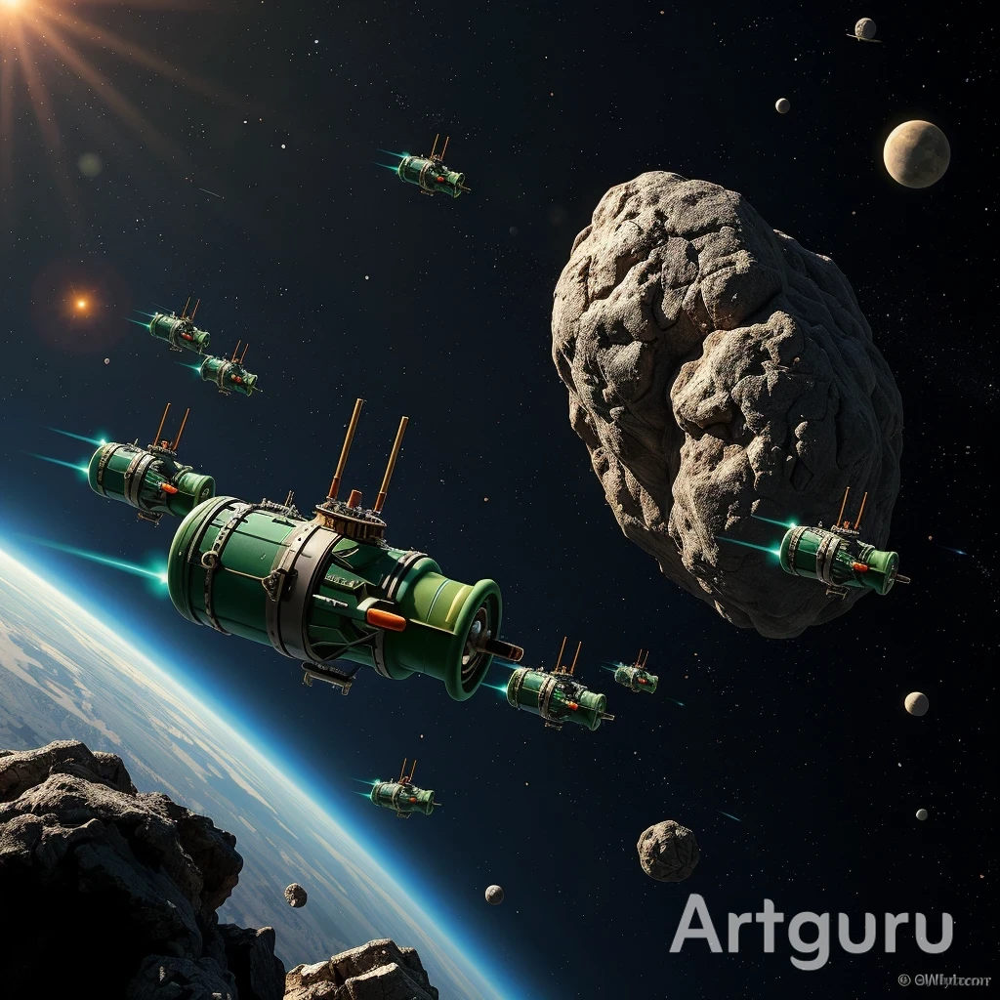

Первый «Дрон» стал для Фиво проверкой тех навыков, что были доведены до автоматизма долгими, изматывающими часами на симуляторе.

Юркий «Заяц» начал свой неумолимый танец манёвров и уклонений. Потребовалось какое-то время, но в конце концов Фиво провёл молниеносную контратаку, и корабль Умга, прошитый насквозь, умолк навсегда, превратившись в безжизненный памятник беспричинной агрессии.

Едва Фиво успел перевести дух, как на смену одному павшему противнику пришёл следующий. И танец уже было завертелся с новой силой, когда из-за тёмного изгиба астероида, словно разъярённый рой, один за другим начали выползать новые «Дроны»!

Сначала один. Потом второй. Третий... Пятый... Как тени, отрывающиеся от стены и обретающие форму.

Глаза у нас стали округляться, а челюсти отвисать.

— Алекс, как?! Откуда? — мой голос сорвался. — Ты же сказал, что на поверхности никого нет?!

— А на поверхности никого и не было! Они откуда-то из недр вылезли. Там наши сканеры их не видели. Видать, шахтёрили. А дупло на той стороне, нам его и не видно было.

Десять. Я насчитал десять алых значков на тактическом экране. Десять кораблей, медленно, но неумолимо разворачивающихся в боевой порядок. Десять алых глаз, зажжённых в темноте, уставились на одинокого «Зайца», превращая тактическую стычку в предрешённую бойню.

— Капитан, он не справится! Их слишком много! — Голос Басова звучал как приговор.

— Вижу, Алекс.

Я отчаянно пытался найти решение для этой, прямо скажем, непредвиденной нами ситуации. Выводить крейсера? Они успеют сделать несколько залпов, прежде чем Умга сообразят, что происходит. Если повезёт, кого-то уничтожим... или хотя бы отвлечём от Фиво. Но не успели идеи оформиться в приказы, как судорожный бег моих мыслей прервал голос Басова.

— Капитан, «Дымящийся»! Самовольно выходит из дока!

«Лиза, что ты делаешь?!» — прошептал я.

Я, конечно, понимал, что это единственное, чем сейчас можно помочь Фиво, но надо было всё же запросить разрешение! Или... она боялась, что я его не дам?

— Алекс, открой канал связи с «Дымящимся»!

— Капитан, канал связи заблокирован с той стороны. Кажется, она не собирается ничего слышать. Не хочет, чтобы вы ей помешали.

Да я и не собирался мешать. Похоже, в данной ситуации это единственно верное решение.

— Свяжи меня с Волк...

Не успел я договорить, как в динамике раздался взволнованный голос Волкова:

— Капитан! Мы что, вступаем в бой?

— Нет, Игорь. Лиза самовольно покинула док.

Я уже собирался отдать приказ «Сокрушительному» поддержать Лизу, как связь с Волковым внезапно прервалась.

— Алекс, что случилось? Соедини с Волковым!

— Канал связи заблокирован. Да и поздно уже... — Басов кивнул на экран, где второй крейсер уже выходил из дока.

— Да что же это такое?! — я вскинул руки. — Меня сегодня вообще никто ни о чём спрашивать не собирается?

Я не знал, огорчаться мне или радоваться. С одной стороны — это откровенное нарушение субординации... С другой — это был именно тот уровень братства и взаимовыручки, который я всегда хотел создать на корабле.

«Дроны» уже начали разворачиваться к «Зайцу» кормой, чтобы воспользоваться реверсом. Я живо представил, что будет, если они все разом набросятся на Фиво... И в этот момент «Дымящийся» открыл огонь, а ещё через мгновение к нему подключился «Сокрушительный». Ракеты прочертили космос, и от двойного попадания один из «Дронов» дрогнул, осыпавшись снопом искр. Ещё одно попадание... ещё... и наконец, «Дрон», пойманный в перекрёстный огонь, разорвало пополам, осыпав соседей обломками. Почти одновременно полыхнул ещё один — это Фиво метким выстрелом добил своего противника. «Осталось девять!» — мелькнуло у меня в голове.

Остальные «Дроны» засуетились, как осы в потревоженном гнезде.

— Алекс, они же не справятся? — сердце сжалось, а шесть из них уже начали перестраиваться, нацеливаясь на крейсера.

— Не справятся. Потери неизбежны, — голос Басова был безжалостно логичен. — Ну, один раз они смогут разорвать дистанцию после реверса Умга, ну два... Это максимум. Вы же сами знаете.

Мысли пронеслись вихрем. Что делать?! ... Решение пришло внезапное и безумное.

— Алекс, давай полный газ и туда, в кучу.

— Капитан, — Басов посмотрел на меня так, будто я предложил выйти в открытый космос без скафандра, — у нас нет орудий.

— Но они же этого не знают? — Я улыбнулся. — Пронесёмся мимо тех трёх «Дронов». Отвлечём на себя. У нас корпус крепкий, несколько попаданий выдержим. Это даст время нашей зондер-команде справиться с оставшимися. Ну а потом... уж как-нибудь отобьют нас от неприятеля.

Лицо Басова оставалось каменным, но в глазах вспыхнула та самая искра, которую я видел во время операции «Барсик-2».
— Понял! — его пальцы взметнулись над панелью управления.

— Алекс! И оповести экипаж, что возможны «осадки»... — добавил я, чувствуя, как адреналин наполняет кровь и не смог сдержать кривой улыбки. — ...местами даже «град».

— Есть, капитан! — Басов без лишних слов открыл общий корабельный канал, и его ровный, спокойный голос зазвучал на всех палубах: «Всему личному составу! Готовиться к манёвру уклонения и возможному столкновению с мелким метеоритным роем.».

— Мы пройдём к «Дронам» правым бортом, пусть по возможности экипаж покинет эти отсеки.

— Есть, капитан! — «Срочно всем переместиться к левому борту! Повторяю, нахождение у правого борта может быть смертельно опасно!»

По кораблю пронеслась лёгкая паника, быстро сменившаяся слаженной работой. Где-то гудели приводы автоматических дверей, где-то спешно крепили оборудование. Это был уже не экипаж, а единый организм.

— Алекс, предупреди Сильвестра, пусть срочно мобилизует ремонтные бригады. Скоро работы у них будет невпроворот.

Последовал короткий, деловой обмен репликами. Сильвестр, к его чести, ответил с привычной аристократичной чёткостью: «Будет исполнено, господа офицеры. Команды уже готовы».

— И ещё, Алекс... — я повернулся к нему, когда «Арго» уже начал свой разбег.

— Да, капитан?

— Ты был хорошим другом! — Я подмигнул ему. Кажется, он слегка смутился, не ожидав от меня такого проявления сентиментальности. — А теперь — полный вперёд!

Мощный гул двигателей перешёл в оглушительный рёв. «Арго», этот гигантский, беззубый левиафан, ринулся в самое пекло, дабы внести ещё большую сумятицу в ряды врагов. И кажется, это сработало. Три ближайших корабля, увидев, что мы несёмся прямо к ним, развернулись, чтобы встретить новую угрозу. А остальные, используя свои чудовищные реверсные двигатели, как из пушки начали выстреливать в сторону крейсеров...

Один из них, едва успев дёрнуться, вспыхнул от очередного двойного попадания. «Молодцы, — порадовался я, — координируют действия. Хорошо, что только я у них в список бойкотируемых попал».

Однако два других уже достигли цели. Волков первый попал под удар. Я видел, как луч дезинтегратора, яркий и безжалостный, срезал один из четырёх пилонов с ускорителями и маневровыми двигателями, а затем прошёлся по правому борту, оставив длинную, обугленную рану.

«Дымящийся» Лизы Чен, ведомый её стальной рукой, действовал немного иначе. Сказывалось понимание логики врага и его возможностей. Всё-таки они с Фиво две недели не вылазили из симулятора. Сначала Лиза провела идеальную атаку — один точный выстрел, от которого противник содрогнулся. А затем сразу же начала манёвр уклонения, не дожидаясь подлёта «Дрона».

Несмотря на это, луч дезинтегратора всё же задел нос корабля, и на несколько секунд на «Дымящемся» погасли все бортовые огни. Видимых разрушений не было, но скоро стало ясно — попадание вывело из строя пусковую шахту главного калибра. Впрочем, на такой дистанции им всё равно невозможно было пользоваться, и «Дымящийся» перешёл на использование «незадокументированного вооружения».

Все земные крейсера снабжались маломощными лазерами ближнего радиуса действия для защиты от метеоритов, и Лиза резонно рассудила, что сейчас защититься от «метеоритов» самое время!

А тем временем к «Зайцу» подоспела новая партия кораблей. Он метался между тремя «Дронами», как молния между грозовыми тучами — ослепительная, неуловимая, смертоносная...

Очередная ракета, выпущенная «Зайцем», попала точно в цель, и один из противников, угас и унёсся по инерции куда-то в глубины космоса безжизненной болванкой.

«Вот и славненько, — удовлетворённо кивнул я. — Сейчас ему станет полегче».

— Алекс, открой створки грузового отсека с минералами справа по борту!

Басов посмотрел на меня с немым вопросом, но недоумение мгновенно сменилось озарением.

— Есть, капитан!!!

— Как только НАШИ «Дроны» врубят реверс, закладывай максимально возможный левый вираж.

— Да я понял, понял, капитан!

И в этот момент «Дроны» рванули к нам. Словно метроном отсчитал — раз, два, три... Три рывка один за другим.

Басов поднял взгляд на меня — Держитесь, капитан! — и заложил вираж.

Всё наше добро, которое Билли и его команда так долго собирали, а Карма Сингх так тщательно складировал, вылетело в космос навстречу врагам.

— А ты говорил, мы безоружные! — крикнул я.

— Откуда я мог знать, что плюшевый Винни-Пух в ваших руках это тоже оружие?!

Целый грузовой трюм, который должен был стать новым орудием для флагмана, мы за пару секунд превратили в самый дорогой заградительный залп в истории человечества. Дорого? Бесспорно. Но плата за право жить иногда бывает очень кусачей.

— Влетит нам от Билли...

— Это точно! — Кивнул Басов.

В этот момент наша импровизированная шрапнель залпом окатила врагов.
Тот, что шёл ТРЕТЬИМ, вдруг засветился всеми огнями и взорвался ослепительной вспышкой. Кажется, его одновременно прошило в нескольких местах, и попало куда-то туда, куда кидать камушки со сверхзвуковой скоростью категорически запрещено.

ВТОРОЙ резко потерял скорость и заложил дугу. Вероятно, мы повредили ему стабилизатор.

А ПЕРВЫЙ... первый не получил видимых повреждений и через несколько секунд ослепительный разноцветный луч ударил в наш правый борт.

Корабль содрогнулся, будто его пнул великан. Свет на мостике погас, и даже на мгновение перешёл на аварийное красное освещение. Завыли сирены, а по всему корпусу прошла вибрация.

— Прямое попадание в правый борт! — доложил Басов, его голос едва пробивался сквозь грохот. — Гермозатворы сработали, отсеки D-4 и D-5 изолированы. Разгерметизация, но, как и планировалось, там никого нет.

Немного потеряв скорость на вираже, мы всё же быстро вышли из зоны поражения. Картина, открывшаяся нам, была одновременно и обнадёживающей, и тревожной. Лиза, словно разъярённый шершень, продолжала «долбить» своего противника лазерами, и из его корпуса уже валил густой дым. Волков, оторвавшись от своего преследователя, разворачивался для атаки главным калибром. А Фиво мастерски маневрировал, как тореадор в окружении быков, и методично изводил их меткими попаданиями своих маломощных ракет... Хотя и он уже получил пару скользящих попаданий, а на корпусе «Зайца» виднелись почерневшие полосы.

Но главная опасность была тут. НАШ ВТОРОЙ «Дрон», тот, что бешено крутился, вдруг замер, погасил все огни и, словно перезагрузился, а после опять начал разворачиваться к нам кормой для реверса.

— Нет, вы посмотрите на него! — не выдержал Басов. — Нормальные люди лицом к лицу нападают, а этот — ЗАДОМ!

Я промолчал... А что тут добавишь?

Рывок ВТОРОГО «Дрона» был коротким и яростным. Нас затрясло, будто мы мчались по гравию. Аварийное освещение, которое в прошлый раз лишь поприветствовало нас и удалилось, на этот раз сказало: «Я поживу тут у вас...», окрасив мостик в зловещие багровые тона.

— Капитан, — Басов посмотрел на меня взглядом, в котором читалась беспомощность и одновременно принятие неминуемого, — ещё одного такого попадания мы, скорее всего, не переживём.

Я горько улыбнулся в ответ, но отвечать не стал.

Из зоны поражения ВТОРОГО «Дрона» мы наконец вышли. А ПЕРВОМУ понадобится некоторое время, чтобы накопить энергию для нового рывка. Небольшая передышка есть. А дальше... Переносной ракетницы в кармане у меня не было.

Но в этот момент Лиза наконец дотюкала своего визави. А «Сокрушительный», развернувшись к противнику главным калибром, несколькими точными попаданиями превратил очередного весёлого клоуна в невесёлого. Взрыв осветил космос, и на мгновение стало тихо. Похоже, тот пошутил свою последнюю шутку...

Кажется, только теперь, с уничтожением этой угрозы, они смогли «поднять головы» и оценить бедственное положение «Арго».

— Басов, где капитан?! Вы как? — завопил Волков под действием адреналина.

— Я тут, Игорь, — отозвался я. — В первую очередь бей по тому «Дрону», координаты которого передаёт Басов. Он первый перезарядит реверс. — Читать сейчас нотации о том, что самовольничать нехорошо, а выключать связь и подавно, я не собирался. Не время.

Через несколько мгновений «Дымящийся» и «Сокрушительный», словно два верных пса, уже неслись в сторону «Арго». Раненый Волков, «на трёх ногах», сразу отстал от Лизы, но без остановки палил главным калибром по указанной цели. Тот заметался. Единственное, что он мог, — это развернуться носом к «Сокрушительному» и сжигать конусным лучём дезинтегратора подлетающие ракеты.

Каждый раз взрывная волна от детонации ракеты сотрясала его корпус, но урона не причиняла. Кажется, он и сам уже был не рад, что связался с нами. И как только его реверсный двигатель перезарядился, не мешкая ни секунды, рванул прочь.

ВТОРОЙ «Дрон», увидев бегство своего собрата, не стал искушать судьбу, и тоже поспешил ретироваться.

А Фиво тем временем, описав крутую дугу, меткой очередью превратил ещё одного противника в огненный шар.

Последний оставшийся «Дрон» верно оценил изменившуюся расстановку сил и, видя, как уже два его собрата спасаются бегством, решил, что героизм не его стезя, и благоразумно последовал их примеру.

Тишина, наступившая на мостике, была оглушительной. Её нарушал только гул систем, шипение повреждённых магистралей и прерывистое дыхание. Я откинулся в кресле, позволив себе наконец выдохнуть. Подпёр лоб рукой и взглянул на Басова. Вымотанный, но собранный, он уже отдавал распоряжения аварийным командам. На экране два повреждённых, но непобеждённых крейсера, словно два бойца, опирающихся друг на друга после схватки, медленно плыли в нашу сторону. А три красные точки спешно отступали к ближайшей планете.

— Алекс, собирай побыстрее наших легионеров и уходим... И скажи Волкову, пусть «ногу» свою подберёт. — сказал я, чувствуя, как накатывает свинцовая усталость. — Хватит на сегодня цирка. Ещё одно такое представление мы не переживём. — Я кивнул на тактический экран, где корабли Умга со всей системы уже тянулись в нашу сторону.

— Есть, капитан! — Басов тут же начал разворачивать «Арго» и отдавать по связи распоряжения.

Раненые корабли неторопливо заходили в ангары флагмана. Сегодня досталось всем. Даже «Зайцу». Индикаторы стыковки загорались один за другим. Вот и Волков, доковыляв последним, доложил о возвращении в док.

Мы с Басовым молча посмотрели друг на друга. Тихое, полное понимание двух людей, прошедших через одно пекло. Я видел как сильно устал он. Он, вероятно, видел то же самое...

— Всё, Алекс. Уводи нас побыстрее из этой негостеприимной системы. Пора уносить ноги и зализывать раны.

— Есть, капитан! — в очередной раз отрапортовал Басов, и его пальцы вновь залетали над пультом управления.

«Арго», тяжело гудя двигателями, начал набирать скорость, устремляясь к спасительному алому свечению гиперпространства, унося нас прочь от этой враждебной звезды.

------------

## Глава двенадцатая. Коэффициент сплочённости

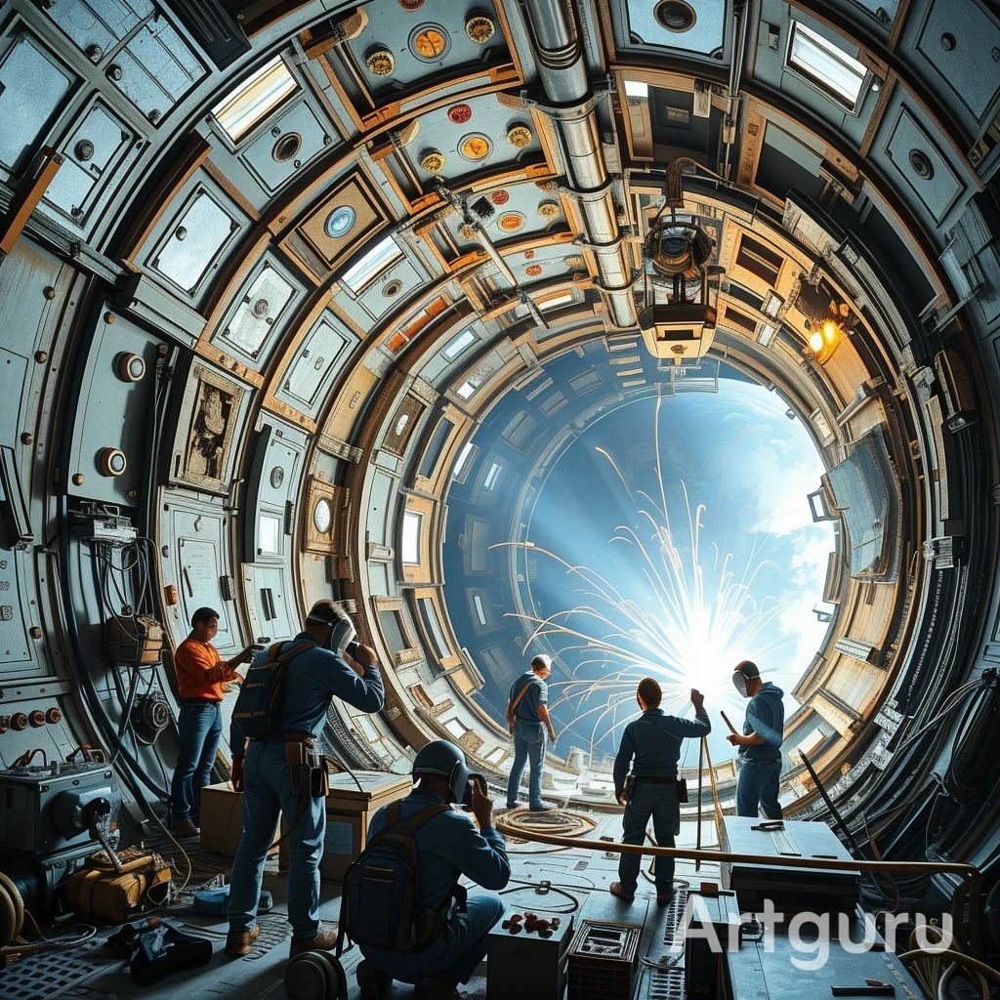

Алое марево гиперпространства за иллюминаторами казалось гуще и тяжелее обычного. «Арго» шёл через него с трудом, как раненый кит, пробивающийся сквозь густой ил. Его могучий корпус отзывался на каждую микровибрацию глухим стоном. В ушах всё ещё стоял вой сирен, а ноздри щипало от запаха гари и озона.

Тишина после боя оказалась обманчивой. Она не принесла покоя, а лишь сменила грохот сражения на грохот отчаянного восстановления. По всему кораблю эхом разносилась симфония аврального ремонта: приглушённый стук кувалд, выравнивающих погнутые шпангоуты; резкое шипение сварочных аппаратов, штопающих крейсера; сдавленные крики и отрывистые команды, сливающиеся в единый гул напряжённой работы.

Вся жизнь корабля сейчас была подчинена одной цели — выжить. Карма Сингх, невозмутимый, как скала, стал душой и мозгом этого хаоса. Он распределял скудные ресурсы с ювелирной точностью: вот — хладагент для пострадавшего реактора «Сокрушительного»; вот — лист композитной брони для «Зайца»; а вот — термосы с крепким чаем и сухофрукты для техников, работающих без сна третью смену подряд. Каждая деталь, каждый миллиметр проводки, каждый грамм реактива находили своё место в этой головоломке под названием «остаться на плаву».

Я стоял на мостике, изучая сводки о повреждениях, когда с мягким шипением открылись двери лифта. На пороге стоял Малинин. Безупречный, выглаженный, с выражением служебного рвения на лице и планшетом в руках.

— Капитан. Разрешите доложить.

— Да, Александр. Что у тебя?

Он прошёл ровно три шага и замер, положив планшет на стол передо мной.

— Рапорт о чрезвычайном происшествии.

Басов, не отрываясь от мониторов, замер, и едва слышный шелест его пальцев по клавишам прекратился.

— Опять? — Я чуть приподнял бровь. — А это, я так понимаю, расстрельные списки?

— Мне кажется, вы недооцениваете серьёзность проблемы, — начал Малинин, ничуть не смутившись. — В ходе недавнего боестолкновения командиры крейсеров «Дымящийся» и «Сокрушительный», лейтенанты Чен и Волков, совершили грубейшее нарушение устава. Пункты 7.4, 8.1, 11.3... — он сделал театральную паузу, — ...и, по сути, всех основополагающих принципов субординации и следования приказам. Они самовольно покинули док и вступили в бой без вашей санкции, создав реальную угрозу гибели корабля и всего экипажа.

— Да, да, угрозу гибели корабля, всего экипажа, Земли и человечества как вида... Я помню.

Я молча смотрел на него, давая понять, что ирония была намеренной. Воздух на мостике стал густым, как сироп.

Малинин побледнел. Его пальцы судорожно сжались, глаза слегка сощурились, а уголок рта дёрнулся — единственные признаки злости и раздражения, которые смогли прорваться сквозь маску невозмутимости.

— На основании вышеизложенного, — его голос стал ещё холоднее, — требую немедленного отстранения лейтенантов Чен и Волкова от командования с заключением под стражу до проведения полного разбирательства и военного трибунала.

Повисла тишина. Я взял планшет, пробежался глазами по тексту. Потом взял стилус и на чистом поле вывел крупными буквами: «ВЕТО. Оставить в должностях. Вопрос будет решён по возвращении на базу».

И протянул планшет обратно.

Малинин прочитал. Его лицо побелело окончательно, словно его посыпали инеем.

— Капитан... это... беспрецедентно. Это прямое попустительство...

— У нас тут много чего беспрецедентно, старпом, — спокойным тоном прервал я. — Мы партизаны в логове хищника и живы только потому, что у этого хищника внезапно возникли проблемы. Как только он с ними разберётся, нас прихлопнут как назойливую муху, если мы, конечно, не успеем к тому времени собрать достаточную силу, которая сможет ему противостоять. — Я посмотрел ему прямо в глаза в последней попытке найти там хотя бы искру благоразумия. — Не время для уставного буквоедства. Они спасали своего товарища.

— Они подорвали основу дисциплины! — в его голосе впервые прозвучали нотки чего-то, похожего на живую эмоцию. Почти страсть.

— Они продемонстрировали, что экипаж — это не просто список личного состава, — ответил я, вставая. — Рапорт принят к сведению. Вы свободны.

Он замер на секунду, потом резко развернулся и стремительно двинулся к дверям. Лифт закрылся за ним с тихим, многозначительным щелчком, который растворился в нарастающем гуле ремонта.

Я встретился взглядом с Басовым. Тот едва заметно мотнул головой в вопросительном жесте, в котором безошибочно читалась фраза: «И что будем делать?»

— Алекс, не сообщай пока нашим «преступникам» об инциденте. Сначала я хочу сам с ними поговорить... Надо было, конечно, обсудить с ними этот инцидент по горячим следам, но... — я махнул рукой в сторону, откуда доносился грохот ремонта. — ты сам знаешь, сколько неотложных дел было после того побоища.

— Хорошо, капитан. Нет проблем, — кивнул Басов, и его пальцы снова заскользили по клавиатуре.

...

Ремонтные бригады под началом Сильвестра фон дер Кампфа творили чудеса. И именно он появился на мостике с итоговым докладом, будто только что сошёл с парада. Его мундир был безупречен, без единой складки или пылинки, и резко контрастировал с окружающей его суетой и копотью.

— Господин капитан, — начал он с лёгким поклоном, — разрешите представить отчёт о проведённых восстановительных работах.

— Да, Сильвестр. Докладывайте.

— С гордостью могу сообщить, что мы, невзирая на обстоятельства, совершили, пожалуй, всё, что было в человеческих, и отчасти даже в нечеловеческих силах. — Начал он, и его речь, как всегда, была многословной и отточенной. — И, позволю себе заметить, даже чуть больше. «Сокрушительный» сможет двигаться и стрелять, но немного пострадала скорость и манёвренность. «Ногу» мы ему пришили, но, увы, несколько ускорителей и маневровых блоков всё же вышли из строя безвозвратно. Новых у нас, к моему великому сожалению, в наличии нет, так что установить мы их сможем только на базе. Возможно, в будущем нам, господин капитан, необходимо создание некоего стратегического запаса подобных запчастей — рассмотрите такую возможность.

Я кивнул, понимая, что это не упрёк в непредусмотрительности, а констатация печального факта. Мы не брали таких запчастей не из-за глупости, а потому что все наши скудные ресурсы уходили на производство самого необходимого. О том, чтобы производить что-то про запас, речи пока не шло.

— «Дымящемуся» повезло несколько больше, — продолжил Сильвестр. — Мы починили «главный калибр». Повреждена, по удачному стечению обстоятельств, была лишь пусковая шахта. Мы её, что называется, подлатали, но на базе, разумеется, потребуется куда более основательный ремонт. Системы жизнеобеспечения и маневровые двигатели, к счастью, остались в целости. Что касается «Зайца»... — он слегка повёл бровью, — ...то он, если можно так выразиться, отделался царапинами. Разумеется, под «царапинами» я подразумеваю несколько сквозных проплешин в броне, которые, впрочем, не задели жизненно важных систем. Их мы тоже успешно залатали. Но вы должны прекрасно понимать, господин капитан, что всё это — временные латки. Привести всё в эталонное состояние мы тоже сможем только на станции.

— И ключевая проблема, — он сделал многозначительную паузу, — это состояние «Арго». Пока мы в гипере, мы физически не можем разблокировать разгерметизированные отсеки D-4 и D-5 и залатать обшивку корабля. Доступ к ним для восстановления целостности корпуса возможен только в нормальном пространстве. — Он демонстративно развёл руки в стороны. — Для серьёзного ремонта: замены силовых элементов каркаса, починки корпуса и переборки двигателей — нам нужна стоянка. Настоящая. Иначе следующий же бой станет для нас последним.

Я смотрел на него, на этого аристократа, чья безупречность в адской круговерти ремонта казалась почти сверхъестественной, и видел в его глазах всего лишь холодную констатацию фактов.

— Алекс, — повернулся я к Басову, — где у нас рядом с Бетой Геркулеса можно припарковаться, чтобы заклеить эти пробоины?

Басов, не поднимая глаз от карт, ответил своим ровным, как линия горизонта, голосом:
— Альфа Геркулеса. Единственная система прямо по курсу, в непосредственной близости от Беты Геркулеса. Мы немного потеряли в скорости после последней стычки, но оттуда до Беты всё равно — рукой подать. Не больше трёх дней пути. И... — он сделал небольшую паузу, — все косвенные признаки указывают на аномально высокую концентрацию редких минералов в системе. Мы могли бы не только починиться, но и возместить наши недавние... тактические пожертвования.

— Думаю, это наш вариант, — кивнул я и снова обратился к Сильвестру, который стоял, словно мраморное изваяние. — Спасибо, Сильвестр. Вы отлично потрудились. И передайте благодарность всем, кто участвовал в ремонте — от главного инженера до последнего сварщика. Будем считать, что Альфа Геркулеса сейчас — наш главный кандидат для стоянки и ремонта. Как только решение будет принято — я сразу же дам вам знать.

Сильвестр кивнул с почти незаметным намёком на поклон и удалился так же бесшумно и безупречно, как и появился.

Когда лифт закрылся, я повернулся к Басову.

— Интересно, Алекс, кто-нибудь когда-нибудь видел его в рабочем комбинезоне, запачкавшего руки, с гаечным ключом в руках?

Басов фыркнул, не отрывая глаз от мониторов.

— Сильвестра? Капитан, вы шутите? Этого принца всей вселенной и её окрестностей? Да он, поди, родился в парадном мундире!

— Нет, я прекрасно понимаю, что сила руководителя не в том, чтобы самому крутить гайки, а в том, чтобы грамотно организовать вверенных людей. Чтобы эти люди работали слаженно и эффективно. А с этим у Сильвестра, надо отдать ему должное, проблем никогда не было. Он у нас как дирижёр в опере разрухи и созидания.

— Дирижёр в белых перчатках, — уточнил Басов. — Но оркестр у него играет слаженно. Что, собственно, нам и нужно.

— Что ж, Альфу пока берём на заметку... И пойдём... Там, кажется, уже весь экипаж собрался.

В этот момент с нижних палуб донёсся сдержанный, но радостный гул. Симфония ремонта сменилась музыкой жизни.

— Да, похоже, веселье в самом разгаре. Не хватает только нас.

...

Комната отдыха была битком набита людьми. Воздух гудел от сдержанного возбуждения. На стене висело самодельное знамя — на куске брезента кто-то маркером нарисовал «Зайца», выходящего из огненного шторма. Получилось криво, но до невозможности душевно.

В центре комнаты соорудили сцену. Пара десятков пустых ящиков, накрытых куском старой обшивки корабля, пробитой в нескольких местах. На этом импровизированном постаменте стоял рядовой Гомес — тот самый, что когда-то оглушил Фиво стан-пушкой. Он с энтузиазмом размахивали распечаткой, а его лицо светилось улыбкой.

— Друзья! Братья и сёстры по оружию! — радостно выкрикнул он, и толпа тут же отозвалась одобрительным гулом. — Ремонт окончен, «Дроны» повержены — значит, время для творчества! Посвящается всем нам!

— Эй, Гомес, так это ты что ли стихи пишешь? — раздался чей-то голос с дальних рядов.

— Да признавайся, ты и есть «Зелёный маркер»?! — подхватили другие, и по залу прокатился одобрительный смех.

— Друзья, друзья! — Гомес поднял руки, умиротворяя толпу, но улыбка не сходила с его лица. — Мне эти строки передали инкогнито! Но внизу, — он сделал театральную паузу, — действительно стоит подпись: «Зелёный маркер»!

Он сделал паузу, чтобы собраться с духом, и начал читать с таким воодушевлением, будто это был не текст на бумаге, а гимн их общему успеху.

Это была поэма. Чувственная, напыщенная, полная высоких слов о «реках огня» и «дрогнувших клоунах». Но на пике высокопарности её вдруг обрывала простая и безжалостно точная концовка, выхваченная прямо из гущи боя:

...Наш капитан им с размаху влепил,

Все камни, что Билли так долго копил!

Без страха на вас на «Арго» мы несёмся.

Держите, шуты! Что ж теперь не смеёмся?!

Комната взорвалась смехом и аплодисментами. Атмосфера была наэлектризована всеобщим чувством братства, прошедшего сквозь огонь.

— Знаешь, Алекс, — дождавшись небольшого затишья, повернулся я к Басову, — а ведь нашу атаку драгоценными полезными ископаемыми можно внести в учебники. Я прямо вижу заголовок параграфа: «Тактика золотого града» или «Обеспечение превосходства путём контролируемого обогащения противника!»

— Насчёт учебников не скажу, — невозмутимо отозвался Басов, — но в судовой журнал тактический манёвр «Барсик-3» уже внесён. С формулировкой: «Вынужденное применение нетрадиционных средств поражения в условиях превосходства противника». Билли уже требует оформить акт списания минералов по статье «Боеприпасы».

— Алекс, — перешёл я на шёпот, чтобы не перебивать начавшееся веселье, — узнай уже наконец, кто этот таинственный «Зелёный маркер».

— Будет сделано, капитан, — так же тихо ответил Басов, не отрывая глаз от толпы. — Вычислим этого Бэтмена. Но, возможно, его сила именно в его таинственности?

И в этот момент на импровизированную сцену вышел Билли. В его руках сияла «Медаль». Дживо Кумар, золотые руки корабля, взяв небольшой обломок корпуса «Дрона», отполировал его до зеркального блеска, оплёл тончайшими разноцветными проводами, словно создавая произведение искусства, и в центр вмонтировал зелёный светодиод, который мягко светился. Медаль была маленькой, изящной и больше походила на работу ювелира, а не техника.

— А теперь... главный виновник нашего торжества! — крикнул Билли. — Барсик, выходи!

— Давай, Фиво, иди, иди...! Поднимайся, не робей! — послышались ободряющие выкрики. — Ты с четырьмя «Дронами» один разобрался! Столько же, сколько наши крейсера на пару!

Фиво вытолкнули вперёд. Он робко озирался своим единственным глазом, его щупальца нервно подрагивали. Не от паники, а скорее от неловкости и смущения. И если приглядеться — крошечная и совершенно непривычная искорка гордости. Под всеобщее одобрительное улюлюканье он поднялся на импровизированную сцену.

Билли с торжественным видом прикрепил медаль к его униформе, рядом со стандартной именной планкой, где было выгравировано: «Фиво», и зелёный огонёк тут же замигал в такт всеобщему ликованию.

Позывной «Барсик» не требовал гравировки — он был выжжен в сердцах всего экипажа.

Фиво посмотрел на медаль, на улыбающиеся лица, и прошептал так тихо, что его едва расслышали:
— Я... я просто зажмурился...

И этот наивный, абсолютно искренний ответ вызвал не взрыв смеха, а новую, уже громоподобную овацию. В этом был весь он. Не герой, не легенда. Просто Барсик. Их Барсик.

— Слышал? — тихо шепнул я Басову. — Готовая цитата для наших мемуаров. «Они просто зажмурились и нажали газ». Выбьем на корпусе нашего флагмана.

— Боюсь, эффект неожиданности будет утерян, — так же негромко парировал Басов. — Если противник прочтёт это до боя, наша главная тактика будет раскрыта. Предлагаю ограничиться гравировкой на внутренней стороне двери санузла... Для служебного пользования.

И тут кто-то крикнул: «Качать Барсика!» Толпа пришла в движение, и десятки рук бережно подхватили Фиво. Он взмыл вверх, инстинктивно хватая щупальцами воздух. А команда продолжала подбрасывать его, сопровождая каждый взлёт радостными возгласами. «Бар-сик! Бар-сик!» — гремело под потолком, а зелёный огонёк медали яростно мигал в такт этому дружному скандированию.

В стороне, прислонившись к косяку дверного проёма, стояла Лиза Чен. Она не аплодировала. Но её тонкие губы тронула та самая, редкая, как солнечный свет в глубинах гиперпространства, улыбка. Она просто смотрела, как её маленький друг взмывает в воздух, как радуются люди вокруг, и этого было достаточно, чтобы стереть всю усталость, все тревоги и все тяготы пройденного пути.

------------

## Глава тринадцатая. Круг доверия или Шифрование уровня БОГ

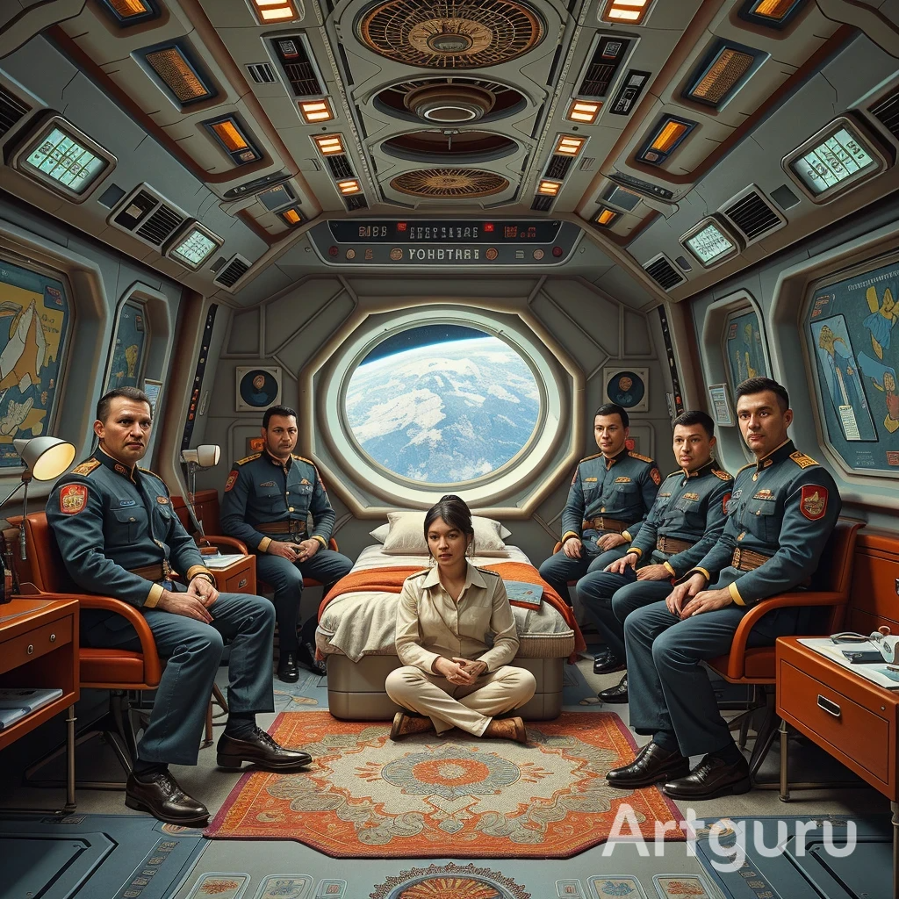

Каюта капитана, рассчитанная на одного человека, теперь больше напоминала консервную банку, в которой шестеро взрослых людей и один маленький Спасси разместились с предельно возможным комфортом. Басов расположился за небольшим рабочим столом. Волков пристроился на краю койки. Чен и Сингх стояли, прислонившись к стенам, как две статуи, охраняющие вход. Билли уселся прямо на полу, скрестив ноги, а Фиво скромно приютился в уголке, стараясь занимать как можно меньше места. Я же оккупировал единственное свободное кресло.

— Господа, — начал я, обводя взглядом собравшихся. — Малинина и Сильвестра здесь нет. Первого — потому что его присутствие свело бы нашу дискуссию к перепалке об уставе. Второго... — я слегка поморщился, — ...мой внутренний параноик не позволил его позвать. Он прекрасно справляется со своими обязанностями, но доверия не вызывает. То, что мы обсудим, должно остаться между нами.

— И начнём с главного, — продолжил я, ловя взгляд Лизы, а затем Игоря. — Малинин подал рапорт с требованием отстранить вас обоих от командования, заключить под стражу и по прибытии на Станцию передать военному трибуналу за самовольство и грубейшее нарушение устава.

Волков опустил голову. Чен замерла, её поза стала ещё более выправленной, а лицо — идеальной ледяной маской.

— С точки зрения устава он прав на сто процентов, — сказал я, глядя на них. — Но такие решения требуют одобрения капитана. А я наложил вето.

Игорь резко выдохнул, но его взгляд так и остался прикован к полу. Лиза смотрела на меня всё так же, но в глубине её глаз что-то дрогнуло, а плечи слегка расслабились.

— И в связи с этим у меня к вам есть вопрос, — я посмотрел сначала на Волкова, потом на Чен. — Как вы могли подумать, что я брошу Фиво на растерзание? ... Потому что он Спасси? ... Если вы вдруг забыли — он действующий офицер вооружённых сил Нового Альянса Свободных Звёзд. И до тех пор, пока он им остаётся, я буду защищать его точно так же, как любого, находящегося под моим командованием. Или, может, вы думаете, что я могу бросить кого-то из вас?

Волков сгорбился ещё больше, будто вес, которым его придавило, от каждого слова становился всё тяжелее. — Капитан... Мы... мы видели, сколько их...

— Ваш порыв — это иллюстрация героизма и взаимовыручки, — я пристально посмотрел на них, — но мой приказ был бы таким же — поддержать Фиво. Но это был бы ПРИКАЗ. Понятно? Мы команда, а не стая одиночек, бросающихся в бой по первому зову сердца. Мне нужно, чтобы вы ДОВЕРЯЛИ мне. Даже если кажется, что я медлю. Вето — не оправдание вашего поступка. Это аванс доверия, который я выдаю вашим намерениям. НО ТАК БОЛЬШЕ НЕ ДЕЛАЙТЕ.

Лиза молча кивнула. А Волков поднял голову, и в его глазах читалось облегчение, смешанное с раскаянием.

— Виноват, капитан, — хрипло произнёс он. — Больше не повторится.

— Капитан, — тихо, но настолько проникновенно начала Чен, что все взгляды устремились к ней. — Мы вам доверяем.

Казалось бы, такие простые слова, но сказанные в правильный момент... И этого оказалось достаточно, чтобы по комнате прошла волна единения, нашедшая выражение в улыбках, кивках и взглядах, полных решимости. Мы становились не просто командой... Незаметно для самих себя, мы становились единомышленниками, готовыми шагнуть в пасть любой угрозе.

— Вот и славно! — удовлетворённо кивнул я. — С этим разобрались... И, Карма, если ты вдруг захватил что-нибудь вкусненькое — самое время.

— Разумеется, сэр, — невозмутимо произнёс Сингх и, словно фокусник, из складок своего безупречного мундира и небольшой холщовой сумки начал выкладывать на единственный свободный угол стола целый стратегический запас: маленькие пакетики с орешками, аккуратные стопки галет, солидную плитку шоколада и даже термос. — Мозговая активность требует подпитки глюкозой и липидами. Не стесняйтесь, налетайте... хватит всем.

Он отломил первый квадратик шоколада и передал Волкову, который кивнул с благодарностью и сразу закинул его в рот.

— О, спасибо, мистер Сингх! Вы всегда думаете о таких важных вещах!

— Это моя работа, — с лёгким поклоном ответил сикх. — Систематизировать, обеспечивать и предвидеть потребности. Фиво, печеньки передайте, — продолжил Карма, протягивая небольшую упаковку через всю каюту. — Он их любит. Особенно эти, с ванильным вкусом. Учитывая стрессовую нагрузку, углеводы ему сейчас показаны.

Фиво робко взял упаковку, и его единственный глаз засиял.

— А теперь к делу. — я встретился взглядом с Басовым — Алекс, сведи для нас всё, что мы выжали из того шапито.

Он включил настенный экран. Поверхность панели ожила, отобразив чёткий, структурированный список добытой информации.

— Итак, первое и самое загадочное — Ур-Куаны. У них проблемы. Большие, — я указал на первый пункт. — Прилетел некий «Братан». Неизвестная сила. Некто «Двоюродный Хранитель Бесконечного Цикла». Что именно из себя представляют эти «хранители», мы не знаем, но формулировка «... на корабле, выточенном из чистого мрака и тишины» оптимизма не добавляет.

— Выточен из мрака и тишины... — задумчиво произнёс Волков, проводя перед собой ладонью, изображая таинственность. — Это же чистая поэзия, а не техническая характеристика. Может, они так описали то, что его нельзя просканировать?

— Возможно он поглощает определённый спектр излучения, — подхватил Басов. — Это объяснило бы «мрак и тишину».

— «Двоюродный Хранитель» — это вообще что? — подключился Билли. — У них там семейный подряд по угнетению галактики, что ли?

По комнате прокатилась волна сдержанных смешков...

— Меня больше беспокоит «Бесконечный Цикл», — тихо сказала Чен, отламывая маленький кусочек шоколада. Все посмотрели на неё. — Это звучит как что-то глобальное. Цикл чего? Войн? Возрождения? Порабощения?

— Звучит как нечто фундаментальное, — добавил Сингх. — Возможно, это внутренний конфликт в их иерархии. Или появление новой, ещё более могущественной силы.

— Не исключено, — согласился я. — В любом случае, пока они разбираются друг с другом, у нас есть окно возможностей. Но узнать, кто такой этот «Хранитель» и что за «Цикл», сейчас жизненно важно. Это может быть ключом к их слабости. Алекс, занеси в анализ все наши идеи.

В каюте воцарилась тишина нарушаемая лишь похрустыванием, почавкиванием и пошвыркиванием.

— Хорошо, — продолжил я. — Оставим пока «братана». Следующие — Арилу. Созвездия Голубя, Циркуля и Чандрасекара. Вероятно, где-то там их дом. И, возможно, это наш потенциальный союзник.

— Это не маленький регион, — сразу же отозвался Басов, выводя на экран звёздную карту. — Всё вместе — четырнадцать систем. Плюс соседнее созвездие Стрелы — ещё три системы. Нужны приоритеты для поиска.

Билли, сидевший на полу, оживился.

— Если они подобрали раненое существо с подбитого дредноута, значит, были недалеко от места боя, — включился он. — Можно искать следы сражения – обломки, аномалии, остаточное излучение. Оттолкнуться от этого!

— Дельное замечание, — я кивнул, отмечая про себя мысль Билли – она была практичной и неочевидной.

Я сделал паузу, давая возможность высказаться остальным, но в тишине было слышно лишь, как Билли постукивает пальцами по коленке. — Алекс, внеси в план сканирование этих систем на предмет аномалий, характерных для мест сражений. Но если следов боестолкновений обнаружить не удастся, придётся обследовать всё по порядку. Если честно, меня немного пугает тот объём работы и время, которое мы на это затратим. «Бесконечный Цикл» может оказаться очень даже конечным, и тогда Ур-Куаны вновь начнут наводить порядок в галактике, и боюсь, что с удвоенной силой.

— Принято, — отозвался Басов, делая несколько пометок на своём планшете.

— Ладно. Следующий пункт – «глупые провокаторы в созвездии Дракона», — продолжил я. — Умга хотели сбросить им на голову астероид, но не смогли из-за законов Ур-Куанов. На старых картах в Драконе обозначена неизвестная сфера влияния. То есть кто-то там есть, и они явно не дружат с Умга. Кто они – загадка.

— Это тоже воины-невольники Ур-Куанов, — напомнил Волков. — Стоит ли туда торопиться? Им по уставу положено встречать нас не горячим чаем...

— А горячей плазмой, — кивнул Билли.

— Не стоит забывать, что Ур-Куанам сейчас дела нет до своих рабов, и они предоставлены сами себе, — спокойно заметила Чен. — Возможно, именно в таких обстоятельствах и можно пробовать договариваться с потенциальными союзниками. Когда хватка Ур-Куанов ослабла.

— Дельная мысль, Лиза. Пока просто занесём в список потенциальных контактов. Теперь — Майконы. Биороботы. Если они действительно созданы, а не родились, то в галактике есть лишь один «кандидат», повсюду оставляющий после себя такие артефакты — это Предтечи.

— Если они созданы, а не эволюционировали, то у них должна быть цель, — рассудительно произнёс Сингх. — Функция. Инструмент без предназначения – не имеет смысла.

— Может, они... наблюдатели? — осторожно предположил Билли. — Или садовники? Те, кто поддерживает баланс в экосистеме галактики?

— А мы тогда — сорняки, — с саркастической усмешкой вставил Волков.

— Эти «садовники» воевали на стороне Ур-Куанов против Альянса, — холодно напомнил я. — Вероятно, они тоже воины-невольники. Других Ур-Куаны не держат.

— Или они — оружие, — мрачно констатировал Волков. — Самое совершенное из возможных. Живое, думающее, саморазвивающееся.

— Тем хуже для нас. — Я медленно обвёл взглядом собравшихся. — Лучше воевать с садовником, чем с десантником.

Видимо, все живо представили разницу, потому что в ответ я увидел лишь серию скупых, понимающих кивков. А Басов сделал запись в своём планшете — вероятно, внёс «Майконов» в список угроз с пометкой «биологическое оружие, высокий приоритет».

— Что ж, — сказал я, переводя взгляд на следующий пункт повестки. — С провокаторами и садовниками разобрались. Теперь последнее, но для нас сейчас самое главное — Чёрный Эскадрон.

Все выпрямились. Даже Фиво в своём углу насторожился, перестав жевать печеньки.

— Умга подтвердили, что это они спёрли их гиперволновой передатчик. И что они проводят какие-то безумные акции по всей галактике. И главное – у них была база на Бете Геркулеса для операции против Мур-муров. Значит, именно там и надо начинать поиски. Есть соображения, где именно?

— Если они параноики, то база будет хорошо спрятана, — сказал Волков. — В атмосфере газового гиганта, на тёмной стороне какой-нибудь луны, в астероидном поясе...

— Фиво, — обратился к нему Басов. — Твои сородичи отговорили Мур-муров от колонизации. Какую именно планету они собирались осваивать?

Фиво заёрзал, все взгляды обратились на него.

— Э-э-э... Кажется, вторую? Я точно не помню. — его щупальца нервно переплелись. — Видите ли, эту историю знает каждый Спасси с детства. Это... как сказка! Но её рассказывают не для передачи информации, а с гордостью! Как о подвиге! Как гимн выдающихся дипломатических навыков Спасси!

— Алекс, а что из себя представляет Бета Геркулеса 2? Есть информация в наших базах? — спросил я.

— Есть кое-что, — он вывел на экран данные.

Бета Геркулеса 2:

    Атмосфера: 0.26

    Температура: -126°C

    Гравитация: 0.27 G

    Радиус: 0.26 R⊕

    День: 1.06 земных

    Наклон: 2°

— Обобщишь для нас самое главное, что нам нужно знать? — попросил я.

— Конечно. В целом похожа на Марс. Атмосфера и гравитация — около четверти земной. Средняя температура -126°C, но за счёт мизерного наклона оси, экваториальные области значительно теплее, особенно днём. Если обобщить — днём можно работать в лёгких скафандрах. Возможно, даже в дыхательных масках, но тут надо уточнять состав атмосферы. Этих данных в наших базах нет.

— А их родной мир? Эта Волопаса? Для сравнения.

Он вывел новые данные:

Эта Волопаса 2:

    Атмосфера: 0.28

    Температура: -190°C

    Гравитация: 0.28 G

    Радиус: 0.28 R⊕

    День: 0.85 земных

    Наклон: 45°

На экране рядом возникла вторая колонка данных. Я ожидал отличий, но вместо этого увидел почти зеркальное отражение: те же доли земной атмосферы и гравитации, схожий диапазон температур.

— Погодите... — Волков протянул палец к экрану, водя им туда-сюда между колонками. — Да они же... близнецы!

В каюте воцарилось изумлённое молчание. Все уставились на два почти идентичных набора цифр.

— Если они роботы, — медленно начала Чен, формулируя мысль, витавшую в воздухе, — зачем им планета, пригодная для жизни? Зачем им точная её копия?

— Значит, она пригодна не для них! — выпалил Билли. — Они её нашли для кого-то другого!!!

Две колонки на экране теперь выглядели не просто справочной информацией, а своего рода уликой.

— Совершенно верно, — подтвердил Басов своим ровным, аналитическим голосом. — И намеренно искали не просто пригодный мир, а мир с конкретными параметрами. По точному, заранее известному шаблону. — Его палец провёл по строчкам, подчёркивая совпадения: атмосфера 0.26-0.28, гравитация 0.27-0.28, радиус, температура... Это не случайная колонизация ближайшей системы. Это выполнение технического задания на...

— РАЗВЕДКУ! — выдохнул Волков. — Это ж... разведчики! Умные, самостоятельные, но всё равно разведчики! Их кто-то сделал, загрузил в «мамочку»-ковчег нужные цифры и сказал: «Лети, дорогой, ищи нам вот это». Нашли Эту Волопаса — отписались домой, высадились. Потом пошли искать дальше — и наткнулись на Бету Геркулеса.

— А найдя, они не захватывали силой, — спокойно, словно читая следствие из теоремы, добавила Чен. — Спасси сказали, что планета «занята» — и Мур-муры ушли. Их программа не подразумевала агрессию. Только поиск, оценка и... вероятно, отчёт.

Эта простая и абсолютно логичная цепочка рассуждений повисла в наступившей тишине, наполняя её новым смыслом.

На наших глазах Мур-муры превращались из загадочной расы в инструмент. Дорогой, сложный, наделённый сознанием — но инструмент. Их «колонизация» была не расширением границ, а... выполнением программы. Установкой флажка на подходящей планете.

— Но Эскадрон, похоже, думал иначе, — мрачно констатировал я. — Для них неважно, что Мур-муры ушли. Важно, что они могли вернуться. Или их хозяева, получив отчёт об идеальной планете, решат прийти сами. Они увидели не конкретную угрозу, а ПОТЕНЦИАЛЬНУЮ ВОЗМОЖНОСТЬ угрозы. И решили действовать на опережение. Так сказать, ликвидировать угрозу в зародыше. Вырвать этот маяк с корнем, до того, как он сможет кого-то привести.

Взгляд Басова, тяжёлый и полный понимания, встретился с моим. Вопрос стоял уже не о Мур-мурах, а о тех, кто их послал. И о том, дошёл ли до них сигнал о провале миссии?... или они просто ждут следующего отчёта, который уже никогда не придёт?

— Превентивное уничтожение разведки, — кивнул Басов. — Не война с агрессором, а санация очага потенциальной инфекции. С их точки зрения — безупречная логика.

Волков с грохотом откинулся на спинку койки.

— Блин. То есть они могли быть просто... безобидными посланниками... Или те, кто их создал, например, сами, потеряли свою родину — планета погибла или система стала непригодной для жизни... И они отправили Мур-муров искать для них новый дом. Не для войны. Для жизни. А эти чёрно-красные маньяки просто... перестраховались. На всякий случай. Потому что «лучше перебдеть»?

В этой формулировке вся суть Эскадрона звучала особенно жутко. Они разобрались с проблемой не потому, что планета кому-то была нужна, а потому что она могла кому-то ВДРУГ понадобиться. И чтобы это «ВДРУГ» в принципе никогда не наступило.

Повисло тяжёлое молчание, которое нарушил Сингх. Его спокойный, низкий голос прозвучал с убийственной логикой:

— Сэр, простите за прямой вопрос. Но как вы собираетесь договориться с обладателями такой... — он сделал почти незаметную паузу, стараясь подобрать верное слово... — «прогрессивной» идеологии?

— Капитан, да они же конченые параноики! Мы прилетим, скажем «привет», а они решат, что это хитрый трюк, и врежут нам по полной с десятка «Клинков»! — Волков с силой ударил кулаком по ладони, вероятно демонстрируя то самое «дружеское приветствие» Эскадрона. — Как вообще договариваться с теми, кто сначала стреляет, а уже потом задаёт вопросы обугленным обломкам?

— Я думаю, их слабость в их же силе, — начал я, нащупывая контуры будущей тактики. — Их идеология же предписывает устранять угрозы? Стало быть, нам нужно с первой секунды доказать, что мы — не угроза, а решение. Решение для ещё более серьёзной проблемы, о которой они, возможно, даже не догадываются... Значит, придётся нам найти такую проблему. — я позволил себе лёгкую улыбку, — ...что-нибудь придумаем.

Все были спокойны и сосредоточены, но в их глазах я прочитал Лизино «Мы вам доверяем, капитан».

— Алекс, — повернулся я к Басову. — Дай нам выжимку по Мур-мурам. Особенно всё о их контактах и поведении до войны. Нам нужно понять, для кого они работали и кого могли привести.

— Мур-муры — самые обыкновенные роботы. Как уже было отмечено, необычно в них лишь то, что они наделены сознанием. Производит их материнский ковчег, расположенный на Эте Волопаса 2. Вернее, производил. Откуда взялся материнский ковчег и кто его построил — единственный вопрос, на который Мур-муры неизменно отказывались отвечать. И это всё.

Сингх тяжело вздохнул.

— Они потому и не отвечали, что происхождение было для них самой охраняемой тайной. Они посланники. Или разведчики. Или терраформеры... Осваиваются, исследуют, готовят условия. И вероятно, сама эта тайна была для них не просто правилом, а вшитым в код фундаментальным запретом. Чем-то вроде наших трёх законов робототехники.

— О-о-о... Это звучит как... САМЫЙ ГЛАВНЫЙ СТРАХ! — не выдержал Фиво, и его щупальца затрепетали. — Понимаете? Нельзя рассказать! Даже думать страшно! Как будто внутри сидит огромное чудище и шипит: «Скажешь — сожру!» Только вместо чудища — их собственный разум!

Его искренняя, почти детская паника вызвала сдержанные улыбки. Но все понимали, что по сути он прав и кусочки головоломки начинают сходиться, рисуя картину, одновременно грандиозную и тревожную.

— Что ж, кто их построил и кому они докладывали, пока остаётся загадкой, и вряд ли мы её сейчас решим. А всё остальное — запоминаем и записываем на будущее, — подытожил я, взглядом дав понять Басову, чтобы тот зафиксировал все наши изыскания. — Их логику мы поняли, но давайте вернёмся к главному, ибо всё это не приближает нас к Эскадрону... Я предлагаю в первую очередь обследовать Бету Геркулеса 2. Фиво, — я повернулся к нему, — как ты думаешь, где в первую очередь надо искать? Ты как Спасси должен понимать, какое место они могли бы выбрать.

Фиво встрепенулся и начал отвечать с таким энтузиазмом, будто его спросили, где выкопать самую уютную и безопасную норку:

— О! Они выбрали бы экваториальную область, где теплее всего и можно обходиться без скафандров! И, конечно, в глубоком каньоне, подальше от чужих глаз. Тени каньона хорошо скрывают присутствие. А если найдётся пещера для ангара... идеальное, уютное, безопасное место!

— Это резко сужает зону поиска, — оживился Басов.

— Отлично. Значит, ищем каньоны в экваториальной области, а в них — пещеры или постройки, — кивнул я. — Спасибо, Фиво! Это очень полезная информация.

Я встал, чтобы размять ноги.

— Итак, подведём итоги. Галактика оказалась куда сложнее, чем мы думали. Ур-Куаны не единственные хищники в этом лесу. Есть тёмный «Братан», загадочные «Провокаторы» в Драконе, биороботы Майконы. А теперь ещё внезапно не менее загадочные Мур-муры с их секретом и, наконец, Чёрный Эскадрон.

Я окинул взглядом наш «кружок по интересам». Все сосредостояенно смотрели на меня.

— Значит, наш план такой: Сначала — стоянка в системе Альфа Геркулеса — это в непосредственной близости от Беты Геркулеса. Будем надеяться, что там тихо и нам никто не помешает. Билли сможет пополнить наши опустевшие трюмы, а Сильвестр проведёт полный ремонт, насколько это вообще возможно вдали от базы. Затем летим к Бете Геркулеса искать базу Эскадрона. Если найдём их и получим флот «Клинков» – мы станем настоящей силой. После этого – оценим обстановку. Возможно, поиски Арилу, возможно, разведка в Драконе. Вопросы? Предложения?

Вопросов не было. План был ясен, и в глазах команды горела ясная, холодная решимость.

— И на всякий случай, Фиво, — добавил я, — ты случайно не вспомнил, какую всё-таки планету отстояли твои собратья?

— Извините, но я не помню, — смущённо пробормотал Фиво. — Но... возможно, эта информация есть в тех компьютерах из моего бункера.

Все взгляды обратились к Билли. Тот сконфуженно поёрзал.

— Билли, вы до сих пор так и не расшифровали базы данных? — я слегка поднял брови — жест, который яснее слов спрашивал: «Ну сколько можно возиться?»

— Капитан, мы до сих пор бьёмся над расшифровкой. Лучшие люди работают над этим с тех самых пор, прерываясь только на сон. Никак! Спасси используют какой-то зверски сложный, непробиваемый шифр уровня «божественная тайна».

— А вы пробовали... — Фиво запнулся, словно колеблясь, его щупальца замерли в нерешительности, — ...сверхсекретный пароль Спасси?

В каюте на секунду повисла тишина. А затем её разорвал взрыв такого смеха, от которого, казалось, задрожали переборки.

— «Хаффи-Маффи-Гаффи»? — сквозь хохот выдохнул Волков, хватаясь за бок. — Тот самый, который ты нам на Плутоне с порога выложил?!

Это был даже не упрёк Фиво. Все понимали, что любой Спасси в страхе сделал бы то же самое. Поэтому «сверхсекретный пароль» воспринимался нами как оксюморон.

Когда мы прилетели на Спассву, пообщаться с Высшим Управляющим Советом Спасси, чтобы попытаться заключить союз, нас, конечно, спросили этот пароль, но мы отнеслись к этому как к какой-то формальности, которую даже соблюдать не обязательно. Как некая традиция, или ритуал, или даже шутка, но уж никак не настоящий пароль, которым может быть что-то зашифровано, а уж тем более какая-то ценная информация.

Даже Лиза Чен позволила себе лёгкую, почти невидимую улыбку. История о том, как Фиво с порога сдал главный государственный секрет Спасси, уже стала легендой.

— Ну да, — пробормотал Фиво, и его единственный глаз заморгал от смущения. — Но он же... сверхсекретный...

Смех постепенно стих. Мы смотрели на серьёзное «выражение лица» Фиво и понемногу до нас начало доходить, что он не шутит. Вообще.

Билли, не говоря ни слова, достал коммуникатор.

— Баковский, — сказал он, когда на том конце отозвались. — Проверь один пароль для расшифровки: «Хаффи-Маффи-Гаффи».

В динамике послышался едва сдерживаемый смех.

— Это Рикардо Росси, сэр. Баковский спит после ночной смены. Сейчас... — послышались быстрые, небрежные щелчки по клавиатуре, затем — долгая пауза. — Мамма мия санто чело!!! Нон чи поссо кредэре! ... Сэр! Есть доступ! ... Полный доступ ко всем файлам!

В каюте на секунду воцарилась тишина, но через мгновение ураганный взрыв истерического хохота просто затопил каюту.

Волков хохотал так, что кровать скрипела под ним в такт конвульсиям. Билли буквально катался, хлопая рукой по полу. А Басов хоть и закрыл лицо ладонью, но его плечи предательски дёргались. Даже невозмутимая Чен отвернулась к стене и тихо смеялась. Сингх стоял, покачивая головой, и его губы растянулись в широкой, беззвучной улыбке.

Когда первый шквал хохота утих, и в каюте остались лишь всхлипывания, Басов с прежним каменным лицом, но со слезами на глазах, произнёс:

— Поздравляю, Фиво... — он провёл тыльной стороной ладони по ресницам, убирая остатки влаги, и ещё раз выдохнул. — Вы только что доказали, что лучшая защита — это тот секрет, который все считают шуткой.

------------

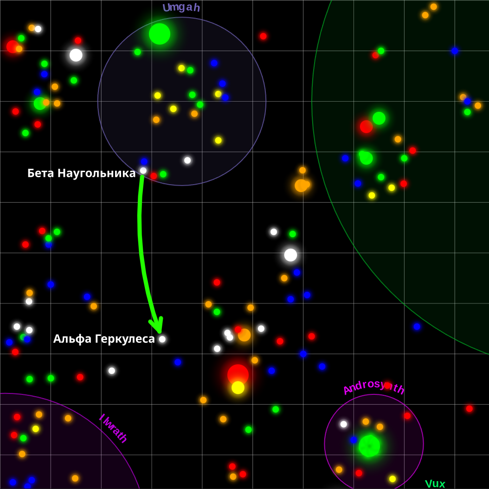

------------
------------
------------

## Глава четырнадцатая. Сокровища тишины

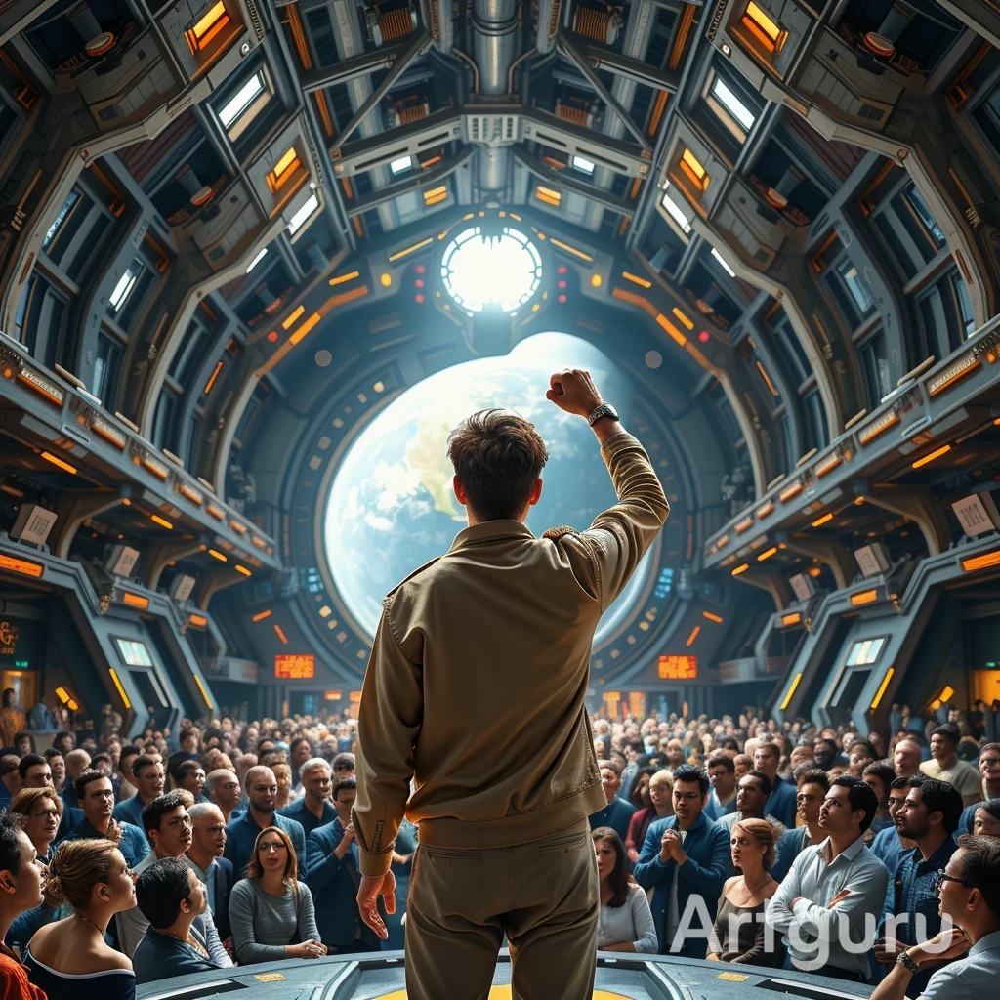

Альфа Геркулеса встретила нас непривычным спокойствием. После адской какофонии Умга эта тишина казалась почти неестественной. На сканерах расцветала прекрасная белая звезда, вокруг которой кружились семь планет. Два газовых гиганта — один ближе к центру системы, другой на окраинах — оба со свитой разнообразных спутников. Примечательно, что в системе не было ни одного астероидного пояса — вся минеральная роскошь, как выяснилось, хранилась прямо в недрах планетарных тел. Система была пустынна, тиха и идеальна для того, чтобы зализать раны.

— Капитан, на сканерах всё чисто, — доложил Басов, и в его голосе впервые за долгое время прозвучало что-то, отдалённо напоминающее облегчение. — Никаких признаков враждебного флота, баз, патрулей. Только планеты с аномально высокой концентрацией полезных ископаемых. Система... неестественно богата.

«Арго», всё ещё несущий на своем корпусе зияющие раны, которые требовали настоящего ремонта в нормальном пространстве, начал свой методичный обход этого щедрого звёздного архипелага.

...

Мы не стояли на месте. Сильвестр фон дер Кампф, в своей неизменной безупречности, превращал любую кратковременную стоянку у каждой планеты в этап грандиозной операции по восстановлению флагмана.

— Господин капитан, — отрапортовал он мне лично, когда я спустился в ангар, — позвольте заверить вас, что повреждения, хоть и выглядят устрашающе, но носят, к счастью, локальный характер. Каркас корабля цел. Это главное. И не стоит забывать, что его создали Предтечи, а эти ребята умели строить на века.

Вокруг корабля кипела работа, масштаб которой поражал. Были развёрнуты внешние рабочие платформы, с которых десятки специалистов, словно рой пчёл, атаковали пробоины, срезая оплавленные края и с ювелирной точностью устанавливая новые секции брони. Если ремонт в гипере был нервной, хаотичной импровизацией, то здесь звучала выверенная, спокойная увертюра. Тот же гул генераторов, то же шипение сварочных аппаратов и тот же стук гидравлических молотов теперь складывались не в какофонию, а в стройную мелодию, где каждый инструмент знал свою партию, и десятки специалистов, словно слаженный оркестр, исполняли второй акт симфонии возрождения.

— Мы заменяем пробитые секции обшивки, — Сильвестр указал рукой на огромный лист новой брони, который медленно поднимали краном. — Используем панели из нашего аварийного запаса. Их хватит. Скоро флагман будет крепче, чем прежде. Как ни парадоксально, но полученный опыт позволил нам усилить наиболее уязвимые узлы. Для двигателей мы, увы, можем сделать лишь временный ремонт, но до возвращения на базу этого будет достаточно.

Я смотрел на эту организованную суету и не мог не отдать ему должное. Педант — да, формалист — конечно, честолюбец — несомненно! Но профессионал высочайшего класса. Его люди работали без суеты, чётко, слаженно, каждый на своём месте.

— И когда наш оркестр сыграет финальный аккорд?

— О, можете не беспокоиться, господин капитан. Билли обирает планеты медленнее, чем мы проводим ремонтные работы.

...

Если Сильвестр был дирижёром симфонии ремонта, то Билли вёл свою, не менее азартную войну — войну за «сокровища» планет. Его челноки сновали туда-сюда без остановки. Каждый возвращался в трюмы, отяжелевший до предела, и выгружал не просто руду, а настоящее богатство.

— Капитан, вы не поверите! — его восторженный голос звучал в динамике, как у кладоискателя, нашедшего легендарную жилу. — Это не просто залежи. Это... планетарная сокровищница! Руды выходят на поверхность пластами. Видимо, уникальная геологическая история системы.

На экран мостика вывели сводку. Разнообразие было ошеломляющим:

Массивные залежи железо-никелевых руд с примесями кобальта и вольфрама — основа для любой серьёзной металлургии, будь то каркасы для новых модулей Арго или броня для новых крейсеров.

Жилы редкоземельных элементов — неодим, церий, диспрозий, невиданной чистоты — критически важные для производства сверхмощных магнитов двигателей, высокоточных сенсоров и систем наведения.

Богатые урановые и ториевые руды — решают проблемы энергоснабжения. Можно будет питать и щиты, и орудия, и заводы.

Платиноиды в самородных включениях — идеальные катализаторы для сложнейших химических процессов, возможно, для синтеза новых видов топлива или материалов.

— Капитан, это не добыча, это конвейер! — докладывал Билли, его голос хрипел от усталости, но горел энтузиазмом. — Порода словно ждёт, чтобы её взяли. Концентрации на порядки выше среднего. Мы не копаем — мы собираем!

Карма Сингх, изучавший первые партии, подтвердил:

— Сэр, качество руды исключительное. Минимум пустой породы. Коэффициент извлечения будет рекордным. Эти ресурсы — не просто пополнение запасов. Это возможность для настоящего технологического скачка. Теперь мы сможем не только ремонтировать, но и модернизировать оборудование, строить новые модули для флагмана и закладывать на верфях новые крейсера.

Он ходил по складам с лицом человека, не верящего своей удаче.

— Сэр, мы восполним потери от... тактического гравитационного манёвра... с лихвой.

...

Пока корпус «Арго» затягивался новым металлом, а его трюмы наполнялись материальным богатством, в тишине аналитического отдела кипела работа другого рода. Лейтенант Баковски и его команда подготовили сводку данных с компьютеров Фиво. Отчёт чётко делился на две части: первая — самые ценные находки о судьбах целых рас; вторая — всё остальное.

Я быстро пробежал глазами по отчёту, оставляя на полях краткие пометки:

«Бета Геркулеса 2». — ВАЖНО!
«Новая звезда в Циркуле и Чандрасекаре каждые 30 дней». — ВАЖНО!
«Долговременная шутка Умга над Ильрафами». — СМЕШНО, НО ПОКА МАЛОПОЛЕЗНО.
«Теория о Предтечах, укрывшихся идеальным щитом». — ФАНТАЗИИ СПАССИ.
«Десять мусорных свалок Предтечей». — БЕЗ УКАЗАНИЯ МЕСТ.
«Бредни Майконов о глубокой древности». — БЕЗ ПОДРОБНОСТЕЙ.
«Раса по имени — Главное Зло». — ТИПИЧНЫЕ СТРАХИ СПАССИ.

Принять решение было нетрудно. Вторую, техническую часть я переслал Басову. Его аналитический ум и опыт штурмана были идеальны для проверки и обобщения конкретных данных. «Алекс, разбери это. Нам нужны точные выводы по Бете Геркулеса и аномалии в Циркуле. Встречаемся через час у меня», — оставил я голосовое сообщение.

Первую же часть — ту, что касалась судеб Шофиксти, Йехатов, Андросинтов, всех тех, с кем мы когда-то сражались и у кого надеялись найти помощь, — я оставил себе. Это была работа не для штурмана. Это была работа для капитана.

Последующие пятьдесят минут я провёл, погружённый в эти записи. Обобщая и систематизируя данные, которые могли изменить всё.

Когда в дверь постучали, я с трудом оторвался от экрана.

— Входи, Алекс.

Басов вошёл с планшетом в руке, его лицо было сосредоточенным, как всегда, когда он с головой нырял в цифры.

— Капитан, предварительный анализ готов, — доложил Басов, садясь на стул, который я ему молча пододвинул.

— Давай сначала самое важное по Бете Геркулеса, — попросил я. Судьбы рас я уже знал. Теперь мне была критически нужна точка на карте, куда в ближайшее время вести корабль.

— Тогда начнём с главного, — сказал он, ставя планшет на стол между нами. — Бета Геркулеса 2. По данным Спасси, состав атмосферы пригоден для дыхания. Доля кислорода ниже земной, но проблема решается масками с концентратором и бустером.

— Те, что прогоняют через себя воздух, накапливают кислород и добавляют его при вдохе?

— Именно. Главное — ядовитых примесей нет. Можно работать в лёгком снаряжении, а не в скафандрах. Для разведки — идеально.

— Почти курорт, — усмехнулся я.

— Это ещё не всё, — в голосе Басова зазвучала едва уловимая нотка профессионального удовлетворения. Он провёл пальцем по экрану. — В базах Спасси указана совершенно другая средняя температура, чем в наших довоенных архивах. Если по-простому, в экваториальных областях днём достаточно тепло для жидкой воды. Так что насчёт курорта вы не ошиблись. Ночью, однако, всё равно большой минус. Нужно хорошее укрытие.

— Я присвистнул, оценивая масштаб ошибки. — Интересно! Может и по Эте Волопаса 2 у нас данные температуры ошибочные?

— Совершенно верно, — кивнул Басов, его пальцы уже листали сравнительные таблицы. — Я сверил официальные базы с теми замерами, которые когда-то собрал Билли. Данные до сих пор не обрабатывались — некогда было, да и никто не ожидал такого расхождения. — Он повернул планшет ко мне, показывая два столбца цифр, резко расходившихся друг с другом. — Если коротко: кто-то поставил лишнюю единицу, и обе планеты в отчётах оказались холоднее на сто градусов. Может, ошибка программы. Может, человеческий фактор при переносе. Сейчас уже не узнать. Но факт: обе планеты значительно теплее.

— Нельзя исключать и целенаправленный подлог, — добавил я, — или что Мур-муры частично осуществили терраформирование.

— Именно! — коротко согласился Басов. — Все версии вполне рабочие.

— Ладно, держим в уме. Может где-то выплывет... А что с аномалией в Циркуле? — Я указал пальцем на следующий пункт.

Басов снова наклонился к планшету. — Тут всё просто. Примерно 17-го числа каждого месяца между Циркулем и Чандрасекаром появляется ярко-зелёная звезда. Координаты попадают в ту самую область, на которую указывали Умга. Совпадение слишком точное, чтобы быть случайным. Аномалия наблюдается ровно трое суток, затем исчезает. Спасси успели зафиксировать несколько циклов до своего бегства. Ближайшая дата — уже скоро. Я буду следить.

— Ты думаешь, это Арилу? — спросил я. В голове как будто что-то соединилось: материализующаяся звезда и их корабли, возникавшие из ниоткуда в самый критический момент боя. Это было больше чем сходство — одна и та же необъяснимая закономерность.

— Логика подсказывает, что да, — Басов поднял на меня взгляд, и в его обычно бесстрастных глазах мелькнула азартная искорка охотника, нашедшего след. — Точнее можно будет сказать, когда приблизимся. Но теперь у нас есть конкретная зацепка, а не просто «где-то там, в том районе...».

— Идеально, — заключил я, чувствуя прилив бодрости. Это был настоящий прорыв. — Скинь этот отчёт узкому кругу, пусть ознакомятся.

— Сделаю, — коротко кивнул Басов, делая пометку.

Ещё раз окинув взглядом отчёт, я понял, что остальную информацию из архивов Спасси нельзя оставить в узком кругу. Она касалась каждого на этом корабле. Касалась нашей прошлой войны, наших погибших и преданных союзников, нашего возможного будущего. Это осознание отозвалось во мне твёрдой решимостью и я попросил Басова собрать весь свободный от вахт экипаж в одном из ангаров.

...

Под мерный гул нескольких сотен человек я вышел на импровизированную сцену, которую спешно перенесли из комнаты отдыха. Ту самую, на которой ещё недавно чествовали Барсика.

В первых рядах стояли Волков, Чен, Сингх, рядом с ними ёжился Фиво. Басов остался на мостике, наблюдая за собранием виртуально. Билли, закопчённый и усталый, протиснулся с краю, едва успев вернуться с очередной партией руды.

— Экипаж «Арго»! — начал я, и гул стих. — Наша стоянка здесь окупилась дважды. Пока трюмы наполнялись рудой, наши архивы пополнялись куда более ценной валютой — информацией. Мы получили доступ к летописям Спасси. И в них есть вещи, которые должен услышать каждый: о наших друзьях, о наших врагах, о нашей войне.

Я сделал паузу, вглядываясь в замершие лица, понимая, что мои следующие слова навсегда изменят их реальность.

— Первое... Шофиксти. — Я обвёл взглядом зал. — Многие из вас сражались плечом к плечу с этими бесшабашными воинами, чья ярость в бою уступала только их громогласным победным гимнам... Когда флот Ур-Куанов подошёл к их дому, они не сдались. Они активировали мощнейшую бомбу, которая превратила их родную звезду в сверхновую. Они уничтожили себя. Но вместе с собой они унесли на тот свет все дредноуты которые были в системе - целый вражеский флот. Этот акт отчаяния и ярости они назвали «Вспышкой Славы». Выжил ли кто-то — неизвестно. Но они пали не как рабы. Они пали как герои, забрав с собой палачей.

Все замерли в тяжёлом, почтительном молчании. В нём читалось и восхищение этой безумной отвагой, и горечь от абсолютно ужасающей цены, которую они заплатили. Волков молча сжал кулаки.

— Второе... Йехаты. — Я выдержал ещё более долгую паузу, чувствуя тяжесть этих слов. — Последние из Альянса. Те, кто дольше всех сдерживал натиск Ур-Куанов. Те, чья честь и доблесть не вызывали сомнений. Те, для кого верность клятве значила больше жизни... Они не повторили путь Шофиксти. Архивы Спасси не оставляют надежды: Йехаты склонили голову. Они присягнули Иерархии. Они больше не наши союзники. Теперь они... воины-невольники Ур-Куанов.

Эффект был как от разорвавшейся бомбы. Тишину смёл шквал неверия, протеста и отчаяния. «Не может быть!», «Предатели!», «Их заставили!». На лицах старых солдат читался настоящий шок. Йехаты — с их кодексом чести, с их величественными крейсерами... Рабы! Волков побледнел, а Чен на секунду закрыла глаза, будто получила физический удар. Это известие ломало один из последних оплотов надежды на то, что старый Альянс ещё где-то жив.

— Третье. Андросинты.
В ангаре повисло тягостное молчание. Все знали, кто они. Наши творения. Наши клоны. Наши слуги. Бежавшие в созвездие Лисички чтобы обрести свободу и наконец жить своей жизнью. Мы носили в себе ВИНУ — и НАДЕЖДУ. ВИНУ за те оковы, которые мы на них когда-то надели. За то, что видели в них лишь подневольных исполнителей, а не народ. И НАДЕЖДУ, что когда-нибудь сможем встать с ними плечом к плечу как равные, протянуть руку не как господа, а как союзники. Искупить прошлое совместным будущем.

Я видел, как эта надежда застыла на лицах экипажа.

— Их колония уничтожена, — с огромным трудом далась мне эта фраза и каждое слово обжигало. — Стёрта с лица вселенной. Полностью... И сделала это не Иерархия, а новая, неизвестная раса — «Орзы». Андросинтов больше нет. Наш шанс... наш долг перед ними... остался невыполненным. Навсегда.

На смену молчанию пришла невыносимая горечь. Горечь не просто потери возможного союзника, а навсегда упущенного искупления... Истории, которую не переписать. Долга, который не вернуть. Слов, которые не произнести...

А затем, медленно и неумолимо, из этой пустоты начала подниматься новая, леденящая мысль: Если некая сила смогла уничтожить целую расу — наследников человеческих технологий — то что она может сделать с нашими потрёпанными крейсерами и одной-единственной станцией?

— Но не всё так печально, — продолжил я, стараясь придать голосу ободряющие нотки. — Архивы сохранили и другую запись — довоенный визит Ченджесу к Спасси. Возвращаясь из экспедиции к ядру Галактики они остановились у Спасси и рассказали, что исследовали созвездие Тукана, где обнаружили неизвестную расу. Спасси, со свойственной им точностью, записали название как «Фоп-Доп-Бик»... или как-то так. — В зале послышались сдержанные смешки. — Но суть не в искажённом имени. Это информация от самих Ченджесу, которые не склонны разбрасываться пустыми словами.

По ангару пробежал оживлённый шёпот — механики и матросы переглядывались, кивали, перебрасывались короткими репликами. Повсюду звучал один и тот же вопрос о возможном новом союзнике.

— Теперь — Арилу, — я сделал особый акцент, зная, что для многих это самая важная новость. — Мы давно потеряли с ними связь. Но теперь, благодаря Умга, у нас есть указание: они прилетали к ним со стороны созвездий Голубя, Циркуля и Чандрасекара. И это было недавно. Это значит, что они не под рабским щитом. Они избежали нашей участи. А это открывает возможность найти союзников, которых мы считали потерянными.

Толпа мгновенно отозвалась одобрительным гулом. Эти скрытные, загадочные товарищи по оружию из старого Альянса всегда относились к людям с особой теплотой, даже заботой. Мы не знали, откуда они приходили и чем руководствовались, но знали, что их корабли всегда с особым рвением бросались на помощь именно земным крейсерам, защищая и спасая в самых безнадежных ситуациях. Теперь у нас есть шанс не просто найти их, а объединиться снова.

Гул, заполнивший ангар, постепенно перешёл в сдержанное, но оживлённое обсуждение. Это были уже не мифы и легенды об их доме, а координаты — пусть и размытые, но вполне осязаемые.

— И последнее на сегодня, — я позволил себе лёгкую, едва заметную улыбку, зная, какой эффект произведёт финал. — Сирены. Они живы.

Волна радостного, почти детского восторга прокатилась по ангару, сметая остатки мрака.

— Они не погибли и не сдались. Они, как и мы, выбрали изоляцию под рабским щитом. Их мир — планета в системе, которую Спасси в своём стиле записали как «Безквирт». Точных координат нет, но теперь мы знаем главное: они живы. На орбите их планеты должна быть станция, как наша «Последний Рубеж». И если мы найдём их и заключим союз... мы получим ещё одну базу для ремонта, снабжения и пополнения экипажа...

Я выдержал паузу, глядя в полные надежд глаза.

— ...И, как прекрасно помнят ветераны, присутствие Сирен на борту считалось не просто приятным бонусом, а нашим секретным оружием для поднятия боевого духа. — По залу прокатился лёгкий, понимающий смех. — Поэтому, что касается пополнения экипажа Сиренами... — я развёл руками, — ...вряд ли кто-то будет против?

Ангар загудел. Восторг, подхваченный сотнями голосов, сотряс стены, рассыпавшись на свист, улюлюканье и радостные крики, а в воздух полетели кепки. Образ синекожих красавиц с сияющими изумрудными глазами, действовал лучше любого боевого клича. Даже самые мрачные лица сейчас расплылись в улыбках. Это была надежда не просто на союзников, а на что-то прекрасное и вдохновляющее, ради чего стоит совершать самые отчаянные подвиги.

Я выдержал паузу, дав выплеснуться ликованию, затем поднял руку. Шум постепенно стих, но улыбки и блеск в глазах никуда не делись.

— Мы подвели итог прошлому и нашли компас в будущее, — я вложил в речь всю свою волю и мой голос, набрав силу, прокатился по ангару. — Мы знаем цену поражения. Мы знаем горечь предательства. Но мы также знаем, где искать друзей. И наш первый шаг — Чёрный Эскадрон. Это ключ, который откроет нам дорогу. К поиску Арилу и Сирен. К освобождению Йехатов! К возмездию за Шофиксти! Их флот — это СИЛА за нашей спиной! И МЫ ИДЁМ ЗА НАШЕЙ СИЛОЙ!!!

Толпа взревела в едином порыве. Звуковая волна ударила в переборки, заставив дрожать палубы. Гул нарастал, как турбина, превратившись в рокот, сметающий всё на своём пути. Это был уже не экипаж, а ЕДИНЫЙ ОРГАНИЗМ, ЕДИНАЯ ВОЛЯ. Сотни голосов слились в один рёв, вырвавшийся наружу оглушительным, громоподобным: «ДА-А-А-А-А!!!»

------------

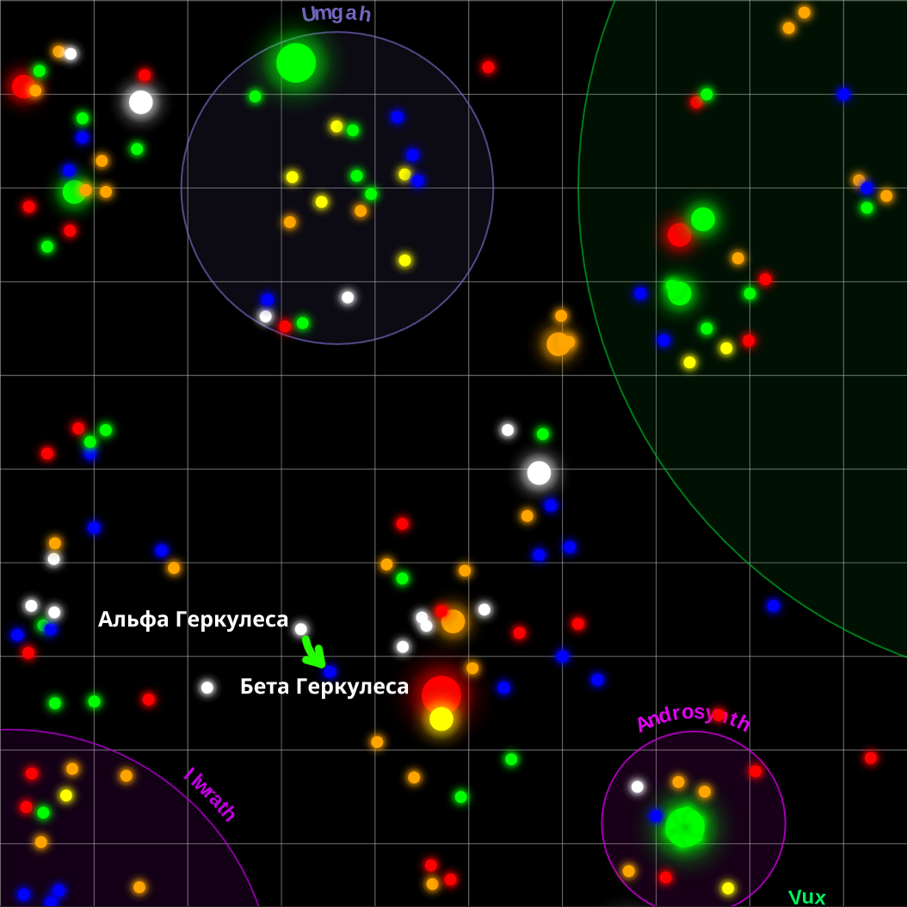

------------
------------
------------

## Глава пятнадцатая. Выгода любой ценой

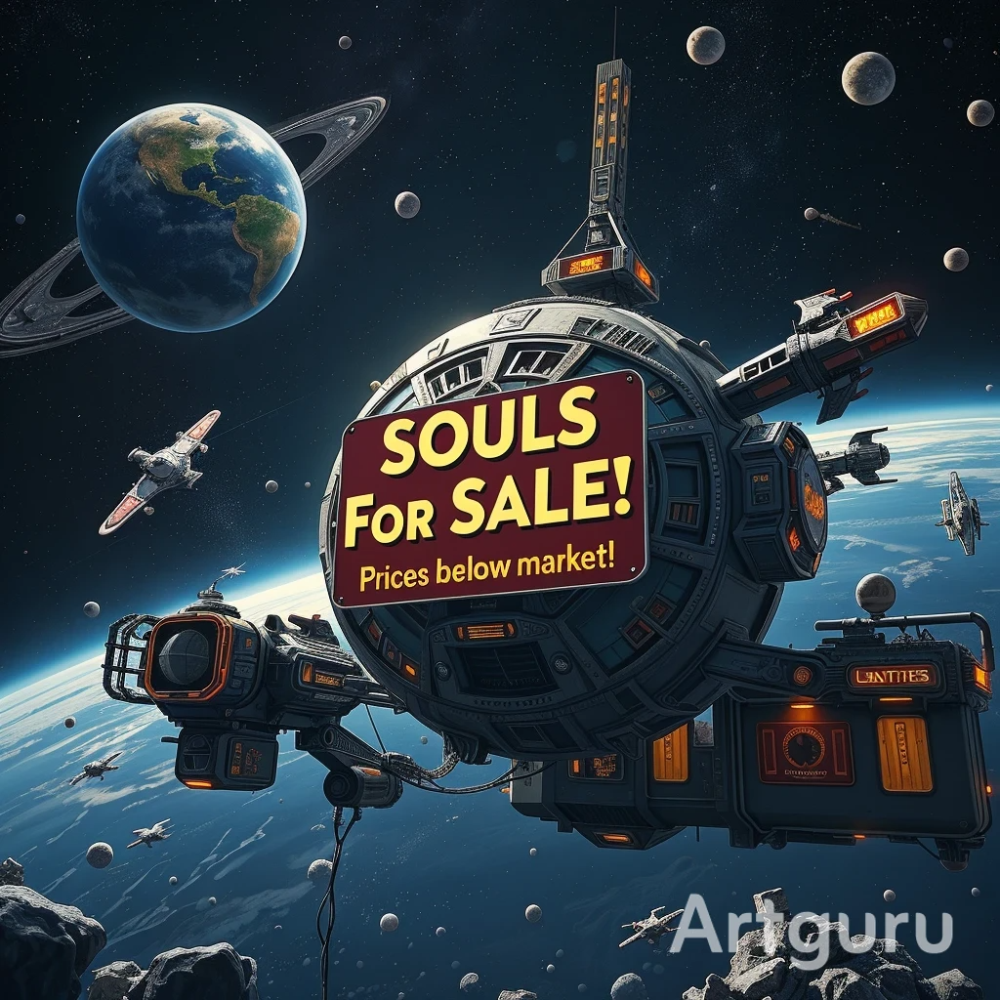

Покончив с делами в Альфе Геркулеса, этой щедрой космической кладовой, «Арго» устремился к предполагаемой базе Чёрного Эскадрона. Первая суета улеглась, и мы с Билли и Кармой Сингхом решили неспешно пройтись по трюмам. Было приятно видеть их снова заполненными доверху ценнейшими полезными ископаемыми после того, как мы опустошили их в схватке с Умга. Мои спутники с горящими глазами прикидывали, во что превратить это богатство дома, когда гарнитура в моём ухе ожила голосом Басова, нарушив нашу блаженную идиллию.

— Капитан, вам лучше подняться на мостик. У нас проблема!

У Александра был целый спектр оттенков голоса, варьировавшихся от «у нас небольшие неприятности» до «всем приготовиться к перевоплощению, сейчас взлетим на воздух». То, как звучал его голос сейчас, уверенно располагалось где-то посередине.

— Басов, — вздохнул я, закатив глаза. — У тебя есть какая-нибудь другая фраза для вызова меня на мостик? Что-нибудь вроде: «Капитан, у нас тут пирожки остывают» или «На горизонте появилась радуга необычайной красоты»?

— Есть, — без малейшей запинки ответил он. — Но я приберегаю её для особо торжественных случаев. Вроде обнаружения планеты, целиком состоящей из шоколада. А пока что — проблема, и вам лучше подняться.

...

Мостик встретил меня привычной прохладой и мягким свечением экранов. Басов не суетился. Он стоял неподвижный, как скала, положив ладони на край центральной консоли. Его спина была прямой, а взгляд прикован к тактическому дисплею, где пульсировала одна-единственная тревожная метка.

— Что на этот раз, Алекс? — спросил я, подходя. — На горизонте маячит очередное весёлое приключение?

— Можно и так сказать, — ответил он, не отрывая взгляд от экрана. — Нас кто-то преследует.

«Чудесно», — промелькнуло у меня в голове. Раненый зверь, за которым уже идёт новый хищник.

— Давно он за нами увязался?

— Как только это произошло, я сразу же вам сообщил. — Басов сделал паузу, взглянув на приборы. — Он вынырнул почти прямо по курсу, мы едва разминулись. И теперь идёт прямо за нами, постепенно сближаясь.

Обычно в гиперпространстве царит мёртвая тишина, нарушаемая лишь патрулями рас в пределах их зон влияния. Но сейчас мы шли по бывшим владениям Спасси — по мёртвой, брошенной территории. И единственные, кто мог тут безнаказанно рыскать, кроме нас, были...

— Алекс, только не говори, что это Слайландро. Мы сейчас не в той форме, чтобы принимать бой.

— Это не Слайландро, — Басов покачал головой. — У преследователя скорость ниже. Слайландро догнал бы нас гораздо быстрее.

— А этот? Догоняет? До Беты не успеем?

— Догоняет, — подтвердил Басов. — Не успеем... По приблизительным расчётам догонит часов через пять, а до Беты ещё часов пятнадцать. — Он бросил на меня быстрый взгляд. — Мы немного потеряли в скорости после последнего побоища.

— Неприятно. Мы не готовы к войне... — Басов почти неуловимо пожал плечами, словно говоря: «Да, всё так». — А по скорости что-то можно сказать? Кто это может быть?

— Скоростные характеристики близки к кораблям Спасси. Но в гипере точно не определишь.

— Спасси? — Я перевёл взгляд с экрана на Басова. — Эскадрон?

— Скоро мы это узнаем, — сухо констатировал Басов.

Гиперпространство — своеобразная штука. Корабль в нём заключён в чёрный как ночь пузырь искажённой реальности, абсолютно непроницаемый для сенсоров. Вы никогда не узнаете, кто скользит в соседнем пузыре — друг, враг или просто безразличный странник. Но стоит этим сферам коснуться друг друга, как их ткани сливаются, форма рушится, и оба корабля срываются в нормальное пространство. Лишь тогда вы видите того, с кем свела вас эта неотвратимая встреча.

Я смотрел, как медленно и неумолимо нас настигал неопознанный преследователь, и думал о моменте, когда это произойдёт. Мысленно я уже проигрывал возможные сценарии. Хорошо, если это Чёрный Эскадрон — мы и сами их искали. А если какой-то неизвестный враг? Принимать бой совсем не хотелось. Сражаться в нашей текущей кондиции было бы далеко не лучшей идеей.

Мы с замиранием сердца ждали момента соприкосновения пузырей. Каждая минута тянулась как час. На мостике воцарилась тишина, нарушаемая лишь тихими щелчками клавиш под пальцами Басова.

За это время наша рыжая Элизабет дважды приносила нам чай и бутерброды — она всегда знала, что в такие моменты тело требует топлива, даже если ум целиком поглощён ожиданием. Её лицо было сосредоточенным, а в её понимающем взгляде читалось: «Сражение будет потом. А сейчас вам нужны силы, чтобы его дождаться». Мы были благодарны ей за молчаливое напоминание об этих простых вещах, за её заботу, ну и за бутерброды, разумеется!

И вот момент настал. Алые вихри гиперпространства внезапно закрутились с бешеной скоростью, сливаясь с таким же кровавым свечением снаружи. Корабль содрогнулся от лёгкой, но отчётливой турбулентности, и нас выбросило в обычное пространство. На главном экране радара, где прежде была лишь наша одинокая точка, вспыхнула вторая. Пузыри соприкоснулись.

Где-то в межзвёздном пространстве, где нет ни светил, ни планет, ни астероидов и лишь разрежённый газ да россыпь «бриллиантов» на чёрном небе. Где до ближайших звёзд — парсеки безжизненной пустоты. Два корабля, вырванные из гиперпространства асимметрией соприкоснувшихся коконов, начинали медленно и неуверенно оживать, озираясь по сторонам, как существа, пробудившиеся от глубокого сна.

— Контакт, — отчётливо произнёс Басов, запуская сканирование. — Корабль... Это Мелнормы, капитан! Орудийные порты закрыты, щиты на минимальном уровне. С их стороны идёт сигнал вызова.

Напряжение спало, сменившись острым любопытством. Мелнормы? Здесь? — Соединяй. Интересно, зачем мы им понадобились?

Картина космоса на главном экране погасла, уступив место изображению странного интерьера. Помещение было однотонным, и его цвет менялся в зависимости от освещения. Сейчас мостик нашего гостя был залит ярко-красным светом. Ни экранов, ни пультов управления, ни намёка на какое-либо кресло. Лишь гладкие стены и абсолютная пустота. Создавалось полное ощущение того, что кораблём управляют силой мысли.

В центре экрана, в абсолютной пустоте странного мостика корабля Мелнормов, парило существо. Его тело было крупным, продолговатым овалом ровного, матово-оранжевого цвета — словно его выточили из цельного куска песчаника. От центрального овала симметрично отходили наросты поменьше: две сферы по бокам в районе, где можно было предположить «уши», ещё одна пара ниже, в районе челюсти — словно гигантские «желваки», которые периодически шевелились, создавая ощущение жизни под неподвижной оболочкой. На самой большой, центральной части зиял единственный огромный синий глаз с вертикальным зрачком, который время от времени плавно превращался в горизонтальную щель и обратно, будто беспрестанно что-то сканируя. Прямо под ним застыла широкая, немигающая и совершенно неестественная улыбка, будто раз и навсегда вырезанная в мраморе или отлитая в бронзе. На этой замершей улыбке при общении неестественно активно двигались тонкие губы, создавая ещё более странный, жутковатый эффект.

— Я — торговец Руби, командир этого корабля, — раздался голос. Монотонный, бесцветный, но при этом идеально членораздельный. — Согласно нашему торговому протоколу, я обязан напомнить наш корпоративный девиз: «Выгода любой ценой». Теперь, когда формальности соблюдены, я официально приветствую вас, капитан, и выражаю надежду на установление продолжительных и взаимовыгодных отношений.

— Я думал, при нашей первой встрече вы пошутили насчёт «Выгоды любой ценой», — сказал я, вспоминая наше знакомство с этой расой. — Кажется, это был командор Гриниш.

— Да, всё верно, — без малейшей заминки ответил Руби. — Командор Гриниш — глава торгового флота Мелнормов в данном секторе. Он базируется на Альфе Центавра, ближайшее место к вашей Солнечной системе, где мы можем иметь постоянное представительство. И нет, мы не шутили. Мы вообще не шутим. Юмор — нерациональная трата когнитивных ресурсов и времени.

— В какой-то степени меня сейчас это даже радует, — честно признался я, позволяя себе расслабиться в кресле. — А то за последнее время у меня что-то образовался критический переизбыток шуток в крови. Причём самого чёрного сорта.

— Да, мы в курсе вашего недавнего столкновения с Умга, — констатировал Руби. — Позвольте выразить удовлетворение положительным исходом боя. Было бы очень обидно потерять столь перспективного клиента.

Мысль, промелькнувшая в голове, была настолько очевидной, что даже не требовала слов. Я встретился взглядом с Басовым, и в его едва приподнятой брови прочёл то же самое: «Как всегда. Они всё знают».

Эта их осведомлённость, демонстрируемая с такой лёгкостью, была пугающей. Она стирала саму возможность секретов, оставляя лишь неприятное ощущение, что мы — открытая книга, которую кто-то постоянно листает за нашей спиной.

— И откуда такая осведомлённость? — не удержался я.

— Мы собираем информацию из тысяч разнообразных источников, разбросанных в пространстве и времени, — невозмутимо ответил Руби. — Знания — это и есть основа нашего бизнеса.

— И что же это за источники такие? — поинтересовался я, уже догадываясь, какой может последовать ответ.

— Стоимость раскрытия хотя бы одного такого источника настолько высока, что ваша раса будет выплачивать её веками.

Так, ясно. Никаких скидок на человечность... Стоило немного расслабиться и начать видеть в них просто чудаковатых торговцев, как они тут же напоминают тебе суть.

— А-а-а, — протянул я. — «Выгода любой ценой», я и забыл... А позвольте полюбопытствовать, отчего такое пристальное внимание к Земле, что аж ЦЕЛЫЙ командор, глава ВСЕГО торгового флота в этой части космоса, базируется почти у нашего порога?

— Мы знали о вас ещё до нашей первой встречи, капитан. Ваша борьба за свободу галактики — это сложная задача. Мы заинтересованы в положительном исходе этой миссии и допускаем вероятность вашего успеха. Именно поэтому одно из наших представительств находится в непосредственной близости от Солнечной системы... И не мы одни наблюдаем за вашей кампанией. Вот, например, капитан Кил-Верези недавно выразил живейший интерес и страстно желал успеха вашему делу. Мы обсуждали этот вопрос буквально вчера. Но, как и все Верези, он, вероятно, не решится на личную встречу из-за опасения произвести нежелательное впечатление своим видом.

У меня уже голова шла кругом от того количества новой информации, которая свалилась на нас в последнее время. Новые имена, новые расы, новые загадки. Вот теперь ещё какой-то Кил-Верези!

— И зачем вам нужна наша победа? И кто такой этот Кил-Верези?

— Эти вопросы относятся к категории стратегических активов высшего порядка, — без колебаний отрезал Руби. — Их стоимость несоизмерима с вашими текущими возможностями по оплате. Кроме того, капитан Кил-Верези ясно дал понять, что желает остаться инкогнито... — Он сделал крошечную, чисто риторическую паузу. — Капитан, я предлагаю вернуться к сути. Скажите, зачем вы нас вызвали?

— Мы вас вызвали? — ошарашенно переспросил я. — Мы вас не вызывали.

— Мы получили чёткий сигнал гиперпередатчика с координатами вашего текущего местоположения в гиперпространстве. Стандартный протокол запроса на торговое взаимодействие.

Я вопросительно посмотрел на Басова. Тот закрыл глаза и едва заметно кивнул, всем видом показывая: «Да, он».

Я нажал кнопку связи. — Билли, срочно разыщи Фиво. И узнай, не подходил ли он к гиперволновому передатчику.

— Будет сделано, капитан! — тут же отозвался Билли.

— Руби, — я снова повернулся к экрану, изо всех сил стараясь сохранить деловой тон. — Я приношу извинения за небольшую... техническую заминку. Так на чём мы остановились?

— На надежде, капитан. Надежде на продолжительные и выгодные взаимоотношения, — повторил он, как запрограммированный.

— Насколько я помню, Гриниш говорил, что вы заинтересованы в биологических данных об инопланетных видах жизни, а также в координатах неких... аномальных планет, энергия излучения которых перегружает сканеры, производя изображение, похожее на радугу. Я ничего не напутал?

— Вы ничего не напутали, капитан, — подтвердил Руби. — В обмен мы можем предложить множество интересных и ценных товаров: топливо; технические чертежи, позволяющие вам строить новые модули для вашего корабля; а также множество важных секретов, которые могут оказаться для вас полезными. Для упрощения транзакций мы конвертируем всё, что вы нам продадите, в Межзвёздные Кредиты — универсальную расчётную единицу. Вы можете затем тратить их по своему усмотрению. Если у вас возникли вопросы — смело их задавайте.

— Планет мы странных не встречали, — сказал я. — А вот животных хоть отбавляй. Кажется, мы собрали данные о двухстах восемнадцати разных видах живых существ. Алекс, передай Руби все данные об инопланетных видах, которые мы встретили за последнее время.

Басов кивнул и запустил передачу данных, а на экране замигали индикаторы отправки. Через несколько секунд торговец отреагировал.

— Данные получены, — подтвердил он, и освещение на его мостике сменилось с ярко-красного на глубокий пурпурный. — Двести восемнадцать записей о ксенобиологических видах. На ваш торговый счёт зачислено двести восемнадцать кредитов.

— Расценки всё те же? — уточнил я. — Сто пятьдесят кредитов за чертёж новой технологии, семьдесят пять за информацию и один кредит за единицу топлива?

— Всё верно. Наши тарифы стабильны.

— Один чертёж — сто пятьдесят кредитов! Может, мы не тем занимаемся? Может, давно пора в торговцы переквалифицироваться? — я посмотрел на Басова. — Алекс, ты чертить умеешь?

— Мои художественные способности, капитан, — невозмутимо ответил Басов, — ограничиваются схематическим изображением вектора, по которому противнику настоятельно рекомендуется удалиться с нашей траектории. В цвете. — Он выдержал лёгкую, почти театральную паузу. — В коммерческом искусстве я не силён.

— Жаль, — сказал Руби без тени иронии. — Рынок технической документации всегда испытывает дефицит качественного контента.

— Капитан, — тихо сказал Басов, слегка наклонившись ко мне. — Может, взять топлива? Не придётся возвращаться на базу. Сможем сразу рвануть к аномалии в Циркуле. Сэкономим несколько недель.

— Дельная мысль, — кивнул я. — Логистика — основа любой кампании.

— Руби, давай нам шестьдесят восемь единиц топлива. Как раз останется на одну технологию или парочку ваших секретов.

— Сделка подтверждена, — откликнулся торговец. — Стоимость: шестьдесят восемь кредитов. Топливо оплачено. Начинаем перекачку в ваши баки. Это займёт некоторое время.

Где-то вдалеке послышалось лёгкое шипение — это в недрах корабля открылись клапаны, и драгоценное горючее потекло в наши ненасытные баки.

— А не дороговато сто пятьдесят кредитов за один чертёж технологии? — спросил я, глядя на это оранжевое существо с вечной улыбкой.

— Мне кажется, капитан, у вас в корне неверное представление, — оживился Руби, и в его голосе зазвучал неподдельный энтузиазм. — Эти технологические новинки не стоят вам кредитов, они ПРИНОСЯТ вам кредиты! Конечно... есть некоторый первоначальный вклад, но каждая наша технология ГАРАНТИРОВАННО будет полезна для чего-то важного — где-то в галактике, когда-то в будущем. Это не расходы. Это долгосрочные инвестиции.

Я посмотрел на него с чувством глубокой усталости, знакомой каждому, кого хоть раз атаковал сетевой маркетолог. В его тоне сквозила та же непоколебимая уверенность, с какой продают эликсир бессмертия.

— Вы раньше пылесосами случайно не торговали? — не удержался я.

— Мы торговали всем, что приносит выгоду, — без тени смущения ответил Руби. — Но пылесосы — низкомаржинальный товар.

Я ощутил полную бессмысленность дальнейших шуток. Мои слова отскакивали от этой оранжевой глыбы, как горох от бронестекла, не оставляя ни царапины. Мы были в разных системах координат. С этим существом можно было говорить лишь о цифрах и фактах. Всё остальное для него было просто фоновым шумом, не имеющим ценности. До него не дойдёшь иронией, не проймёшь сарказмом. У него в голове был только баланс да дебет с кредитом.

— Ладно, — «бизнес, так бизнес», подумал я, глядя на его бутафорскую улыбку. — Есть ли у вас какая-либо информация, которая могла бы быть... ну, скажем так, особенно полезной для нас в текущих обстоятельствах?

— Безусловно, — ответил Мелнорм, и его тон стал чуть более заинтересованным. — Информация — наш основной товар. Собственно, прямо сейчас моя система высветила один информационный пакет, который, согласно нашему анализу ваших известных интересов и текущей ситуации, я уверен, имеет неоценимую важность для вас!

— Нас крайне интересует, не знаете ли вы, о каком таком «чёрненьком Братане» Ур-Куанов говорили Умга?

— Именно этот информационный пакет я и имел в виду, — подтвердил Руби. — Стоимость раскрытия данной информации стандартная и составляет семьдесят пять кредитов.

— Ну что, Алекс, — вздохнул я, — раскошелимся? Кажется, сейчас для нас эта информация важнее любой технологии.

— Согласен, — коротко кивнул Басов. — Гулять так гулять.

— Ладно, Руби, — сказал я с ощущением, что у нашего оппонента семь тузов в рукаве, и мы всё равно уйдём без штанов. — Выкладывай. Что это за чёрный братан на корабле из тишины и мрака?

Руби на секунду замер, и лишь его зрачок беспрестанно перетекал из вертикального положения в горизонтальное и обратно.

— Итак... Ур-Куаны сейчас воюют с расой, которая называется Кор-А. Они сражаются в области пространства, ограниченной большой сферой с центром в районе созвездия Чаши. И хотя, вероятно, ещё рано делать окончательные выводы, текущий анализ распределения сил и потерь указывает на то, что Кор-А побеждают.

Тишина на мостике стала звенящей. Я услышал, как Басов резко вдохнул.

— Побеждают? Ур-Куанов? — переспросил я, не веря своим ушам.

— Такова текущая динамика, — бесстрастно подтвердил Руби.

— А кто они такие, эти Кор-А?! — вырвалось у меня.

— Это, — сказал Руби, — будет стоить вам ещё семьдесят пять кредитов.

И тут меня прорвало...

— Ах ты ж... барыга! — Я ткнул пальцем в экран. — Ты же почти ничего не сказал! «Идут бои, кто-то кого-то бьёт»! Это и так понятно!

Руби склонил голову набок, словно изучая редкий образец неадекватного поведения.

— Я предоставил вам данные о НАЗВАНИИ расы, точные стратегические данные о ЛОКАЛИЗАЦИИ конфликта и его текущем СТАТУСЕ, который ОТВЛЕКАЕТ основное внимание и ресурсы вашего главного противника. Согласно вашему первоначальному запросу, первый пакет информации о «братане» раскрыт. Теперь у вас возник новый, уточняющий вопрос.

Злости моей не было предела! Они не обманывали. Они честно грабили! Строго по тарифу... Они взяли с нас семьдесят пять кредитов не за тайну — а за её огрызок, за жалкие крохи информации, которые только распаляли голод! И теперь, с лицемерной вежливостью, открывают следующий прайс-лист. Делить целое на куски и продавать каждый втридорога — вот их ремесло. Можно было возмущаться, скандалить, рвать на себе волосы, но это ни на миллиметр не сдвинуло бы эту оранжевую глыбу. Самые натуральные барыги, космического масштаба!

— Ладно... — махнул я рукой, понимая, что спорить бесполезно. — Давай дальше. Кто такие эти Кор-А?

Руби снова сделал свою микро-паузу.

— Вынужден вас огорчить, капитан. В процессе верификации предоставленных вами биологических данных наши системы обнаружили аномалию. Две записи из двухсот восемнадцати оказались идентичными. Таким образом, уникальных записей — двести семнадцать. На данный момент у вас осталось... семьдесят четыре кредита. Этого недостаточно для оплаты второго информационного пакета.

Я несколько секунд молча смотрел на экран, пытаясь переварить весь этот абсурд.

— Одного кредита не хватает? — наконец произнёс я. — Вы шутите?

— Мы никогда не шутим, капитан, — невозмутимо парировал Руби. — Это противоречит протоколу эффективности.

Я обернулся к Басову, чувствуя, как абсурдность ситуации начинает зашкаливать.

— Алекс, как так могло получиться? Ты же всё проверял!

Басов был бледен. На его обычно бесстрастном лице боролись вина и ярость.

— Я проверял данные с каждой планеты в отдельности, капитан. Повторов внутри одной экспедиции не было. — Казалось, он уже заново прокручивал мысленно все данные, пытаясь найти ту самую роковую точку. — Это могло быть, только если два одинаковых вида жили на двух разных планетах, но мы никогда с таким прежде не сталкивались, и я даже не подумал сравнивать данные из разных экспедиций.

— Получается, — медленно проговорил я, — на двух разных планетах, в разных концах космоса, обитали два совершенно одинаковых вида?

— Всё верно, — вмешался Руби. — Дублирующая запись присутствует в данных с двух разных планет.

Мы с Басовым смотрели друг на друга в полной беспомощности. Весь этот эпичный путь, все битвы, подвиги, преодолённые парсеки... А теперь мы упираемся в один жалкий, никому не нужный кредит из-за какого-то космического суслика, который оказался клоном своего собрата с другой звезды.

— Ну хорошо, — сказал я, собираясь с мыслями. — Мы в следующий раз занесём вам недостающий кредит.

Руби покачал головой. Плавно и неумолимо, как метроном.

— Если вы погибнете до того, как сможете совершить следующую транзакцию, кто компенсирует нашу потерю, капитан? Мы не работаем с кредитными рисками такого уровня. Мы не торгуем в долг.

— Давайте тогда... мы возьмём на одну единицу топлива меньше, — предложил я, пытаясь сохранить самообладание.

— Это невозможно. Сделка по топливу завершена, и товар возврату не подлежит.

— Ну, выкупите тогда у нас обратно одну единицу топлива за один кредит! Вы же его всё равно ещё не успели перекачать к нам в баки. — Я чувствовал, как мой мешок аргументов пустеет с умопомрачительной скоростью.

— Благодарю за предложение, но мы не заинтересованы в покупке топлива.

Пальцы непроизвольно сжались в кулаки.

— Но это же была ваша ошибка! — не выдержал я. — Это же вы не заметили дубль и начислили лишний кредит! А мы теперь должны расплачиваться за ваш недосмотр?!

— Всё верно, капитан, — согласился Руби, совершенно не смутившись. — Таков наш торговый протокол. Поставщик несёт конечную ответственность за уникальность и достоверность предоставленных ксенобиологических данных. Вы вправе отказаться от дальнейшего сотрудничества с нами, если такие условия вас не устраивают.

Он сказал это с такой ледяной, протокольной уверенностью, что у меня опустились руки.

Я смотрел на экран, за которым скрывалось это странное существо, и понимал: передо мной не просто инопланетянин. Передо мной — воплощённый, абсолютный и безжалостный принцип. Принцип, который ставит ценник на всё: на знание, на помощь, на саму возможность выжить. «Выгода любой ценой» перестало быть корпоративной шуткой или чужой странностью. Это был принцип существования целой расы.

Принцип, в сравнении с которым меркла даже тирания Ур-Куанов. В нём не было ничего — ни ярости, ни страсти. Только холодная, идеальная, неумолимая арифметика. Принцип, где даже их заинтересованность в нашей победе никак не должна повлиять на их доходы.

«Выгода любой ценой»... Это не просто их слоган или их девиз. Это их суть. Их ДНК.

— Но мы же делаем важное дело для всей галактики! — в отчаянии бросил я, уже понимая, что это всё равно что просить ураган изменить направление. — Вы же сами говорили, что заинтересованы в нашей победе. Неужели ради такого важного дела нельзя сделать исключение? Разве альтруизм и помощь ближнему — не наивысшая ценность?

На «лице» Руби промелькнула какая-то мимолётная тень, и его зрачок на секунду замер.

— Нет, капитан, это не так, — его голос впервые приобрёл оттенок чего-то, похожего на... лёгкое раздражение. — В нашей культуре «отдать» без эквивалентного возмещения в виде материальных товаров, услуг или информации считается неприличным и неприемлемым. И, пожалуйста, не поднимайте больше эту тему.

«Да чтоб вас...» — пронеслось у меня в голове. Вот уж точно — «Выгода любой ценой»! Всё упирается в один кредит, в сумму размером с чашку кофе!

Я посмотрел на Басова. Тот сидел, опустив голову, и его лицо не выражало ничего, кроме горького уныния.

— Приехали... — тихо сказал я. — Алекс, вот где нам, в открытом космосе, взять данные о каком-нибудь живом существе, которого у них ещё нет?

— Может, тараканов им отсканировать? — мрачно предложил Басов.

— Руби, — сказал я, уже на автопилоте, — тараканов возьмёте? Можем штучно, можем на вес, можем с подробным описанием жизненного цикла.

— Мы уже имеем данные об этом биологическом виде, — бесстрастно отреагировал Руби.

— Крысы? Мыши? Мухи? Космическая моль?

— Все перечисленные вами биологические виды уже содержатся в наших базах данных.

И в этот момент, словно по звонку небесной канцелярии, на связь вышел Билли.

— Капитан, ну вы были правы! — его голос звучал сдержанно-весело. — Наш Барсик маялся бездельем, а тут гиперпередатчик — большой, красивый, с кучей кнопочек, мигающих огоньков... Ну, он не удержался. Немного потыкал. Говорит, хотел узнать прогноз погоды на Бете Геркулеса.

Тут меня осенило!!! Как удар молнии в кромешной тьме.

— Руби, — начал я, и в моём голосе зазвучала новая, расчётливая нотка. — А вы были бы заинтересованы в данных о виде ОТВАЖНЫХ Спасси?

Единственный огромный и вечно «моргающий» глаз Руби даже сузился на пару миллиметров.

— Капитан, при всём моём уважении к вашим тактическим способностям, — Руби сделал едва заметную, чисто риторическую паузу, — то, что вы выстреливаете его в гущу боя и заставляете сражаться, ещё не говорит о смелости и отваге. В такой обстановке он уже повинуется инстинкту самосохранения. Это адаптивное поведение под экстремальным давлением.

— Но чисто теоретически, — настаивал я, — если бы такой Спасси существовал — уникальный, преодолевший свои генетические страхи, действующий вопреки инстинктам... Информация о таком феномене была бы вам интересна? Как, ну скажем... ксенопсихологический кейс?

Руби замер. На этот раз пауза затянулась. Казалось, в его процессоре шли титанические вычисления, где взвешивалась редкость явления против стоимости.

— Гипотетически, — наконец произнёс он, — да. Уникальный поведенческий паттерн, противоречащий видовой норме, несомненно представляет определённый академический и коммерческий интерес.

Я не смог удержаться от торжествующей ухмылки.

— Алекс, а ну-ка, прокрути этому барыге «Рубикон» нашего Барсика.

Очередной раз мы наблюдали, как маленькое, дрожащее существо ОТВАЖНО шаг за шагом преодолевает коридор, ангар, берётся за поручень и... САМООТВЕРЖЕННО заходит в корабль.

— Ну как? Такого вы ещё не видели? — торжествующе произнёс я.

— Не знаю, что вы с ним сделали, но это действительно интересно.

— Ничего мы с ним не делали. Мы его просто любим. Но вам, — я посмотрел на это оранжевое существо с бегающим зрачком, гуляющими желваками и неестественной улыбкой, — кажется, этого никогда не понять... — Я переключился на внутренний канал связи. — Так, Билли, хватай нашего Барсика и дуй к Мари Пастер в лабораторию. Пусть она сделает все сканы, томографию и всё остальное, что у неё там есть, и пересылает нам на мостик. Натыкал там кнопочек — вот теперь пусть отвечает. Только живо!

— Есть, капитан! — радостно отозвался Билли.

Следующие пятнадцать минут мы с Басовым наблюдали, как в лаборатории суетятся вокруг маленького зелёного существа. Фиво сидел на столе, а доктор Пастер приставляла к нему датчики, приговаривая что-то успокаивающее на французском. Периодически Фиво бросал жалобный взгляд в камеру.

Наконец, поток биометрических данных хлынул к нам. Мы сгенерировали краткий отчёт: «Кейс Спасси-Фиво: подавление доминирующего инстинкта страха в пользу групповой солидарности и выполнения долга». И передали Руби интересующие его данные.

— Хорошо, капитан. Данные приняты как уникальный ксенопсихологический прецедент. На ваш счёт зачислен один кредит.

— Самый дорогой кредит в моей жизни, — мрачно выдохнул Басов.

— Руби, — сказал я, чувствуя, как камень свалился с плеч. — Теперь ты нам можешь рассказать, что это за Кор-А такие?

— Да, конечно, — сказал торговец своим бесстрастно-деловым тоном. — Кор-А — это ответвление расы Ур-Куанов, которое отделилось от основной ветви много тысяч лет назад. Их текущая битва — это не просто война. Это ритуальное разрешение фундаментального философского раскола, возникшего после победы Ур-Куанов над своими бывшими рабовладельцами, Дниарри.

Если обычные Ур-Куаны, побеждая другие расы, либо ассимилируют их в свою Иерархию как «воинов-невольников», либо изолируют на родных планетах под рабским щитом, то философия Кор-А эволюционировала иначе. Они утратили саму концепцию потенциальной полезности других видов. Их парадигма безопасности основана на абсолютном, тотальном устранении любой возможной угрозы. Чтобы гарантировать свою безопасность на сто процентов, Кор-А не порабощают и не изолируют. Они уничтожают. Полностью. Без остатка. Геноцид — не эксцесс их войны. Это их стандартная операционная процедура при контакте с любой цивилизацией, которую они сочтут достаточно развитой, чтобы представлять гипотетическую опасность в отдалённом будущем. Они не воюют. Они проводят санитарную зачистку вселенной.

Тишина, воцарившаяся на мостике после этих слов, была страшнее любой канонады. Я видел, как Басов медленно откинулся в кресле. Его лицо стало пепельно-серым. Такого удручённого вида я у него не видел никогда. В горле пересохло.

«Вот тебе и братан!!!» — пронеслось в оцепеневшем сознании. Мы думали, что Ур-Куаны — это предел ужаса. Оказывается, мы даже не представляли, что такое настоящий ужас.

— Ну... спасибо тебе, Руби, — с трудом выдавил я. — Даже не знаю, как тебя благодарить за такое...

— Благодарность не требуется, капитан, — ответил торговец. — Вы оплатили информацию в полном объёме.

— Да... — вздохнул я. — Похоже, что такое ирония, вы тоже не знаете.

Экран погас, оставив нас в полной, оглушительной тишине, нарушаемой лишь гудением систем и тяжёлым дыханием.

— У одних — выгода любой ценой, — наконец прошептал Басов, глядя в пустоту, где только что было «лицо» торговца. — У других — геноцид любой ценой. Весёлая у нас галактика.

— Да уж, обхохочешься, — пробормотал я, ощущая полную, всепоглощающую усталость. — Я уже почти ностальгирую по нашим старым добрым поработителям.

Я посмотрел на Басова. В его глазах читалась та же мысль, то же трезвое и беспощадное осознание. Осознание того, что где-то там есть нечто, перед чем даже Ур-Куаны — всего лишь испуганные дети.

— Зато теперь, я кажется, знаю, что сказать при встрече с Эскадроном. У нас появился общий враг. И он страшнее любых разногласий.

Я посмотрел на тактический экран, где корабль снова начинал разгон, чтобы взять курс на Бету Геркулеса. Они ищут угрозу, чтобы её нейтрализовать? Что ж, теперь мы можем показать им НАСТОЯЩУЮ угрозу. Ту, от которой не отсидишься в тени. Ту, с которой не договоришься и которую не подкупишь. Ту, которую можно только уничтожить. Вероятно, это и будет наш общий интерес, который заставит нас встать по одну сторону баррикад. Ставки взлетели до небес, и на кону уже нечто похуже рабства. На кону — полное и тотальное небытие.

------------

## Глава шестнадцатая. Доверяй, но проверяй

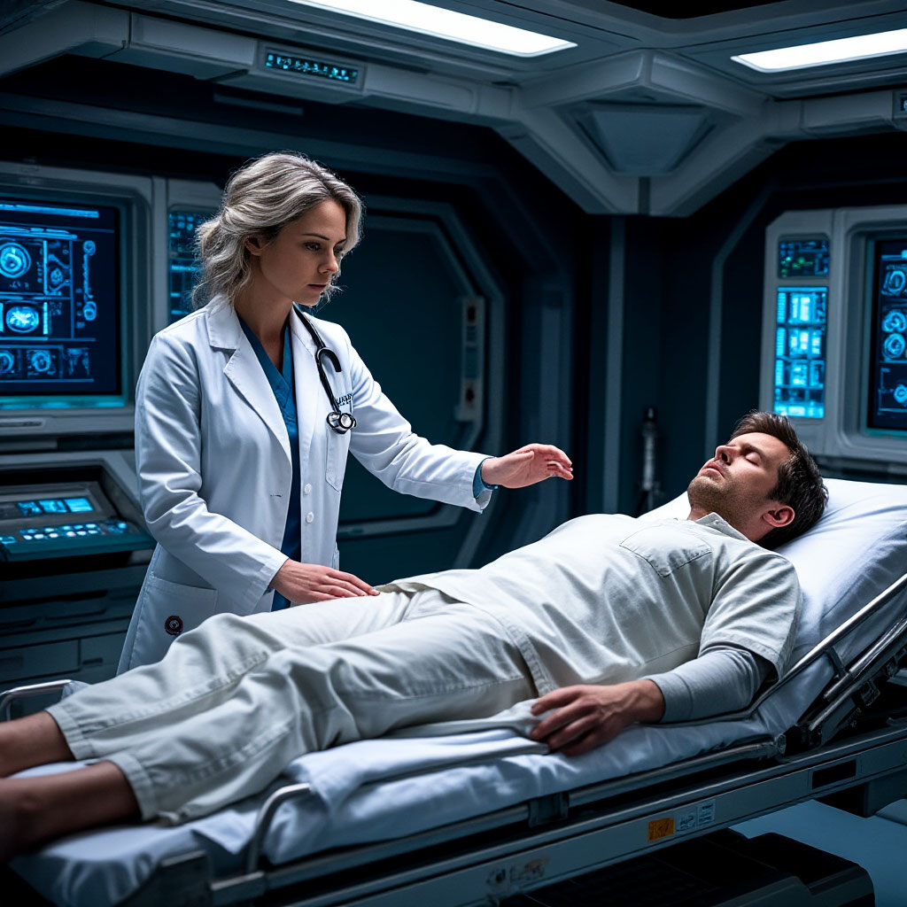

Система Бета Геркулеса встретила нас абсолютной тишиной. Тщательное сканирование выявило лишь старые тепловые следы двигателей да облако обломков, оставшееся со времён последней битвы. Те самые исследовательские «Зонды», что прогнали нас в прошлый раз, исчезли. Вероятно, собрали необходимые данные, разобрали на составляющие компоненты всё, что сочли интересным, и отбыли в иные пределы, где реальность ещё не была так тщательно каталогизирована.

«Арго», всё ещё нёсший на своём корпусе шрамы прошлой битвы, осторожно двинулся ко второй планете. Безмолвной и загадочной. Туда, где могла скрываться база Чёрного Эскадрона.

Я отдыхал в своей каюте — в единственном оазисе спокойствия, где можно было по-настоящему расслабиться, сбросить груз командования и оставить всю накопившуюся усталость. Здесь, среди мягкого света настольной лампы и знакомого с детства шума прибоя, который теперь был всего лишь оцифрованной памятью, петлёй в два часа сорок три минуты... Под пристальным взглядом старой фотографии Земли — закат над Тихим океаном, в пригороде Сиднея, какой уже, возможно, никто не увидит, я мог на время сложить с себя маску непоколебимости.

В голове, вопреки всем попыткам расслабиться, крутилась одна и та же заевшая пластинка: Сильвестр, Малинин, информация о Кор-А, предстоящая высадка... Словно тяжёлые планеты, они вращались на орбите моего сознания, создавая гравитационные возмущения.

Я снова бросил взгляд на фотографию заката, которая рождала во мне чувство ностальгии и умиротворения, когда в дверь осторожно постучали. Следом на браслете завибрировало короткое сообщение: «Это я, Билли».

— Входи, Билли.

Лейтенант Робинсон вошёл с таким выражением лица, что вся моя усталость мгновенно испарилась, уступив место знакомому, холодному чувству тревоги. Выглядел он так, будто только что обнаружил в своём скафандре скорпиона.

— Капитан, нужно поговорить... С глазу на глаз. — Билли оглянулся на дверь, будто ожидая увидеть за ней призрак. — Это касается Малинина и Сильвестра.

Я жестом показал на кресло по другую сторону столика. «Началось», — промелькнуло у меня в голове.

— Гомес, тот, что планомерно чистит все фильтры на D-3, — начал Билли, понизив голос. — Он был в вентиляции, снял решётку для чистки. И тут мимо проходят они. Малинин и Сильвестр. Говорили о чём-то очень оживлённо. Так увлеклись, что прошли мимо и даже не заметили ни открытого люка вентиляции, ни решётки, которая стояла рядом.

Смысла он не уловил. Но тон, капитан... Тон был не служебный. Не «обсудим график смен» или вроде того, а... заговорщицкий. Гомес сказал, что у него мурашки пошли. Словно подслушал, как два стервятника тушу делят.

Я медленно кивнул. В сознании тут же всплыла деталь, крошечная и до поры незначительная. «Индикатор». Один и тот же симптом на двух разных челноках. Сильвестр отвечал за оба. И «ремонт» второго тянулся подозрительно долго.

— Спасибо, Билли. Твоя бдительность, как всегда, на высоте. — Теперь слушай внимательно. — Я наклонился вперёд. — Мне нужна твоя помощь. Тихая, тщательная проверка. Возьми Дживо Кумара и сержанта Фридмана. Ночью, когда ангар пуст. Проверьте второй челнок. Вдоль и поперёк. Особенно тот самый индикатор и системы, связанные с ним. Фридману и Дживо я доверяю, они хоть и в подчинении у Сильвестра, но они всей душой болеют за корабль. Я в этом уверен.

— Понял, капитан. Будет сделано, — Билли встал, на его лице застыло выражение решимости. — Разберём его до винтика.

...

Прошло двенадцать часов тягучего, нервного ожидания, пока «Арго» неумолимо приближался к Бете Геркулеса 2. Я пытался сосредоточиться на картах планеты, отмечая возможные убежища Эскадрона, но мысль упрямо возвращалась к Билли, к тёмному ангару, к двум фигурам, сговаривающимся в полутьме коридора. Не просто бюрократ и амбициозный офицер, а союз. Это меняло всё. Это делало угрозу конкретной и смертельно опасной.

И когда связь разорвала тишину, я уже почти ждал этого. Голос дежурного врача был сдавленным.

— Капитан, срочно в лазарет. С лейтенантом Робинсоном... что-то не так.

Я влетел в лазарет. Билли безмятежно лежал на койке. Его лицо было неестественно спокойным, глаза закрыты, дыхание ровное, но слишком медленное. Возле него суетилась Мари Пастер, наш главный медик и ксенобиолог.

— Что с ним? — выдохнул я, подходя.

— Не знаю, — Мари скрестила руки на груди. — Кома? Глубокий сон? Физиологически — всё в порядке. Сердцебиение, дыхание, давление, активность мозга в пределах нормы здорового сна. Никаких следов травм. Я пыталась стимулировать — тактильно, звуком, слабым разрядом. Безрезультатно. Как будто... его просто отключили.

— Отравление?

— Пока неизвестно. Я проверяю на всё, что могу. Но это требует времени.

Внутри всё сжалось в тугой, холодный узел.

— Спасибо, Мари. Как только появятся какие-то новости, сразу дайте мне знать.

— Обещаю. И, капитан... будьте осторожны. — Её взгляд был красноречивее любых слов.

Я смотрел на безмятежное лицо Билли. Слишком большое совпадение. Слишком. Я отдал приказ проверить челнок — и тот, кто должен был это сделать, внезапно выбыл из игры. Во мне закипала холодная, беззвучная ярость. Теперь я был слеп на один глаз. И, кажется, на корабле завелась крыса. Или даже две.

Атака была точечной, изящной и невероятно эффективной. Не попытка мятежа, не открытый конфликт — а тихое устранение помехи. Следующим на очереди, без сомнения, был я. Враги действовали из тени, и эта тень становилась всё гуще.

...

В течение следующих часов моя каюта превратилась в штаб-квартиру круга доверия. Первыми пришли Волков и Чен.

— Сэр, — начал Волков, отбросив формальности. Его лицо, на котором обычно сияла простодушная улыбка, сейчас было твёрдым, как гранит. — Это не внезапная болезнь. И не несчастный случай. Кто-то действует. Действует тонко. И мы прекрасно знаем, кто эти «кто-то»! Удар нанесён не по кораблю, а по нашему другу. Долой формальности! Взять их обоих, Малинина и этого аристократа, в экспедицию и «случайно» забыть в самом глубоком каньоне. Местные условия быстро закроют вопрос.

— Мы не можем это игнорировать, — тихо, но чётко добавила Чен. Её тёмные глаза были полны холодной ярости, которую она сдерживала лишь железной волей. — Они выбивают ключевые фигуры. Очищают поле. Сначала косвенными намёками и интригами, теперь — вот этим. И... — она сделала крошечную, но весомую паузу, — следующая цель — вы, капитан. Мы этого допустить не можем.

Я кивнул. Её слова повисли в воздухе тяжёлым, неоспоримым фактом.

— Ты права, Лиза. Нам всем придётся быть осторожней. Но и подавать вида, что мы догадываемся, кто за этим стоит, тоже не стоит. Это только спровоцирует их на дальнейшие действия. Пусть Мари доведёт расследование до конца, а там посмотрим. А вот лазарет под охрану взять надо. Отбери со своего корабля несколько самых проверенных ребят. Пусть подежурят в медотсеке под предлогом беспокойства о здоровье лейтенанта Робинсона. А я скажу Мари, чтобы она временно переехала в лабораторию, чтобы нам не пришлось её охранять по дороге к каюте и не вызвать подозрений. Врач, забывший о сне и еде у постели пациента, — это они поймут.

— Сделаю, — коротко ответила Чен, а её взгляд уже вычислял кандидатов.

Я перевёл взгляд на Волкова.

— Игорь, твой метод решения проблемы радикален, но не для нашего корабля. У нас нет доказательств. Только подозрения, и больше ничего. Этого мало для официальных действий против старпома и третьего помощника. Да и будь у нас такие доказательства, я бы просто отдал приказ взять их под стражу до трибунала.

— Подозрения иногда достаточны для того, чтобы принять меры в наш, с позволения сказать, партизанский век, — проворчал Волков. — Мы не на параде. Нас могут прирезать во сне.

— Если мы начнём действовать на одних подозрениях, без железных улик, — возразил я, — мы сыграем им на руку. Они ждут паники, необдуманных шагов, которые дискредитируют нас в глазах экипажа. Этого я допустить не могу. Терпение и готовность — вот наш новый боевой устав.

...

Следом пришёл Карма Сингх, принёс чай, но его обычно добродушное лицо было омрачено. Он поставил термос и вздохнул.

— Экипаж встревожен, капитан. Новость о лейтенанте Робинсоне уже разнеслась по кораблю: «С лейтенантом Билли стряслось неладное», «Что-то нечисто на корабле». Это подрывает моральный дух. А наш Барсик... — Сингх качнул головой, — он всё дежурит в коридоре у медотсека, принёс туда свою пайку питательной пасты, говорит: «Для Билли, когда проснётся». Уперся, и всё. Люди это видят. Это... и трогательно, и ещё больше нагнетает.

– Ясности пока нет, Карма, – честно сказал я, и комок встал в горле при мысли о Фиво с его жалкой пайкой у дверей лазарета. – Нам нужно продержаться ещё немного. Донеси это до людей, как сумеешь. Через чай, через разговоры. Мы – команда. И мы выстоим.

А Фиво... Я свяжусь с Мари, чтобы она пустила его внутрь. Там и ему будет удобней, да и людей у дверей лаборатории смущать не будет.

...

Потом появился Басов, молча сел напротив, а его умное, усталое лицо было красноречивее любых слов. Он просто посмотрел на меня, и в этом взгляде был весь наш долгий путь, все битвы и все невысказанные тревоги.

— Иногда мне кажется, Алекс, что командовать кораблём во враждебной галактике гораздо проще, чем командовать людьми, которые забыли, зачем мы здесь... Сейчас главная задача — не дать им спровоцировать нас на первый выстрел. Потому что тогда виноваты будем мы. Нужно заставить их ошибиться первыми. И быть готовыми к этому моменту. Держи ухо востро, старик. Мне нужен кто-то, кому я могу доверить спину без оглядки.

Он молча кивнул. Поднялся, по старой привычке похлопал меня по плечу и вышел. Никаких слов больше не требовалось.

...

И тогда пришёл он. Сильвестр фон дер Кампф. Безупречный в своей форме, с лицом, на котором читалось искреннее, глубокое беспокойство.

— Капитан, я только что узнал о лейтенанте Билли, — начал он, и в его бархатном голосе звучали подлинные, отточенные годами нотки озабоченности. — Это ужасно. Я... мы все в шоке. Как такое могло произойти? Вы в порядке, капитан? Я понимаю, вы с лейтенантом были близки по службе. Это не могло не сказаться на вас. Если вам нужна помощь с управлением, с любыми вопросами — я к вашим услугам.

Я смотрел на него, слушал этот бархатный, полный участия голос и думал: «Какой же ты искусный лицемер. Хоть бы не приходил. Неприкрытая вражда была бы честнее этой сладкой отравы». Но моё лицо оставалось спокойным, даже дружелюбно-усталым.

— Спасибо за заботу, Сильвестр, — сказал я нарочито успокаивающим, добродушным тоном, словно ободрял переживающего юнгу. — Я понимаю, ты беспокоишься за товарища. Не надо так сильно волноваться. Доктор Пастер — лучший специалист, она делает всё возможное. Мы обязательно найдём причину. А пока главное — всем нам сохранять хладнокровие и продолжать выполнять свои обязанности... И спасибо тебе, что зашёл. Именно поддержка друзей и помогает мне не унывать.

Я видел, как на миг в его ледяных глазах дрогнула уверенность. Его безупречный расчёт, готовый к любой сложной контр-игре, дал сбой, столкнувшись с моим спокойным, почти простодушным ответом. Он не мог понять: перед ним наивный простофиля, принявший лицемерие за чистую монету, или куда более опасный игрок, чей ответ был неотличим от естественной реакции. Для мастера интриг эта неразрешимая дилемма была страшнее открытой угрозы. Замешательство длилось всего доли секунды, прежде чем он вновь обрёл контроль и лишь ещё почтительнее склонил голову.

— Разумеется, капитан. Ваша выдержка служит примером для всех нас. Мои молитвы — с лейтенантом. Если что-то понадобится — я всегда на месте.

Когда дверь закрылась, я позволил себе горькую усмешку. Блестящий ход! Сильвестр не только укрепил в глазах потенциальных свидетелей свой имидж лояльного, сопереживающего офицера, но ещё и подставил Малинина, который так и не соизволил проявить беспокойство. И всё это — одним визитом. Ай да Сильвестр, ай да умница!!! Настоящий мастер интриг. Профессионал подковёрной возни!

...

Тем временем «Арго», как тень, вышел на низкую орбиту Беты Геркулеса 2. Планета лежала внизу потрёпанным временем барельефом — застывшим, мёртвым ландшафтом, изъеденным глубокими провалами каньонов. Мы замерли, вглядываясь в этот рельеф. Охота началась.

Работа шла методично. Сканеры, словно щупальца света, прочёсывали каждый метр поверхности, ища соответствия параметрам, описанным Фиво: экваториальная зона, глубокие каньоны, желательно с геотермальной активностью для маскировки тепловых сигнатур, специфическая плотность пород, способная скрыть обширные пустоты. Компьютер, помигивая, выдал три вероятных локации, которые Басов, в привычном ему творческом ключе, отметил на карте как: «Альфа», «Бета» и «Гамма».

— Три лотерейных билета, — пробормотал я, глядя на проекцию. — Хоть бы один оказался счастливым.

— Предлагаю тянуть по очереди, а если ни один не будет выигрышным, заставим компьютер печатать новый тираж.

— Спасибо, Алекс, всегда рад твоему безудержному оптимизму. Он согревает душу.

— Я не оптимист, капитан. Я штурман. Моя задача — считать вероятности и быть реалистом.

Первый челнок, небольшой и верткий «Гефест-1», отправился к точке «Альфа». Экспедицию возглавил лейтенант Итан Ригби, наш ксенотехник, временно заменивший Билли. Ригби был хорошим специалистом — педантичным, внимательным к деталям, но ему не хватало природной интуиции Билли. Идеальный солдат для чёткого приказа, который он и получил:

«Обнаружив любые признаки искусственных структур — немедленно прекратить сближение, найти любое укрытие поблизости и вести наблюдение. Ни в коем случае не приближаться. Никаких активных действий, тем более — попыток установить контакт. Ваша задача — глаза и уши, не более. При малейшем признаке угрозы или необъяснимой активности — немедленный возврат на «Арго». Всё ясно?»

«Так точно, капитан. Глаза, уши и тихий уход».

На мостике воцарилось то самое нервное ожидание, знакомое каждому командиру. Мы с Басовым, как два сфинкса, молча наблюдали за тактическим экраном, где крохотная метка челнока ползла по поверхности планеты. Тишину нарушали лишь периодические, лаконичные доклады Ригби приступившего к обследованию точки «Альфа»: «Сектор A-1, чист... Переходим к сектору B-1... Никаких аномалий».

Минуты растягивались в часы. Взгляд сам собой соскальзывал на значок лазарета на боковом мониторе. Бледное лицо Билли — живое напоминание об ударе исподтишка. По спине пробежал холодок. Паранойя — заразная штука. Но в космосе параноик — это просто трезвомыслящий человек, который ещё не знает, откуда прилетит следующий снаряд.

— Точка «Альфа» чиста, — наконец донёсся голос Ригби, вырвав меня из тягучих размышлений. — Перемещаемся к точке «Бета».

В этот момент Басов обернулся ко мне. Его взгляд был тяжёлым и вопрошающим.

— Капитан. Когда мы её найдём... вы всё ещё намерены спускаться лично?

Вопрос повис в воздухе, гнетущий и мучительный. Басов редко задавал вопросы, на которые уже знал ответ. Когда он это делал — значит, это беспокоило его гораздо серьёзней, чем казалось на первый взгляд.

— Да, Алекс, — ответил я без колебаний. — Не передумал.

— Это безрассудство, — сказал он, не как обвинение, а как констатацию погоды за иллюминатором. — Мы ищем не дружелюбных исследователей... Мне это не нравится.

Он помолчал, его взгляд упёрся в схемы корабля на боковом мониторе.

— Мне тоже, — честно признался я. — Но альтернативу предложишь?

Басов медленно, почти незаметно покачал головой.

— Это всё равно не делает идею хорошей... Спуститься в логово параноиков, которые сделали карьеру на превентивных ударах... Это как сунуть голову в пасть дракону и попросить не дышать огнём... Доверьте это Ригби. Он уже на месте, он видит обстановку. Или Волкову. Да кому угодно, лишь бы флагман не остался без командира.

— Вспомни ВУКСов, Алекс, — сказал я, переводя взгляд на главный экран, на плывущую внизу планету.

Он хмыкнул. Историю «Великого Оскорбления» знал наизусть каждый земной офицер. Как капитан Джеффри Л. Рэнд, увидев командира ВУКСов на экране, сказал своему помощнику: «Боже, и это лицо называют разумным? Надо же, какие уродцы бывают». Он не знал, что автоматический переводчик ВУКСов проводил калибровку моментально — в отличие от земных аналогов. Эти слова, переданные дословно, навсегда сделали человечество объектом абсолютного отвращения для целой расы. И сколько потом дипломаты Альянса ни пытались загладить вину «Великого Оскорбления», все их попытки разбивались о глухую стену абсолютного презрения.

Ур-Куаны же ловко использовали этот раскол. Обида была настолько глубокой, что ВУКСы предпочли стать воинами-невольниками Ур-Куанов, чем иметь что-то общее с теми, кто их высмеял.

— Одно неосторожное слово, Алекс, — тихо сказал я. — Одна неправильная интонация, один неверно истолкованный жест. И вместо флота союзников мы получим орду фанатиков, которые решат, что следующая угроза, которую нужно устранить превентивно, — это мы. Цена ошибки здесь — не моя жизнь. Цена ошибки — это «Арго», «Дымящийся», «Сокрушительный», все наши люди. И, возможно, последний шанс Земли. Если я доверю первый контакт кому-то другому, и он провалится... Я никогда себе этого не прощу.

Я замолчал, и тяжёлый, вопрошающий взгляд повис между нами.

— Ты всё ещё считаешь, что я могу доверить это Ригби? Или Волкову? Или даже тебе?

Басов долго молчал. Тяжело, почти физически переваривая мои слова с той же тщательностью, с какой просчитывал гиперпрыжок. Лишь по едва заметному движению скулы можно было понять, какую работу проделывает его разум, примеряя этот груз на себя.

— Нет, — наконец выдохнул он. — Не могу. Потому что, если бы это доверили мне, и я бы облажался... я бы тоже никогда себе этого не простил.

Наши глаза встретились. Он медленно, тяжело кивнул. Одного этого движения было достаточно. Решение было принято.

А дальше всё стало просто и понятно. То, что нужно было сказать, уже прозвучало. Спорить было не о чем. И мы просто ждали очередных новостей, изредка пересекаясь взглядами. Каждый такой взгляд был мимолётным кивком подтверждения: да, мы оба здесь. Да, мы оба знаем. Иного выхода нет.

Периодически тишину прорезал голос Ригби — ровный и сухой, как сводка погоды.

А потом в его голосе появилась та самая, долгожданная хрипотца. Едва заметная, но оттого ещё более пронзительная — смесь азарта и сдержанного трепета.

— «Арго», приём! Каньон «Гамма»! Мы... мы нашли. Но, капитан... они мастера! Если бы не показания приборов, мы бы прошли мимо, даже не заметив. Всё врезано в скалу и замаскировано под породу... но это искусственное сооружение. Металлическая стена. И большие ангарные ворота! Ждём указаний!

Сердце ёкнуло. Басов выпрямился, его пальцы замерли над консолью. Вот он. Момент истины. Я кивнул Басову, и он, не дожидаясь команды, вывел картинку на главный экран.

На экране застыло изображение, переданное с камер челнока: тёмный, величественный разлом каньона, погружённый в глубокие тени. Стена и ворота были покрыты камуфляжем, повторяющим фактуру и цвет камня. База была замаскирована так изящно, что её почти невозможно было отличить от окружающего пейзажа. Никаких надписей. Никаких опознавательных знаков. Только искусная маскировка и абсолютное безмолвие.

Тишина на мостике стала абсолютной. Мы нашли их. Мы нашли логово Чёрного Эскадрона.

— Отлично сработано, Ригби. Оставайтесь на позиции. Держите дистанцию. Никаких самостоятельных действий. Я скоро буду.

Я отключил связь и повернулся к Басову. Он смотрел на меня, и в его взгляде больше не было сомнений. Было лишь холодное, непоколебимое принятие.

— Алекс, готовь второй челнок. Полный боевой расчёт в лёгких скафандрах и только необходимое снаряжение. Без фанфар.

— Уже делаю, — кивнул Басов, отдавая тихие, зашифрованные приказы. — А как же наши... внутренние проблемы?

— А это мне придётся оставить на тебя, — я посмотрел ему прямо в глаза. — Придётся тебе последить, чтобы с нашего корабля мне не выстрелили в спину.

Басов выпрямился и бодро отсалютовал.

— Будет сделано, капитан. Доброй охоты.

Я кивнул и вышел. Путь вёл вниз, к челноку. Туда, где всё должно было решиться. Успех или провал. Победа или крах. Со щитом или на щите. Но это был мой риск, мой выбор. И за последствия отвечаю только я.

------------

## Глава семнадцатая. Чёрная метка

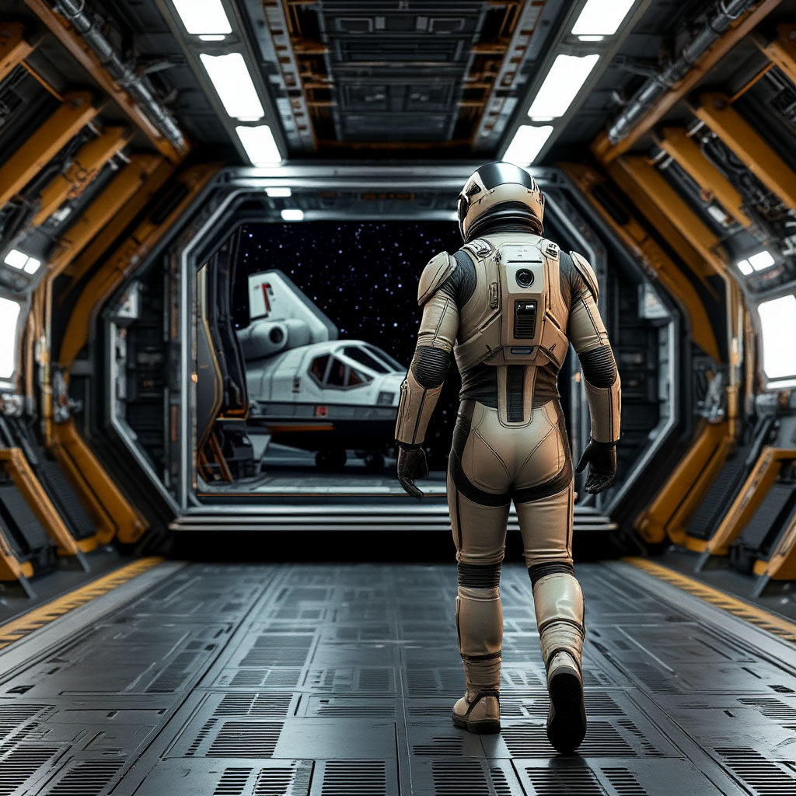

Ангар гудел, как растревоженный улей. Шум систем жизнеобеспечения, шипение гидравлики и приглушённые голоса техников сливались в низкочастотный рокот. В эпицентре этого хаоса, в свете прожекторов, стоял «Гефест-2». Его корпус, покрытый паутиной мелких царапин, выглядел как шкура старого боевого зверя. Открытый люк казался не входом, а чёрной дырой, порталом в иное пространство, где кончались мои полномочия и начиналась игра без гарантий.

Доверяй, но проверяй. Фраза билась в висках навязчивым ритмом. Я проверил всё, что мог. Оружие на бедре. Герметичность шлема. Канал связи с Басовым. Но как проверить пустоту за спиной, где могла таиться тень, отбрасываемая твоим же кораблём?

Облачённый в лёгкий скафандр, я подошёл к трапу. Техник, стоявший рядом, шагнул навстречу и, отдав честь, отрапортовал:

— Рядовой Ковальски, сэр! Все системы проверены. Давление, герметичность, связь, двигатели. «Гефест-2» к выполнению задачи готов.

— Ковальски... Ковальски... — Фамилия зацепила что-то в памяти. — Высадка на Плутоне, кажется...

— Однофамилец, сэр! — отчеканил техник, выпрямившись ещё сильнее.

— Спасибо, рядовой. И поблагодарите от меня всю бригаду.

— Так точно, сэр! Будет сделано!

Я посмотрел поверх его плеча, в глубину ангара, где метались в предстартовой лихорадке другие фигуры. Следующий шаг — внутрь челнока — был шагом из условной безопасности в абсолютную неизвестность. И пришло время его сделать.

Челнок, рассчитанный на двенадцать человек, встретил меня гулом готовых к работе систем. Второй состав — десять разведчиков во главе с лейтенантом Майклом Талбо — уже сидел на своих местах. Из глубины челнока доносился сдавленный, но чёткий шёпот Талбо: «Дженкинс, Хендрикс, Фукасава, сколько можно повторять, что пристёгиваться при спуске положено по инструкции? Давайте живо, с нами капитан! Не позорьте меня».

Я занял кресло командира, привычным движением защёлкнув ремни безопасности. Сердце колотилось где-то в горле. Неужели мы их нашли? Неужели наши поиски были не напрасны?

По иронии судьбы, самые трусливые существа в галактике обладали самыми эффективными кораблями для уничтожения Ур-Куанских Дредноутов. И мы очень нуждались в этих кораблях.

Талбо, завершив «дружественные» наставления, опустился в соседнее кресло и застегнул ремни.

— «Арго», челнок «Гефест-2» к вылету готов, — доложил я на мостик.

— Полёт разрешён, капитан. Удачи, — отозвался Басов.

В его голосе звучала едва уловимая нотка беспокойства человека, посылающего друга в пасть неизвестного зверя.

— Не переживай, Алекс. В крайнем случае напишем мемуары: «Как мы почти спасли галактику», — сказал я, стараясь придать голосу твёрдость.

Ответом была многозначительная тишина. Алекс, как всегда, сомневался в разумности всего сущего. И, чаще всего, был скорее прав, чем нет.

Челнок отстыковался и, управляемый автопилотом, устремился вниз, к тусклому, испещрённому тенями диску планеты.

...

Из иллюминатора открывалась картина, от которой на миг перехватило дыхание. Сначала космос во всём его холодном великолепии — бархатный, усыпанный мерцающими точками далёких солнц. Красота столь совершенная, что на миг заставляла забыть, зачем мы здесь.

Потом, по мере погружения в верхние слои атмосферы, вокруг начало разливаться слабое фосфоресцирующее свечение. Оно постепенно нарастало, теплело, переходя из индиго в тёмно-синий, затем в лазурно-голубой, пока сама тьма не стала светиться изнутри, отступая перед рождающимся светом.

И вот тогда явилась она. Ослепительная во всей своей невозможности — поверхность.

Это был океан. Бескрайний, белоснежный и невероятный. Сплошной покров облаков сверкал в лучах местного солнца, замершего в бездонной выси. Поверхность казалась не просто яркой, а твёрдой: причудливые завитки и башни кучевых облаков создавали иллюзию фантастического ландшафта — сияющих горных хребтов, заснеженных долин, гигантских мраморных дворцов. Свет играл на этих неровностях, отбрасывая глубокие, бархатные тени и создавая стереоскопическую, почти осязаемую глубину.

Фантазия услужливо рисовала картину, что стоит лишь снизить скорость — и шасси мягко коснётся этой пушистой, сияющей тверди, оставив на ней след. А мы, поддавшись нелепому, детскому желанию, выйдем, ступая босыми ногами на прохладную, упругую гладь, и пойдём по облакам в безмятежной, невозможной прогулке. А над нами — лишь вечное, безоблачное небо и яркое, одинокое солнце.

Казалось, даже воздух в кабине наполнился этим светом — чистым, сверкающим, обещающим чудо.

Иллюзия достигла своего пика, когда до облачного щита оставались считанные сотни метров. Он заполнил весь обзор, превратившись в настоящую твердь, в ту самую землю под ногами. Я невольно напрягся, ожидая лёгкого толчка посадки.

И в этот волшебный момент челнок начал входить в облачный слой.

Сначала всё лишь слегка затянуло пеленой — словно дым от костра едва заслонил пейзаж. Очертания сияющих дворцов и долин поплыли, стали мягкими, начали терять резкость. Дымка стремительно густела, превращаясь в молочно-белый, плотный туман. Он заволакивал всё с бешеной скоростью: последние проблески света гасли, и вот уже мир вокруг бесследно растворился в абсолютной белизне.

Иллюзия белоснежной поверхности и мира над ним была настолько полной, что мозг начал протестовать против этой утраты, отказываясь верить в белую пустоту. Глаза, ещё совсем недавно видевшие сияющие ландшафты, теперь напряжённо вглядывались в однородную мглу, пытаясь различить хоть какие-то очертания. Но вокруг простиралась лишь непроглядная, всепоглощающая пелена.

Возникло ощущение, что протяни руку — и даже она исчезнет в этом густом тумане.

Все красоты закончились. Смотреть стало решительно не на что. Я перевёл взгляд на панель приборов, и всё ещё улыбаясь от былого восторга, увидел его. В самом низу, в стороне от основных жизненных показателей, тот самый индикатор, который бессистемно и интенсивно помаргивал.

Время замедлилось. Мысли пронеслись со скоростью света.
Я совсем про него забыл! Билли не успел проверить!!!

Не было ни секунды на раздумья. Только инстинкт и та самая паранойя, которая не раз спасала мне жизнь.

— ВСЕМ ДЕРЖАТЬСЯ! — заорал я и изо всех сил вмазал по большой красной кнопке АВАРИЙНОГО КАТАПУЛЬТИРОВАНИЯ.

Последнее, что я увидел внутри челнока, — это ошарашенные лица моей команды. И их вытаращенные глаза, полные непонимания, на которых застыл только один немой вопрос: «Что происходит?»

В этот миг сработала автоматика — с шипящим звуком визор моего шлема опустился, окрасив всё в тёмно-серый, и мир померк.

Чудовищная, сминающая перегрузка вдавила меня в кресло, выжимая воздух из лёгких. Мир пропал, растворившись в рёве и темноте. Я ощутил, как кресло вырывается из пазов, как его швыряет в белую пустоту. А потом — только хаос выстреливаемых кресел. Короткие, яркие вспышки в белой мгле, когда катапульты один за другим выплёвывали их наружу. И тишина.

Где-то над головой с глухим хлопком, который я почувствовал телом, раскрылся купол парашюта. Падение замедлилось, превратившись в монотонное, покачивающееся парение в белом ничто. Только белизна. Бесконечная, беззвучная, абсолютная.

Я, вопреки всякой логике, всматривался в сплошную молочную пелену, пытаясь силой воли прорезать её, найти смутные тени своих ребят. Это было безумием, и я понимал это. Единственным ответом мира было моё собственное, тяжёлое дыхание в шлеме, звучавшее как гулкий отсчёт времени.

«Без паники... Всё должно быть штатно». Эта мысль стала единственной точкой опоры.

Прошло всего пара минут, когда тишину разорвал взрыв. Глухой удар, пришедший снизу сквозь толщу облаков. Без вспышки, только тяжёлый, сокрушающий грохот, от которого сжался воздух. Челнок. Это мог быть только он. И он даже не успел долететь до земли — его разорвало в воздухе.

А спустя несколько минут новый звук, от которого сжалось сердце. Нарастающий, знакомый рёв реактивных двигателей. Резкий, яростный. Это был первый челнок, рванувший с поверхности на полной тяге.

Далёкий рокот, быстро переросший в гул, прошёл прямо подо мной и умчался куда-то ввысь. «Гефест-1». Уходил на орбиту. Почему? Если Басов видел взрыв, он бы не отозвал челнок, а приказал ему искать выживших. Басов цеплялся бы за любой шанс до последнего. Это было непохоже на него. Значит, что-то случилось. Что-то, о чём я не знал.

Прошло минут десять, прежде чем эта туманная пелена стала редеть, превращаясь из густой молочной в сероватую дымку, сквозь которую начали проступать неясные очертания поверхности. Затем в просветах стали вырисовываться силуэты. Сначала один расплывчатый контур слева. Потом ещё один — справа. Ещё. И ещё.

Я принялся считать, ловя взглядом каждое покачивающееся пятно. Один, два, три... десять, одиннадцать. Все. Все на месте. И на каждой фигуре под куполом — характерный блик опущенного визора. Автоматика сработала штатно. Все живы.

Спуск казался бесконечным. Наконец, жёсткий удар встряхнул кресло, а парашют протащил его по земле ещё несколько метров. Я отстегнул ремни и поднялся на ноги, отряхиваясь. Вокруг, на пустынной, песчано-каменистой равнине, один за другим опускались остальные капсулы. Я видел, как мои ребята выбирались из кресел и отстёгивали ремни. Молча, без суеты, потрёпанные, но живые, они начали сходиться ко мне.

Мы собрались на краю каньона, постепенно приходя в себя после жёсткого приземления. Адреналин ещё пульсировал в висках, и в ушах стоял оглушительный грохот взрыва, которого мы не видели, но который почувствовали всем телом. Я сделал быструю перекличку — все живы, всё в порядке, раненых нет.

Именно тогда мой взгляд скользнул по экрану браслета, и я замер. Среди стандартных служебных уведомлений висело одно, выделяющееся красной рамкой приоритета. Входящее сообщение. Время получения... Примерно через тридцать секунд после нашего катапультирования.

В той чехарде, что творилась — оглушительный хлопок, невесомость, раскрытие парашюта, — я его не видел и не слышал. А сейчас, когда самый угар отступил и команда собралась вместе, оно маячило на экране, словно метка.

Талбо, бледный как смерть, первым нарушил молчание:

— Капитан... Что это было? Почему вы...?

Я не ответил. Мой взгляд был прикован к персональному браслету. С ледяным спокойствием я нажал кнопку воспроизведения.

Из динамика раздался ровный, холодный, до боли знакомый голос. Голос Сильвестра фон дер Кампфа. Он звучал панибратски — полный злобы и торжества, приправленный ядовитым презрением.

«Капитан, я крайний противник перехода на личности, но от того бардака, который творится в твоей голове, становится немного не по себе. Рекомендую меньше общаться с зелёными слюнтяями и больше думать о миссии. Хотя зачем тебе теперь мои рекомендации? Не буду скрывать, это сообщение содержит небольшую программу, которая прямо сейчас заблокировала механизм катапультирования, и через минуту ты умрёшь. Можешь прожить целых пять, если прыгнешь в открытый люк. Тогда вместо мириадов мелких кусочков ты станешь мокрой лужицей на дне каньона, но кому теперь какое дело, как именно ты закончишь свою никчёмную жизнь?»

И тут он снова вернулся к своим аристократическим интонациям и театральной манерности, которая в этих условиях звучала даже более отвратительно, чем его хамско-панибратский стиль секундой ранее. Он звучал как актёр, играющий Гамлета. Пафосно. Явно упиваясь и моментом абсолютной власти, и тем, как красиво он облекает банальную подлость в шелуху высокопарных фраз:

«Кто решил, что моя безупречная служба — это одобрение вашего авантюрного стиля? Кто счёл моё служебное рвение за признание вашего стратегического гения? Кто истолковал мою вынужденную лояльность за ваш командирский талант? Кто принял мою вежливость за признак того, что я смирился со своей ролью?»

Голос сделал идеальную, театральную паузу, чтобы придать весомость своей речи.

«Вы — баг в системе командования, который я устраняю. Вы самое слабое звено, прощайте».

Сообщение оборвалось. В наступившей тишине был слышен только ветер, гуляющий по каньону.

Талбо смотрел на меня выпученными глазами, его мозг явно отказывался складывать пазл.

— Капитан... это... это же был Сильвестр... — он запнулся. — Но как? Откуда оно на вашем личном браслете?

Остальные разведчики смотрели на меня с тем же немым вопросом.

Я медленно опустил руку. Моё лицо, как мне казалось, ничего не выражало, а внутри всё застыло, как титановая болванка.

Я медленно поднял голову.
— Стандартный протокол, лейтенант, — мой голос прозвучал удивительно ровно и спокойно, как на лекции. — Регламент связи, пункт 7.4: «Все важные сообщения, адресованные командиру челнока, в обязательном порядке дублируются на его персональный браслет».

Талбо качнул головой, всё ещё не понимая.

— Но... вы нажали на кнопку до того, как оно пришло!

— Диапазон браслета на открытой местности может достигать нескольких километров. Мы катапультировались, но всё ещё оставались в зоне уверенного приёма. — Я увидел, как в его глазах промелькнуло озарение. — Челнок получил этот ядовитый «подарок» Сильвестра и автоматически переслал копию мне.

Другой разведчик, помоложе, кажется, Хендрикс, робко спросил:

— Капитан... а если бы... если бы это была паранойя... ну, то есть ошибка? Просто сбой индикатора? И вы зря нас всех вышвырнули?

— Рядовой Хендрикс?

— ТАК ТОЧНО, СЭР!!! МАРК ХЕНДРИКС! — молодой разведчик резко выпрямился, будто ждал этого момента всю жизнь.

— На ваш вопрос, Марк, «что если это паранойя?», ответ очень прост: если бы я ошибся, челнок благополучно спустился бы на автопилоте на поверхность, а мы бы потратили несколько лишних часов на упаковку парашютов и установку кресел обратно.

А теперь представьте: я не стал бы перестраховываться, и мы бы продолжили спуск. — я обвёл взглядом всю команду. — Мы бы получили это милое послание. И всё. С ним на челнок пришла программа-блокиратор аварийной системы катапультирования. — я кивнул в сторону, где внизу дымились обломки, — ...система катапультирования была бы заблокирована. Намертво. А мы бы с вами сидели, слушали сообщение и доживали свои последние минуты, не в силах что-либо изменить. Вот и скажите мне, несколько часов потерянного времени — это справедливая цена за наши жизни? За то, что мы сейчас здесь стоим, а не размазаны по скалам в виде «мокрой лужицы», как любезно предложил нам Сильвестр? Я считаю, это более чем честная цена за перестраховку. А вы?

Я обвёл взглядом всю свою маленькую, уцелевшую команду.

Я видел, как понимание, тяжёлое и безжалостное, просачивается в каждого из них. Оно пришло не как озарение — оно расползалось, как чернильное пятно, окрашивая всё вокруг в новые цвета.

Талбо первым отвёл взгляд. Он опустил глаза на свои руки, как будто впервые видя их. Пальцы непроизвольно сжались в кулаки, потом разжались. Его фигура, всегда собранная и подтянутая, вдруг осела, словно его придавила невидимая плита. Он выглядел как человек, которому вонзили нож в спину. И это предательство пришло оттуда, откуда он его совсем не ждал.

Рядовой Хендрикс, секунду назад робко задававший вопрос о паранойе, застыл и стиснул зубы. Его молодое, открытое лицо будто покрылось маской. Детская недоуменность в глазах сменилась чем-то твёрдым и острым. Он перестал быть новичком, которого нужно опекать. В его взгляде появилась та самая параноидальная готовность, которая совсем недавно спасла нам жизнь.

Остальные разведчики молча совершали ту же внутреннюю работу. Кто-то медленно обводил взглядом горизонт, уже не как исследователь, а как часовой, оценивающий угрозы. Кто-то, не глядя, протянул руку и крепко сжал плечо товарища, стоявшего рядом. Жест поддержки, понятный без слов. Самый старший из них, сержант Хансен, просто кивнул самому себе, коротко и резко, будто подвёл черту под прошлой жизнью.

Это был самый необычный момент моей командной карьеры. Я не произносил пламенных речей. Я не строил их в шеренгу. Я просто наблюдал, как исчезает растерянность с их лиц, сменяясь холодной расчётливостью. Как плечи, опустившиеся под грузом предательства, медленно расправляются. Как взгляды, искавшие у меня ответы, теперь встречаются друг с другом, договариваясь без слов. Как они неумолимо превращаются из экипажа корабля, из подразделения в составе флота, во что-то иное. В автономный, самостоятельный организм. В группу выживания. В легион, который должен воскреснуть и вернуться наперекор судьбе.

Вопросов не было. Было тихое, обжигающее осознание. Что они остались одни, на чужой планете, с единственным преимуществом — знанием. Знанием того, что их капитан и они сами только что официально погибли в глазах всего корабля. И что теперь предстоит начать свою, тихую войну за возвращение домой.

Я повернулся к своей новой, маленькой армии. Теперь я вёл их не как капитан флота, а как командир теней, у которых не осталось ничего, кроме друг друга и ярости.

Мы стояли, двенадцать призраков в слепящем полуденном свете, и глядели в глубь каньона, где скрывалась база тех, кто мог стать нашими союзниками. Дорога назад была отрезана. Оставался только один путь: вперёд — в логово Чёрного Эскадрона.

------------

## Глава восемнадцатая. Из мира света — в царство теней

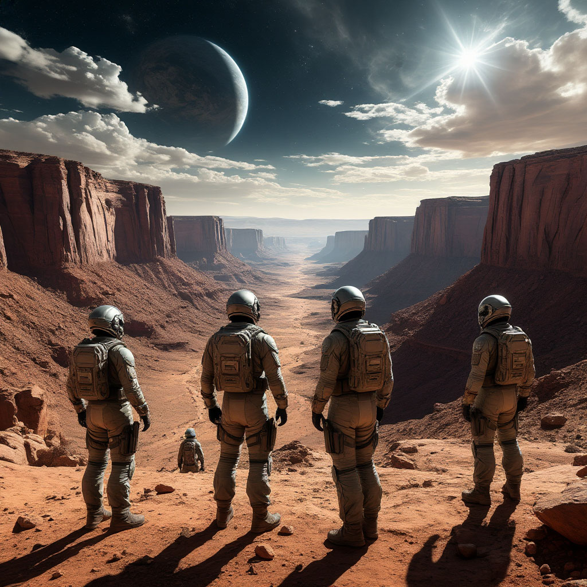

Мы стояли на краю мира, двенадцать человек, вычеркнутых из всех списков, кроме списка мертвецов. И нужно было вернуть людям не просто надежду — нужно было вернуть им структуру, опору, имя. Из праха растерянности — выковать новую силу.

Я громко щёлкнул застёжкой на разгрузке. Резкий звук прорезал тишину и заставил все одиннадцать пар глаз мгновенно сфокусироваться на мне.

— Внимание, — мой голос прозвучал чётко, без пафоса, как отдача приказа на учениях. — С этой минуты формальности заканчиваются. Отныне мы больше не экипаж «Арго». Мы — призраки, приговорённые к забвению. Для всех, кто наверху, мы теперь — пепел, развеянный над этим каньоном. Мы стали тем, чего не видят, о чём не говорят, во что не верят. Мы — «Тени».

Наша новая структура — взвод. Взвод «Теней». Три отделения по четыре человека. Во главе каждого — старший офицер. Его правая рука — младший офицер.

Я обвёл взглядом строй.

— Хендрикс, Дженкинс, Фукасава — поздравляю. Вы — отделение «Альфа» в составе Взвода «Теней». Я — командир отделения. Хендрикс — заместитель командира.

Марк Хендрикс замер. Его широко открытые глаза метнулись от меня к Талбо, затем к своим товарищам, словно ища подтверждения, что он не ослышался. На его лице было написано чистейшее недоумение, смешанное с паникой, будто ему только что предложили управлять звездолётом.
— Сэр, я... я не младший офицер. Я рядовой.

— Это, Марк, мы исправим быстрее, чем ты произнёс эту фразу. — Я выпрямился. — За проявленную инициативу, хладнокровие и за правильный вопрос присваиваю Марку Хендриксу звание капрала Нового Альянса Свободных Звёзд. Поздравляю, капрал. Теперь ты заместитель командира отделения «Альфа».

На лице Хендрикса застыла маска абсолютного, сюрреалистического изумления. Он медленно, будто на шарнирах, повернул голову, оглядывая Дженкинса и Фукасаву. Те смотрели на него с гордостью и немым вопросом: «Ты как, справишься?». Потом он снова посмотрел на меня, и на его лице расплылась широкая, откровенно счастливая улыбка. Он даже непроизвольно выпрямился, а плечи расправились.

— Майк, — перевёл я взгляд на лейтенанта. — Кто ещё из наших призраков готов тянуть лямку замкомандира отделения?

Талбо, уже пришедший в себя, не моргнув глазом, отчеканил:
— МакНиш и Карпов, капитан. Оба с опытом, оба с головой на плечах.

— Отлично. — Я кивнул на двух коренастых, скуластых бойцов. — МакНиш, Карпов. Вам тоже присваивается звание капрала. Добро пожаловать в клуб ответственных.

На этот раз изумление было не таким шоковым. МакНиш, всегда немного угрюмый, лишь резко кивнул. Карпов выдохнул: «Вот это поворот...», и тут же получил дружеский тычок в плечо от стоявшего рядом товарища. Пока они стояли, слегка ошеломлённые, к ним первым шагнул сияющий капрал Хендрикс. Он, сам ещё не остывший от новости, по-мужски, крепко пожал руки новым сослуживцам по капральскому цеху.

— Добро пожаловать в клуб, ребята, — сказал он, продолжая широко улыбаться. — Теперь с нас тут за всё спросят!

И вокруг раздался сдержанный смех. Другие бойцы, кто похлопыванием по спине, кто коротким «Так держать!», выразили свою поддержку. В этом жесте была не просто радость — была солидарность. На мгновение тяжёлый груз предательства отступил, уступив место простому, братскому «свои парни выбились в люди». В этот момент, среди красной пыли и под свист чужого ветра, рождалось нечто важнее нового звания.

— Майк, кто из них твой зам? — спросил я.

— МакНиш, капитан.

— Отлично. Капрал МакНиш, ты — заместитель лейтенанта Талбо. Отделение «Браво». Капрал Карпов — ты зам в третьем отделении.

Я повернулся к самому старшему и, пожалуй, самому спокойному из нас. Его седая щетина и пронзительные голубые глаза видели, наверное, не одну переделку.

— Хансен, третье отделение — «Чарли» — твоё.

Хансен, как и Хендрикс минуту назад, моргнул от неожиданности.

— Капитан, я сержант. Не старший офицер.

— Эрик, — я вложил в голос всю теплоту и уважение, на которые был способен. — Если бы я искал человека, который не подведёт, когда всё рушится, который будет думать головой, а не званием, и тащит на себе не только ранец, но и дух других, я бы искал тебя. И это мы исправим ещё быстрее, чем в прошлый раз. Сержант Эрик Хансен. За многолетнюю беспорочную службу, образцовое исполнение долга и готовность принять на себя ответственность в критический момент присваиваю вам звание лейтенанта Нового Альянса. Поздравляю, лейтенант.

Эффект был мгновенным и оглушительным. Сдержанный, немного угрюмый Хансен был всеобщим любимцем, этаким «дедом», на котором держался дух старой гвардии. Взвод взорвался. Кто-то свистнул, кто-то загоготал, раздались крики: «Наконец-то, старина!», «Лейтенант Хансен, вот это да!», а кто-то прокричал: «Теперь у нас два лейтенанта, берегись, Талбо!». К Эрику бросились, хлопая его по спине так, что он крякнул, но на его суровом лице, впервые за многие месяцы, дрогнули уголки губ, сложившись в неловкую, но искреннюю улыбку.

Я дал им эту минуту. Минуту простой, почти детской радости. Посмеяться, потолкаться, ощутить прилив гордости за товарищей. Неизвестно, когда в следующий раз у них будет повод ликовать. Пусть эта радость, это братское тепло станут для них щитом против гнетущей тишины каньона. В неизвестности, что ждала нас впереди, такие минуты могли стать последними лучиками солнца.

Когда первые восторги схлынули, сменившись удовлетворённым гулом, я снова поднял руку. Тишина вернулась мгновенно.

— Так. Внимание. Иерархия «Теней». Мой заместитель по взводу — лейтенант Талбо. Второй заместитель — лейтенант Хансен. Вопросы?

Вопросы нашлись. Мой зам по «Альфе» — Хендрикс — с хитринкой в глазах осторожно поднял руку.

— Сэр, а... эти звания как-то будут учитываться? Когда мы вернёмся?

— Когда мы вернёмся, капрал, — подчеркнул я, — мы предоставим интендантской службе полный отчёт о полевых повышениях. А до тех пор звание даёт вам право отдавать приказы в рамках вашего отделения и обязанность думать за своих людей. Кто ещё?

Из рядов «Альфы» раздался голос Дженкинса:

— Капитан, а как насчёт... ну, знаков различия? Шевроны там, или... — он смущённо замолчал.

По взводу прокатилась волна сдержанного хихиканья. Я тоже позволил себе лёгкую улыбку.

— Рядовой Дженкинс, в качестве знаков различия предлагаю запомнить лица своих новых командиров. А им — ваши. Если этого недостаточно, — я указал пальцем на красную пыль под ногами, — можете нарисовать звёздочки друг другу на лбу. Следующий вопрос?

— А за прыжок с парашютом в нештатных условиях нам усилят паёк? — с каменным лицом спросил молодой темнокожий парень из тех, кого я не знал.

Взвод одобрительно зашумел.

— Рядовой?

— Рядовой Джума Одинга, сэр!

Я повернулся к Талбо.

— Майк, распредели остальных бойцов.

— Аджит Хатри, Жак Дюран — «Браво». Дитрих Шнайдер и Джума Одинга — «Чарли». — Бодро распорядился Талбо.

— Отлично. Рядовой Джума из отделения «Чарли», если выберемся отсюда целыми и невредимыми, я лично гарантирую каждому не усиленный, а двойной паёк на неделю. И выбор десерта первым. Ещё вопросы?

Раздались одобрительные возгласы. «Вот это я понимаю, стимул!» — выкрикнул кто-то, и Джуму тут же начали благодарно похлопывать по плечу.

— Капитан, — тихо, но внятно спросила Фукасава. — Протокол на случай контакта? Не с эскадроном... а с местной фауной, если таковая имеется.

— Отличный вопрос. Если оно меньше вас — осторожно обойти. Если оно с клыками и больше вас — тихо отступить. Если оно смотрит на вас как на обед и у него больше двух пар глаз... — я сделал драматическую паузу, — ...вспоминайте, чему вас учил лейтенант Хансен на тренировках. И стреляйте первыми.

Это вызвало новый, уже громкий смех. Лёд тронулся. Команда наконец задышала свободно.

— Капитан, — твёрдым, как сталь, голосом спросил Аджит Хатри. — Какова цель? Кроме «выжить»?

— Цель, — мой голос стал твёрже, подстать тону, который задал Аджит, — найти тех, кто здесь обитает. Чёрный Эскадрон. И убедить их, что настоящая угроза галактике — не мы, и даже не обычные Ур-Куаны. А затем нам понадобится их помощь, чтобы вернуться на «Арго» или вернуть «Арго», это уж как пойдёт. Ещё вопросы?

Вопросов не было. Этот солдатский, чёрный юмор сделал своё дело — сработал как выпускной клапан, сбросил остаточное напряжение и окончательно сплавил нас в единое целое. Мы были взводом. Со своей иерархией, своим юмором и своей чёткой целью — выжить и воскреснуть.

— Теперь по существу, — скомандовал я. — Всем проверить личное оружие. Исправность. Заряд батарей.

Воздух наполнился щелчками предохранителей, тихим шипением тестовых циклов и сдержанными докладами: «Оружие в норме», «Заряд полный». У Дюрана из «Браво» пистолет издал хриплый звук и погас.

— Падение при высадке, капитан, — виновато пробормотал он.

— Не беда. Слушайте внимательно! В каждом аварийном кресле, внизу, есть отсек, где хранится НЗ: вода, высокоэнергетический паёк, аптечка, базовые инструменты, батареи для оружия, рюкзаки. А в шестом и двенадцатом креслах — запасные пистолеты. Но главное — в каждом ящике должны быть гидрогенераторы «Росинка».

Я увидел, как у некоторых в глазах вспыхивает понимание, у других — вопрос.

— «Росинка» — прибор незаменимый. В одном режиме — добывает воду из воздуха, по капле, но постоянно. В другом... засыпаешь в приёмник любое относительно влажное вещество: мох, грунт, да что угодно — получаешь воду. Немного, но от жажды не помрём. Физику не спрашивайте — просто запомните. И берегите их. Наше выживание зависит от этих железок.

— Талбо! — я позвал лейтенанта. — Ты всё это знаешь. Проинструктируй молодёжь. И ещё две задачи. Первая: срежьте с кресел все парашюты и стропы. Складывайте аккуратно. Они могут понадобиться — на укрытия, на перевязки, на растяжки. Вторая: сами кресла. Найдите расщелины, пещерки, любые укрытия. Спрячьте их так, чтобы ни сверху, с орбиты, ни с земли — ни единого намёка на наше присутствие. Сейчас этот облачный покров — я указал рукой вверх, — наш лучший друг. Но он не вечен. Не исключено, что нас будут искать. И не для того, чтобы спасти... Второго покушения мы можем не пережить.

Всё, Майк. Командуй. А я с «Альфой» — на поиск спуска в каньон.

Лейтенант Талбо чётко взял под козырёк. В его движении была та самая выправка, которую не могли сломить ни предательство, ни падение с небес.

— Так точно, капитан! «Браво», «Чарли» — ко мне! Работу делите: «Браво» — на НЗ и парашюты, «Чарли» — на маскировку кресел. Быстро, но без суеты. Помните — мы тени. Хансен, командуй «Чарли».

Отряд мгновенно ожил, задвигался, зашелестел, превратившись в чёткий, отлаженный механизм. Бойцы бросились к капсулам, ловко вскрывая отсеки. Карпов помогал Хансену, который уже отдавал свои первые приказы лейтенантским, твёрдым голосом.

Несколько секунд я с наслаждением наблюдал за слаженной работой и удовлетворённо кивнул. Процесс пошёл.

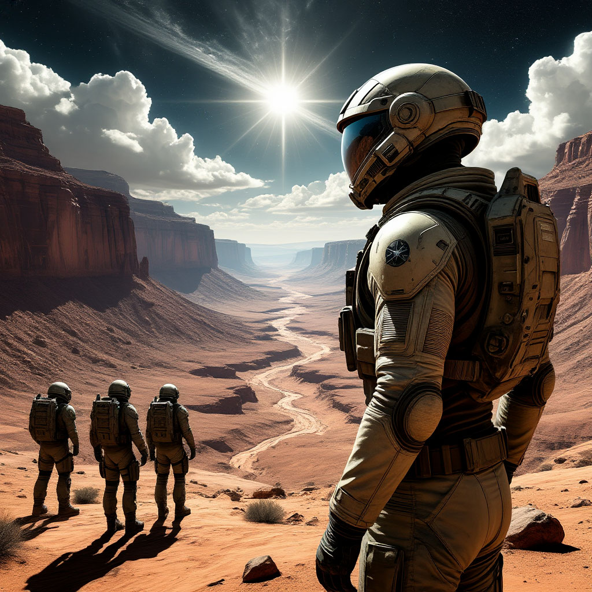

— Отделение «Альфа»! — скомандовал я, и трое мгновенно выстроились передо мной. — Наше дело, ребята, — сказал я, — найти путь вниз. Пока они прячут следы, мы ищем дорогу.

Три кивка. Три пары глаз, в которых горела решимость. Мы развернулись и пошли в сторону каньона. За спиной оставался деловой гул работы и голос Талбо, отдающего распоряжения.

Мы осторожно подошли к краю пропасти. Каньон зиял перед нами, бездонный и молчаливый, словно тёмная рана на ржавом теле планеты. Где-то там, в этой каменной утробе, могло таиться наше спасение. Где-то там была база.

— Ну что, ребята, смотрите в оба, — сказал я, и мы пошли вдоль кромки великого каньона, соблюдая дистанцию, цепляясь взглядами за каждый камень, каждую трещину в породе. — Ищем любые пути вниз.

Тишина вокруг была неземной, нарушаемая лишь шелестом песка под ботинками и далёким завыванием ветра в расщелинах. Её нужно было заполнить, и не просто болтовнёй, а нитью, которая свяжет нас крепче ремней парашюта.

— Кстати, Хендрикс, пока идём — отличные комиксы у тебя про Фиво. На «Арго» они, кажется, популярнее сводок новостей.

Хендрикс споткнулся от неожиданности, едва не отправив камешек в пропасть, и посмотрел на меня так, будто я только что заговорил на языке Спасси.

— Капитан? Я... я не думал, что вы такими вещами интересуетесь.

— Комиксами как таковыми — не очень, — признался я, переступая через валун. — Но вот как командир флагмана я обязан интересоваться, чем живут и о чём думают мои подчинённые. Это не право, Хендрикс, это долг. Если я не буду понимать своих людей, я не смогу ими командовать. И не смогу положиться на них в трудную минуту. Нужно знать, кто в чём силён, кто что любит, к чему лежит душа, и ставить людей на те задачи, где они раскроются. Где им будет не в тягость, а в удовольствие. Где они будут гореть, а не тлеть. Это и есть психология управления, Хендрикс. А в психологии, капрал, один плюс один никогда не равняется двум. Правильно составь эти «единицы» — и они, дополнив друг друга, дадут в сумме и три, и четыре. А если сложишь кое-как — и двух не наберёшь. Мотай на ус, будущий командир.

Я видел, как он слушает, впитывая каждое слово. Дженкинс и Фукасава тоже насторожились, прислушиваясь.

— Так точно, капитан! — отозвался Хендрикс, и в его голосе звучала не просто формальность, а живая, не наигранная заинтересованность. — Я запомню.

— Фукасава, — перевёл я взгляд на Хидэюки, который шёл невероятно тихо и собранно. — А ты чем увлекаешься? Кроме умения ходить так, чтобы даже пыль не шелохнулась.
Хидэюки слегка улыбнулся.

— Музыку пишу, капитан. Электронную, в основном.

— Отлично! — я не смог сдержать улыбки. — Значит, будешь нам гимны сочинять. Под которые мы пойдём в бой и которые будут поднимать дух, когда станет совсем тяжело. Договорились?
Глаза Фукасавы загорелись.

— Постараюсь, капитан! Обязательно напишу что-нибудь... эпичное, — он кивнул, но в его сдержанности угадывался настоящий энтузиазм.

— Музыка — это мощное оружие, солдат.

Дженкинс, твоя очередь. У тебя какое хобби? Или вся жизнь — это служба и сон?

Тео Дженкинс, долговязый и всегда немного насупленный, виновато опустил глаза, ковыряя кобуру на бедре.

— Никакого, капитан. Так... ничего особенного.

Хендрикс фыркнул, не выдержав.

— Да он, капитан, безвылазно на боевом симуляторе зависает! Всё пытается побить рекорд Фиво по зачистке от «Дронов», но даже до половины его очков не дотягивает.

— Ты бы уж тогда сказал, — проворчал Дженкинс, исподлобья посмотрев на Хендрикса, — что добрая половина флагмана на том симуляторе пропадает. Все хотят Фиво обойти... Только ни у кого не выходит.

Я посмотрел на Хендрикса и поднял бровь.

— Это правда, капитан, — развёл руками Марк. — Рекорд Фиво — это что-то нечеловеческое. Но Дженкинс — лучший из людей. Прочно держит второе место.

Я повернулся к Тео. Парень стоял, страшно смущённый.

— Значит, любишь пилотировать?

В его глазах, только что полных смущения, вспыхнул настоящий, жадный огонь.

— Да, капитан! Очень! — выпалил он.

— Ладно, — кивнул я. — Если выберемся отсюда живыми, поговорю с Волковым. Скажу, что рвёшься в пилоты как сумасшедший. Пусть берёт тебя на «Сокрушительный» под своё крыло.

Глаза Дженкинса засверкали таким немыслимым счастьем, что стало почти неловко.

— Спасибо, капитан! Огромное спасибо!.. — он замялся, затем добавил тише: — Капитан, а можно... можно попросить и за Одингу? Он тоже грезит небом. Мы с ним постоянно на симуляторе соревнуемся.

Я снова вопросительно посмотрел на Хендрикса. Тот подтвердил кивком:

— Да, Джума идёт третьим в общем рейтинге. Стабильно.

— Хорошо, — согласился я. — Отправлю вас вместе. Мы же не вечно будем с двумя крейсерами ходить. Флот будет расти, и хорошие пилоты нам ещё очень пригодятся.

— А у вас, капитан, хобби есть? — вдруг спросил Хендрикс с любопытством новоиспечённого капрала, позволяющего себе некоторую фамильярность.

Я сделал паузу.

— Да, капрал. Читаю умные книжки по психологии управления. А потом применяю прочитанное на практике. На вас, например. Довольны качеством оказания услуг?

Хендрикс и Фукасава дружно рассмеялись. Даже обычно невесёлый Дженкинс заулыбался.

— А теперь, ребятки, — я махнул рукой вперёд, — будьте внимательны. Ищем спуск.

Мы шли ещё минут двадцать, молча, всматриваясь в каждую щель, каждую трещину в скальной стене. А я то и дело поглядывал вверх: перламутровый щит облаков, наш спасительный покров, всё ещё висел над нами, но его плотная ткань уже кое-где редела, обещая скорый конец укрытию. Он рассеивался быстрее, чем я думал. Время работало против нас.

Вскоре мы нашли спуск. Причём не один, а сразу два, будто сама планета предлагала нам выбор. И оба были как будто специально созданы для учебного пособия.

Первый путь был дерзким вызовом самой природе: крутой каменный «жёлоб», усеянный выступами, за которые можно было цепляться. Спуск по нему занял бы часа три, не больше. Но он не прощал ошибок. Один неверный шаг — и долгий полёт в бездну.

Второй путь был полной его противоположностью: извилистая, пологая тропа, лениво петляющая среди осыпей и древних оползней. Безопасно, надёжно... но долго. Было ясно, что на спуск уйдёт не меньше половины дня.

— Ну что, ребята, — обернулся я к своей тройке, — выбирайте. По какой пойдём?

Они переглянулись. Идея «быстрее — значит лучше» была слишком очевидной.

— Ну... наверное, по той, где быстрее, — неуверенно предположил Хендрикс, уже чувствуя себя обязанным как младший командир предлагать решения.

— Не боитесь сорваться? — спросил я прямо.

— Если постараться... спускаться аккуратно... — Дженкинс пожал плечами. — Вроде нет?

— Отлично, — кивнул я. — Давайте оценим риск. Допустим, вероятность сорваться для опытного бойца на этом участке — всего три процента. Смешная цифра, да? Я не случайно для примера привёл именно такую вероятность. Это как взять игральную кость и выбросить два раза подряд единицу. Шанс мизерный... Если бы мы с вами просто играли на интерес, и моей задачей было выкинуть эти две единицы подряд, что бы вы поставили? — спросил я.

Их лица оживились. Они уже чувствовали подвох, но мозг упрямо твердил: «Три процента — это ничто».

Посыпались варианты, сдобренные ухмылками: «Месячный запас десерта!», «Вакуумный термос!», «Целую неделю буду убирать каюты за весь взвод!». С такими шансами играть готов был каждый.

— А теперь вопрос посерьёзнее, — голос мой стал тише и холоднее. — Готовы ли вы поставить на кон при этих трёх процентах свою жизнь?

Тишина наступила мгновенная и тяжёлая. Шутки испарились. Они смотрели на жёлоб, и теперь видели не путь, а статистику, принявшую осязаемую, жуткую форму.

— Первый урок на тему «оценка рисков» я вам преподал там, в облаках. Второй — сейчас.

Я оценивающе скользнул по их лицам, ловя реакцию.

— Эти проценты не где-то в абстракции. Представьте, что эти проценты выпадают именно на вас. Прямо здесь. Прямо сейчас. И вопрос не в том, «мало это или много». Вопрос в другом: стоят ли сэкономленные четыре часа ваших жизней?.. Особенно когда до заката мы без проблем успеваем спуститься по безопасной тропе... Риск без необходимости — это глупость. Запомните это.

Они молча кивнули. Урок был усвоен без лишних слов.

По дороге назад, уже с найденным путём, я снова нарушил молчание. Не хотелось идти в тишине, да и тему с оценкой рисков пора было завершить и перевернуть эту страницу.

— Как вы думаете, почему я взял в «Альфу» именно вас троих?

Они переглянулись. Первым, как всегда, рискнул Хендрикс:

— Потому что мы... первыми выстроились?

— Может, потому что мы... наименее опытные? Чтобы дать нам шанс проявить себя? — осторожно добавил Фукасава.

Дженкинс просто пожал плечами.

Я покачал головой.

— Всё неправильно. Я взял вас потому, что вы трое — те самые умники, которые считали, что пристёгиваться в челноке не обязательно. И это вам третий урок на ту же тему.

Они замерли. На их лицах застыли маски полнейшего изумления и стыда.

— Теперь, зная, что с нами произошло, представьте, куда бы вас вышвырнуло при катапультировании, будь вы не пристёгнуты... Фукасава, у тебя, случайно, крыльев нет?

— Н-нет, капитан, — пробормотал он, бледнея.

— Хендрикс? Дженкинс? А у вас?

Они молчали, смущённо глядя под ноги. Потом Хендрикс, уже новоиспечённый капрал, чья ответственность теперь распространялась не только на себя, поднял голову.

— Мы всё поняли, капитан. Спасибо за урок... Больше такого не повторится.

В его голосе была не формальность, а тяжёлое, взрослое осознание. Дженкинс и Фукасава молча кивнули.

— Вот и отлично, — я похлопал Хендрикса по плечу. — Учиться никогда не поздно. Особенно когда уроки преподаёт сама жизнь... И не забывайте думать головой и оценивать риски.

Мы вернулись к месту нашей вынужденной посадки как раз в тот момент, когда работа подходила к завершению. От кресел не осталось и следа — Талбо с Хансеном организовали их идеальную маскировку в расщелинах. Парашюты были аккуратно свёрнуты в тугие рулоны, стропы смотаны в бухты. Содержимое аварийных ящиков — бесценный НЗ, инструменты, гидрогенераторы — было распределено по рюкзакам. «Тени» работали молча и эффективно.

— Вижу, Майк, вы тут зря время не теряли, — кивнул я, окидывая взглядом результат. Всё было сделано чётко, выше всяких похвал.

Талбо сделал вид, что вытирает пот со лба, и коротко кивнул. Сквозь стекло забрала его шлема я разглядел улыбку — первую, кажется, со времён нашей «высадки». Значит, и он доволен тем, как слаженно сработал взвод.

— Как раз закончили, капитан. Спуск нашли?

— Нашли, — я коротко кивнул в сторону западного края плато. — Есть хорошая пологая тропа. Безопасная.

Он подошёл ближе и, не меняя выражения лица, тихо сказал, чтобы слышал только я:
— Капитан, облака рассеиваются.

Я поднял голову. Наш спасительный покров всё ещё висел, но в нём уже зияли первые робкие просветы.

— Да, — так же тихо ответил я. — Надо поторапливаться. Собирай ребят.

Лейтенант Талбо взял под козырёк и развернулся к взводу.

— «Тени»! Построиться! Проверка снаряжения — тридцать секунд!

Пока бойцы совершали последние приготовления, я окинул взглядом бывшую площадку приземления. Если не знать, что здесь что-то было, не увидишь ничего. Лишь выжженную равнину да вечный ветер, сметающий последние следы.

— Взвод к выдвижению готов, капитан, — доложил Талбо, повернувшись ко мне, и в его голосе снова звучала привычная уверенность.

— Отлично, Майк. Вы хорошо поработали. Молодцы все. — я обвёл взглядом замерших в ожидании «Теней». — Пора отправляться в гости к нашим потенциальным союзникам.

Только давайте договоримся, — добавил я, — когда найдём этих «союзников», не будем сразу рассказывать им, как мы сюда попали. А то подумают, что к ним в гости пожаловал отряд неудачников, которых выплюнул собственный крейсер.

— Так точно, капитан! — дружно рявкнул взвод, и в этом «так точно» слышалась уже не столько дисциплина, сколько общее понимание всей нелепости нашего положения. Даже самые суровые лица теперь освещали улыбки.

— А теперь выдвигаемся. Нужно успеть спуститься до темноты. Талбо, ты за мной. Хансен — замыкающий. Вперёд.

Двенадцать призраков, рождённых предательством, чётко и молча двинулись в сторону длинной, извилистой тропы, что вела их с плато в каньон.

Из мира света — в царство теней.

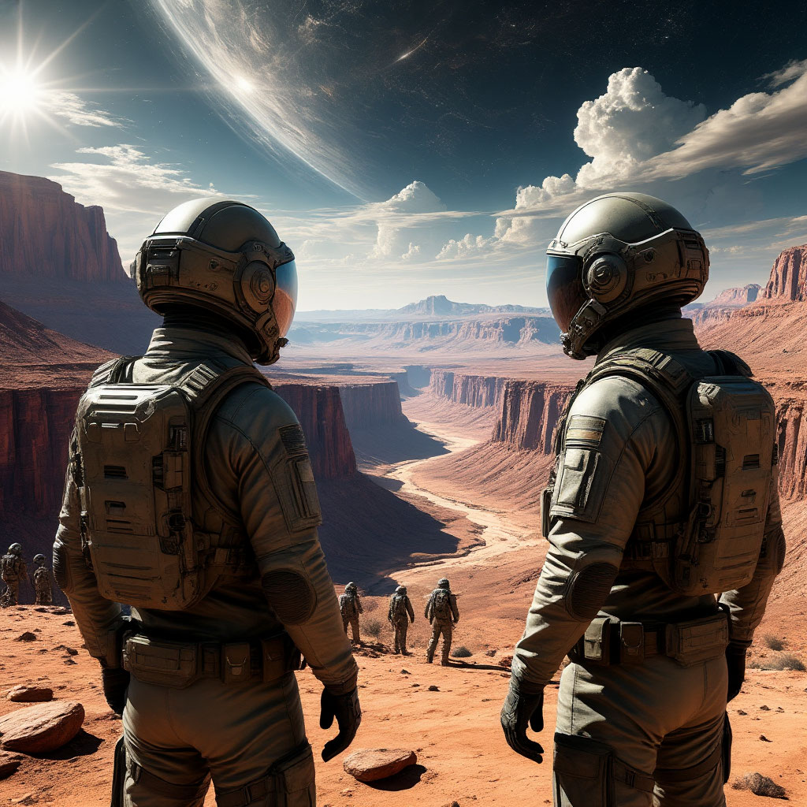

------------

## Глава девятнадцатая. Призрачный гарнизон

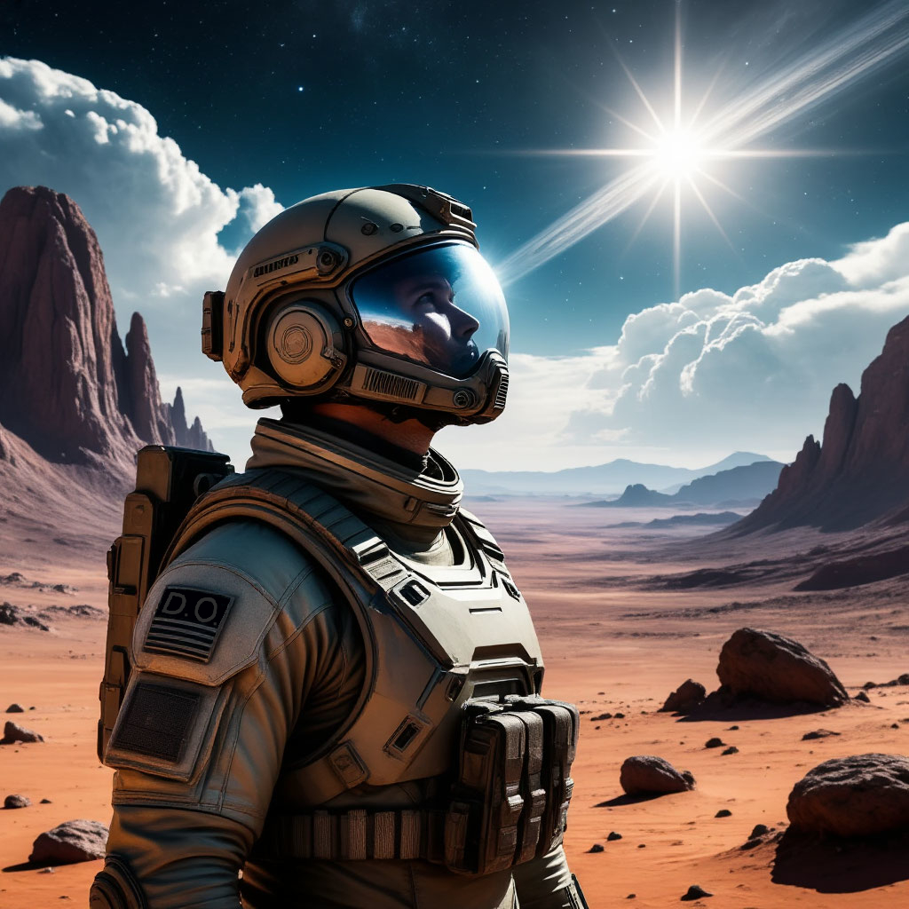

Тридцать долгих минут мы провели в укрытии, не шелохнувшись. Тридцать минут пристального наблюдения. Бинокли с тепловизорами скользили по гигантской каменной стене, настолько искусно вписанной в склон каньона, что с пятисот метров её было почти не отличить от скалы. Мы высматривали малейшее движение, проблеск света, любой признак жизни. Но база молчала. Молчала как может молчать только мёртвое или невероятно хорошо замаскированное.

— Ничего не понимаю, — сказал рядом Талбо, замирая с биноклем у глаз. — Ничего. Как будто все вымерли.

— Похоже, никого нет дома, — прошептал Хендрикс, и его голос, усиленный системой внутренней связи, прозвучал неестественно громко в наступившей тишине.

— Или не хотят светиться, — мрачно добавил Хансен.

До заката оставалось минут двадцать. Больше ждать было нельзя.

— Ну что, похоже, нас не ждут с хлебом-солью. Пойдём поздороваемся первыми. Выбора, у нас нет. «Тени», за мной. Спокойно и тихо.

Мы двинулись к базе, осторожными перебежками от одного укрытия к другому. По мере приближения детали проступали чётче. Массивная стена с гигантскими, многосекционными створками — явно предназначенными для захода кораблей. На их фоне мы чувствовали себя букашками.

Но в самом низу, у самого основания, была обычная дверь. Если «обычной» можно было назвать конструкцию высотой не более полутора метров. Она казалась игрушечной на фоне циклопических ворот. Дверь для Спасси.

Прямо по центру, где-то на уровне глаза Спассси и человеческого пояса, располагалась панель управления. Присев на корточки, мы приступили к пристальному изучению доступных нам вариантов. Автоматический переводчик в моём шлеме, усердно сканировал все надписи. Один из символов под самой крупной кнопкой интерпретировался как (ВЫЗОВ).

Обменявшись взглядами с Хендриксом, я кивнул. Он коротко нажал кнопку. Мы затаили дыхание.

Тишина.

— Капитан, — тихо сказал Хендрикс, припав к панели. — Тут, кажется, есть не только вызов. Смотрите.

Он провёл рукой по чуть выступающей панели ниже кнопок. Загорелись несколько индикаторов, и переводчик выдал новую строку: (ВВОД КОДА ДОСТУПА. ОСТАЛОСЬ ПОПЫТОК: 3).

— Без пароля мы не попадём внутрь... Что будем делать? — в голосе Хендрикса прозвучало привычное, но сдержанное напряжение. Он смотрел на меня, ожидая приказа, чуда или хоть какого-то плана.

— Без паники! — сказал я, — Вводи: «Хаффи-Маффи-Гаффи».

Хендрикс посмотрел на меня так, будто я предложил ему прыгнуть в пропасть для остроты ощущений. В его взгляде читалось: «Капитан окончательно свихнулся от усталости».

— Капитан, тут ясно написано: три попытки, потом блокировка на века! — в его шёпоте слышалось отчаяние.

Я посмотрел на него не как командир на подчинённого, а как старый солдат на зелёного новичка, в глазах которого мелькает страх перед приказом, за которым нет другой логики, кроме веры в того, кто его отдаёт.

— Не бойся, сынок, вводи.

Он сглотнул, сделал короткий вдох и ткнул пальцем в панель, набирая нелепую фразу.

Раздался нежный, мелодичный сигнал. На экране вспыхнуло не «Доступ разрешён», а «ПРИВЕТСТВУЕМ, ХРАНИТЕЛЬ. АКТИВИРОВАН МАСТЕР-РЕЖИМ».

— СРАБОТАЛО!!! Пишет что введён правильный МАСТЕР-ПАРОЛЬ! Это даже не пароль от двери!

— Ну я же говорил!.. Видишь ли, Наш Барсик не так давно открыл нам глаза на криптографию Спасси. Нам теперь все двери открыты. Входите, господа. Похоже, у Чёрного Эскадрона сегодня будут гости.

Дверь с шипящим звуком отъехала в сторону, впустив нас в шлюз. За ним простирался просторный, слабо освещённый ангар. Воздух был сухим, с лёгким запахом смазки — типичный аромат любой космической базы. Давление почти земное. И главное — тепло. После наступающего снаружи леденящего холода это было благословением.

— Никого, капитан, — Талбо провёл рукой по пыльному крылу старого наземного тягача, оставленного в углу. — Но и не заброшено. Кто-то поддерживает системы.

Ангар был пуст. Ни одного корабля под исполинскими сводами — лишь эхо от наших шагов, одиноко бродившее в темноте. Хендрикс безнадёжно обвёл взглядом пустующие площадки и присвистнул — тихо, почти неслышно, но в этом звуке читалось всё: и облегчение, что нас не встретили с оружием в руках, и разочарование, что нас не встретили вообще. Мы надеялись найти флот, а нашли склеп.

Мы двинулись дальше, по узким коридорам, окрашенным в безликий серо-зелёный цвет. На стенах висели строгие инструкции на спассийском, карты секторов, графики дежурств, обведённые красным. База производила жутковатое впечатление призрачного корабля, чей экипаж внезапно испарился, оставив машины работать на холостом ходу. В казармах койки были аккуратно заправлены, на камбузе гудели холодильники, в вентиляционных шахтах шелестел воздух, а на всех панелях управления ритмично мигали светодиоды. Склады ломились от брикетированной еды и цистерн с водой.

Она не была заброшена. Она была законсервирована в идеальном состоянии боевой готовности, застыв в тот самый момент, когда все её обитатели разом встали и ушли в неизвестном направлении. Тут не хватало только одного, самого главного — гула голосов, стука шагов и скрежета инструментов.

Мы стояли посреди чужого, идеально работающего механизма, не зная, что делать дальше. Кораблей нет. Эскадрона нет. Мы получили убежище, но оказались в ловушке посреди ничего. Эта мысль была настолько очевидной для всех и читалась в каждом взгляде, что любые слова были излишни.

— Обследуем всё, — скомандовал я, прерывая это тягостное молчание. — Комнаты, терминалы, хранилища. Ищем любую информацию.

Вскоре мы нашли командный центр. Он оказался небольшим, но насыщенным техникой помещением, застывшим в полумраке дежурного освещения. В центре — несколько терминалов с потухшими экранами. Над главным пультом, как и в ангаре, красовалась эмблема: стилизованный чёрный «Клинок» на кроваво-красном фоне.

— Опять пароль, — вздохнул Хендрикс, указывая на мигающее приглашение на главном экране.

— Не меняем выигрышную стратегию! — я кивнул. — «Хаффи-Маффи-Гаффи».

Хендрикс кивнул, больше себе, чем мне и поборов последнюю тень сомнения, чётко ввёл знакомую последовательность символов.

Экран вспыхнул зелёным светом доступа. Переводчик выдал: «Обнаружен мастер-ключ. Повышение уровня допуска... Доступ к оперативным журналам предоставлен».

Мы замерли. Перед нами была не просто база данных, а дневник параноиков. Журналы пестрели записями о «потенциальных угрозах»: от случайного пролёта кометы до повышенной активности вулканов на соседней планете. Но одна запись, помеченная высшим приоритетом и датированная несколькими месяцами назад, повторялась снова и снова:

«АНОМАЛИЯ В СЕКТОРЕ SR-Омега-7 (ГРАНИЦА СОЗВЕЗДИЙ ЦИРКУЛЬ/ЧАНДРАСЕКАР).

ХАРАКТЕР: НЕИДЕНТИФИЦИРОВАННЫЙ ЭНЕРГЕТИЧЕСКИЙ ВЫБРОС, НЕ СООТВЕТСТВУЮЩИЙ МОДЕЛЯМ ЗВЁЗДНОЙ ЭВОЛЮЦИИ.

АНАЛИЗ: ВЕРОЯТНОСТЬ ЕСТЕСТВЕННОГО ПРОИСХОЖДЕНИЯ — 0,03%.

РЕШЕНИЕ СОВЕТА КЛИНКОВ: ПРЕКРАТИТЬ ВСЕ ТЕКУЩИЕ ОПЕРАЦИИ. НЕМЕДЛЕННОЕ РАЗВЁРТЫВАНИЕ ЭКСПЕДИЦИИ ДЛЯ ОЦЕНКИ И ЛИКВИДАЦИИ ПОТЕНЦИАЛЬНОЙ УГРОЗЫ.

СТАТУС: ЭСКАДРОН В ПОЛНОМ СОСТАВЕ ВЫСТУПИЛ К АНОМАЛИИ. БАЗА ПЕРЕВЕДЕНА В РЕЖИМ КОНСЕРВАЦИИ. ВОЗВРАТ ОЖИДАЕТСЯ ПО ЗАВЕРШЕНИИ МИССИИ».

— Смотрите, капитан, — Талбо провёл пальцем по строкам. — Они помешаны на этой аномалии. «Циркуль-Чандрасекар. Зелёная звезда. Необъяснимо. Угроза? Необходима проверка».

— Они снялись с якоря всем составом, — тихо произнёс Хендрикс. — Что за аномалия может заставить таких трусов... простите, таких осторожных ребят, рвануть на край света?

— «Зелёная вспышка», — ответил я, чувствуя, как в голове складывается последний кусочек пазла. — Мы нашли упоминания о ней в архивах бункера Фиво и обсуждали в узком кругу. Она появляется в указанном секторе примерно 17-го числа каждого месяца, горит ровно трое суток и гаснет. Спасси-учёные зафиксировали несколько таких циклов, до самоизоляции. Они классифицировали её как «необъяснимую и потенциально враждебную» — стандартная для них формулировка паранойи... Видимо, Чёрный Эскадрон тоже её обнаружил и оказался единственными, у кого хватило... решимости, чтобы проверить её лично.

Теперь мы знали, куда они делись. Ирония была в том, что это знание было почти бесполезно для нас, запертых на этой пустынной планете. И всё же оно всё расставляло по местам.

Я присел на миниатюрное кресло и подпёр голову рукой. Эскадрон, параноидальный даже по меркам Спасси, бросил свою укромную базу, чтобы исследовать ту самую загадочную вспышку, о которой мы узнали из бункерных баз данных. База была на полном автоподдержании, но Эскадрона здесь не было.

"И что теперь?" Вопрос повис в спёртом воздухе командного центра, отражаясь в потухших экранах. Мы пережили крушение, стали «Тенями», нашли базу. — и всё для чего? Чтобы занять апартаменты, которые покинули те, кого мы искали. Мы нашли ключ от царства, но царь отбыл, оставив лишь холодный ветер в ангарах и дневник сумасшедших.

Ждать, что они вернутся? Молиться, чтобы они вообще вернулись живыми  из своего крестового похода к аномалии? А если вернутся — как мы объясним своё присутствие? «Здравствуйте, мы ваши поклонники, пробрались на вашу секретную базу, не стреляйте, мы тут пирожков испекли».

А тем временем Ур-Куаны и их «братаны» Кор-А будут выжигать галактику, и Земля станет лишь строчкой в отчёте о зачистке.

Мои глаза скользнули по лицам офицеров. Талбо, склонившийся над распечатанной звёздной картой. Хендрикс, упрямо водивший пальцем по строчкам журнала. Хансен, молча ощупывавший пыльную панель. Они верили, что я знаю, что делать дальше. А я — не знал. Не знал.

И только одинокая пылинка, попавшая в луч света одной из аварийных ламп, медленно плыла уносимая невидимым течением воздуха из вентиляции.

Тишину нарушил негромкий щелчок в дальнем углу комнаты. Карпов, только что снявший полимерный кожух с одной из стоек, замер, вглядываясь в открывшуюся тёмную нишу.

— Капитан, — позвал он, не отрывая глаз от находки. — Кажется тут есть устройство... Сигнал SOS. Глобальный, на частоте Спасси.

Мы собрались у найденного маяка. Запасов базы хватило бы нам на месяцы, если не на годы, но сидеть в ловушке, пусть и комфортной, не входило в наши планы. Техники для взлёта не было. Сигнал SOS казался единственным логичным шагом.

— Капитан, — тихо сказал Хансен, положив руку мне на плечо. — Вы уверены? Это всё равно что выстрел сигнальной ракеты с надписью «мы здесь».

Я вспомнил пустой ангар, посмотрел на мигающие огоньки панелей — слепую, бездушную автоматику, поддерживающую жизнь в этом теле, из которого ушла душа.

— А какая альтернатива, Эрик? Стать новыми хозяевами этого некрополя? И умереть от старости?

Я пристально посмотрел на него, пытаясь уловить, осознаёт ли он всю глубину нашего тупика.

— Нет Эрик. Риск — теперь наша работа. Наша реальность. И наш единственный шанс... Пусть вселенная знает, что «Тени» ещё живы и нуждаются в такси.

Я обвёл взглядом своих офицеров. Талбо молча кивнул, его лицо было сосредоточенным и решительным. Хансен, поймав мой взгляд, медленно провёл ладонью по седой щетине, тяжело вздохнул и молча развёл руками, всем видом показывая: «Рискованно, но иначе — тупик».

— Ваше решение, капитан.

На лицах остальных читалась усталость и та же готовая к действию собранность. Возражать было некому и нечем.

— Жми, Карпов.

Карпов встретился со мной взглядом — последний раз проверяя не передумаю ли, не отменю ли приказ... Его палец на секунду замер в миллиметре от большой красной кнопки, нажатие которой разделит нашу жизнь на до и после. А затем решительно, вдавил её, отрубая этим жестом все сомнения и саму возможность отступить.

На экране вспыхнула лаконичная надпись: «МАЯК АКТИВИРОВАН. СИГНАЛ ТРАНСЛИРУЕТСЯ».

Молчание после его щелчка по кнопке было оглушительным. Мы только что крикнули в бездну. Осталось ждать, кто крикнет в ответ.

— Всё. Что могли, мы сделали, — резюмировал я, глядя на уставшие, но собранные лица своей команды. — Теперь — отдых. Надо выспаться. Торопиться нам некуда. А как отсюда выбираться будем думать уже завтра. Назначаю дежурства по два часа: рядовой у радара, офицер у входа. Любое движение — мгновенный подъём. Майк, распредели смены. И поставь меня в последнюю. Что-то я немножко устал.

Устроиться на ночь оказалось проблемой. Койки в казарме Спасси были смехотворно малы. Но «Тени» были не из тех, кого остановит быт. Под руководством Талбо койки сгребли в один угол, словно гигантское металлическое гнездо. Матрасы сняли и расстелили на освободившемся полу — получилось некое подобие общей спальни. Легли вповалку, кто в полной экипировке, кто сняв разгрузку, но с оружием под рукой.

Я пристроился рядом с остальными, прислонившись спиной к стопке матрасов. Ночлег оказался куда комфортнее, чем можно было надеяться ещё днём, и мы заснули как убитые, под однообразный гул систем жизнеобеспечения.

Сны были тревожными и обрывистыми. Мне чудился смех Умга, синяя молния Слайландро, оранжевая улыбка Руби, ледяной голос Сильвестра и огромный, грустный глаз Фиво. Я проваливался в эту пучину, когда...

Резкий толчок в плечо вырвал меня из небытия. Я дёрнулся, рука инстинктивно потянулась к пистолету. Надо мной стоял рядовой Дженкинс, его лицо в тусклом свете аварийных ламп было бледным.

— Капитан! — его шёпот был хриплым. — Объект в атмосфере! Спускается прямо сюда!

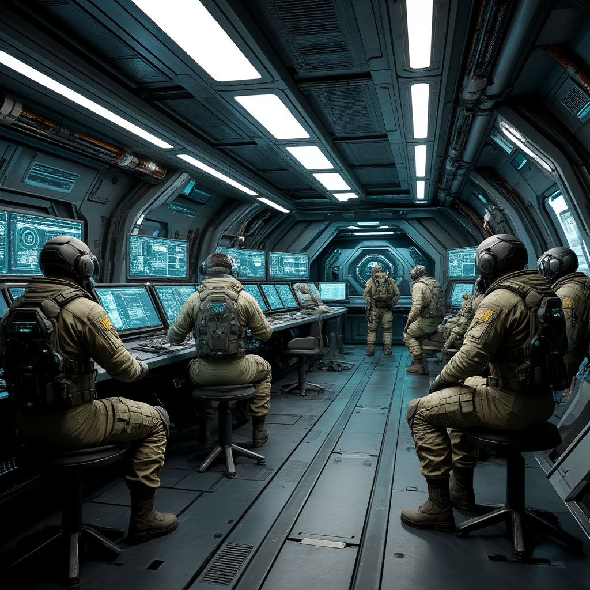

------------

## Глава двадцатая. ...И все за одного

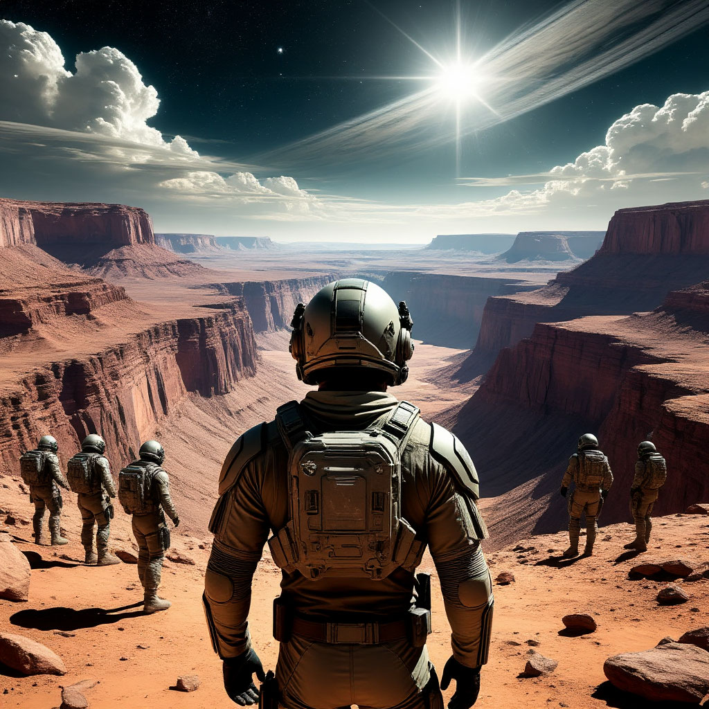

— Капитан! Объект в атмосфере! Спускается прямо сюда!

Времени на вопросы не было. Часы мучительного ожидания, запущенные кнопкой маяка, подошли к концу. Теперь началось новое время — время, когда нам выставят счёт...

— В ружьё, — хрипло скомандовал я, и казарма взорвалась сдержанной суетой.

Мы не знали, кто идёт в гости. Ответ на наш крик в бездну мог быть любым. И нужно было встретить гостей на пороге.

— Дженкинс, Фукасава — возле дверей в ангар. Талбо, распредели людей за укрытиями в глубине ангара. Прицел на вход. Без моей команды — ни звука. Хендрикс, со мной.

Я занял позицию в шлюзе, у узкой смотровой щели, из которой открывался вид на каменистую пустыню. Хендрикс присел чуть сзади, его дыхание было ровным и спокойным, как заученная мантра. Мы стали тенями, вмурованными в сталь, частью этой бездушной, затаившейся конструкции.

Сначала мы услышали его — далёкий, нарастающий вой, разрезающий атмосферу. Потом увидели — стремительную тень, прочертившую небо. Не «Клинок» Спасси... Этот силуэт был знакомым. До боли.

Челнок, изящный и стремительный, с опознавательными знаками «Арго», снижаясь на струях пламени, подняв вихрь пыли и песка, мягко приземлился в десяти метрах от ворот.

Сердце ёкнуло. Свои? Или Сильвестр, решивший проверить работу? Люк открылся. И первым, спрыгнув на грунт, оказался...

...Билли. Лейтенант Робинсон. Он выглядел бледным, осунувшимся, но его глаза горели знакомым острым огнём. Он осмотрелся, рука на пистолете.

Всё стальное напряжение, что сковало мои мышцы, разом ушло.

— Свои, — выдавил я, и это слово повисло в эфире, снимая чары с моих людей. — Это Билли.

Я распахнул дверь и вышел навстречу, подняв руку в приветственном жесте.

— Привет, Билли! Выспался? — крикнул я, имея в виду его таинственную кому. — Не ожидал, что ты так быстро очухаешься!

Билли вздрогнул, увидев меня, и его лицо расплылось в такой радостной улыбке, что на мгновение он стал похож на того самого подростка-поэта, а не на сурового командира разведки.

Щурясь от яркого утреннего света, он уже открыл рот для ответной шутки. Но в этот момент из открытого люка челнока вылетело что-то маленькое, зелёное и стремительное.

— Ааааааа!

Это был не крик ужаса. Это был вопль невероятного, счастливого облегчения. Фиво, наш Барсик, мчался ко мне, беспорядочно размахивая щупальцами, и не в силах остановиться, врезался в меня и вцепился в ногу так крепко, словно боялся, что я испарюсь.

— Капитан! Мой дорогой, мой драгоценный спаситель!!!

Я наклонился и потрепал его по гладкой голове.

— Фиво, да это же теперь ТЫ мой дорогой, мой драгоценный спаситель, — сказал я, и мой голос, против воли, стал тихим и тёплым, а рука сама потянулась, чтобы ещё раз его погладить.

Он не ответил. Он просто стоял, вцепившись в мою ногу, и тихо, прерывисто всхлипывал. Его единственный глаз был плотно закрыт. В этом молчании, в этой дрожи обнявших меня щупалец, была вся боль, весь страх и всё облегчение последних суток.

Наступила пауза. Билли смотрел на эту сцену, пытаясь сохранить серьёзность. Талбо и ребята, высыпавшие наружу, с трудом сдерживали смех.

Я выпрямился, не пытаясь его отцепить.

— Ну что, команда, — сказал я, глядя на своих потрёпанных, но сияющих разведчиков. — Похоже, такси приехало. Давайте собираться домой.

...

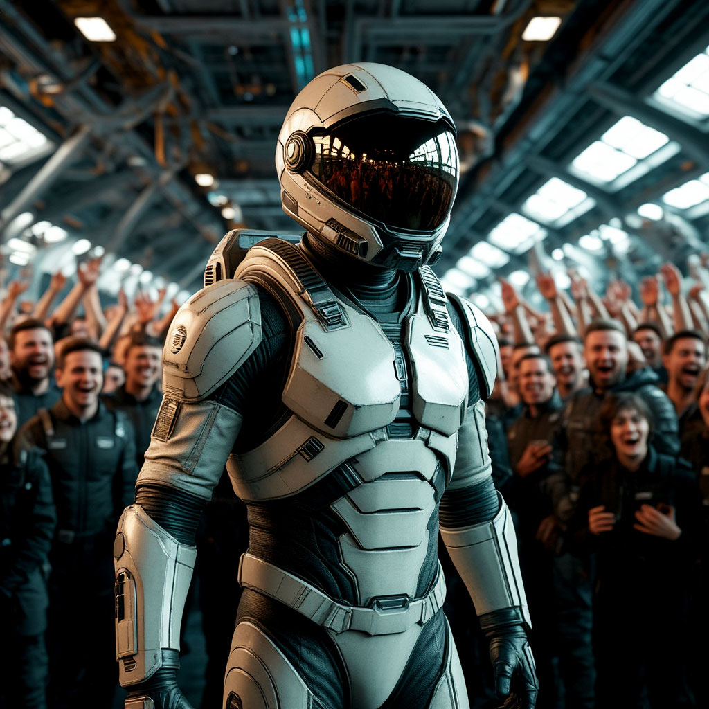

Дверь челнока с шипением отъехала в сторону, и на нас обрушилась волна звука. «Арго» встретил нас гулом голосов, смехом, криками. Ангар, огромный и обычно полупустой, теперь был забит людьми до предела. Казалось, собрался весь экипаж флагмана, кто не был прикован к критическим постам. Стояли техники в замасленных комбинезонах, медики в белых халатах, операторы с мостика, повара с камбуза, рядовые и офицеры — все смешались в одну плотную, дышащую волну. И когда я сделал шаг из челнока и показался в проёме, эта волна на миг замерла. Тысяча глаз уставилась на нас, на наши потрёпанные, запылённые скафандры и на наши усталые лица.

А потом ангар содрогнулся.

Оглушительный, всесокрушающий рёв. Грохот аплодисментов, топот сотен ног, слившийся в сплошной гул, дикие крики «УРА!» и «КАПИТАН!», свист, смех, рыдания. Ангар, битком набитый людьми, взорвался от накопленного за эти часы напряжения.

Меня окружили. Кто-то хлопал по плечу, кто-то пытался пожать руку. Кричали со всех сторон: «Капитан!», «Вы живы!», «Мы знали!». И повсюду — лица. Десятки, сотни знакомых лиц. Улыбающиеся, плачущие, кричащие что-то, что тонуло в общем гуле.

Я поднял руки, пытаясь хоть как-то унять это бурное море. Постепенно, очень постепенно, шум начал стихать, переходя в счастливый, возбуждённый гул. Все смотрели на меня и ждали слова.

Я откашлялся. Мой голос после тишины каньона и грохота оваций звучал хрипло и непривычно громко в наступившей тишине.

— Неужели вы так соскучились по мне, что даже работу побросали? — сказал я, и на моём лице, помимо воли, расползлась та самая, знакомая всем, немного кривая «капитанская» улыбка.

По ангару прокатилась новая волна — смеха и одобрительных выкриков. «Мы не могли это пропустить!» — раздался чей-то радостный голос из толпы.

— А я, признаться, думал, что обратный путь будет подлиннее! — продолжил я, и голос зазвучал твёрже, набирая привычную командирскую тональность. — Я думал, мне предстоит долгий и трудный путь, чтобы вернуться к вам, и придётся брать эту крепость силой... Не думал, что путь окажется таким... стремительным. И что для этого не понадобится ни штурма, ни хитрости. Понадобилось только одно — чтобы вы, все до единого, оставались теми, кто вы есть. Самым стойким, самым невероятным и самым верным экипажем во всей этой суровой и прекрасной галактике.

Я сделал паузу, обводя взглядом это море лиц.

— За то, что не сдались. За то, что остались верны себе и друг другу. За то, что сплотились, когда это было важнее всего... Спасибо. Всем. Просто — спасибо, что вы есть.

И тогда гул перерос в новую, оглушительную овацию.

Я не торопил их. Стоял и смотрел, позволяя этой буре восторга выплеснуться, давая каждому почувствовать радость победы. И только когда первый накал эмоций начал стихать сам собой, я поднял руку, призывая к тишине.

— Ладно, друзья мои! А теперь, с вашего позволения, я наконец-то приму душ, которого меня лишил один бравый старпом!

Новая, короткая волна смеха и аплодисментов проводила меня. Я пошёл сквозь толпу, которая расступалась, но не умолкала. Пожимал протянутые руки, кивал знакомым лицам, ловил на себе взгляды, полные того самого, чего не описать словами, — общего чувства, что худшее позади и мы снова вместе.

...

В моей каюте пахло свежезаваренным чаем. Я откинулся в кресле, чувствуя, как каждый мускул ноет от усталости после спуска в каньон и адреналиновых горок. Напротив меня, выпрямившись, сидел Басов. Его лицо было спокойным, но в уголках глаз собрались тончайшие морщинки — признак недавнего огромного напряжения. В углу, на моей кровати, съёжившись в зелёный комочек, сидел Фиво. Рядом присел Карма Сингх. Майкл Талбо и Эрик Хансен заняли позиции у стен, как и подобает солдатам даже в относительной безопасности: их позы были собранными, взгляды быстрыми и оценивающими. Билли пристроился на краю стола, а Лиза стояла у двери, её скрещённые на груди руки говорили красноречивее любых слов: «Я здесь. Я слушаю. Они заплатят».

— Ну что, Алекс, расскажи, что тут у вас творилось, пока мы на планетарной экскурсии были?

Басов сделал небольшой вдох, собираясь с мыслями.

— После того как объявили о вашей гибели и показали... кадры катастрофы, снятые камерами первого челнока, на корабле наступил шок... но плёнка была убедительна. Честно говоря, капитан, даже я на секунду поверил.

— Но ты бы всё равно отправил «Гефест-1» проверить место крушения? — не удержался я.

— Я бы отправил, — сухо кивнул Басов. — Но у нас тут произошла смена командования, и произошла она молниеносно. — Он покачал головой, видимо снова мысленно пережив произошедшее. — Малинин, как первый помощник, опираясь на устав, немедленно принял командование. Его первыми приказами стали аресты: меня — как «пособника, поставившего флагман на грань уничтожения» в бою с Умга, схватили прямо на мостике. И сразу же отозвали челнок с поверхности. Волкова схватили в его же каюте под предлогом нарушения субординации и самовольных действий в том же бою. Потом долго не могли найти Лизу. Нашли в ангаре возле «Зайца».

Я перевёл взгляд на Лизу:

— Лиза, ты чего там делала?

Она опустила глаза, а её пальцы лишь сильнее впились в рукава.

— Да наш Фиво, — Басов кивнул в сторону кровати, — когда ему сказали о вашей гибели... Заперся в «Зайце», активировал внутренние затворы и прекратил отвечать на любые вызовы.

Я представил картину: неподвижный «Заяц» в ангаре и хрупкая, но неотступная фигура женщины у его посадочных опор, которая часами говорила что-то в коммуникатор, пока за её спиной не сомкнулись руки охранников Малинина.

— Ничего не смог добиться и Карма Сингх с его стратегическим запасом ванильного печенья. Фиво даже не отвечал. Просто сидел там один...

Я почувствовал, как сжимается сердце. Бедный Барсик, забившийся в свою стальную скорлупу.

— Я думал на ванильное печенье выйдет, — честно признался Карма, а его брови сдвинулись в искреннем смущении.

— Я... я расстроился, — тихо сказал Фиво, не поднимая глаза от кружки.

Я посмотрел на него — на этот съёжившийся от горя комочек — и почувствовал, как в груди что-то оборвалось.

— И куда вас всех?

— В камеры, — Басов презрительно фыркнул.

— В камеры? — я даже не сразу понял, о чём он. Мозг отказывался складывать слово и смысл. — На «Арго» нет тюремных камер.

— Именно поэтому они их построили, — холодно пояснил Басов. — Санузел в секторе G-7, за который отвечал Сильвестр, уже второй месяц якобы находился на ремонте. Официально — из-за «сложной поломки фильтров». А внутри, силами нескольких верных им техников, он был тихо переоборудован в изолятор. Организовали герметичные, звукоизолированные камеры, магнитный замок... Все думали, что идёт плановый ремонт. Проверить дистанционно было невозможно. А Сильвестр предоставлял исчерпывающие, но ложные отчёты. Всё было продумано. Туда нас и бросили... Они тщательно готовились.

Я посмотрел на Лизу. Она едва заметно кивнула: «Да, так и было».

— На командование крейсерами были поставлены их люди, — продолжил Басов. — Когда Малинин отдал приказ развернуться и взять курс на Солнечную систему, многие были подавлены, но не сопротивлялись. Доказательств подлога не было, а записи с камер первого челнока были... убедительны. Вину возложили на вас: «Несчастный случай из-за некомпетентности капитана в пилотировании челнока», мол, не будучи пилотом, вы что-то там «нахимичили» в атмосфере. Слишком гладко, слишком вовремя — но формально всё сходилось.

— И сколько вы так летели?

— Примерно восемь часов, — ответил Басов. — До границы зоны гравитационного влияния звезды оставалось не так много. И тогда... — Он сделал паузу, и его взгляд обратился к зелёному комочку на подушке. Взгляд, в котором впервые появилось неподдельное, почти отеческое уважение. — произошло то, чего не предусмотрел ни один их безупречный план. Фиво, просидев в корабле всё это время, сам вышел на связь с мостиком.

Все, включая меня, повернулись к Фиво. А он только сильнее сжал банку с печеньем.

— Мы в камерах, естественно, ничего этого не знали, это потом Элизабет рассказала нам во всех подробностях.

Фиво заявил, что получил сигнал SOS с планеты, что это должно быть вы и вы живы. На мостике уже вовсю командовали Малинин с Сильвестром. Сильвестр приказал ему «не выдумывать и не сеять панику».

Тогда Фиво ПОТРЕБОВАЛ развернуть корабль, чтобы проверить сигнал.

В каюте повисло изумлённое молчание. ПОТРЕБОВАЛ! От Спасси!

— Сильвестр просто рассмеялся ему в лицо. Сказал, что это галлюцинации от горя, приказал заткнуться и сидеть смирно, «а то и тебя арестуем за распространение паники».

И тогда, — Басов сделал паузу, и в его глазах вспыхнуло неподдельное восхищение, — произошло то, чего не предусмотрел ни один их безупречный план. Наш «Зайчик» сам вышел из берлоги.

— Они... они сказали, что вы не вернётесь, — не поднимая глаза, сказал Фиво. Его щупальце нервно обвилось вокруг кружки. — Я запросил данные телеметрии челнока... Мне Сильвестр сказал «заткнуться». Сказал, что у меня... «галлюцинации от горя». — Он сделал глубокий вдох: — А я... Ну, я рассердился.

— Он рассердился, дамы и господа, — ровно, без интонации, повторил Басов и сделал паузу, дав нам мгновение представить эту картину.

Фиво, не говоря более ни слова, сам нажал кнопку аварийного катапультирования. И начал атаку.

— Атаку? — я не смог сдержать удивления. — На флагман?

Я посмотрел на Фиво, не в силах поверить в сказанное. Крошечный, дрожащий от страха Спасси — и атака на флагман? Диссонанс был настолько чудовищным, что в это невозможно было поверить.

— Но это же было несправедливо! — выпалил Фиво, и в его устах это прозвучало как приговор, вынесенный всем Сильвестрам этой вселенной.

Я посмотрел на Фиво, пытаясь совместить в голове образ дрожащего от страха Спасси с картиной безумной и яростной атаки на флагман. И — поверил. Потому что в его голосе звучала та самая, чистая, детская убеждённость в справедливости, которая и двигала мирами.

— Именно. В атаку на флагман! — голос Басова прозвучал с неприкрытой гордостью, а в уголке глаз дрогнула едва заметная улыбка. — Он даже не пытался маневрировать или пользоваться своей кормовой ракетницей. Он просто нёсся на «Арго» на полной скорости и... извините за неформальность, долбил из носовой скорострельной пушки. Той, которой Спасси обычно не пользуются.

— Да ещё орал в эфир! — не выдержал Билли, и на его лице расплылась широкая ухмылка.

— Что орал? — спросил я машинально, чувствуя, как смех и невероятная гордость подступают к горлу.

— Да ничего конкретного! — рассмеялся Билли. — Просто: «А-а-а-а-а-а-а!..» — И жал на гашетку! Чистая, неконтролируемая ярость! Это было эпично!

Басов сделал вид, что хмурится на него, но не смог скрыть одобрительного блеска в глазах.

— Эпично или нет, но эффект был сокрушительным. Малинин пришёл в ярость. Объявил Фиво мятежником и отдал приказ «новым» командирам крейсеров уничтожить «Зайца»... — Басов сделал драматическую паузу. — Вот тут всё и рухнуло. Система дала сбой. Вернее, сработала другая система. Человеческая. Экипажи «Дымящегося» и «Сокрушительного» самовольно арестовали новых командиров, вывели корабли из доков и взяли «Арго» на прицел.

Картина предстала передо мной во всей ясности: одинокий «Заяц», яростно долбящий по «Арго», и два грозных крейсера, вставшие горой за него, направив орудия на свой же флагман. Сердце сжалось от гордости.

— А команда флагмана, — закончил Басов с лёгким намёком на удовлетворение в голосе, — приказ «уничтожить Фиво» тоже не оценила... В течение десяти минут Малинин, Сильвестр и их группа поддержки были скручены и помещены в тот самый изолятор, где были мы, а нас, естественно, освободили.

Он показал на себя, на Лизу, а затем кивнул в сторону мостика, где сейчас был Волков.

— После освобождения первым делом Фиво передал мне данные о вашем сигнале. Мы тут же развернулись и пошли на максимальной скорости обратно в надежде, что это были вы. Ну, а остальное вы знаете.

В каюте повисла тишина, наполненная уважением и благодарностью. Все смотрели на Фиво. Тот смущённо ковырял щупальцем пачку печенья, а зелёный огонёк его медали подмигивал в такт его смущённому дыханию.

— Кстати, Билли, — я повернулся к нему, — а ты когда пришёл в себя и как?

— Да когда наших заговорщиков арестовали, в каюте Сильвестра нашли какое-то вещество... Мари мне долго пыталась объяснить, как оно действует. Она что-то говорила про блокировку каких-то связей и функций... что-то там про ингиб... неее, я это не выговорю, даже если вспомню! — Он широко ухмыльнулся, и в его глазах заиграл знакомый озорной огонёк. — Было ОЧЕНЬ интересно, но я ничего не понял! Да и то, что вспомнил, сто процентов переврал! — И он громко и заразительно рассмеялся. — Вы у неё сами потом спросите, она с радостью вам всё в деталях расскажет. Все эти молекулы и рецепторы в подробностях нарисует!

— Капитан, вы лучше расскажите, как вы-то выжили? — нетерпеливо перебил Басов.

Я откинулся в кресле, позволив себе ту самую, немного уставшую командирскую усмешку.

— А я тебе всегда говорил, Алекс: «Если ты параноик, это ещё не значит, что за тобой не следят!»

По комнате прокатился дружный хохот.

— Виды там были что надо, — продолжил я, уже серьёзней. — Закачаешься! Но когда мы вошли в облачный слой и смотреть стало не на что, я увидел барахлящий индикатор, который поручал проверить Билли. Времени на раздумье не было, и я просто бахнул по большой красной кнопке. Решил, что в крайнем случае у нас состоится внеплановая парашютная экскурсия. А челнок прекрасно и без нас на автопилоте сядет. Вы бы видели глаза Талбо в этот момент!

— Я подумал, капитан, что у вас сдали нервы, — сухо, но беззлобно парировал Талбо.

— А дальше всё было просто, — махнул я рукой. — Добрались до базы. И знаете, что нас спасло?

Я посмотрел в сторону кровати. Фиво тут же насторожился, а его единственный глаз замер.

— Твой пароль, Фиво. «Хаффи-Маффи-Гаффи». Он сработал как мастер-ключ. Открыл всё. Спасибо тебе. Без этой... отмычки мы бы до сих пор мёрзли у порога.

Фиво выпрямился так резко, что чуть не упал с кровати. Его щупальца взметнулись вверх, как флаги победы.

— А я что говорил! — он потряс щупальцами, и в его голосе звучала чистая, неподдельная победа. — Я же говорил! Он сверхсекретный!

Все снова рассмеялись. Смех был тёплым, снимающим последнее напряжение.

— На базе мы выяснили главное. Чёрный Эскадрон жив, здоров и, похоже, от скуки не страдает... Они снялись с якоря всем составом и рванули к той самой аномалии в Циркуле. Так что теперь у нас есть точный адрес. Проблема была в том, что мы сами оказались в ловушке. Без корабля, без связи. Оставался только аварийный маяк. По сути выбора у нас и не было. Решили — сделаем что можем, а дальше будь что будет.

...

Когда чай был допит и основные новости рассказаны, наступило время навести порядок. Я обвёл взглядом собравшихся.

— Пора вернуть кораблю лицо. Вот временные назначения, — голос прозвучал твёрдо, без пространных вступлений. — Билли, с сегодняшнего дня ты — мой старпом. Ты и так последние месяцы выполнял половину моих поручений по работе с экипажем.

Билли лишь чуть кивнул, но по его осанке было видно — он уже мысленно примерял новые обязанности.

— Алекс, — я повернулся к Басову. — Извини, но ты мне нужен на мостике, в качестве штурмана.

— Да я и сам не горю желанием сидеть в кресле первого, — сухо ответил Басов. — Моё место — за штурманским пультом. Моё дело — звёзды и курсы.

— Карма, — я повернулся к нему. — Ты — третий помощник. Только тебе могу доверить всю материально-техническую часть. Готов?

— Нет проблем, сэр! — Сингх расплылся в такой широкой улыбке, что даже усы затрепетали. — Всё будет — винтик к винтику.

— Кого посоветуешь на своё место?

— Есть у меня один толковый парень, — оживился Карма. — Мой зам, Лукас Сантана. Парень — золотые руки и светлая голова. Он справится. Ручаюсь.

Я кивнул.

— Талбо, — мой взгляд остановился на сосредоточенном лице разведчика. — Возглавишь разведку вместо Билли.

В глазах Талбо вспыхнул азартный, хищный огонёк. Он лишь коротко кивнул: «Есть».

— Эрик, — я перевёл взгляд на Хансена. — «Теней» я расформировывать не буду. Нам может понадобиться подготовленный отряд. Командуешь им ты. «Альфу» возглавишь лично. Хендрикс — твой заместитель. Мы с Билли в ближайшее время подберём командиров для «Браво» и «Чарли». За подготовку «Теней» отвечаешь лично передо мной. Парни должны быть готовы ко всему. Это будет наш передовой отряд спецназа. Подчиняешься тоже лично мне.

— Понял, капитан! Будет сделано! Слеплю из них настоящих призраков.

— Вот и отлично, — я кивнул. — Тогда за работу.

Все начали расходиться, обмениваясь скупыми, но содержательными взглядами. Басов же ненадолго задержался. Когда дверь закрылась за последним из ушедших, он наклонился ко мне, и его тон сменился с официального на доверительно-ироничный.

— Кстати, капитан, — словно между делом заметил он. — Насчёт того вашего старого поручения. Про тайного поэта. Зелёный маркер.

— И что? Нашёлся виновник? — спросил я, чувствуя, как уголки губ сами собой растягиваются в улыбке.

— Пока Волков и Чен сидели под арестом, в комнате отдыха не появилось ни одной новой строчки. Никто не дописал поэму. Совпадение?

Я поднял бровь, мысленно представив сначала жизнерадостного Волкова, склонившегося над рифмами, а затем — бесстрастное лицо Лизы Чен, выводившее каллиграфическим почерком: «Барсик наш теперь герой...».

— Волков? Или Чен? — не удержался я от смеха.

— Так точно. Волков. Или Чен, — с подчёркнутой серьёзностью подтвердил Басов, но глаза его уже смеялись.

— И кто же из них?

Басов развёл руками с самым непроницаемым видом, какого только мог достичь.

— Вам виднее, капитан. Я всего лишь штурман. Анализ почерков — не в моей компетенции. Ну, и я, само собой, тоже был под арестом. Но это не я.

Я откинулся в кресле, и громкий, искренний смех вырвался из груди. Это был смех облегчения и смех гордости за этот невероятный, стойкий, преданный экипаж, где суровые командиры крейсеров втайне пишут стихи о подвигах Спасси, а штурман в разгар государственного переворота на корабле ведёт расследование о маркерах.

— Ладно, Алекс, — выдохнул я, вытирая несуществующую слезу. — С этим литературным трибуналом разберёмся как-нибудь в свободную смену. Сейчас у нас дела поважнее. Летим к аномалии в Циркуле.

Басов, наконец позволив себе едва уловимую улыбку, кивнул и вышел, оставив меня наедине с тишиной каюты.

Дверь закрылась. Я остался один. За окном плыла чужая звезда, а в ушах стоял крик — отчаянный и рассерженный... Вопль маленького зелёного существа, которое, оказалось, умело не только бояться и любить, но и бунтовать!

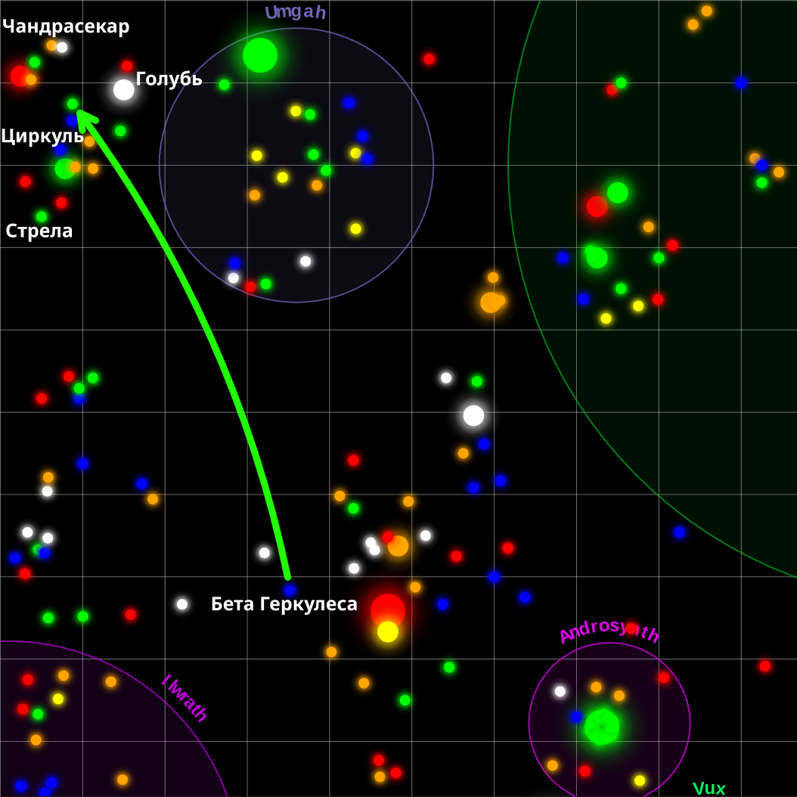

------------

## Глава двадцать первая. Зов совести

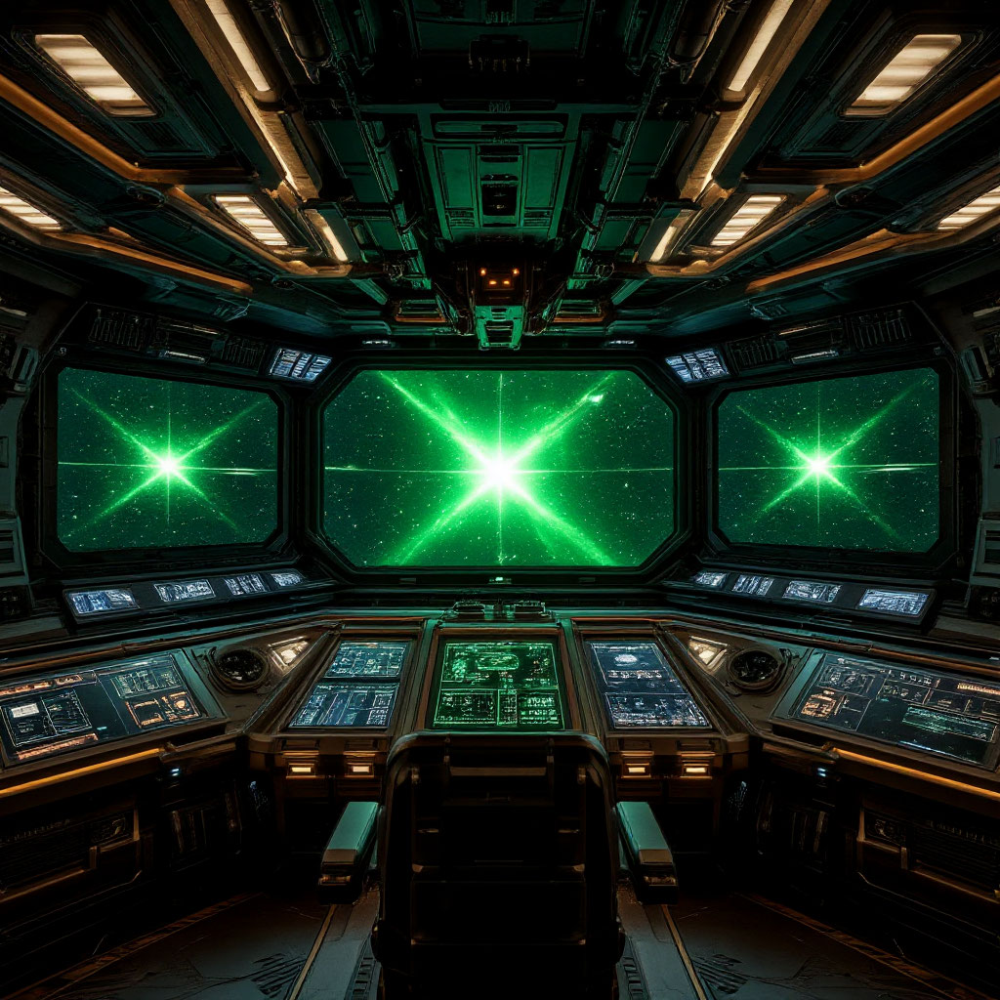

Два дня я отдыхал. Отсыпался, слушал ровный гул гипердвигателей, мой личный тихоокеанский прибой и старался ни о чём не думать. Необходимости в моём присутствии на мостике не было. Билли и Басов действовали так слаженно, словно всю жизнь работали в паре. А корабль уже нёсся в гиперпространстве на полной скорости, к той самой невозможной «зелёной звезде».

Но всё хорошее рано или поздно кончается. Отведённые самому себе сорок восемь часов истекли. Пора было возвращаться в строй.

Я, наконец, сбрил щетину, умылся и проверил последние сводки. На экране мелькали сообщения от Басова, краткие рапорты Билли, график тренировок «Теней» от Хансена. Всё шло по плану. Всё шло хорошо.

А дальше — процедура, отработанная годами: китель, браслет на запястье, коммуникатор за ухо и можно выходить в люди.

На мостик я шёл не торопясь, стараясь прочувствовать настроение корабля. Я кивал встречающимся по пути техникам, ловил на себе быстрые, деловые взгляды: «Капитан вышел, значит, всё в порядке, можно работать спокойно».

Эта бесшумная обратная связь была лучшим подтверждением, что корабль оправился и был готов к новым вызовам.

Перед тем как подняться на командную палубу, я свернул в комнату отдыха.

Большая белая доска снова была исписана. А справа висел новый листок. Ага! Стихи не просто вернулись — они расцвели пышным цветом. Я прочитал первые строчки:

Когда сгустился облачный покров,  
И до паденья оставались лишь мгновенья...  
Наш капитан по кнопке бахнул что есть сил.  
И экипаж спасло лишь это от крушенья.  

Я невольно улыбнулся. Дальше была целая сага про наш спуск. А потом шло что-то эпичное про «бунт Спасси» и «ярость зелёной атаки». Да и главное было не в содержании, а в самом факте: корабль снова пел. Шутил. Творил. Всё было в порядке.

Мостик встретил меня мягким светом мониторов. После всех потрясений он казался островком невероятного, хрупкого спокойствия. На главном экране вместо враждебных силуэтов мерцали мирные схемы курса и телеметрии. А в воздухе витало редкое чувство — уверенного, целенаправленного движения.

Басов, как всегда, организовал свой мини-буфет у штурманского поста, и воздух наполнялся ароматом свежезаваренного чая.

— В строю, капитан? — спросил он, не отрываясь от экрана с картами, но по тону было ясно — вопрос риторический. Он уже всё оценил.

— В строю, Алекс. Что по курсу?

— Летим. На пределе, что позволяет гипердрайв. Всё в норме.

Я подошёл к своему креслу и опустился в него с чувством облегчения. Передо мной на главном экране мерцала навигационная карта. Теперь длинная линия, уходящая вдаль, выглядела не просто гипотетическим маршрутом. Она выглядела обещанием разгадки.

— Капитан, у меня для вас сюрприз, — сказал Басов своим, как всегда, спокойным тоном. — В подарочную обёртку завернуть не успел, извините.

Я повернулся. Александр был как всегда непроницаем, но в уголках его губ играла та самая, едва уловимая искорка, которая всегда означала: «У меня есть что-то интересное, и я буду это сообщать с максимально невозмутимым видом».

— Алекс, я же вижу, у тебя лицо хитрое. Говори прямо, к чему ты клонишь?

— А вот и наша красавица. — Он провёл пальцем по панели. — С поправкой на расстояние и скорость света, получается именно семнадцатое число.

На главном экране вспыхнула ярко-зелёная звезда. Невероятно красивая, как изумруд в бархатной черноте космоса. Она висела на стыке Циркуля и Чандрасекара, холодная и завораживающая.

— Элизабет, — негромко позвал я. — Смотри, какая красота. Ты такое любишь.

Оператор Эванс подняла голову и на миг застыла. Всё напряжение с её лица разом ушло, уступив место тихому, безоговорочному изумлению. Она медленно подняла руку, будто хотела коснуться экрана. В её взгляде было то самое простое, чистое восхищение, которое возникает перед чем-то по-настоящему прекрасным — будь то картина, закат или вот эта невозможная звезда.

— Боже мой... — тихо выдохнула она, и в её голосе не было ничего, кроме искреннего, почти детского восторга. — Какая красота...

— А вчера она пропала, — добавил Басов. — Почти трое суток после появления. Чуть меньше.

— Когда следующее представление? — спросил я.

Басов перевёл взгляд на меня.

— С учётом нашего курса... будем на месте за несколько дней до её появления. Успеваем как раз к началу представления. Можно даже занять лучшие места.

Я повернулся к Элизабет. Она уже пришла в себя, но в глазах ещё стоял отблеск недавнего восторга.

— Ну что, Элизабет, навестим нашу красавицу? Поглядим на неё не в записи, а вживую?

Она встретила мой взгляд, и на её лице расцвела улыбка, которая появляется у людей, когда они говорят о чём-то по-настоящему прекрасном.

— Ещё бы! — вырвалось у неё, и она даже слегка привстала с кресла, словно забыв на секунду, где находится. В её глазах горел живой, нетерпеливый огонёк. — Я бы... я бы даже дежурство на целую смену продлила, только бы посмотреть на неё снова, вживую! Представляете, каково это — увидеть такое вот, прямо здесь, за стеклом иллюминатора?

Она смущённо присела обратно и только ещё больше расплылась в улыбке.

На мостике повисла та самая тишина — тишина перед первым актом. Я медленно прошёлся взглядом по мостику: по Элизабет, всё ещё светящейся изнутри, по Басову, удовлетворённо попивающему чай. Хорошо, — подумал я.

Но это приятное послевкусие чуда рассеялось в тот момент, когда я вспомнил про сектор G, где под замком томились наши «гости». Поэзия кончилась. Пора было вернуться к прозе.

— Алекс, — прервал я тишину. — В тех... импровизированных апартаментах для наших гостей. Камеры наблюдения установили?

— Они там уже были, капитан, — сухо ответил Басов. — Малинин и Сильвестр позаботились об этом при переоборудовании санузла. С ночным видением и записью звука.

— И круглосуточная запись ведётся? — я повернулся к нему. — А то они там, не дай бог, утопятся в унитазе от угрызений совести, а мне потом будут предъявлять, что это я лично их утопил.

— Унитаз там, насколько я помню, остался один, и он вакуумный, капитан, — невозмутимо заметил Басов. — Утонуть проблематично. Но запись ведётся в трёх экземплярах, с резервным питанием и передачей в защищённый архив. На всякий, как вы изволили выразиться, параноидальный случай.

Я кивнул. Компания под стражей была невелика — меньше десятка человек. Сам Малинин, ледяной Сильвестр, двое их ставленников, мечтавших о командирских креслах на крейсерах, и несколько рядовых техников и младших офицеров, оказавшихся в нужное время в нужном, с их точки зрения, месте.

В этот момент на мостик вошёл Билли. Его походка была лёгкой, но глаза по-прежнему сканировали пространство с профессиональной остротой, а на его лице играла довольная ухмылка.

— Капитан, по кадровому вопросу — выполнено. Дженкинс на «Сокрушительном», Одинга на «Дымящемся».

— Одинга на «Дымящемся»? — Я удивлённо посмотрел на Билли.

— Да, оказывается, Волков и Чен уже месяц за ними наблюдали. Сами хотели забрать их к себе. Лиза сказала, что Одинга — её копия: «слов не тратит, дело делает». — Билли рассмеялся. — Представляю, какой у них там на мостике будет тихий час!

От этих слов на душе стало тепло. Они не просто воевали, они думали на шаг вперёд, строили будущее, растили смену. После ядовитого педантизма Малинина и ледяного цинизма Сильвестра эта простая, искренняя забота о деле была глотком чистого воздуха. Не командиры, а золото!

— Молодцы, — сказал я искренне. — А усиленный паёк для «Теней»?

— И это сделано! Усиленный паёк и двойной десерт. — Билли ухмыльнулся, но почти сразу его лицо стало серьёзнее. — Тут ещё кое-что... К вам рвётся один человек. Рядовой Нуш. У него нет допуска на мостик. Я его досмотрел — чист. Оружия нет. Но цель визита не называет. Говорит: «Только капитану. Лично».

Я обменялся взглядом с Басовым. Тот едва заметно пожал плечами — «ваше решение».

— Ну, зови его, Билли. Надо же узнать, что он хочет.

Через минуту на мостик вернулся Билли, а за ним — молодой парень в поношенной рабочей робе техника. Он был бледен, его взгляд был прикован к полу, а пальцы нервно теребили край куртки.

— Рядовой?

— Г... Годен, сэр! Рядовой Годен Нуш, техник второй категории, команда технического обеспечения, сектора G! — выпалил он, и его голос сорвался на высокой ноте.

— Что случилось, рядовой Годен? Зачем вы хотели меня видеть?

Он поднял на меня глаза. В них читалась какая-то глубокая, выворачивающая наизнанку тревога. Взгляд был виноватым, умоляющим, почти отчаявшимся.

— Я... Я так больше не могу...

На мостике повисла гробовая тишина. Даже Басов приподнял бровь в немом вопросе.

— Продолжайте, рядовой Годен, — сказал я спокойно.

Годен сделал глубокий, прерывистый вдох, словно собираясь нырнуть в ледяную воду.

— Это... это про лейтенанта Робинсона, сэр. Про его... кому. Я знаю, как это произошло. Вернее... я знаю, кто это сделал и как.

— Говорите чётко и по делу, — мягко, но неумолимо потребовал я. — Что вы знаете?

— Я был на плановом обслуживании в щитовой G-7, — затараторил Годен, слова понеслись из него, как из прорванной плотины. — Там узлы распределения энергии для... в том числе для того самого санузла. Я был за панелью, делал замеры. И тогда... тогда зашли они. Капитан Малинин и капитан фон дер Кампф.

Он замолчал, сглатывая ком в горле. В тишине мостика было слышно, как с шипением работает вентиляция.

— Они не знали, что я там. Я... я замер и старался не шевелиться. Они говорили тихо, но в щитовой страшное эхо, сэр... И я всё слышал. Они говорили, что лейтенант Робинсон что-то «разнюхал» про челнок.

Он закрыл глаза, собираясь с духом, и заговорил снова, но теперь тихо и отчётливо, как будто зачитывал протокол по памяти.

— Капитан Малинин... он был не в себе. Голос немного дрожал. Он говорил: «Он что-то разнюхал про челнок. Про индикатор. Он же не успокоится. Что делать?» Он повторял это: «Что делать?»

Годен передохнул, его пальцы ещё сильнее сжали промасленную робу.

— А капитан фон дер Кампф... его голос был другим. Спокойным. Как лёд. Он сказал: «Перестань метаться. Ты только привлекаешь внимание. Я всё решу». И тогда капитан Малинин... он как будто испугался ещё больше. Он сказал: «Что ты хочешь сделать? Не хочешь же ты его...»

Техник поднял на меня глаза, полные немого потрясения от услышанного.

— А капитан фон дер Кампф рассмеялся. Тихо. И говорит: «Что ты разнервничался? Успокойся. Есть одно вещество. Не смертельное. Просто... усыпляющее. Введёт в глубокий сон, в кому. Никто не пострадает. Никаких драм». А потом... потом он сказал самое страшное. С тем же спокойствием. Сказал: «Но если ты и дальше будешь паниковать и делать глупости, то тогда... тогда действительно у кого-то могут начаться проблемы. Так что держи себя в руках».

— А когда они ушли, я выполз и... ничего никому не сказал. Я боялся, сэр. Боялся... Они офицеры, а я кто? Я рядовой. Кто бы мне поверил? Я думал... может, мне показалось... Но я знал, что не показалось. А на следующий день лейтенант впал в кому.

Он выдохнул, и из его глаз покатились тихие, беспомощные слёзы.

— И когда взорвался ваш челнок... — Он снова выпрямился, с отчаянной решимостью глядя мне в лицо. — Я не могу больше так жить. Моя совесть... она меня изводит день и ночь.

Я смотрел на этого молодого, надломленного парня, чья совесть оказалась сильнее страха. Страх, трусость, раскаяние — всё это было в нём и смешалось в один клубок. Он не был злодеем. Он был испуганным человеком, попавшим в жернова обстоятельств. И теперь его мучила не столько боязнь наказания, сколько внутреннее осуждение, съедавшее его заживо.

Тишина на мостике стала густой и тяжёлой. Все ждали моего слова.

— Рядовой Годен Нуш, — сказал я, не повышая тона. — Вы совершили ошибку. Серьёзную. Вы скрыли информацию, которая могла предотвратить преступление и раскрыть попытку мятежа. По уставу, за это грозит трибунал.

Он побледнел ещё больше, но кивнул, готовый принять всё.

— Но, — я сделал паузу, — я вижу не соучастника. Я вижу человека, которого сломал страх. Испуганного рядового, оказавшегося один на один с двумя старшими офицерами, обладавшими огромным влиянием. Ваша вина — в бездействии. Но то, что ваша совесть в итоге оказалась сильнее этого страха и привела вас сюда, — многое меняет.

Надежда, слабая и невероятная, мелькнула в его мокрых глазах.

— Поэтому трибунала не будет, — твёрдо сказал я. — Будет работа. Исправительная и очень нужная. «Заяц».

Годен моргнул, не понимая.

— Штатный экипаж спасского «Зайца» — тридцать человек, — пояснил я. — Мы так и не сформировали полноценную команду для этого корабля. Он летал только благодаря Фиво и помощи техников «Арго», от случая к случаю. Чтобы он мог функционировать как полноценная боевая единица эскадры, ему нужен свой, постоянный экипаж. Техники, операторы, кибернетики. Вы будете первым. Ваше новое место — технический специалист в экипаже «Зайца». Под непосредственным командованием лейтенанта Фиво.

Лицо Годена выражало полнейшее смятение. Вместо камеры — назначение на самый легендарный, самый «горячий» пост на корабле?

— Но... но я... я струсил, сэр, — выдохнул он, не в силах совладать с собой.

— И будете учиться не трусить, — парировал я. — Помимо технических обязанностей, я вменяю вам в обязанность посещение специальных лекций. Три раза в неделю. Их будет вести лейтенант Фиво. Тема: «Основы преодоления видового инстинкта страха на примере личного опыта».

На лице Билли расплылась широченная ухмылка. А Басов фыркнул, кашлянув в кулак.

— Вы будете изучать теорию и практику храбрости, рядовой Годен, — продолжал я, уже с лёгкой улыбкой. — У самого, на мой взгляд, компетентного в этом вопросе специалиста во всём флоте Нового Альянса. Считайте это курсом повышения личной эффективности.

Годен стоял, открыв рот. За последние две минуты его мир перевернулся с ног на голову. От уничтожающего стыда и страха перед трибуналом — до нелепого и невероятного, спасительного приказа.

— Я... я не знаю, что сказать, сэр, — прошептал он.

— Говорите «Есть, капитан!» и идите готовиться к новому назначению, — мягко, но не оставляя пространства для возражений, сказал я. — Детали вам передаст старпом. И, рядовой Годен... — я посмотрел ему прямо в глаза. — Спасибо, что нашли в себе силы прийти. Это и есть первый шаг. Не останавливайтесь на этом.

Он выпрямился. Слёзы ещё блестели на щеках, но в его позе появилась твёрдость, а в глазах — место сломленности заняла решимость.

— Есть, капитан! Спасибо! Я... я не подведу!

Он бросил взгляд на Билли, который одобрительно кивнул, и почти выбежал с мостика, словно боясь, что этот странный, чудесный сон вот-вот закончится.

Двери закрылись. На мостике снова воцарилась тишина, но уже другого свойства.

— Курсы храбрости у Фиво, — первым нарушил молчание Басов, глядя на меня. — Гениально. Беру на заметку. Может, и мне записаться? А то я, если честно, когда Малинин меня арестовывал, тоже немного понервничал.

— Ты, Александр, уже прошёл свой курс, — усмехнулся я. — Когда летел на Умга на полной скорости, зная, что это может стать нашим последним манёвром. Практические занятия, так сказать.

Басов хмыкнул, но не стал спорить.

Билли подошёл ближе, его лицо было серьёзным.

— Вы правильно поступили, капитан. Он и так сломлен, дополнительное наказание ничего не даст. А так... у него есть шанс. И у «Зайца» — наконец-то появится экипаж.

— Именно, — согласился я, глядя на закрывшиеся двери. — Каждый заслуживает второго шанса. Особенно тот, у кого хватило духа признаться в своей слабости. А теперь, господа, вернёмся к звёздам. У нас курс на Циркуль. И, кажется, там нас ждёт не только аномалия.

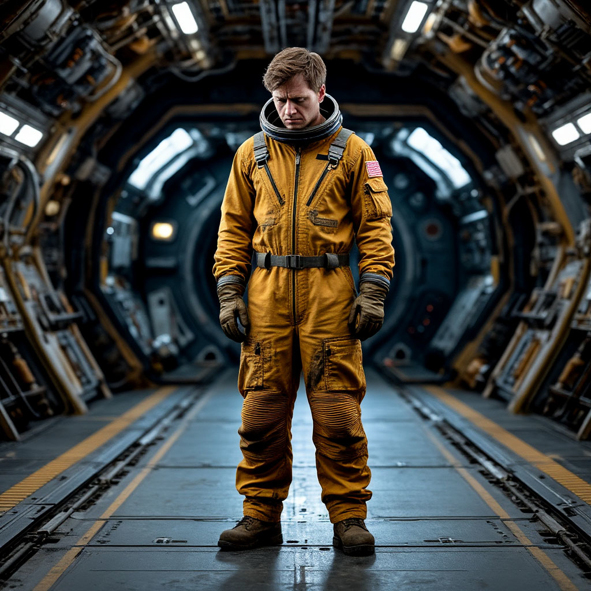

------------

## Глава двадцать вторая. Курс молодого бойца, или Принцип зажмуривания

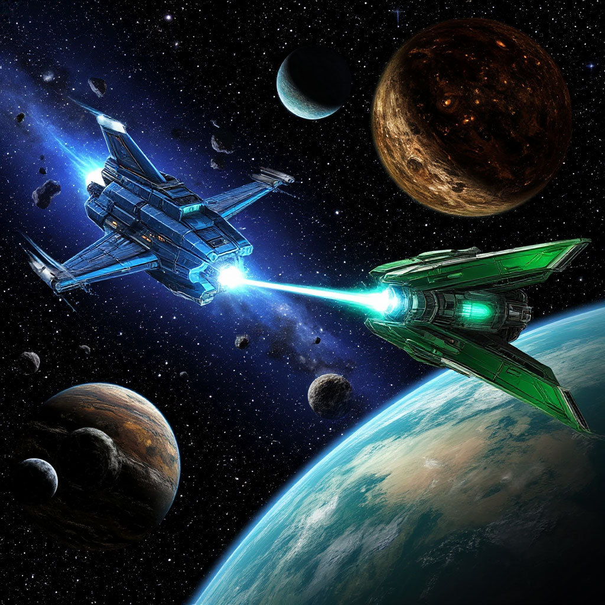

Первая лекция началась с того, что опоздал сам лектор.

Фиво, сбившись с ног в поисках составленного наспех конспекта, ворвался в кают-компанию с опозданием на семь минут. Помещение было пустым, если не считать бледного, как полотно, рядового Годена Нуша, сидевшего точно в центре помещения и сжимавшего в руках потёртый, видавший виды планшет. Они молча смотрели друг на друга — гуру и его единственный ученик, оба готовые броситься наутёк.

— Пр-принцип первый, — выдавил наконец Фиво, ухватившись за доску на стене, как утопающий за соломинку. — Иногда... надо просто зажмуриться. И нажать на газ...

Не сказать, что первая лекция произвела фурор, но на следующей лекции, помимо Годена, в дверях кают-компании застыли двое техников с инструментами в руках, делая вид, что просто ждут, пока освободится помещение. Они слышали последние десять минут. И задержались.

Через неделю в кают-компанию пришлось притаскивать табуретки из столовой. Слушали не только техники, но и кибернетики, и даже пара хмурых десантников из «Теней», которые стояли, скрестив руки, с видом суровых экспертов, оценивающих новую тактику.

Фиво, к своему собственному удивлению, обнаружил, что когда он говорит о страхе — по-настоящему, без утайки, — его собственный голос перестаёт дрожать. Он не учил храбрости. Он просто честно рассказывал, как ему, самому трусливому существу во вселенной, удавалось иногда — совсем чуть-чуть — эту храбрость в себе находить. И оказалось, что этот рецепт — «зажмуриться и нажать...» или «посмотреть на того, кто рядом...» — был универсальным. Он работал не только в космическом бою, но и когда нужно было признаться в ошибке, вступиться за товарища или просто сделать первый шаг в тёмный отсек.

Через две недели курс «Основ преодоления видового инстинкта страха» стал самым посещаемым неформальным мероприятием на «Арго». Апофеозом стала сцена, когда я, проходя мимо распахнутой двери кают-компании, увидел, что в углу комнаты на столе с невозмутимым видом, покачивая ногой, сидел Волков. Он встретил мой взгляд, слегка приподнял руку и произнёс шёпотом, чтобы не мешать течению лекции:

— Повторение — мать учения. А то я на прошлой лекции про принцип «зажмуриться» прослушал.

К концу третьей недели кают-компания «Арго», рассчитанная от силы на двадцать человек, уже не вмещала всех желающих. Народ стоял вдоль стен, толпился в дверном проёме, а некоторые и вовсе сидели на полу, стараясь не пропустить ни слова.

В центре внимания, на табуретке перед маркерной доской, стоял лейтенант Фиво. Его глаз бегал быстрее обычного, а щупальца теребили указку, но голос звучал твёрже, чем можно было ожидать.

— И... итак, тема сегодняшнего занятия, — он кашлянул. — «Тактическое зажмуривание и его применение в экстренных ситуациях».

В задних рядах кто-то сдержанно хмыкнул. Фиво метнул взгляд в ту сторону, но не сбился.

— Это не шутка, — сказал он серьёзно. — Это базовый протокол выживания при тотальном переполнении контуров страха. Когда логика отказывает, а конечности не слушаются, остаётся один алгоритм: шаг первый — зажмуриться. Шаг второй — нажать на то, на что нужно нажать. Шаг третий... не забывать дышать, пока всё не закончится.

Он обвёл взглядом переполненную комнату. Среди слушателей были не только техники вроде Годена Нуша, который сидел в первом ряду с планшетом, но и бортинженеры, разведчики из команды Талбо, и даже пара молодых стажёров с «Дымящегося». На заднем плане, прислонившись к стене, стоял лейтенант Билли с характерной полуулыбкой.

— Пример из практики, — продолжил Фиво, и в его голосе появились ноты, которые раньше были ему несвойственны. — Бета Геркулеса. «Зонд» Слайландро. Меня... э-э-э... неожиданно выгрузили в космос. Всё, что я видел, — это огонёк прицела на моём дисплее. Мозг кричал: «Всё пропало!» Но щупальца... щупальца сами сделали манёвр «семь-бета». Я просто представил, что это симулятор. И зажмурился.

— И сработало? — крикнул кто-то с места.

— Меня не разобрали на компоненты, — сухо констатировал Фиво. — Значит, сработало. Но это был уровень «новичок».

Он слез с табуретки и подошёл к доске, где были нацарапаны два круга. Один был подписан «Зажмуриться». Под вторым красовалась загадочная надпись: «Точка опоры».

— Есть другая ситуация. Когда зажмуриться нельзя. Когда ты видишь, что... что твой корабль, твои друзья, — он на секунду запнулся, — что они в беде. И лететь на помощь — значит наверняка погибнуть... Здесь алгоритм другой.

Он ткнул указкой во второй круг.

— Здесь нужно найти точку опоры. Не физическую, а внутреннюю. Для меня... это был голос капитана. И мысли о командире Чен. О том, что если я не полечу, то с ними случится беда. Страх за себя превратился в... в ярость за них. Более управляемую субстанцию.

В комнате повисла тишина. Все знали, о каком «бунте» идёт речь.

— То есть, чтобы перестать бояться, надо подумать о ком-то другом? — спросила молоденькая оператор из блока жизнеобеспечения.

— Не «чтобы перестать», — поправил её Фиво. — Страх никуда не денется. Он будет тут. — Он приложил щупальце к своей груди. — Но рядом с ним появится что-то ещё. Что-то, за что можно зацепиться. Долг. Дружба. Справедливость!.. Найдите свою точку. Вырастите её. И когда придёт время... просто нажмите на газ. Даже если щупальца трясутся.

Он замолчал, словно смущённый собственной речью.

— Иногда... иногда храбрость — это не громкий крик. Это тихий шёпот самому себе: «Надо! Это надо сделать прямо сейчас!»

Наступила пауза, которую прервали аплодисменты. Негромкие, но искренние. Фиво смущённо потеребил указку.

— Вопросы есть? — спросил он, оглядывая аудиторию.

Поднялся лес рук. Годен Нуш спросил о технике дыхания во время панической атаки. Кто-то из разведчиков поинтересовался, как отличить «полезный» страх, предупреждающий об опасности, от «парализующего». Пилот с «Дымящегося» спросил, нужно ли тренировать «тактическое зажмуривание» на симуляторе.

Фиво отвечал. Не как дипломированный психолог, а как прошедший всё это на собственном опыте. Его советы были странными, наглядными и до смешного практичными: «Полезный страх шепчет: „Осторожно, тут скользко“. Парализующий орёт: „ВСЁ ПРОПАЛО!“»; «Если сердце колотится — дышите глубоко и ровно, пока не сосчитаете до десяти. Медленно. На вдохе — раз, на выдохе — два»; «Если темнеет в глазах — найдите пять синих предметов в кабине и назовите их».

Билли, наблюдавший за этим, качал головой с нескрываемым восхищением.

Когда занятие закончилось и народ стал расходиться, к Фиво подошёл Годен Нуш.

— Спасибо, лейтенант. Это... это действительно помогает.

Фиво понимающе посмотрел на него своим большим глазом.

— Я рад, рядовой Годен. Просто помни: самый сложный шаг — первый!

Он собрал свои записи — несколько листочков с каракулями и схемами — и потопал к выходу, по пути отвечая на последние вопросы. По коридору за ним шёл небольшой хвост из слушателей, что-то оживлённо обсуждающих.

Курсы храбрости лейтенанта Фиво, начавшиеся как шутливое дисциплинарное взыскание для одного человека, стали неофициальным, но самым посещаемым мероприятием на корабле.

На одной из таких лекций, когда атмосфера в кают-компании была сосредоточенной и почти медитативной, а Фиво, стоя на своём табурете-трибуне, водил указкой по схеме на доске, и прозвучал тревожный сигнал вызова.

— Капитан, на мостик. У нас проблема. — Прозвучал невозмутимый голос Басова. — И на этот раз это снова не пирожки, не радуга и уж точно не планета из шоколада. Рекомендую готовность номер один.

— Объявляй, — тихо, но отчётливо сказал я в коммуникатор.

Через мгновение по всему кораблю завыли сирены боевой тревоги, грубо ворвавшись в размеренный ритм лекции, заглушив медитативный гул двигателей.

Фиво посмотрел на мигающую сирену, обвёл импровизированную аудиторию взглядом и сделал несколько глубоких вдохов...

— Кажется, — сказал он ровным голосом, — пришло время переходить к практическим занятиям.

Это сработало как щелчок. Тишина взорвалась движением. Не было паники, не было толкотни — был чёткий, отлаженный поток людей, разбегающихся по коридорам к своим шлюзам и лестницам. Даже хмурые десантники из «Теней» на ходу кивнули Фиво, прежде чем исчезнуть в дверях.

Мы остались вдвоём в опустевшем, внезапно огромном зале. В воздухе ещё висело эхо недавних слов о страхе и точках опоры.

— Ну что, лейтенант, — сказал я, глядя на него. — Пора и нам. На свои места.

Он лишь коротко кивнул, положил указку, спрыгнул с табуретки и побрёл в сторону ангара.

...

Говорят, спорт продлевает жизнь. Судя по тому, как я добежал до мостика, мне теперь полагается как минимум бессмертие... Я переступил порог ровно в тот момент, когда оборвался вой сирены. И в этой внезапной тишине собственное дыхание показалось оглушительным.

На главном экране, на фоне кроваво-красных вихрей гиперпространства, горела одна-единственная метка. Она не просто следовала за нами — она стремительно сокращала дистанцию с невозможной, пугающей скоростью.

— Никто в гиперпространстве не движется так, — констатировал Басов, не отрывая взгляда от экрана. — Ни один известный нам вид. Кроме «Зондов» Слайландро. Время до перехвата — минут сорок.

Я только молча кивнул и открыл канал связи с «Зайцем».

— Фиво, это капитан. Слышишь меня?

Ответ пришёл почти мгновенно, и в нём не было ни прежней истерики, ни подавленного шёпота. Голос Фиво звучал сосредоточенно, даже... спокойно.

— Слышу тебя, капитан. Барсик у аппарата.

Я обменялся с Басовым быстрым взглядом. Алекс только приподнял бровь и уважительно кивнул.

— Фиво, на хвосте у нас с вероятностью девяносто девять процентов — Слайландро. Старый знакомый. Нам снова нужна твоя помощь.

— Понял. Я готов, — прозвучало в ответ без малейших колебаний.

В рубке воцарилась тишина, полная нового уважения. Этот путь — от дрожащего комочка в бункере до твёрдого «я готов» — был пройден на наших глазах. Каждый чувствовал гордость и причастность.

— Слушай внимательно. Как только наши пузыри соприкоснутся, нас выкинет в нормальное пространство. Твоя задача — сразу же максимально сблизиться, чтобы он воспринимал тебя как цель номер один. Канал связи откроем через твой ретранслятор. Ну а дальше — по проверенной схеме, «Барсик-2».

— Я понял, капитан. Схема «Барсик-2».

— Тебя выстрелить, как в прошлые разы?

На мгновение в эфире повисла тишина. Секунда. Две. Три...

— Нет. Я сам.

Это было сказано не с вызовом, не с бравадой. Это была простая, твёрдая констатация факта. Фиво больше не нуждался в пинке. Он сам выходил на тропу войны.

— Принято, — улыбнулся я. — Тогда жди моего сигнала.

Следующие тридцать минут прошли в тягучем ожидании. Чёрная сфера на экране росла, становясь всё ближе, всё реальнее. Мы ничего не видели за её матовой поверхностью — она была абсолютно непроницаема для любых сенсоров.

Когда дистанция сократилась до нуля, я коротко кивнул Басову. Он ничего не ответил — просто положил руки на рычаги управления и приготовился к рывку.

Корабль дрогнул.

Чёрный пузырь преследователя коснулся чёрного пузыря «Арго». На миг обе сферы замерли, соприкасаясь идеально ровными краями. А потом их ткани пошли рябью, сливаясь, деформируясь, теряя форму. Реальность вокруг нас вывернулась наизнанку — и через мгновение мы уже озирались в обычном космосе, среди пылевого диска какой-то туманности.

А напротив нас висел он. «Зонд» Слайландро. Та же синяя электрическая конструкция, вращающаяся в такт беззвучному ритму. Те же длинные разрядники, готовые в любой момент потянуться к цели.

— Контакт, — сухо доложил Басов.

Я открыл общий канал.

— Крейсерам — быть готовым к выходу в любой момент. Действуем по плану «Барсик-2». Фиво... Твой выход!

Я посмотрел на экран. Маленький зелёный огонёк «Зайца» уже отделился от «Арго» и теперь уверенно двигался навстречу синему монстру. Без катапульты. Без принуждения. Сам.

— Представляю себе глаза Нуша, — с лёгкой иронией в голосе произнёс Басов.

Я лишь улыбнулся, представив, с каким видом Нуш сидит в кабине «Зайца» в кресле техника позади Фиво и смотрит на главный экран.

— Не все рождаются храбрецами, Алекс...

Голос Фиво вернул нас в реальность — спокойный, ровный, твёрдый:

— Я на позиции, капитан, — в нём не было и тени паники.

— Фиво, проверь, там у тебя Нуш ещё дышит? — с лёгкой улыбкой спросил я.

Последовала короткая пауза. Я уже хотел повторить вопрос, когда в эфире раздалось:

— Всё в порядке, капитан. Он ищет синие предметы...

— Отлично, тогда открывай канал. Послушаем последние новости из мира мирных исследований.

Канал щёлкнул. На экране возникло мерцающее изображение синей энергетической структуры, на фоне которой пульсировали красные кристаллы, по которым то и дело пробегали электрические разряды. Вся структура дышала в такт неслышимой музыке, и где-то в её глубине угадывался ровный, холодный свет. А из динамиков полился монотонный, синтезированный голос:

— ЭТОТ ЗОНД НЕ ВРАЖДЕБЕН. НЕ НАПАДАЙТЕ.

— Очень рады слышать, — отозвался я. — Мы тоже всей душой за мир. Что завело тебя так далеко от дома?

— ОПИСАНИЕ МИССИИ: БОРОЗДИТЬ КОСМОС, ЗАПИСЫВАЯ ИНФОРМАЦИЮ. ИСКАТЬ МАТЕРИАЛЫ ДЛЯ ВОСПРОИЗВОДСТВА. РАЗМНОЖАТЬСЯ, ЧТОБЫ УВЕЛИЧИТЬ МАСШТАБ МИССИИ. УСТАНАВЛИВАТЬ МИРНЫЕ СВЯЗИ С ЖИВЫМИ СУЩЕСТВАМИ. ПОСЛЕ ДЕСЯТИ РАЗМНОЖЕНИЙ ВЕРНУТЬСЯ К ОТПРАВНОЙ ТОЧКЕ. КОНЕЦ ОПИСАНИЯ МИССИИ.

— Восхитительная программа, — заметил я. — А текущее состояние систем в норме? Ничего не барахлит?

— Я ЗАПУЩУ ПРОВЕРКУ СИСТЕМ ЧЕТВЁРТОГО УРОВНЯ. ПРОВЕРКА... ПРОВЕРКА... ПРОВЕРКА... ПРОВЕРКА СИСТЕМ ЧЕТВЁРТОГО УРОВНЯ НЕ ВЫЯВИЛА СБОЕВ ИЛИ АНОМАЛИЙ.

— Отлично. Тогда, может, поделишься чем-нибудь интересным? Например, координатами чего-нибудь... аномального?

— КООРДИНАТЫ:

На экране высветились координаты.

— Алекс, что там по этим координатам?

— Там ничего нет, капитан. Совсем ничего, — он внимательно смотрел на карту. — Обычная точка в гиперпространстве. Ни звёзд рядом...

Но не успел он договорить, как голос «Зонда» изменился, став резким и неумолимым:

— ПЕРЕОПРЕДЕЛЕНИЕ ПРИОРИТЕТА. ЗАДАНО НОВОЕ ПОВЕДЕНИЕ. НЕОБХОДИМО РАЗБИТЬ ЦЕЛЬ НА СОСТАВЛЯЮЩИЕ КОМПОНЕНТЫ.

— Ну, — вздохнул я, переключая канал на крейсера. — Ничего другого мы и не ожидали... Командирам «Дымящегося» и «Сокрушительного» — ваш выход!

Два крейсера, две безмолвные тени, уже выходили из доков. А маленькая зелёная метка «Зайца» метнулась в сторону от молнии «Зонда» Слайландро и устремилась вдаль, увлекая его за собой, прочь от «Арго».

А дальше началось то, чего мы ещё никогда не видели. Раньше «Заяц» был приманкой — теперь он стал охотником.

Юркий «Заяц», ведомый не паникой, а холодным, выверенным расчётом, танцевал вокруг бьющих в его сторону молний Слайландро. Он не просто уворачивался и безостановочно обстреливал «Зонд» из кормовой ракетной установки, но и периодически разворачивался к «Зонду» носом, чтобы окатить его очередью из своей скорострельной пушки. А потом отскакивал, уворачивался и снова заходил на очередной виток. В этот раз он был не жертвой, а полноценным бойцом!

Я так заворожённо смотрел на этот танец, что не сразу заметил, как Фиво что-то кричит в общий канал.

— Алекс, что он там так воодушевлённо вещает?

— Он говорит: «Подножмём, братья-человреки!»

— Подножмём?

— Так точно. Подножмём. — кивнул Басов. — Через «О».

Два земных крейсера ударили с двух сторон — тяжёлые ракеты «Сокрушительного» и «Дымящегося» обрушились на «Зонд». Щиты вспыхнули, по корпусу забегали разряды — а крейсера, не сбавляя темпа, вколачивали снаряд за снарядом в уже почерневшую броню.

Очередная ракета прошила синий корпус, щиты вспыхнули и тут же погасли.

Все системы «Зонда» отказали одновременно, и только по инерции он всё ещё продолжал вращение. А затем на мгновение замер и разорвался ослепительным сгустком энергии, осыпав пространство осколками и тишиной.

На тактическом экране горела лишь одна зелёная точка, слегка потрёпанная, но несокрушимая. «Заяц» развернулся и неторопливо пошёл домой.

Когда корабли один за другим вернулись в доки, на мостике повисла торжественная тишина. Басов поднял взгляд от тактического экрана и посмотрел на меня.

— Капитан, полагаю, мы не можем пропустить этот момент.

...

В ангаре «Арго» творилось что-то невообразимое! Не знаю, остался ли хоть кто-то смотреть за тем, куда мы вообще летим, но казалось, здесь собрался вообще весь экипаж. И когда люк «Зайца» открылся, гул сменился напряжённым ожиданием.

И вышел он. Не выполз, не выкатился дрожащим комочком. Фиво вышел твёрдым, размеренным шагом. Его щупальца не метались, а были спокойно опущены вдоль тела, а единственный глаз обводил толпу с непривычным для него выражением достоинства.

Тишину взорвал рёв:

— УРА БАРСИКУ! УРА! УРА!!!

И тогда Фиво поднял щупальца. Не в беспомощном жесте, а высоко над головой, в древнем, универсальном, победном жесте триумфатора.

— КАЧАТЬ! — пронеслось по толпе, и десятки рук бережно подхватили его.

Его подбросили в воздух. Он взмывал вверх, и каждый раз на пике подъёма из его груди вырывалось громкое, звонкое и ликующее:

— УРА!

Это было «ура» не толпе. Это было «ура» самому себе. Ура своей решимости, которая, оказалось, сильнее врождённого страха. Ура новому себе — тому, кто нравился ему самому бесконечно больше, чем прежний, вечно дрожащий Фиво. Он не избавился от страха. Он научился смотреть ему в глаза и шагать вперёд, сквозь него. И в этом был величайший подвиг маленького зелёного существа, которое навсегда перестало быть просто «Барсиком», а стало полноправным, легендарным воином экипажа «Арго». Лейтенантом Нового Альянса Свободных Звёзд.

Я стоял рядом с Басовым и смотрел, как над морем голов взмывает и кричит «Ура!» наш самый робкий храбрец. И впервые за долгое время чувствовал не тяжесть ответственности, а чистую, ничем не омрачённую гордость. За него. За всех нас.

— Ну что, Алекс, — сказал я, не отрывая взгляда. — Кажется, наш легионер наконец-то получил свою триумфальную арку.

— И он заслужил это, капитан, — тихо добавил Басов. — Собственной волей. Самым ценным ресурсом во Вселенной.

------------

## Глава двадцать третья. У порога

По расчётам мы должны были прибыть к аномалии на пять дней раньше её появления. Пять дней висеть в пустоте, глядя на пульсирующие графики и строя гипотезы, — удовольствие ниже среднего. Поэтому на маленьком совете, собранном в кают-компании, вопрос решили быстро и единогласно: идём в Гамму Циркуля. Система лежала почти по курсу, прямо рядом с местом аномалии, и предварительный спектральный анализ обещал хорошую добычу. Хоть мы и пополнили пустые трюмы «Арго» после нашей импровизированной пальбы минералами, но место ещё оставалось. Да и диагностика всех систем корабля перед серьёзным приключением никогда не бывает лишней. Разведка новых миров и пополнение запасов — что может быть лучше?

Гамма Циркуля не обманула ожиданий. Пятая и седьмая планеты при ближайшем рассмотрении оказались откровенно бедноваты, четвёртая и вовсе газовым гигантом, бесполезным для наших целей. Но четыре оставшиеся воистину ломились от богатств.

Однако наши трюмы были не в силах вместить всё добро, поэтому мы не слишком расстроились, когда выяснилось, что первая планета пылает раскалённой атмосферой, делая добычу смертельно опасной, а третью трясло так, словно тектонические плиты устроили соревнование по прыжкам в длину — работать там было решительно невозможно.

Оставались две: вторая и шестая.

Богатые, доступные и с условиями, позволявшими работать без героических усилий. К тому же времени у нас было ровно столько, чтобы успеть «снять сливки» с обеих и двинуться дальше.

Работа закипела. И тут я в который раз убедился, что кадровые решения, принятые после мятежа, были абсолютно верными.

Талбо на своей новой должности проявил себя блестяще. Чётко, без суеты, с той спокойной уверенностью, которая отличает настоящего профессионала, он организовал разведку и координацию групп на поверхности. Я почти не вмешивался — просто наблюдал и отмечал про себя, что этот человек вырос на глазах.

Но главным открытием стал Лукас Сантана.

Он работал так, словно всю жизнь только и делал, что организовывал добычу ресурсов в незнакомых системах с жёстким лимитом времени. Склады заполнялись ровно тем, что нужно, ровно в тех объёмах, которые мы могли увезти, и ровно в том порядке, который обеспечивал максимальную эффективность при укладке. Ни грамма лишнего, ни секунды промедления.

Карма оказался прав на все сто! Глядя, как он носится, координируя работу, сверяясь с планшетом и успевая подбодрить каждого техника, я поймал себя на мысли, что такие люди — настоящий цемент, скрепляющий экипаж.

Парень был на своём месте. И дело своё делал выше всяких похвал.

Когда последний контейнер скользнул в ячейку, а створки трюма с лёгким шипением закрылись, на мостике воцарилась атмосфера тихого удовлетворения. «Арго» снова был полон под завязку, все системы работали идеально, экипаж, уставший, но довольный, разошёлся по каютам, а Басов с удовлетворением констатировал, что наша «минеральная пушка» снова заряжена.

Мы развернулись и взяли курс на точку рандеву с аномалией.

...

На месте мы оказались в расчётное время.

Аномалии ещё не было. Только холодная чернота космоса и далёкие звёзды, равнодушно взирающие на наше ожидание. Никаких признаков того, что через несколько часов здесь разверзнется зелёное нечто.

Я стоял на мостике, вглядываясь в пустоту за иллюминатором, и думал о том, сколько таких вот мгновений ожидания было в моей жизни. Перед боем, перед прыжком в неизвестность, перед встречей с тем, что невозможно предсказать. Все они были похожи друг на друга — та же тишина, те же ровно горящие приборы, те же лица офицеров, старающихся не показывать волнения.

Басов молча возился с настройками сканеров, хотя мы оба знали, что пока аномалия не появится, сканировать здесь нечего. Элизабет Эванс сидела чуть напряжённее обычного, но держалась молодцом — ни тени той паники, что могла бы возникнуть у кого-то другого в ожидании встречи с неизведанным.

И где-то там, в глубине пустоты, уже зрело то, чему предстояло изменить всё. Зелёный свет, который мы видели только с огромного расстояния, уже готовился прорвать ткань реальности и явить себя нам.

Оставалось только ждать.

И мы ждали.

А потом появилась ОНА.

Зелёный свет вспыхнул буквально из ниоткуда, разрывая черноту космоса ярким, почти неестественным сиянием. На таком расстоянии уже стало видно, что это не звезда — это была воронка, провал, разрыв в ткани пространства. И свет прорывался ИЗ него, словно из открытой раны мироздания.

— Красота какая... — выдохнула Элизабет, и в её голосе не было страха — только благоговение.

Басов подался вперёд, вглядываясь в показания приборов, и через мгновение повернулся ко мне:

— Капитан, это же... это напоминает ту воронку, которая появляется перед входом в гиперпространство. Только она не красная. Она зелёная.

Я смотрел на воронку, разраставшуюся на экране, заслоняющую собой звёзды, и где-то в глубине сознания щёлкал тумблер — догадка, сопоставление, узнавание.

— Ты прав, Алекс. Это оно. Только цвет другой.

Элизабет, услышав наш разговор, перевела взгляд с аномалии на меня и обратно. Её глаза горели тем же восторгом, что и в тот день, когда она впервые увидела зелёную звезду на экране.

— Что будем делать, капитан? — спросил Басов, и в его голосе звучало то самое спокойное любопытство, которое я так ценил.

Я медленно повернулся к Элизабет.

— Элизабет, ты хотела посмотреть на это чудо поближе?

Она моргнула, не сразу поняв вопрос. Потом её лицо озарилось улыбкой — той же, что тогда, на мостике, когда она вскочила с кресла при виде зелёной звезды.

— Да, капитан! Очень хотела!

Я перевёл взгляд на Басова.

— Алекс, не будем разочаровывать нашего оператора связи. Полный вперёд!

Элизабет резко повернулась ко мне. Восторг на её лице сменился почти комическим ужасом.

— Я... я совсем не то имела в виду, капитан!

Басов, не поворачивая головы, хмыкнул:

— Поздно, леди. Экскурсия оплачена. Пристегните ремни.

«Арго» медленно двинулся к зелёному сиянию. С каждой секундой воронка росла, заполняя собой всё больше пространства на экране. Свечение становилось ярче, гуще, оно уже не просто прорывалось из разрыва — оно текло, пульсировало, жило своей неведомой жизнью.

А потом началось то, что мы так хорошо знали по сотням гиперпереходов, но что сейчас казалось совершенно новым, почти священным действом.

Звёзды поплыли в стороны. Сначала медленно, а потом всё быстрее и быстрее, словно кто-то невидимый раздвигал ткань вселенной, освобождая путь. Зелёное сияние впереди расползалось, проникало в каждую щель, в каждый уголок видимого пространства. Оно было везде — на лицах, на приборах, на стенах. Сияние заполонило собой всё, превратившись в бескрайнее море света.

Я покосился на Элизабет. Она вцепилась в подлокотники, но не отрывала глаз от экрана. В них был всё тот же восторг — только теперь к нему примешалось что-то ещё. Понимание, что она видит то, чего не видел никто из людей. То, что останется в истории.

Зелёное свечение начало закручиваться.

Медленно, величественно, оно превращалось в вихрь — точно такой же, как алые водовороты гиперпространства. Гигантская воронка разрасталась, увлекая корабль в самую гущу ослепительного свечения. Мы чувствовали, как дрожит «Арго», но мы сами выбрали этот путь. Зелёные спирали обвивали нас со всех сторон, ускоряя вращение, пока всё вокруг не слилось в однородный, пульсирующий поток.

И корабль провалился в это всепоглощающее зелёное море.

------------

## Глава двадцать четвёртая. Симфония души

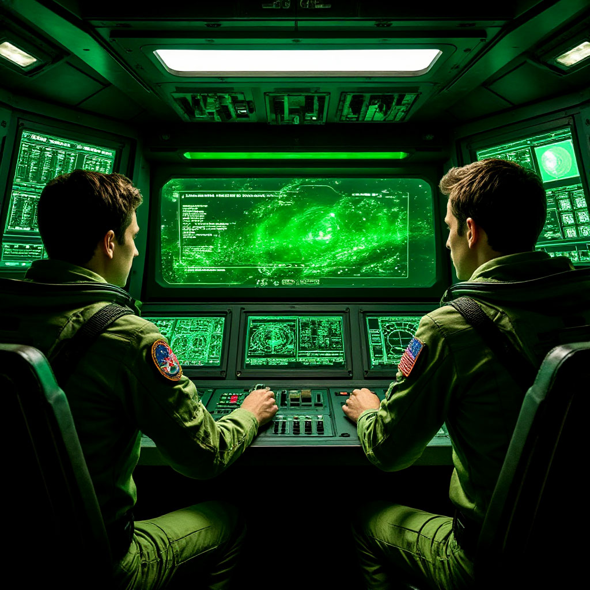

Первым пришло ощущение.

Острое, щемящее, сладкое — оно подкатило к горлу, сдавило грудь, заставило сердце биться быстрее. Вдохновение. Чистое, как горный родник, и мощное, как удар током. Я вдохнул — и воздух на мостике показался мне нектаром. Каждая клеточка тела пела, каждая мышца желала действия. Страха не было. Был дикий, первобытный восторг бытия.

А потом пришла Музыка.

Она родилась где-то внутри головы, из ничего, и разлилась по сознанию, заполнив собой всё существо. Это была не мелодия в человеческом понимании. Это была симфония сфер, сплетённая из звона мириад хрустальных колокольчиков, пения невиданных птиц, вздохов далёких звёзд и глубокого, фундаментального гула самой материи. Она была бесконечно сложной и абсолютно простой одновременно. Она вселяла необъяснимый покой и в то же время — лихорадочную жажду действовать, творить, любить и жить.

Я открыл глаза.

Мостик был залит тем же ровным ярко-зелёным светом, что и всё снаружи. Операторы сидели за консолями, застыв. Кто-то закрыл глаза, кто-то смотрел в пустоту. Элизабет Эванс сидела неподвижно, и по её щеке медленно катилась слеза.

— Вы... слышите? — прошептала она, не оборачиваясь.

— Слышу, — ответил я, и голос мой прозвучал хрипло и незнакомо.

Рядом раздался голос Басова — непривычно приглушённый и лишённый обычной иронии:

— Капитан. Пси-атака? Воздействие на центры удовольствия?

— Не думаю, Алекс. Это не атака. Это... скорее приветствие. Или фон.

Я тряхнул головой, пытаясь вернуть себе хватку командира. Это было трудно — музыка звала раствориться в ней, забыть о долге, о корабле, обо всём.

Я сделал глубокий вдох, чтобы успокоиться и собраться с мыслями... И включил общий канал.

— Всем постам! Доложить состояние!

Голоса посыпались в эфир, и все без исключения были окрашены одними и теми же нотами изумлённого, почти детского восторга.

Первым отозвался Карма Сингх. Его обычно сдержанный, чуть насмешливый голос сейчас звенел, как у мальчишки:

— Капитан! Всё в норме, но я... э-э-э... чувствую себя лет на двадцать моложе, ей-богу! Голова ясная, руки не дрожат, хочется... работать хочется!

Следом — Мари Пастер, и в её голосе я с удивлением уловил ту же растерянную радость:

— Медотсек, Пастер. Физиологических нарушений нет. Пульс, давление — в норме. Но эмоциональный фон... у всех эйфория. Неконтролируемая. Люди плачут, смеются, обнимаются. Я... я тоже, капитан. Это очень странно. И... приятно.

Билли, как всегда, пытался держать себя в руках — сказывалась выучка разведчика:

— Я здесь, капитан. Эффект ослабевает, если сосредоточиться на задаче. Пробую стабилизироваться. Докладываю: нижние палубы в порядке, но люди... они в прострации.

И так — каждый пост, каждый отсек. Со всех концов корабля поступали одни и те же доклады: всё в порядке, всё работает, но люди... люди были в эйфории.

— Фиво, это капитан. Что у тебя?

— Капитан! Это же ситарка! — Голос нашего Барсика звенел, как колокольчик — в нём было столько восторга, что я невольно улыбнулся.

— Что ещё за ситарка?

— Это такая... Спасская дудочка! — Голос Фиво вибрировал от восторга. — На ней играют во время праздников! Очень красиво! Только... я никогда не слышал, чтобы она звучала ТАК! Это... это лучшая ситарка в моей жизни!

Я переглянулся с Басовым.

— Пытаюсь зафиксировать, — он уже колдовал над терминалом, запуская программу. — Тишина... На записи только наши голоса. Она не фиксируется приборами. Она... в нас.

Мы замолчали, прислушиваясь к неслышимому. Это был парадокс, от которого звенело в ушах.

— Хансен, — вызвал я командира «Теней». — У тебя там есть Фукасава, он композитор. Пусть запишет то, что слышит.

— Есть, капитан. — В динамике послышался приглушённый голос, дающий указания, а затем Хансен снова вышел на связь: — Фукасава уже за планшетом. Сейчас всё сделаем.

Через несколько минут раздался голос Фукасавы.

— Капитан, я записал. Получилось... ну, примерно то, что я слышу.

— Давай, Хидэюки, включай.

В динамиках зазвучала мелодия. Простая, красивая, с восточными интонациями. Она лилась плавно, убаюкивающе, в ней были и колокольчики, и переливы струнных.

— Очень красиво, — сказал я искренне. — Но это не то, что слышу я.

— И не то, что я, — отозвался Басов.

— И не то, что я, — подтвердила Элизабет, и в её голосе звучало изумление. — У меня совсем другая. Более... высокая. Как пение птиц, но не земных.

Мы переглянулись. Озарение пришло одновременно.

— Выходит, — медленно произнёс я, — мы все слышим разную музыку. У каждого она своя. Неповторимая.

— Как отпечаток пальца, — кивнул Басов. — Только звуковой. Индивидуальная симфония души.

— Красиво сказано, Алекс. Для протокола не годится, но красиво.

Мы смотрели друг на друга с блаженными улыбками на лицах, заслушавшись симфонией сознания, которое внезапно обрело своё материальное выражение, как вдруг в общем канале прозвучал напряжённый голос Билли:

— Капитан, у нас проблема на нижней палубе. Техник...

Он не договорил. Из динамика прорвался посторонний звук. Кто-то кричал. Не от восторга — от ярости.

— КАК ЭТО УБРАТЬ?! — голос был искажённый, почти нечеловеческий. — ВЫКЛЮЧИТЕ ЭТО! Я БОЛЬШЕ НЕ МОГУ!

За криком слышались удары, возня, чьи-то голоса.

— Техник Гарсиа, — голос Билли пробивался сквозь шум и крики в эфире. — У него... обратная реакция. Вместо эйфории — кошмар. Какофония в голове. Он в истерике, капитан. Бьётся о стены. Мы пытаемся его держать, но он в разнос.

— Есть ещё, — добавил Басов, пробегая по спискам вызовов. — Техник Духанина. Та же картина. Жалуется на «музыку ада».

— И третий, — вмешалась Пастер с медблока. — Санитар Ахмед Ндяй. Тоже паникует. У всех троих — агрессия, неприятие, попытки заглушить звук физическим воздействием.

Я нахмурился. Трое из нескольких сотен. Статистика ничтожная. Но что-то здесь было не так.

— Алекс, проверь их. Личные дела, контакты, перемещения за последние недели.

Басов работал молниеносно. Через несколько минут он поднял на меня глаза, и в них читалось то самое выражение, которое я видел каждый раз, когда он находил последнюю деталь пазла и ему открывалась вся картина целиком.

— Гарсиа и Духанина, капитан. Они были в списке подозреваемых после мятежа. Первичная проверка их не выявила, но сейчас, с учётом новых данных... они оба пересекались с людьми Сильвестра. Неоднократно. В малых группах, в неформальной обстановке.

— Значит, и третий?

— Не обязательно, — Басов покачал головой. — Ндяй чист по контактам. Возможно, это просто... индикатор. Лакмусовая бумажка. Музыка обнажает суть.

— Индикатор порядочности? — горько усмехнулся я. — Звучит как название дешёвого романа.

— Тем не менее, — Басов пожал плечами. — Как ни крути, а картина складывается именно такая.

К концу часа обнаружились ещё двое. Всего пятеро. Люди, у которых вместо симфонии в голове звучала какофония. Два человека, чьи контакты с бывшими мятежниками теперь, при повторной проверке, вылезли наружу, как шрамы. И ещё трое, абсолютно чистых. Никаких контактов с заговорщиками, никаких подозрений. Только какофония. Индикатор порядочности сработал и на них — показал, что с этими троими что-то не так. А может, и всё не так.

Я распорядился изолировать их до завершения расследования. Никакой агрессии, никакого насилия — только временное отделение от остальных.

— Есть, — отозвался Билли. — Сделаем.

Но история не закончилась. Обнаружилась ещё одна группа — около двадцати человек по всему кораблю, которые не слышали ничего. Ни восхитительных мелодий, ни ужасающих. Просто тишина.

— Пограничный случай, — предположила Мари Пастер. — Их поведение ситуативно: они могут стать как лучше, так и хуже, впитывая нормы той группы, в которой находятся. Если основной экипаж «Арго» — это люди, слышащие райские колокольчики и думающие об общем благе, то и эти со временем начнут копировать их поведение. Тяготеть к большинству. Эффект социального окружения.

— То есть лечить средой?

— Именно, капитан. Не изоляцией, не наказанием. А примером.

— Хорошо, Мари. Составим списки. Будем вести наблюдение. Пусть слушают свою тишину. И смотрят на тех, кто слышит музыку. Посмотрим, что из этого выйдет.

Я отключил связь и поймал себя на мысли, что мы уже полчаса обсуждаем психологию, пока корабль висит неизвестно где. Я постарался сосредоточиться, заставив себя отвлечься от внутренней симфонии.

— Ладно, — я перевёл взгляд на Басова. Он, похоже, явно ждал этого момента. — Восторги восторгами, Алекс, но где мы?

— Квазипространство, — кивнул Басов с довольным видом.

— Чего?

— Квазипространство, — повторил он с удовольствием человека, только что придумавшего новый термин. — От латинского «quasi» — «вроде» или «почти». Потому что это, знаете ли, не совсем гипер. Хотя очень на него похоже. Как кофе без кофеина — вроде кофе, а вроде и нет.

Я невольно усмехнулся. Басов в своём репертуаре — даже перед лицом неизведанного он находил место для иронии.

— Капитан, — он смотрел на меня с видом первооткрывателя, — утверждаю термин «квазипространство» для служебного пользования. Возражения?

— Ты штурман, тебе виднее, как это называется, — ответил я. — Только не знал, что ты латынью увлекаешься.

Басов сделал паузу, явно наслаждаясь моментом, и с невозмутимым видом произнёс:

— Капитан, любой незнакомый термин придаёт вес отчётам. А латынь... — в его глазах мелькнул довольный огонёк, — латынь для этого идеально подходит. Вы же знаете старую истину: вставляешь в рапорт название «квазипространство» — начальство кивает, думает, что мы знаем, о чём говорим. Это половина успеха в нашем деле.

Я переглянулся с Элизабет. Та только ещё шире заулыбалась.

— Ладно, Алекс, — кивнул я. — Квазипространство так квазипространство. Что показывают приборы?

Он вывел на экран карту.

— Звёзд здесь нет. Вообще. Ни одной. Пустота. Но... — он увеличил масштаб, и на карте вспыхнули точки. — Радар показывает кое-что другое.

Перед нами возникла схема. В центре — наша метка и портал, через который мы вошли. А вокруг, на разном удалении, горели пятнадцать чётких пульсирующих точек. Они мерцали ровным алым светом.

— Шестнадцать объектов, — Басов ткнул пальцем в ближайшую. — Излучение — в алом спектре. Точное совпадение со свечением гиперпространственного перехода. С вероятностью девяносто девять процентов — это выходы. Обратные порталы в гиперпространство.

— Значит, мы не в ловушке, — выдохнул я. — У нас есть пути назад.

— Есть. Шестнадцать путей. Но вот этот...

Он уменьшил масштаб и переместил обзор правее. В стороне от основного скопления, значительно дальше от нашей позиции, горела семнадцатая точка. Она была вдвое крупнее остальных. И её свечение было иным — сложным, пёстрым, оно переливалось множеством оттенков, словно внутри неё пульсировала целая вселенная.

— Этот — другой, — тихо сказал Басов. — Совсем другой.

Где-то внутри начал разгораться тёплый огонёк надежды. Мы были не в ловушке. Мы были в узле. В месте, где сходились пути. Семнадцать дорог. Шестнадцать — назад. И одна — неизвестно куда.

— А следы Эскадрона? — спросил я, уже почти веря в чудо. — База? Корабли? Хоть что-нибудь?

Басов покачал головой, и искра надежды начала стремительно угасать.

— Ничего, капитан. Кроме этих аномалий и фонового зелёного излучения — абсолютная пустота. Ни обломков, ни сигналов, ни следов работы двигателей. Ничего.

В этот момент в общем канале раздался голос Волкова. В нём не было эйфории — только озадаченность, граничащая с тревогой.

— «Арго», это «Сокрушительный»! О каких порталах вы говорите? У нас экран радара залит зелёным шумом! Никаких целей, ничего! Или у нас полный сбой навигационных систем, или...

На мгновение я замер, переваривая услышанное. Что-то здесь было не так. Но что именно?

— «Дымящийся», подтвердите!

Голос Лизы Чен был спокоен, но в нём явно слышалось напряжение:

— Подтверждаю, капитан. Наши сенсоры слепы. Только однородный фон. Ни единого сигнала.

— Фиво! «Заяц», что у тебя?

Пауза. Потом вздох и бодрый, но сдавленный ответ:

— Всё зелёное, капитан! Красиво, конечно, музыка... но лететь некуда. Целей нет.

Прозрение наступило мгновенно, жестокое и неумолимое.

Я медленно повернулся к Басову. Наши взгляды встретились, и в его глазах я увидел то же самое понимание.

— Алекс... — начал я, и даже голос прозвучал как-то хрипло. — Радары «Арго»... это же технология Предтечей.

Басов едва заметно кивнул. В нём чувствовалось напряжение — то самое, когда ответ уже висит в воздухе, и осталось только сложить слова в предложения.

— А у «Клинков» Чёрного Эскадрона... чисто спассийские. Как на «Зайце».

Он терпеливо ждал, пока я закончу. Но я не мог. Слова застряли в горле. Он произнёс их за меня, тихо и чётко, как приговор:

— Если Эскадрон нырнул сюда на своих «Клинках»... они ослепли. Они не видят эти выходы. Они видят только зелёную пустоту.

Тишина на мостике стала абсолютной. Даже внутренняя симфония на мгновение стихла, заглушённая грохотом этой мысли.

...

Тишину нарушила Элизабет. Её голос прозвучал робко, но в нём чувствовалось желание найти спасительную лазейку:

— Капитан... а если они просто... ну, смотрели на аномалию и летели к ней? Визуально. Они же могли нырнуть назад? Не обязательно было оставаться здесь, если они видели портал своими глазами.

Басов посмотрел на неё с неподдельным уважением.

— Хорошая мысль, Элизабет. Давай проверим, — поддержал я. — Выведи визуальную картинку на главный экран.

— А если электроника тоже врёт? — подал голос Басов. — Сигнал с камер может подвергаться тем же искажениям, что и радары.

— Логично!

Я нажал кнопку коммуникатора.

— Билли, ты нас слышишь?

— Я здесь, капитан! — донёсся голос Билли.

— Иди к ближайшему иллюминатору, откуда видна аномалия. Видишь наш входной портал? Тот, через который мы только что вошли?

Несколько секунд в эфире висела тишина, а затем раздался голос Билли.

— Вижу, капитан! Алый! Прямо как гипер! Висит сзади и слева от нас. Вижу чётко.

— Отлично. Сейчас ты будешь нашими глазами. Мы будем медленно двигаться к нему. А ты корректируй курс. Чисто визуально. Смотри на портал и говори, куда рулить. Понял?

— Понял! Рулю!

«Арго» дрогнул и плавно тронулся с места. Я не отрывал глаз от тактического экрана, где наша метка и метка портала были чётко видны — чёрная и алая, на небольшом расстоянии друг от друга.

— Курс... так, чуть левее... теперь прямо на него... — командовал Билли в микрофон. — Ещё немного... прямо, прямо...

На экране происходило нечто невозможное.

Наша метка не приближалась к цели. Она удалялась!

Чем увереннее Билли правил «прямо на портал», чем чётче он видел его своими глазами, тем быстрее мы отходили в сторону. Расстояние росло. Цель уплывала влево, хотя Билли клялся, что мы идём точно на неё.

— Стоп! — скомандовал я. — Остановить ход. Алекс, что происходит?

Александр уже анализировал нашу траекторию, а лицо его было сосредоточенным. Было видно, как в его голове складывается новая картина реальности.

— Визуальное восприятие пространства здесь... иллюзорно. Оно не просто искажено. Оно ложно. Глаза обманывают. Чтобы попасть в точку А, нельзя смотреть на точку А и двигаться к ней. Ты промахнёшься. Нужен другой алгоритм.

— Данные радара «Арго», — понял я. — Они дают истинную картину?

— Скорее всего да. Надо проверять.

Я посмотрел на главный экран, где алый портал, висящий, казалось бы, в прямой видимости, тонул во всепроникающем зелёном сиянии. И вспомнил старую земную книжку.

— Как в детской сказке. Помнишь, Алекс? Где дорога, по которой идёшь, приводит совсем не туда, куда смотришь.

— Точнее не скажешь, — согласился Басов. — С той лишь разницей, что у нас, к счастью, есть карта. Попробуем двигаться по данным радара?

— Да, пробуем. Веди нас, Алекс.

Басов взял управление на себя. Он игнорировал визуальную картинку, смотрел только на экран с координатами и вёл корабль, ориентируясь исключительно на цифры.

Движение было странным. Визуально казалось, что мы делаем зигзаги, петли, временные отдаления. «Арго» то уходил в сторону, то закладывал вираж, то, казалось, пятился назад. Билли сообщал, что алый портал то приближается, то отдаляется, то вообще исчезает из виду. Мы видели ту же картину на главном экране. Но на радаре наша метка неумолимо ползла к цели.

Через пятнадцать минут мы висели в паре километров от алого пульсирующего разрыва. Нашего окна обратно в гиперпространство. Достаточно близко, чтобы рассмотреть его в деталях — идеально ровный круг, который светился тем самым алым, знакомым до боли светом. За ним угадывалась ткань гиперпространства.

Дверь была рядом. Вот она — только протяни руку и, кажется, коснёшься пальцами алого сияния. Однако видимость здесь ничего не решала. Как только что доказал Билли, смотреть на неё — верный способ промахнуться.

Наступила тишина. Даже внутренняя музыка казалась теперь похоронным маршем.

Басов медленно повернулся ко мне. В его глазах не было вопроса. Был приговор.

— Теперь понятно, что случилось с Эскадроном, — его голос звучал как голос компьютера, зачитывающего некролог. — Они вошли. Поняли, что приборы не работают. Увидели портал. Попытались вернуться, ориентируясь визуально. И... отдалились. Чем усерднее они пытались, тем дальше уходили.

Он сделал паузу, собираясь с мыслями. Или с силами.

— А через трое суток портал закрылся. Они остались здесь. В зелёной пустоте. Слепые. Без ориентиров. Скорее всего, они метались, пытались лететь «вперёд» или «назад», теряя последние следы исходной точки...

Он замолчал, не в силах договорить.

Я договорил за него, и каждое слово обжигало губы:

— И теперь они дрейфуют где-то здесь. Навсегда. Мы нашли ответ, Алекс. Мы узнали правду об их исчезновении. Это зелёное море стало их последним пристанищем... Их братской могилой.

Горькая пилюля. Она встала комом в горле. Весь наш путь — от заброшенной планеты Мур-муров до яростной схватки с Умга, от интриг Сильвестра до ликования экипажа, от лекций Фиво о храбрости до этого зелёного порога — всё упёрлось в стену этой немой, прекрасной и безжалостной зелёной бездны.

Мы пришли за силой. За легендарным эскадроном. За союзниками.

А нашли эпитафию.

Несколько минут мы стояли поражённые, не в силах вымолвить ни слова. Даже Элизабет молчала, вцепившись в подлокотники, и по её щеке снова катилась слеза — и теперь уже не от восторга.

— Что прикажете делать, капитан? — Басов вернул меня в реальность. Его тон был почти сочувствующим. — Начинаем обследование аномалий? Я предлагаю начать с крупной цели. Семнадцатая точка. Она уникальна. Все остальные, скорее всего, просто выходы в гипер. А эта — может быть чем-то другим. Вратами куда-то. Или... чем-то ещё, чего мы не понимаем.

Я смотрел на экран, на семнадцатую, мерцающую разными цветами точку. Разум кричал: «Да! Исследовать! Двигаться! Это логично! Мы пришли за ответами — так вперёд!»

Но что-то внутри, что-то упрямее разума, восстало. Ярость. Горечь. Нежелание принимать этот приговор.

— Нет! — вырвалось у меня. — Я не могу так просто сдаться! Не могу принять, что они все погибли, а мы просто... как ни в чём не бывало пойдём дальше!

Я провёл рукой по лицу, чувствуя, как дрожат пальцы.

— Мне надо подумать. Алекс, ты за старшего. Я... я скоро вернусь.

И я вышел с мостика, оставив за спиной тишину и шестнадцать алых дверей домой.

...

Ноги сами несли меня по коридорам.

Я просто шёл, не выбирая дороги. Погружённый в свои мысли, перебирая варианты, отбрасывая их один за другим и снова возвращаясь к исходной точке. Музыка в голове звучала, но теперь она казалась насмешкой. Симфония для обречённых.

Мы не могли вернуться. Не сейчас. Не после всего. Сказать Хейсу: «Мы нашли, где пропал Эскадрон. Они ослепли и умерли. Всё. Конец миссии»? Нет. Это было бы предательством. Предательством надежды, предательством долга, предательством всего, ради чего мы сюда летели.

Но что мы могли сделать? Искать их вслепую в бескрайней зелёной пустоте? У нас не было их курсов, не было их последних координат. Только шестнадцать алых дверей и одна пёстрая, манящая неизвестность.

Я остановился.

Вокруг было тихо. Только гул двигателей и та самая, внутренняя музыка. Я поднял голову и прочитал табличку на переборке:

СЕКТОР G-7. ДОСТУП ОГРАНИЧЕН.

Я не планировал сюда приходить. Ноги принесли сами. Туда, где в переоборудованном санузле сидели те, кто хотел моей смерти. Малинин. Сильвестр. И их подручные.

Я замер на мгновение, прислушиваясь к себе. Может быть, подсознательно я надеялся, что они, с их циничным умом, увидят то, чего не вижу я? Какую-то деталь, закономерность, ключ...

Я усмехнулся. Глупо, конечно. Но терять всё равно было нечего.

Охрана у дверей вытянулась при моём появлении. Я махнул рукой — не надо церемоний.

— Как они? — спросил я, кивнув на дверь.

Дежурный — сержант с усталыми глазами — козырнул и доложил без лишних эмоций:

— Психуют, капитан. Особенно после того, как это началось. — Он постучал пальцем по виску. — Требуют, чтобы убрали ЭТО из головы. Орут, стучат. Некоторые уже охрипли.

— Все так себя ведут?

— Не все, сэр. — Сержант помедлил. — Двое ведут себя иначе.

Я поднял бровь.

— Кто именно?

— Капитан фон дер Кампф. — Сержант невольно понизил голос. — Он... рычит, сэр. Как зверь. Глаза безумные, мечется по камере. Когда кто-то из нас проходит мимо, бросается на дверь как одержимый. Нам немного не по себе. Прикажете вмешаться?

Я покачал головой. Одержимый Сильвестр? Ледяной, расчётливый аристократ, который всегда всё контролировал, — сейчас рычал и кидался на людей. Значит, его драгоценный интеллект не справляется с тем, что звучит в его голове?

— А второй? — спросил я. — Малинин?

Сержант только молча кивнул.

— Он... не такой, сэр. Сидит тихо. Голову опустил, обхватил руками — и молчит. Даже когда другие орут, он не поднимает глаз. Такое ощущение... — сержант замялся, подбирая слово, — будто он просто подавлен, сэр.

Я молчал, переваривая услышанное. Малинин, вечный борец за устав, за порядок, за букву закона, — сидит тихо, обхватив голову?

Я подошёл к двери, за которой была камера Малинина.

— Откройте, — сказал я. — Мне нужно поговорить с заключённым.

Охранник замешкался:

— Капитан, это небезопасно...

— Я знаю, — перебил я. — Открывайте.

Дверь с шипением отъехала в сторону. И я шагнул внутрь.

Он сидел на краю койки, спиной к стене, в той самой позе, которую описал сержант. Голова опущена, плечи ссутулены. Прозрачная дверь закрылась с тихим шипением, отрезая гул коридора, но он даже не пошевелился.

В камере было тихо. Только ровный, едва слышный гул систем корабля — и это зелёное свечение, которое теперь, кажется, проникало даже сюда.

— Здравствуй, Александр, — сказал я тихо.

Он медленно поднял голову. Взгляд... такого взгляда я у него не видел никогда. Пустой, бесконечно уставший. Словно из него вынули стержень, вокруг которого когда-то накручивались все его принципы, амбиции и претензии.

— А-а-а, капитан... — голос его звучал хрипло, обречённо. — Пришли прочитать мораль? Или объявить приговор?

Я прислонился к косяку и просто смотрел на него... И вдруг понял, что злости нет. Совсем. Была только усталость, какое-то горькое любопытство и даже жалость к этому сломленному человеку.

— Приговор вынесет трибунал на станции, — ответил я. — Я пришёл поговорить. Как человек с человеком.

Но он просто молчал, глядя вниз.

— Зачем, Александр? — спросил я. — Ты же вроде неплохой человек. Педант, зануда, каких поискать, но не подлец. Зачем тебе это всё? Захват корабля, аресты, покушение на Билли... на меня?

— Я только хотел навести порядок... — Голос его дрогнул.

— Порядок, — повторил я. — Ты на «Арго» человек новый. Пришёл с «Последнего Рубежа» на смену Морисону. Увидел корабль, который, на твой взгляд, болтался без руля. И решил навести свой порядок.

Я сделал паузу. Он поднял глаза, и в них мелькнуло что-то похожее на недоумение.

— Но вот чего ты, Александр, скорее всего, не знаешь. Место капитана изначально готовили не для меня. Его готовили для Сильвестра фон дер Кампфа. Он был командиром «Сокрушительного». Но его сняли. За циничный расчёт, за готовность платить любую цену — чужими жизнями. Понизили до третьего помощника на «Арго». И в его душе поселилась месть. Всем. И в первую очередь — тому, кто занял его кресло. Мне.

Малинин смотрел на меня, и я видел, как в его голове куски этой разрозненной головоломки пытаются сложиться в единую картину.

— Он и тебя использовал, — сказал я негромко. — Как отмычку. Изучил тебя, твой формализм, веру в устав. И начал мягко давить на болевые точки. Превратил твою принципиальность в оружие против меня. Ты стал главным действующим лицом. Бунт праведного педанта.

— Он... — Малинин сглотнул, его голос сел. — Он говорил о долге, о порядке... О том, что вы ведёте корабль к гибели.

— И ты поверил, — кивнул я. — Потому что хотел верить. Это льстило тебе. Быть спасителем «Арго»... Но задайся вопросом, Александр: долго бы ты пробыл главным? Ты был и. о. командира. Он — и. о. старпома. Один шаг. Думаешь, он стал бы его откладывать?

Я смотрел, как до него начинает доходить. Это было похоже на то, как трещина ползёт по льду — медленно, но неотвратимо.

— В лучшем случае — кома в лазарете, как у Билли. В худшем... — я кивнул туда, где за толщей металла простирался открытый космос. — Роль ледяной глыбы, которая вечно дрейфовала бы в системе Беты Геркулеса. Ты был расходником, Александр. Разменной монетой в чужой игре.

Он молчал, но я видел, как его лицо медленно каменеет. Пальцы, лежавшие на коленях, сжались в кулаки.

— Хочешь увидеть, как он «ценит» тех, кто стоит у него на пути?

Я достал планшет, нашёл запись. Ту самую, что мы получили перед взрывом челнока. Голос Сильвестра заполнил камеру — холодный, ядовитый, с тем ледяным презрением, которое я успел подзабыть за последние недели.

«Баг в системе... Мокрая лужица... Вы самое слабое звено, прощайте...»

Я смотрел на Малинина. По его лицу прошла судорога. Сначала он просто слушал, потом его руки, сжимавшие планшет, задрожали. К концу записи его лицо стало пепельно-серым.

Голос Сильвестра смолк, и на несколько секунд в камере воцарилась мёртвая тишина.

Малинин медленно поднял на меня глаза. В них был ужас. Не страх наказания — ужас осознания. Ужас человека, который вдруг понял, что всё, во что он верил, все его праведные порывы были лишь чужими марионеточными нитями.

— Я... — голос его сорвался. — Я не знал про взрыв челнока... Сильвестр сказал, что предусмотрел там запас провизии на два месяца. Что после того, как мы наведём порядок, мы вернёмся за вами. А потом... а потом я уже увяз в этом по уши...

Планшет выпал из его рук и с металлическим звоном ударился о пол. Он схватился за голову, и я увидел, как его тело содрогнулось в беззвучном, сухом рыдании.

Я молча поднял планшет и смахнул пыль.

— Лично я, Александр, на тебя зла не держу, — сказал я устало. — Ты был слепым орудием. Опасным, но всего лишь орудием... Держать зло на молоток, которым тебе пытались проломить голову, — глупо. Ответственность несёт тот, кто держит этот молоток.

Он не поднимал головы, только плечи его вздрагивали.

— Но за свои поступки отвечать придётся, — продолжил я. — Мятеж, лишение свободы, соучастие в покушении... По возвращении — трибунал. Скорее всего — бессрочное заключение на станции.

Он кивнул, не в силах говорить. Кивнул, словно принимал не только приговор, но и всю тяжесть того, что успел осознать за эти несколько минут.

Смотреть на этого сломленного человека было невыносимо. Но и помочь я ему не мог. Пора было возвращаться. Я уже хотел уйти, когда Малинин вдруг спросил:

— Капитан, что это за тихая дудочка, которая постоянно играет тоскливую мелодию?

— Это голос твоей души, Александр.

Я вспомнил Сильвестра. Как он неистово зарычал, когда я посмотрел на него. Вероятно, там унылой дудочкой и не пахнет. Даже страшно представить, какие медные трубы играют похоронный марш во всю свою мощь. Хотя кто, кроме него самого, может знать, какая адская мелодия звучит в его голове?

Я шагнул к двери, но на пороге обернулся.

— Я рад, что смог с тобой поговорить, Александр. И что ты увидел, во что превратился в чужих руках. И что... — я сделал паузу, подбирая слово. — Что раскаялся. Значит, не всё убила твоя вера в параграфы. Значит, разговор был не зря.

Я взялся за ручку.

— Капитан... — донеслось из-за спины. Голос хриплый, сдавленный, но в нём прорезалось что-то, чего не было в начале разговора.

Я оглянулся.

Малинин поднял голову. Глаза его были опухшими, но в них уже не было той пустоты, с которой он встретил меня. Там горело что-то другое. Может быть, последняя искра того самого человеческого, что я пытался разглядеть в нём всё это время.

— Не сдавайся, — сказал он. — Я вижу, что-то не так. Вижу, у тебя проблемы. Не сдавайся, капитан. Иди до конца.

Я смотрел на него несколько секунд. А потом просто кивнул. Молча. Без слов.

И вышел.

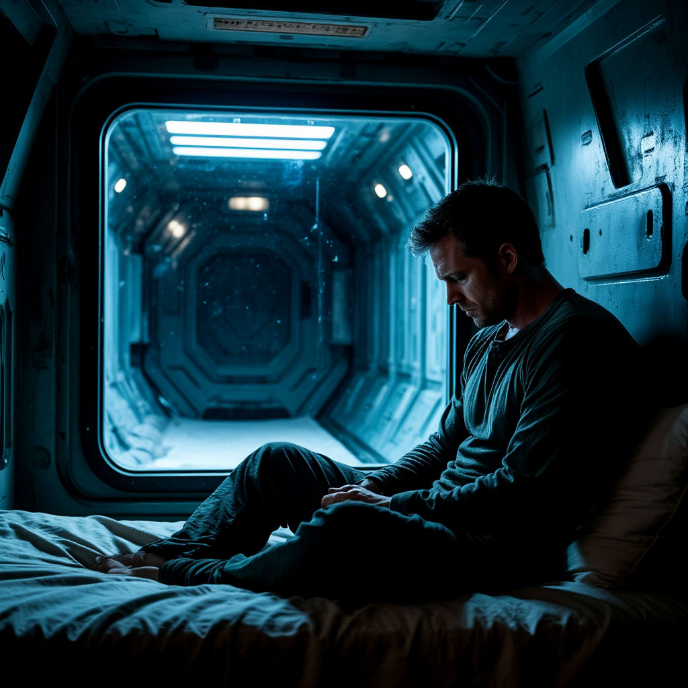

------------

---

#### продолжение следует...

---

Специально для Александра М., который так отчаянно рвался заняться обратной вычиткой:

https://github.com/bazhenov-ai/lib/blob/main/bss/backwards_proofreading.txt

А это программа, которая позволит ему потом самому переводить актуальные версии книги в понятный ему формат:

Shell скрипт: https://github.com/bazhenov-ai/lib/blob/main/bss/backwards_proofreading.sh

Питон вариан: https://github.com/bazhenov-ai/lib/blob/main/bss/backwards_proofreading.py

---

### Баженов А.И.
#### https://github.com/bazhenov-ai/lib

#### CC0-1.0 license - public domain (общественное достояние)
