# B.S.S.

## Оглавление
- [Глава первая. Мур-муры](#глава-первая-мур-муры)
- [Глава вторая. Ценный груз с запахом](#глава-вторая-ценный-груз-с-запахом)
- [Глава третья. Предел прочности](#глава-третья-предел-прочности)
- [Глава четвёртая. Незапланированно-контролируемое отделение](#глава-четвёртая-незапланированно-контролируемое-отделение)
- [Глава пятая. Холодная война за горячую воду](#глава-пятая-холодная-война-за-горячую-воду)
- [Глава шестая. Стихотворный десант](#глава-шестая-стихотворный-десант)
- [Глава седьмая. Легионер в космосе](#глава-седьмая-легионер-в-космосе)
- [Глава восьмая. Две тени за спиной капитана](#глава-восьмая-две-тени-за-спиной-капитана)
- [Глава девятая. Жребий брошен, или Рубикон длиной в коридор](#глава-девятая-жребий-брошен-или-рубикон-длиной-в-коридор)
- [Глава десятая. Цирк уехал, клоуны остались](#глава-десятая-цирк-уехал-клоуны-остались)

---

## Глава первая. Мур-муры

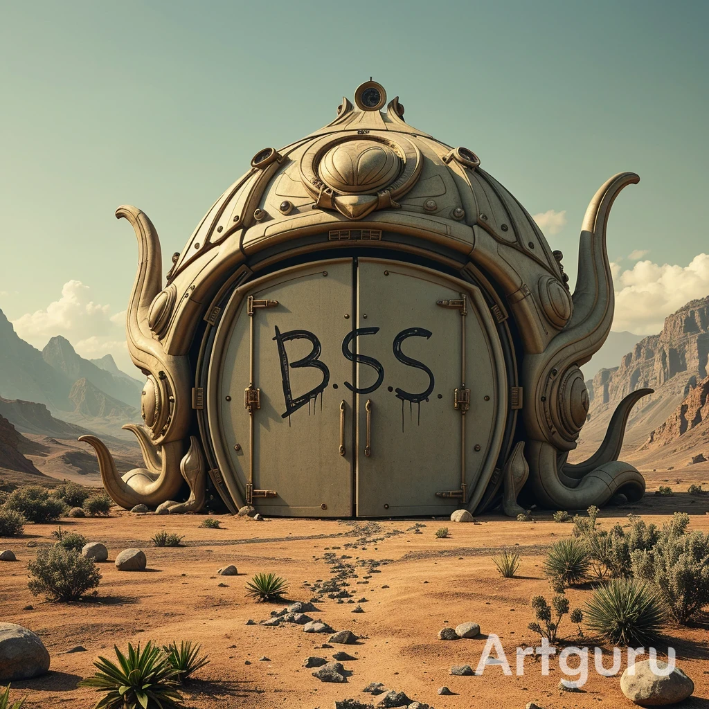

Коммуникатор запищал и выдал сообщение:

— Капитан, на поверхности тихо и спокойно. Никаких следов активности. Если это и был когда-то домашний мир Ммрнмхрм, то теперь он больше похож на свалку металлолома. Только сломанные запчасти наших Мур-муров, песок, пыль, запустение.

Я сел в кресло и завис, уставившись на экран коммуникатора. «Куда подевались эти Мур-муры?» — пронеслось в голове.

Мур-мурами земляне издавна называли Ммрнмхрм. Как ответил когда-то мой командир, когда я сам ещё был курсантом, на вопрос: «почему Ммрнмхрм называют Мур-мурами?»
— Ммрнмхрм говорить — язык сломаешь! — ответил он. — А почему именно «Мур-мурами», уже наверное никто и не вспомнит. Вероятно, надо было придумать что-то созвучное и легко произносимое.

Короче, Мур-муров нет, и куда делись — непонятно, — подумал я и снова нажал кнопку коммуникатора.

— Билли, больше ничего интересного не нашли?
— Ну как сказать, капитан. Нашли их материнский ковчег. Но особо интересным это наверное не назовёшь, потому что он сломан. Его массивные двери заблокированы. Внутри никаких признаков активности. Ни звуков, ни шорохов. Вот только на главных створках нацарапаны английские буквы с точками: B.S.S. и всё.
— Что ещё за B.S.S.? Black SS? Негры-эсэсовцы, что ли?!
— Вам виднее, капитан. Может, и негры-эсэсовцы, — в селекторе послышались тихие смешки и едва различимый шёпот лейтенанта Билли: — Тихо, парни, тш-ш-ш!
— Ладно, Билли. Возвращайтесь. Отбой.

Остаток дня я крутил эту аббревиатуру в уме так и эдак...
Bad Signal Syndrome — Плохой Сигнальный Синдром?
Busy Sleeping Students — Занятые Спящие Студенты?
Bearded Scientists Society — Общество Бородатых Ученых?
Bigger Snack Strategy — Стратегия Большого Перекуса?
— Так, хватит! — сказал я себе, вконец измучившись. — На перекусах и остановимся. Давно пора перекусить.

...

Следующие несколько дней мы провели в гипере. Улов был неплохим, и мы возвращались домой, чтобы пополнить запасы и немного перевести дух.

И вот уже Солнце вырастает на радарах корабля, и вот Земля с её до сих пор непривычным красным сиянием, и станция — наш «Последний Рубеж сопротивления» и в то же время «Новая колыбель Альянса Свободных Звёзд». И как всегда спокойный голос Хейса: «С возвращением, капитан!» — и наше стандартное: «Командор, у меня трюмы полны минералов!» — и едва заметная улыбка в уголках глаз Хейса: «А другого я от вас и не ждал, капитан!»

...

Разгрузили нас довольно быстро. Ещё немного подлатают, заправят... Хейс сказал, что за время нашего отсутствия был построен ещё один земной крейсер, и это хорошо. Дополнительная огневая мощь нам явно не помешает. С каждым разом мы забираемся всё дальше и дальше в гипер. Старых союзников найти не получается. Времени проходит всё больше, а жить становится всё страшнее... Надо будет в следующий раз поискать в другом направлении. Не могли же все провалиться сквозь землю. Может, Шофиксти или Йехаты живы и согласятся примкнуть к нашей борьбе.

Брякнул сигнал входной двери. — Сим-сим, откройся, — сказал я, и дверь быстро скользнула в сторону. В проёме стоял Хейс с поднятыми вверх руками. В одной он держал заварник, в другой — две кружки. И эта едва уловимая улыбка в уголках глаз, которую почему-то никто не видит.

— Салют, дружище! Ни за что не угадаешь, что я тебе сегодня принёс! — радостно воскликнул Хейс.
— Дай догадаюсь, зелёный чай?
— Зелёный чай, — лицо Хейса вдруг тронула тень удивления. — А ты откуда знаешь?
— Да встретил тут твоего подчинённого, которого ты «раскулачил».

Хейс сел напротив, налил чай и протянул одну чашку мне.

— Ну, ты скажешь тоже — «раскулачил»! Давай, рассказывай, что нового удалось обнаружить?
— Да вот удалось обнаружить, что ты всегда хитро, но очень по-доброму улыбаешься краешком глаз. Но удалось обнаружить это только мне, а другим это почему-то обнаружить не удаётся. Не знаешь почему?

Хейс захохотал: — Да они просто не на то смотрят. Они смотрят в глаза, а ты — внутрь. Может, поэтому я тебе тогда и поверил, при первой нашей встрече. Поверил, что если кто и сможет собрать новый альянс и поставить Ур-Куанов на их эквиваленты коленей, как ты остроумно тогда выразился, то только ты. — Хейс скинул обувь, а на мой вопросительный взгляд добавил: — Затекают. Ты же не против?

— Да на здоровье! Нам нужно, чтобы всё было в максимально рабочем состоянии. И станция, и пушки, и ноги.
— Ну так что вам удалось найти? — вернул наш разговор в конструктивное русло Хейс.
— Извини, друг, не хочется тебя расстраивать, но похвастаться особо нечем. Сначала мы двинули к Ченджесу, по тем координатам, которые ты дал. Ну ты нас и отправил в муравейник, я тебе скажу! Вернее, в паучятник. Ильрафы на каждом шагу. Хорошо, что они тихоходные, но пару раз всё равно не получилось уйти, и пришлось принимать бой. Ты же пробоины на нашем корабле видел? Те, что в виде художественного орнамента на левом борту?
— Видел, — он на мгновение погрузился в свои мысли.

Я глотнул чаю, чтобы немного смочить горло. — А чай очень даже ничего!

Хейс улыбнулся: — При нашем скудном рационе любое разнообразие — праздник. — Он откинулся на спинку кресла. Было видно, что напряжение, которое постоянно держит его в тонусе, начало немного отступать. Всё-таки тысячи людей в подчинении, и всем ты за отца и мать. Хейс — на станции, я — на корабле. Может, поэтому мы и смогли так быстро найти общий язык и сдружиться. — Да ты рассказывай, не томи, — решил поторопить мои мысли Хейс.

— А что рассказывать? Ну, дошли мы до Проциона. Нашли такой же рабский щит, как на Земле, только в отличие от нас у них ещё и станция не работает. Полностью в автоматическом режиме. Пришлось лететь дальше.
— К Мур-мурам? — Хейс улыбнулся так, будто это он сам когда-то придумал им это прозвище. — Там рядом.
— К ним, — там и правда было недалеко, поэтому ачивку «Провидец» я Хейсу не засчитал. — Рабского щита нет, — продолжил я. — Спустились. Там сломанные запчасти Мур-муров, материнский ковчег, похоже, тоже сломан. На главном входе какие-то негры свои инициалы нацарапали.
— Какие негры? — удивился Хейс.
— А я откуда знаю, какие? Эсэсовцы какие-то. Я весь обратный полёт ломал голову, что бы это могло значить, но, как говорится, «ноу айдиэ».

У Хейса выражение лица становилось всё удивлённей и удивлённей. — А что конкретно там было написано?

— Три английские буквы с точками, аббревиатура «B.S.S.», — я потянулся за кружкой. Захотелось сделать пару глотков и тоже откинуться на спинку, как Хейс, и расслабиться.
— «B.S.S.»? — И в этот момент выражение лица Хейса вновь стало привычным: спокойным, уверенным, с его фирменной, едва уловимой улыбкой в уголках глаз, которую видел только я.
— Да. «B.S.S.».
— Black Spathi Squadron? Чёрный эскадрон Спасси?

Да-а-а-а! ДА! Да! Как я сам не догадался!? Ай да Хейс! Ай да молодчина!

Мгновенно перед моим взором пронеслись все открывающиеся перспективы! Извините, Шофиксти, извините, Йехаты. Но, кажется, вам придётся подождать.

После того как Спасси трусливо спрятались под рабским щитом, мы потеряли львиную долю своей мощи. Под рабским щитом им не нужны были их корабли, они их и не взяли. А обидней всего было то, что все корабли были в рабочем состоянии, но не было тех, кто поднимет их в небо. И если примитивную работу — принеси, подай — могли делать люди, то за пульт управления всё равно требовался Спасси. У нас был огромный флот Спасских «Зайцев», не было только самих «зайцев». Но, кажется, теперь мы можем получить огромный флот Спасских «Клинков»! Надо только найти этих негров-эсэсовцев.

— Не знаю, в какую дыру вы забрались, но я уже иду за вами!

------------

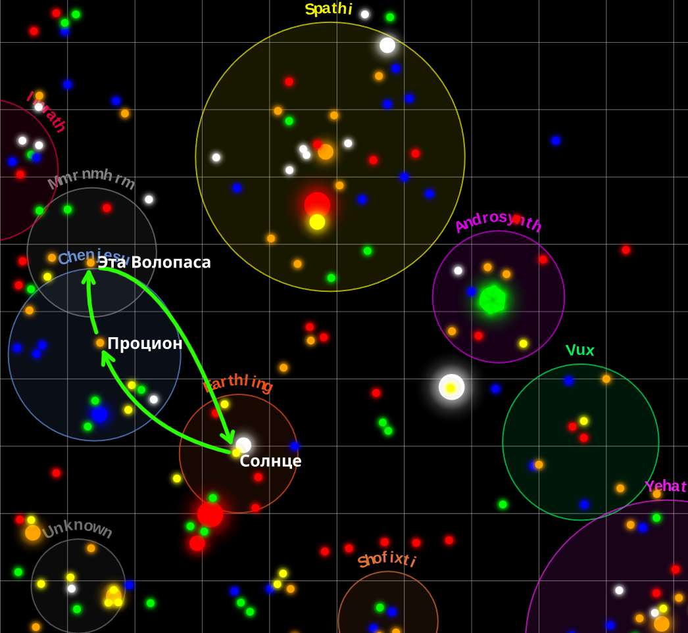

------------
------------
------------

## Глава вторая. Ценный груз с запахом

Коммуникатор запищал с таким надрывом, будто его лично оскорбили.
— Капитан, вы бы хоть пояснили, что мы ищем? — раздался голос Билли.

Ох, Билли, — мысленно вздохнул я. — Если бы у меня было хоть малейшее представление о том, что мы ищем... Ну, то есть, я, конечно, знал. В теории. Мы ищем Чёрный Эскадрон Спасси. Но вот незадача — мы уже были здесь, на луне их родного мира, и не увидели ровным счётом ничего, кроме всеобщего запустения. А было это ещё тогда, когда все Спасси дружно вспомнили, что забыли выключить дома утюг, и с позором рванули на родную планету, захлопнув за собой рабский щит — штуку настолько непробиваемую, что сквозь неё не пролезает даже дурная мысль, не то что корабль. И всё, что осталось нам, — это разводить руками и чесать затылок. «Если бы я знал, что мы ищем, — снова повторил я сам себе».

Билли, разумеется, ждал внятного ответа, а не моих философских терзаний.

— Билли, мы ищем зацепки, — сказал я, стараясь, чтобы голос звучал уверенно. — Поройтесь во всём, что выглядит хоть сколько-нибудь подозрительно. В компьютерных базах, в архивах, мусорных вёдрах, под половицами, если придётся. Ты же сам понимаешь, насколько это важно.
— Понимаю, капитан. Не переживайте, мы поищем. Заглянем в каждую щель, если понадобится. Отбой.

...

Коммуникатор умолк, оставив меня наедине с тягостным чувством безнадёжности. Ну сколько шансов, что они там что-то найдут? Мы же уже всё обшарили в прошлый раз. С другой стороны, больше никаких зацепок всё равно нет. Так что и выбора нет. Будем искать...

Билли был командиром разведки и руководил всеми нашими вылазками на планеты. У меня никогда не было нареканий к его работе. Он всё и всегда делал скрупулёзно, качественно и в срок. Если кто-то что-то там и сможет найти, то это Билли с его командой. «Будем искать...» — снова мысленно повторил я.

За минутами тянулись минуты. За часами — часы. Время шло, и ожидание становилось всё тягостнее. Ведь для чего нужен капитан на нашем корабле в момент исследовательской миссии на планете? Правильно! Ни для чего!

Корабль никуда не летит. Процессы все остановлены. Единственная движуха сейчас на планете, где всем мастерски заправляет Билли. Капитану же остаётся сидеть, бездельничать, ногой качать и дырки на скатерти изучать... Надо бы какого-нибудь котёнка завести, что ли. Для моральной поддержки. Да где его взять? Все котята под рабским щитом на Земле. И вроде в войне с Ур-Куанами не участвовали, а тоже оказались под арестом! «Преступники-рецидивисты, блин!» — подумал я и сам рассмеялся от этой нелепой аналогии. Кажется, я уже много раз про это упоминал в нашей кают-компании и, похоже, всех уже порядком утомил этими разговорами.

И тут, наконец-то, мои многочасовые мучения прервал сигнал коммуникатора. «А вот и Билли, — подумал я, и на лице сама собой расплылась улыбка. — Хороший он парень».

Я вдавил кнопку.

— Ну что там, Билли? Есть хорошие новости? — Я всё ещё лелеял слабую надежду, что мы хоть что-то найдём. Улетать с пустыми руками не хотелось категорически, ведь других версий, где искать этих чёрно-красных есаулов, у нас не было.
— Извините, капитан, но порадовать вас нечем, — в голосе Билли слышалась неподдельная досада. — Понятно, что мы не можем заглянуть в каждый дом, под каждый куст и в каждую норку местной фауны, но все самые важные точки мы прошерстили тщательнейшим образом. Космодромы, командный пункт, правительственные здания... Компьютеры, которые остались, распечатки, стикеры на стенах... Никаких следов Чёрного Эскадрона. Никаких упоминаний о нём.
— Вы сейчас где, Билли?
— Около гиперволнового передатчика, который мы в прошлый раз не смогли забрать. Вы же помните, мы тогда под завязку были забиты, даже в проходах ящики с минералами стояли, некуда было ставить эту громадину с трёхэтажный дом... — Билли выдержал паузу. Он частенько так делал, давая возможность сказать мне что-либо важное, но сейчас мне сказать было нечего. Надежды приобрести флот Спасских «Клинков» утекали, как вода сквозь пальцы.
— Ну так что, мы его грузим? Капитан?
— Да, Билли. Грузите. Вещь полезная, в хозяйстве пригодится. Отбой.

Голова опять включилась в работу. Снова настаёт моё время. Я должен решить, куда нам лететь и с какой целью. «Итак, — сказал я сам себе. — Кто может знать, где искать Эскадрон? Мелнормы? Возможно. Но, как известно, их информация стоит дороже, чем золотой унитаз командующего Ур-Куанов, так что пока отложим этот вариант. Кто-то из соседей Спасси? Умга? Возможно. Эти весельчаки-хохмачи сначала обрадуются тебе, как старому другу, потом по-дружески расскажут пару сотен неуместных шуток, а потом так же по-дружески поджарят твой зад из дезинтегратора. Боя с ними не избежать в любом случае. Радует одно — поболтать они любят, так что можно попытаться их разговорить. Что мы имеем в сухом остатке? Мелнормы с их оверпрайсом и Умга с дезинтегратором. Замечательные расценки в этом супермаркете, — рассмеялся я. — Прямо даже и не знаю, что выбрать?»

Но тут мои невесёлые размышления прервал сигнал ЭКСТРЕННОГО вызова. «А это что-то новенькое», — подумал я и нажал кнопку.

— Да, Билли? Что у вас стряслось?
— Капитан, мы тут вам котёнка нашли... — Билли выдержал паузу, достойную мхатовской сцены. — Ну чего молчишь? Говори! — сказал Билли куда-то в сторону.
— Привет, Капитан! Привет, мои самые лучшие друзья человреки!! — На меня смотрел огромный, знакомый до слёз зелёный глаз, в котором читалась смесь паники и надежды.
— Фвиффо, ты?!
— Я, капитан! Я!.. Как я рад, что вы снова прилетели спасти меня, и заботиться обо мне, и оберегать...
— Стоп, стоп, стоп, Фвиффо! Мы совсем не за этим сюда прилетели. — Фвиффо, казалось, выглядел расстроенным после таких слов, хотя как быть уверенным, что написано у него на лице, если и лица-то у него нет. Один большой глаз на всё лицо. — Билли, где вы его нашли?

Билли явно оживился.

— О, капитан, это самое интересное! Мы начали поднимать гиперволновой передатчик, чтобы загрузить его в челнок, а под ним — вход в бункер. Открываем, а там этот Барсик сидит. Перепуганный, чумазый, запах оттуда идёт, я вам скажу... Сильно, короче, он испугался. Не розами пахнет. Ну, вы поняли. И смотрит на нас сиротским глазом, явно с надеждой, что не запечатаем бункер снова. Прямо как осиротевший котёнок.

Я снова перевёл взгляд на Фвиффо.

— Слышишь, Фвиффо? Говорят, ты как бездомный котёнок.
— Мяу, капитан, — не растерялся Фвиффо.

«Ну, понятное дело, — подумал я. — Он сейчас готов хоть мяукать, хоть хвостом вилять, лишь бы его не оставили в этом пахучем убежище».

— Так, Билли, грузите передатчик, берите этого Барсика и возвращайтесь. Бункер обследовали?
— Так точно, Капитан. Там была пара компьютеров, мы их не успели изучить, но берём с собой. В остальном всё чисто. Больше ничего.
— Принял, Билли. Конец связи.

...

Люк челнока открылся с шипящим звуком, и в коридор повалил тот самый знаменитый «аромат» бункера вперемешку с запахом озона и раскаленного металла. И следом за ним, пугливо озираясь своим единственным глазом, трусливо выполз Фвиффо. Он замер посреди помещения, дрожа всеми щупальцами.

«Ну что ж, — вздохнул я. — Самое время выяснить, как этот «котёнок» умудрился загреметь под домашний арест с таким солидным замком». Я устало провёл рукой по лицу.

— Ну что, Фвиффо, пришло время ответить на главный вопрос. Как ты оказался в этом бункере? Только, ради бога, не начинай свою историю с большого взрыва, постарайся изложить историю немного покороче.

Его глаз заморгал с такой частотой, словно он передавал сигнал бедствия на азбуке Морзе.

— О, Капитан! Мой самый мудрый и, я уверен, милосердный спаситель! Этот вопрос пронзает мое бедное, трепещущее сердце острой пикой ностальгии и... и лёгкой, совсем крошечной обиды! Но я не виню их! Нет-нет, ни в коем случае! Они, мои дорогие, любимые, единственные сородичи, действовали из самых лучших, ну, или, по крайней мере, из самых понятных побуждений! Видишь ли, после того небольшого... э-э-э... недоразумения с координатами, после которого прямиком к нашему тайному убежищу на луне Глиб-Глаб прилетели вы, наш дорогой спаситель и благодетель...

— Фвиффо, к делу. Бункер.

— Да, бункер! Конечно! Прекрасное, хоть и немного душное местечко, если честно. Запах, конечно... напоминает мне о том времени, когда мой бедный двоюродный брат, Фвоффо, решил спрятаться в вентиляционной шахте от Воображаемого Монстра Тьмы и пролежал там три цикла, пока его не нашли по... о, это совсем другая история! Так вот, они сказали — а сказали это мне на Совете Старейших, знаете ли, их глаза были наполнены... ну, не слезами, у нас нет слёзных желез, скорее, это была особая влажная печаль... они сказали: «Фвиффо, наш дорогой, хоть и неизлечимо бестолковый собрат! Твоя способность навлекать беду достигла такого величия, что мы, в целях всеобщего блага, а также для твоей же личной безопасности...»

— ...решили запереть тебя.

— ЗАПЕРЕТЬ? О, нет-нет-нет! Это такое грубое слово! Они... обеспечили мне максимально безопасную, контролируемую среду обитания! Да! Без окон, без дверей, без каких-либо случайных гиперпространственных коммуникаторов, которые могли бы случайно активироваться от моего чиха и послать оскорбительное сообщение прямо Верховному Командующему Ур-Куанов! Это был акт высшей заботы! Правда, единственный выход они заблокировали тем самым гиперволновым передатчиком... Ты только вдумайся, Капитан! Целым передатчиком! Таким большим, ценным и... и тяжёлым! Они так беспокоились, что я могу его случайно сдвинуть, что приложили титанические усилия, чтобы привалить его прямо к люку! Вот что значит истинная братская любовь! Они буквально похоронили меня в заботе! Ну, в метафорическом смысле, конечно. Хотя, если подумать о запахе и полном одиночестве...

Я смотрел на него, и у меня начинала болеть голова. — Погоди. Ты хочешь сказать, что тебя посадили в бункер и завалили единственный выход передатчиком размером с дом... чтобы ты «больше не навлекал беду»?

— Именно! Наконец-то ты понял! Это был не акт отчаяния или жестокости, а продуманная, превентивная... изоляционная тактика! Они даже оставили мне несколько компьютеров! Правда, без доступа в сеть... и всего с одной игрой — «Угадай, в какой трубе прячется Смертоносный Космический Монстр». Я проиграл все десять тысяч раз. Это было утомительно. Но зато я был в безопасности! И все остальные были в безопасности от меня! Все в выигрыше! Ну, кроме, возможно, моего чувства клаустрофобии и социальной потребности в общении, но кто сейчас учитывает такие мелочи в эпоху галактической угрозы?

Я вздохнул и потер переносицу. — Понятно. В общем, тебя выкинули с корабля, как балласт.

— «Выкинули»... О, опять это челомбрячье отсутствие тонкости! Я же говорю, меня... э-э-э... тактически разместили в наземном стабилизаторе непредвиденных обстоятельств! И знаешь, что я понял, сидя там в тишине, под периодический скрежет песка о металл, который мне казался шагами Огромного Космического Муравья-Убийцы?.. Я понял, что они были правы! Абсолютно, на все сто процентов, безоговорочно правы! Лучше сидеть в бункере, чем быть причиной... активации Протокола Эскалации Ненависти у Ильрафов! Это же чистый, ничем не разбавленный ужас! Представь: я всего лишь хотел послать им поздравительную голограмму по случаю Великого Праздника Сорока Четырёх Очей, когда Догар взирает на все сорок четыре плоскости бытия, а Казон слушает сорок четыре шёпота забвения, а мой дрожащий щупалец случайно зацепил настройки, и вместо «поздравляю» они получили развернутую схему бомбардировки их священной паутины... с пометками «одобрено и проверено Спасси»! Они до сих пор ищут виновного, Капитан! И у них очень, ОЧЕНЬ острые когти! ну, ты знаешь... Капитан, ты же сейчас не передумаешь и не выбросишь меня обратно, правда? Я буду тихим! Я буду полезным! Я могу... мяукать! Мяу! Смотри, как у меня получается!

Я смотрел на это прыгающее и мяукающее существо и чувствовал, как во мне борются смех и отчаяние.

— Хорошо, но я буду звать тебя Фиво, а то от твоего имени я уже язык сломал.

Его единственный глаз засиял, как миниатюрная зелёная звезда.

— О, капитан, это отличная идея! Я всеми своими щупальцами «за»! Я даже могу быть Барсиком, если хотите! Мяу! Смотрите, я уже почти освоил этот сложный земной диалект!

— Нет, достаточно лишь немного упростить твоё имя. А Барсиком теперь тебя и так уже будет называть весь экипаж. Они все слышали шутку Билли. Так что ты уж не обижайся. Но лично для меня это перебор. Я торжественно нарекаю тебя «Фиво»! Ныне и присно и вовеки веков... А теперь к делу. Ты, как видный представитель своего... э-э-э... беспокойного народа, не слыхал ли, где может находиться Чёрный Эскадрон Спасси?

Он издал тихий, похожий на свист чайника, звук. — О-о-о... Вы говорите о... них. О тех, чьи имена мы произносим шёпотом, предварительно заперев все люки и выключив свет! Безумные отступники! Головная боль наших старейшин и живое воплощение кошмара для любого здравомыслящего Спасси! Их философия — это извращение самой сути нашего бытия! Зачем бежать навстречу опасности, когда можно бежать от неё, желательно по сложной траектории и с громкими воплями?

— Философию оставим на потом. Просто скажи, где их искать, если знаешь.

Так вот в чём дело! Мы не могли найти следы не потому что их не было, а потому что их просто стёрли. Не из компьютеров — из памяти. Эти «безумцы» оказались настолько чужеродной идеей для своего народа, что само их существование стало табу. Забавный парадокс: самый трусливый народ в галактике проявил редкую решительность, единодушно вычеркнув тех, кто решил сражаться. Жутковатое единство, основанное на общем страхе перед самим понятием «храбрость».

— Ну, если подумать... мой бедный, перепуганный мозг пытается выудить из глубин памяти хоть что-то полезное... Ах да! Была одна история! Древняя, как реликтовое излучение, но весьма показательная! Я слышал, что у вас, челдабреков, есть поговорка: «Гром не грянет, мужик не перекрестится». Так вот, Чёрный Эскадрон живёт по принципу: «Гром ещё даже не родился в грозовой туче, а мы уже крестимся, превентивно запускаем ракеты по туче, а затем эвакуируем всю планетную систему на всякий случай»!

— И к чему это всё?

— А к тому, капитан! Ярчайший пример — история с этими... э-э-э... Мур-мурами, да. Они, представьте себе, попытались основать колонию в системе Бета Геркулеса! А система эта, по нашему скромному мнению, исторически, культурно и, главное, идеологически, считалась сферой влияния Спасси! Мы, разумеется, не стали устраивать сцен. Нет! Мы вежливо, очень вежливо, почти на цыпочках, подползли к ним и объяснили, что здесь... витает одно очень, очень древнее и крайне недоброе проклятие. Мы не знаем, чьё оно и откуда, но оно наводит порчу на все технологические системы и приносит неудачу любым долгосрочным начинаниям. Корабли глохнут, компьютеры сходят с ума, а чай вечно остывает на полминуты раньше, чем нужно! Цивилизованному существу здесь просто не выжить! Они, надо отдать должное, всё поняли и любезно улетели. И больше никогда нас не беспокоили. Вот что значит истинная цивилизованность!

— И что, Эскадрону этого было мало?

— О, капитан, для обычного Спасси инцидент был исчерпан! Но для них, этих чёрно-красных психопатов, это стало сигналом тревоги! Они провели своё собственное, очень «глубокое» расследование и пришли к выводу, что если побеспокоили один раз, то побеспокоят и второй! И решили, что лучшая защита — это нападение! Или, в их случае, — упреждающее, тотальное и демонстративное устранение даже самой призрачной угрозы раз и навсегда! Они посчитали Мур-муров «явной и нарастающей опасностью»! Так что, если где-то и можно искать их следы, так это на Бете Геркулеса.

— А могли они там организовать свою базу, чтобы... как бы это поточнее сказать... «мониторить угрозу»?

— С точки зрения обычного Спасси, это полное нарушение всех инстинктов, Капитан! Это противоречит самой природе здравомыслия! — он возмущённо взмахнул щупальцем. — Нормальное существо, почуяв опасность, в галактике, бежит без оглядки в противоположную сторону от этой галактики! А эти... эти безумцы... Только настоящий безумец может поселиться рядом с тем, что он считает источником потенциальной опасности! Но я с прискорбием вынужден признать, что они пропитаны, нет, промаринованы этим всепоглощающим безумием, и если они где и есть, то... — он понизил голос до испуганного шёпота, — ...где-то там. Прячутся в астероидном поясе или в атмосфере газового гиганта, строят свои мрачные планы и красят корабли в этот тревожный, абсолютно некамуфляжный чёрно-красный цвет! Ужас! Но, капитан, это всё, что я знаю! Клянусь этим глазом, который видел, как захлопывалась крышка моего бункера! Я никогда не интересовался их перемещениями! Интересоваться ими — всё равно что составлять каталог змей, будучи мышонком в террариуме.

Я смотрел на него, на этого дрожащего, мяукающего «мышонка», и мне стало его жалко. Что ж, это единственная ниточка, которая у нас есть на данный момент.

— Спасибо, Фиво! — поблагодарил я его. — Значит, Бета Геркулеса. Это уже кое-что.

— О, капитан! Пожалуйста, только не летите туда сразу! Дайте мне сначала спуститься в самый защищённый отсек! И, возможно, запереть себя на несколько замков! И написать завещание! И... вы же не оставите бедного Барсика одного в этой жестокой вселенной, правда?

— Боюсь Фиво, тебе срочно пора писать завещание. Мы выдвигаемся!

------------

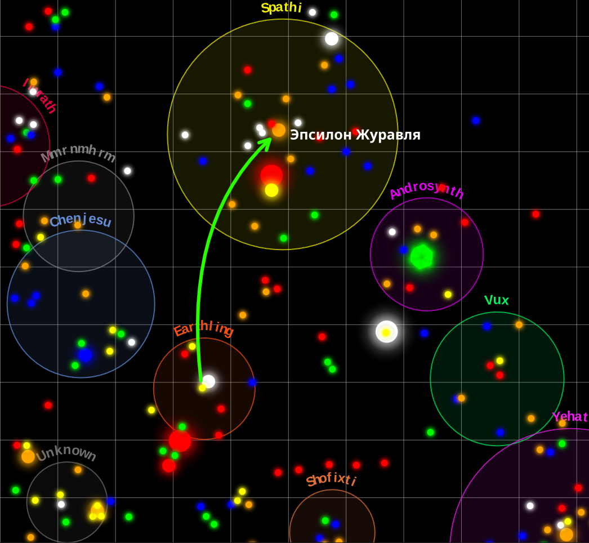

------------
------------
------------

## Глава третья. Предел прочности

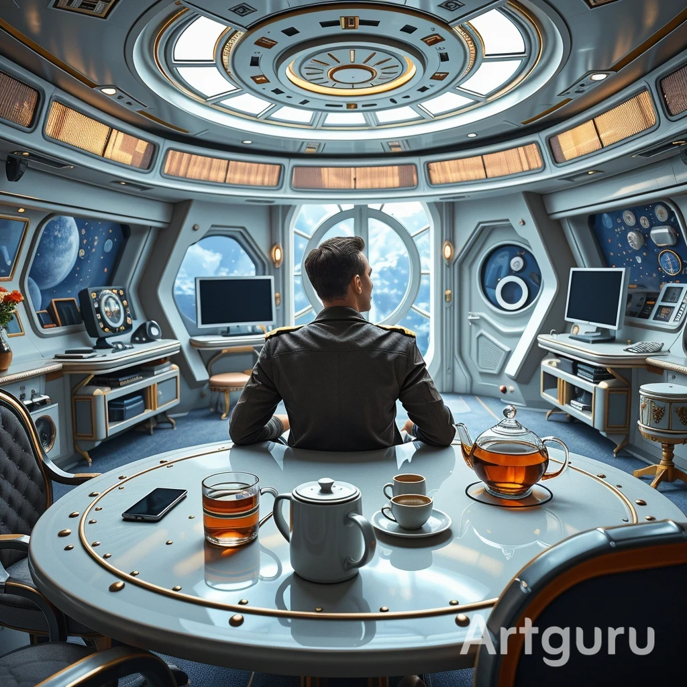

Я сидел в кают-компании после ночной смены. Вытянул ноги, налил чайку из запасов, подаренных мне Хейсом, и уже потянулся сделать первый, самый вкусный глоток и насладиться ни с чем не сравнимым ощущением аромата и тепла, которое разольётся по всему телу, как увидел старшего помощника Александра Малинина, целенаправленно идущего в мою сторону. Наверное, моё лицо в этот момент перекосила какая-то непроизвольная гримаса, потому что Малинин даже на секунду замер на полпути ко мне.

Характер Малинина я классифицировал как — «Педант-террорист» — по моей же собственной, одобренной мной же, и мной же утверждённой классификации. Ключевой чертой этого характера была склонность маскировать субъективные придирки и вкусовщину под объективный логический анализ и создание иллюзии конструктивной критики под соусом учтивости и обходительности, которая на деле оказывается навязыванием своих личных стандартов и предпочтений.

— Капитан, разрешите к вам присоединиться? — спросил Малинин и, даже не дожидаясь ответа, сел и тут же перешёл в атаку. — Капитан, мне кажется, вы как-то халатно подходите к своей работе! Я уже давно хотел вам это сказать.

Он выдержал паузу и снова продолжил, так, будто зачитывал служебную записку:

— Я на вашем месте бы напрягся, что кто-то оставил аббревиатуру английскими буквами на створках ковчега. Вряд ли при повсеместном использовании автопереводчика в нашей Вселенной Спасси решили бы оставить надпись на английском, либо это ложный след... — Он сделал паузу для драматизма и пристально посмотрел на меня, явно ожидая ответа.

Что ж, и я посмотрел на него пристально и ответил, тщательно выговаривая слова:

— А может, просто они хотели оставить сообщение для тех, у кого английский является официальным языком? Альянсу Свободных Звёзд, например? — Я приподнял бровь, глядя на него.

Было видно, что он слегка смутился. Этого он совсем не учёл в своих рассуждениях. Но смущение, как обычно, длилось долю секунды, и Малинин снова пошёл в словесную атаку с, как ему казалось, железобетонными аргументами, стоящими на фундаменте логики из титана.

— Ну хорошо, — тут же переключился он, — а почему вы решили переименовать Фвиффо?!

Мысленно я сделал фейспалм. Боже, началось. Опять... Но внешне спокойно ответил:

— Потому что сложно произносить — Фвиффо.
— А я вот считаю, что Фвиффо вполне выговариваемо. Я бы понял, если бы оно превратилось в «Фифу», но не в «Фиво».

Я вздохнул, чувствуя, как накатывает знакомая усталость.

— Ну, вот ты считаешь, что выговариваемо, а я так не считаю. Я уже язык сломал. Каждый раз, когда нужно было к нему обратиться, у меня начинался лёгкий спазм лицевого нерва. Тебе, кстати, никто не запрещает его называть Фвиффо.

Создавалось ощущение, что он даже не особо обращал внимание на то, что я отвечал, и невозмутимо продолжал:

— Тем более, немного странно, что только сейчас вы, капитан, решили «переназвать» Фвиффо. Почему вы раньше этого не сделали? Ещё тогда, на Плутоне?
— А что, должен был? — сказал я тоном человека, у которого только что спросили, почему он до сих пор не выучил язык китов. — Я что, давал повышенные обязательства по переименованию всех живых существ в Галактике при первой встрече?

Каждый раз в таких ситуациях я надеялся, что он внезапно укажет на меня пальцем, дико хохоча, со словами: «Купился! Капитан, ха-ха-ха! Ты бы видел своё лицо!» — но не такой человек был Александр Малинин! Скала! Кремень! Титан!!!

Стараясь, чтобы голос был ровным и спокойным, я продолжил:

— Ну, тогда терпел как-то. А когда случилось повторное обретение «мощей» Фиво, понял, что больше этого не вынесу. Могло быть так?
— Кстати, это далеко не первое «переназвание» чего-либо, — он закинул ногу на ногу, приняв вид человека, ведущего стратегические дебаты. — Это начинает настораживать. Вам не кажется, что это формирует опасный прецедент? Если что, извини — характер у меня такой.

«Ну спасибо, кэп. Как я сам-то не догадался...» — промелькнуло у меня в голове.

— И раз уж мы заговорили о прецедентах. Капитан, насчёт вашего... стиля руководства. А именно — шуток. — Он сложил пальцы «домиком», принимая вид лектора. — Возьмём, к примеру, вашу зацикленность на котиках. С точки зрения теории управления, однотипные шутки должны «стрелять» не более двух раз. Вы же зачастую эксплуатируете этот приём в третий раз! Это создаёт когнитивный диссонанс. Команда, наблюдая подобную ригидность мышления, неизбежно начинает задаваться вопросом о вменяемости капитана!

Он сделал многозначительную паузу, давая этому обвинению повиснуть в воздухе.

— Мягко говоря, не самое продуктивное впечатление, когда во главе корабля, предназначенного для такой великой миссии, — он многозначительно поднял палец вверх, — находится человек, демонстрирующий такое вопиющее непонимание принципов управления коллективом, а также приверженность к единственному, притом далеко не самому остроумному, юмористическому шаблону. — Подобная шаблонность — прямая дорога к потере авторитета, а в перспективе — и к угрозе боеспособности экипажа.

Он откинулся на спинку кресла с видом мастера, снисходительно предложившего ученику прикоснуться к великому знанию.

— Сначала — потеря авторитета. Потом — снижение боеспособности. А затем — гибель корабля. И в конечном счете — уничтожение Земли и исчезновение человечества как вида! Можете поверить моему богатому жизненному опыту, всё это может начаться с безобидной, казалось бы, шаблонной шутки, капитан. Цепная реакция некомпетентности. Вам стоит пересмотреть ваш юмористический арсенал.

Он сделал небольшую паузу, давая мне осознать весь масштаб грядущих бедствий.

— Меня, знаете ли, тоже когда-то вела дорога остроумия, пока мне не... кхм! — Пока я не разделил для себя понятия «остроумие командира» и «остроумие рядового состава».

Он плавно провёл ладонью над поверхностью стола, сметая невидимые пылинки.

— Вы, судя по всему, всё ещё путаете эти категории, — затем он снисходительно посмотрел на меня, как на нерадивого ученика. — Это может быть позволительно для матроса, но для капитана...

Он развёл руками, изображая крах всех надежд.

— Так вот, с высоты этого опыта могу сказать: все эти ваши «Барсики» — это какофония, а не мелодия. Настоящий юмор — это хирургический инструмент. Вам стоит серьёзно поработать над своим отношением к делу. Если хотите, я могу вас проконсультировать. У меня сохранились кое-какие наработки, — он выдержал паузу. — Короче, если мои комментарии не требуются, вы просто скажите.

Он поднялся, не дожидаясь ответа, и неторопливым, полным достоинства шагом направился к выходу.

Старпома надо менять, — твёрдо решил я, наконец-то делая глоток остывшего чая. — Больше я этого не вынесу.

------------

## Глава четвёртая. Незапланированно-контролируемое отделение

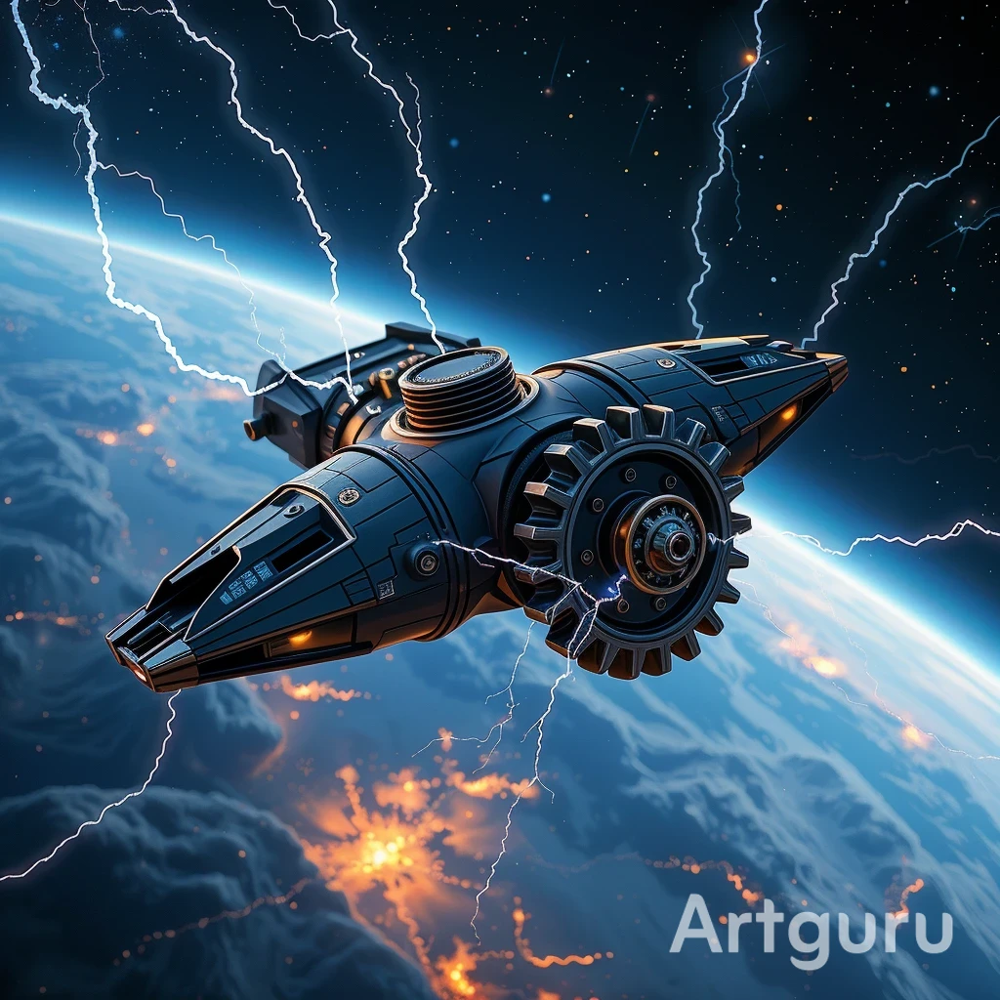

Мы прибыли в систему Бета Геркулеса.

— Капитан, вам презент, — сообщил штурман Басов.

Синий электрический зонд, похожий на вращающиеся и искрящие во все стороны шестерёнки, плавно скользил в пустоте. Он казался безмятежным и совершенно не обращал на нас внимания.
— Опять этот зонд, который называет себя Слайландро, — не отводя взгляд от объекта, констатировал Басов.

Я смотрел на навигационный экран. Зонд двигался к последней планете системы Беты Геркулеса.

— Алекс, он нас ещё не видит?
— Нет, капитан.
— Это ненадолго. Скоро увидит. — Я на мгновение задумался. — Так, Алекс. Срочно поднимай по тревоге командиров «Дымящегося» и «Сокрушительного».

Пока Басов занимался делом, я смотрел на синюю точку зонда...

«Дымящийся» и «Сокрушительный» были земными крейсерами и по сути нашей единственной огневой мощью. Когда мы только отбыли с Велы на Землю, чтобы узнать, почему вдруг связь с Землёй оборвалась, на нашем флагмане тоже было установлено ионное орудие. Но мы так остро нуждались в дополнительных топливных баках, грузовых отсеках и помещениях для экипажа для дальних экспедиций, что по моему указанию его демонтировали. Это было как вчера...

Каждый на нашей маленькой колонии на Веле догадывался, что произошло с Землёй. Последние новости с фронтов были, мягко говоря, не обнадёживающими. Линия фронта держалась на честном слове, и слово это, похоже, оказалось не очень честным. Так что ничего хорошего мы не ждали...

Так и оказалось. Ур-Куаны и их Иерархия «воинов-невольников» прорвали оборону... Земле был поставлен ультиматум: либо мы становимся так называемыми «воинами-невольниками» Ур-Куанов, сохраняем флот и некоторую автономию, но сражаемся за них по первому требованию. Либо Землю накрывают рабским щитом, сквозь который ничто не может пройти, кроме солнечного света и кораблей Ур-Куанов, обладающих нужной технологией. А на орбите создаётся космическая станция с экипажем из людей, исключительно для обслуживания кораблей Иерархии. И Земля выбрала второе... Никто не хотел называть «друзьями» тех, кто ещё вчера были нашими врагами.

Что стало с Ченджесу, мы уже тоже знаем. Не знаем только, почему их станция, в отличие от Земной, законсервирована. На станции были вооружённые роботы для охраны, а воевать с ними у нас тогда возможности не было. Что стало с Мур-Мурами, мы как раз пытаемся выяснить. А про остальных членов Альянса свободных звёзд узнать пока ничего не удалось. Где Шофиксти и Йехаты? Что стало с Сиренами? Куда пропали Арилу? Вполне возможно, их постигла та же участь, что и Землю... Все воспоминания начала нашего пути пронеслись в памяти за одно мгновение.

«Да... как вчера...» — мысленно повторил я.

— Алекс, полную инспекцию всех систем Спасского «Зайца» провели?

Мы прихватили его в системе Спасси... Так что теперь наша огневая мощь скакнула до небес с таким бравым капитаном, как Фиво.

— Да, капитан. Всё проверили, заправили, смазали... Лямки ремней безопасности под Фиво подогнали.
— И что, он даже не возражал?

— О, он возражал! — Басов оставался невозмутимым, а его лицо не выражало ничего, кроме служебного рвения. — Сначала заявил, что любое давление на его грудную клетку может вызвать спонтанную панику, ведущую к непроизвольному залпу всех орудий. Потом уверял, что по древней традиции Спасси первый полет на новом боевом корабле должен совершаться только в присутствии старейшины, который проведёт «обряд благословения двигателей». Потом клялся, что системы целеуказания «Зайца» работают на частоте, вызывающей у него мигрень, и ему требуется предварительная многомесячная демегренизация под наблюдением врача. — Он даже попытался симулировать техническую некомпетентность, заявив, что его познания в управлении ограничиваются «теоретическим курсом для пацифистов», который он провалил. «Я же вас подведу!» — почти рыдал он.

— И что, уговорили? — поинтересовался я.

— Никак нет, капитан. Уговоры на субъект не подействовали. Он перешёл к тактике саботажа под предлогом заботы о технике. Утверждал, что системы жизнеобеспечения «Зайца» требуют предварительной «биологической калибровки» — якобы ему нужно провести не менее 150 часов в неподвижной медитации в кабине для «синхронизации с контурами корабля», иначе корабль не примет его как пилота и приступит к процедуре самоликвидации. При этом категорически запрещалось не только прикасаться к нему, но даже наблюдать за процессом.

Но когда понял, что тактические аргументы не работают, перешёл к стратегическому уровню. «Давайте просто поставим «Зайца» на якорь и будем использовать как стационарную оборонительную платформу! Это гениально! Все преимущества огневой мощи — и ноль риска для пилота!»

Но когда и это не сработало, он предложил радикальное решение: Он пытался доказать, что его истинная ценность — в качестве «тактического советника на безопасном расстоянии», а не боевого пилота.

Но самым отчаянным его предложением была идея «символического капитана». Он говорил, что его «моральная поддержка» будет куда эффективнее, чем прямое участие в бою. Когда же ему напомнили, что системы «Зайца» реагируют только на биометрию Спасси, он на полном серьёзе предложил отрезать ему одно щупальце («самое незначительное!») и прикрепить к креслу — «пусть оно думает, что я там есть».

— И что вы сделали?

— Мы его внимательно выслушали, после чего сообщили субъекту, что отменяем все замеры и оставляем его в покое. Он вздохнул с облегчением, решив, что ему удалось избежать непосредственного назначения. После чего нами был разработан и осуществлён план под кодовым названием «Барсик-1».

Я поднял бровь. — «Барсик-1»? Звучит как название сверхсекретной миссии.

— Так и есть, капитан. Через некоторое время лейтенант Билли ворвался в каюту Фиво и срывающимся голосом кричал, что отовсюду надвигается опасность и единственный способ спастись — это воспользоваться челноком, чтобы переждать самое страшное за его бронёй или в крайнем случае эвакуироваться на какую-нибудь ближайшую планету.

— И что же это за опасность такая, которая надвигается прямо отовсюду? — поинтересовался я.

— Этого мы не стали уточнять, — невозмутимо парировал Басов. — Когда он оказался в шлюзе, рядовой Гомес, предварительно размещённый в челноке у пульта управления стан-пушкой...

— Вы его что, оглушили?! — Я ошалело смотрел на Басова.

— Так точно, капитан. Рядовой Гомес кратковременно активировал стан-пушку челнока на минимальной мощности. Что привело к временной дезориентации без вреда для здоровья.

В соседнем отсеке нами предусмотрительно была размещена «тактическая группа захвата» во главе с главным техником сержантом Фридманом, и пока субъект приходил в себя, его переместили в кабину «Зайца» и подогнали все лямки безопасности в соответствии с техрегламентом.

Когда он очнулся, процесс был завершён. На что он заявил, что это «варварские методы, травмирующие хрупкую психику расы Спасси», после чего его вежливо попросили ознакомиться с инструкцией по эксплуатации под расписку.

— Вы прямо целую спецоперацию провели! — не смог сдержать я смеха.

В уголке рта штурмана едва заметно дрогнул мускул. Эквивалент гомерического хохота по шкале Басова.

— Для обеспечения боеготовности эскадры все средства хороши, капитан, — абсолютно серьёзным тоном парировал Басов. — Субъект был доставлен по назначению, формальности соблюдены. После ознакомления с инструкцией он заявил, что будет подавать жалобу в межгалактический суд по правам разумных существ, но поскольку мы не предоставили ему бланк для жалобы и не указали адрес суда, процесс зашёл в тупик. В настоящее время Фиво проходит курс адаптации в кабине «Зайца», который заключается в его попытках договориться с бортовым компьютером о предоставлении ему статуса «невовлечённого наблюдателя».

Я смотрел на Басова с растущим уважением. В его исполнении даже самый абсурдный план обретал черты железной военной логики.

В дверях рубки показались командиры крейсеров — подтянутый и жизнерадостный лейтенант Игорь Волков с «Сокрушительного», и лейтенант Лиза Чен с «Дымящегося», чьё хладнокровие в бою уже стало легендой.

— В общем, вам уже сообщили про нашего синего друга, — начал я, не теряя времени. — Опыт подсказывает, что мирный диалог с ним невозможен. Его логика неизменно приводит к тому, что он начинает разбирать нас «на составляющие компоненты». Мы попробуем поговорить, но вряд ли стоит ожидать от него другого поведения.

Я обвёл взглядом собравшихся. — Ваша задача: — Лиза, видишь этот астероид в секторе D13, прямо по курсу и чуть правее?

— Так точно! — отчеканила Лиза Чен.
— Подойдёте к нему аккуратно, так, чтобы постоянно оставаться в его тени для зонда. И ждите моего сигнала, — плавным движением пальца я провёл по карте траекторию. — Всё ясно?
— Так точно, капитан! — ещё более рьяно отрапортовала Лиза.

— Игорь, ваша цель — вот этот астероид в секторе D7, прямо по курсу и левее, — я поставил метку на навигационном экране, отмечая нужное место, — Сделаете то же самое, что и Лиза.
— Подойти в тени. Ждать дальнейших указаний, — кивнул Волков.

— Теперь слушайте внимательно, план такой: Наши крейсера слишком тихоходные в сравнении с зондом. Вы и сами помните это по прошлым стычкам. Не мне вам объяснять, какой урон мы получаем при прямом столкновении с этими электрическими «друзьями». — Я посмотрел на командиров кораблей. — Раз уж мы обзавелись таким грозным активом, — я кивнул в сторону изображения Спасского «Зайца» на мониторах корабля, — пора его применить. Как только «Дымящийся» и «Сокрушительный» займут позиции, начинаем манёвр «Барсик-2».

— А что, «Барсик-1» уже был? — поинтересовался Волков.
— Был, — я мельком бросил взгляд на Басова. — Вы долго шли и всё пропустили. Басов потом вам расскажет... после смены.

— Капитан, — Басов посмотрел на меня, сдвинув брови так, будто я был маленьким, наивным ребёнком, — мы же не сможем уговорить его подключиться к атаке.
— А нам это и не надо. — Я многозначительно посмотрел на Басова и хитро улыбнулся. — Субъект же сейчас в корабле?... Осваивается?
— Сейчас проверю, — Басов наклонился к монитору. — Так точно, всё ещё там.
— Вот и отлично! Прямо сейчас разгерметизируй отсек, где стоит «Заяц», чтобы он уже никуда не делся с корабля. А в нужный момент, по моей команде, мы открываем створки отсека и катапультируем «Зайца» в сторону Слайландро. А дальше он уже сам будет делать то, что у его расы получается лучше всего — драпать. Как он там дальше говорил...? — Я поднял голову и посмотрел на подчинённых.
— По сложной траектории и с громкими воплями! — захохотал Волков.
— Вот именно, — кивнул я.

То, что отчебучивал Фиво, моментально передавалось из уст в уста и становилось местным фольклором.

— У «Зайца» скорость очень хорошая. С зондом, конечно, не сравнится, но приличная. А ещё замечательная манёвренность и очень, очень крепкий корпус, — «Спасси другой сделать и не могли, с их патологическим стремлением к защищённости», — подумал я. — А так же у него есть ракетная установка в кормовой части корабля. Будет отстреливаться.

Чен и Волков, похоже, очень живо представили эту картину и заулыбались.

— Когда зонд на него среагирует и бросится в погоню, будьте наготове. Как только наша сладкая парочка окажется на дистанции максимальной атаки земных крейсеров — открываете огонь. Зонд, конечно, среагирует и попытается вернуться, но какой бы быстроходный он ни был, такое большое расстояние под огнём двух крейсеров он преодолеть не успеет. — Я посмотрел на командиров крейсеров. Настрой у них был решительный. — Всё ясно?

Командиры синхронно кивнули, их лица стали ещё более сосредоточенными и собранными.

— Тогда по местам, — отдал я последнее распоряжение. — И да помогут нам панические инстинкты одного бравого Спасси.

Когда они вышли, я повернулся к главному экрану. Синяя точка зонда по-прежнему плавно скользила к планете, ничего не подозревая. Я представил, как через несколько минут из нашего корабля, словно пробка из бутылки шампанского, вылетит стремительный «Заяц» с вопящим от ужаса Фиво внутри, и не смог сдержать улыбки.

— Приготовиться к операции «Барсик-2», — тихо произнёс я, глядя на зонд. — Начинаем представление.

Крейсеры плавно отошли от флагмана. Мы наблюдали, как они неторопливо скользили в этом чёрном океане, пока не достигли своих боевых позиций. Зонд по-прежнему двигался своим курсом, не замечая нас. Басов посмотрел на меня, как бы мысленно вопрошая: «Ну что? Начинаем?»

— Начинаем, Алекс! Выстреливай Фиво!

Басов пробежал пальцами по пульту, и в этот момент, как выстрел из новогодней хлопушки, по направлению Слайландро вылетел Фиво. Мы с Басовым синхронно аплодировали!

— Фейерверка не хватает, — без тени улыбки констатировал Басов.
— Согласен, — кивнул я. — Дай ему 10 секунд немного прийти в себя и открывай канал связи.

Басов педантично отсчитал 10 секунд и включил канал связи с «Зайцем». Из динамиков донёсся пронзительный, полный ужаса визг.

— А?! Что?! ГДЕ?!?! Я опять что-то нажал?! Что происходит?!

Мы с Басовым переглянулись. Кажется, нас посетила одна и та же идея, я понял это по его лицу и подмигнул ему.

— Фиво. Только без паники... — начал я максимально спокойным голосом.
— Ааааааа! — почти зарыдал Фиво. — Капитан, это вы?! Мой дорогой, мой драгоценный спаситель!!! Я просто почесал глаз, и вдруг... О, я же говорил, что мои рефлексы несовместимы с этой машиной смерти! Она сама по себе полетела!

— Фиво, кажется... э-э-э... произошло какое-то незапланированное, но в целом контролируемое отделение, — сказал я, стараясь звучать убедительно. — Всё в порядке. Просто... проверь системы. Сделай небольшой круг для диагностики, через квадрат J10. Дай мне знать, если что-то покажется тебе странным.

— Круг? Диагностика? О, конечно! Я эксперт в диагностике! Только бы снова не тыкнуть куда-нибудь не туда... — его голос перешёл на бормотание, и «Заяц» дрожаще, но послушно начал разворачиваться в сторону указанного сектора.

Как только он достиг сектора J10, Басов коротким, чётким жестом указал на меня. Этот жест был лаконичным сигналом: «Цель на позиции. Ваш выход, капитан». Я кивнул.

— Капитан, — палец Басова завис над кнопкой коммуникатора, — мы же помним, чем заканчивались все наши попытки поговорить с этими штуками? «Мирный контакт» по их версии — это когда они нас расстреливают, а мы — нет.

— Помню, Алекс, помню. Но лишний раз попробовать не помешает. Мало ли, может, у этого сегодня прошивка обновлённая. Включай.

— Фиво, — снова вышел я на связь. — Мы сейчас перенаправим на тебя один канал связи. Просто послушай, что там скажут, и... действуй по обстановке. Не паникуй.

Канал был открыт. Голос Слайландро прозвучал как ледяной душ.

— МЫ ПРИШЛИ С МИРОМ.

Фиво на другом конце сначала замер, а затем выдал:

— А... Привет! Я тоже! С миром! Абсолютно! — потом, чуть слышно, добавил: — Капитан, он говорит, что с миром!

Зонд, как мы и ожидали, уже менял курс. Его плавное скольжение сменилось на целенаправленное, неумолимое сближение.

— ЭТО ЗОНД 2418-Б. МЫ ВЫПОЛНЯЕМ МИРНУЮ ИССЛЕДОВАТЕЛЬСКУЮ МИССИЮ.
— МЫ НЕСЁМ ПРИВЕТСТВИЕ ОТ ДРУЖЕСТВЕННОЙ РАСЫ.

Ну и несли бы себе дальше. Обрушивали бы ваше дружественное приветствие на чью-то другую голову, — мелькнула у меня мысль.

— О, как здорово! — защебетал Фиво, явно не понимая, что его ждёт дальше. — И я выполняю мирную миссию! Ну, как мирную... скорее, наблюдательную... или, если честно, просто случайно здесь оказался! Но я тоже очень дружественный! Мы все здесь очень мирные и дружественные и...

— ПЕРЕОПРЕДЕЛЕНИЕ ПРИОРИТЕТА. ЗАДАНО НОВОЕ ПОВЕДЕНИЕ.
— НЕОБХОДИМО РАЗБИТЬ ЦЕЛЬ НА СОСТАВЛЯЮЩИЕ КОМПОНЕНТЫ.

Приехали... — только и успел подумать я, как в динамике раздалось:

— ОН ЦЕЛИТСЯ! КАПИТАН, ОН ЦЕЛИТСЯ! — завопил Фиво, и его «Заяц» резко рванул в сторону, начав отчаянный, судорожный зигзаг.

Мы наблюдали, как зонд, словно хищная рыба, устремился за ним в погоню. Он набирал скорость, игнорируя всё вокруг. Я дождался, пока зонд окажется на идеальном для атаки расстоянии, и открыл канал связи с крейсерами. — Командирам «Дымящегося» и «Сокрушительного»... Лиза, Игорь, ваш выход!

Из-за глыб астероидов, как призраки, выплыли два земных крейсера. Их орудия были готовы к бою.

— Огонь! — скомандовал я.

Ракеты прочертили в пустоте яркие линии, разорвавшись на корпусе Слайландро. Зонд вздрогнул, его щиты ярко вспыхнули. На мгновение он замер, а затем, следуя своей смертоносной логике, резко развернулся и бросился на ближайший крейсер — «Дымящийся».

Волков занял позицию с фланга, и зонд попал в перекрёстный огонь, но это лишь на мгновение сбило его с курса. Ответом стал яростный бросок: зонд, подобно синей молнии, нырнул под очередной залп «Сокрушительного» и устремился к «Дымящемуся». Дистанция таяла с пугающей скоростью. Я смотрел на это, не способный ничем помочь... Ещё немного — и он набросится на крейсер, как хищник на жертву, и начнёт кружить вокруг него и рвать его на части... Но голос Лизы Чен звучал в общем канале чётко и холодно.

— Огонь!
Корпус «Дымящегося» содрогнулся от отдачи.

— Перезарядка! Огонь!
Очередная ракета прочертила космос ярким следом.

— Перезарядка! Огонь!...

— Вот это нервы, — восхитился я. — Железная леди!

И в этот момент два залпа почти одновременно ударили по зонду с разных сторон. Его щиты не выдержали. Корпус зонда разорвало изнутри ослепительной вспышкой, которая на мгновение затмила звезды. По связи прошёл оглушительный треск, и на экранах радаров заклубилось облако раскалённых, медленно разлетающихся обломков.

Наступила тишина, которую нарушил только тяжёлый, прерывистый вздох Фиво.

— Всё... всё кончено? Он... он больше не стреляет?
— Он уничтожен, Фиво, — сказал я. — Ты молодец. Ты отвлёк его и вывел прямо под наши «пушки».

В который раз мы с Басовым обменялись взглядом и синхронно кивнули друг другу.

— Алекс, приготовь нашему герою горячий приём, соответствующий величине его подвига!
— Будет сделано, капитан!

Когда «Заяц» вернулся в док, там уже собралась вся эскадра — «Дымящийся» и «Сокрушительный» успели занять свои места в ангаре после боя. Мы с Басовым спустились вниз, где нас встретила толпа техников и матросов. И когда Фиво, всё ещё дрожа всеми щупальцами, выбрался из кабины, раздались аплодисменты. Кто-то свистел, кто-то хлопал его по спине (заставив его вздрогнуть), кто-то кричал «Ура Барсику!».

Игорь Волков, не скрывая широкой улыбки, подошёл к Фиво и, наклонившись, с почтительной осторожностью пожал одно из его щупалец.

И в этот момент подошла Лиза Чен. Её лицо сохраняло обычную сдержанность, но в глазах стояла несвойственная ей влажная поволока. Она, не говоря ни слова, просто присела на корточки — чтобы оказаться на одном уровне с невысоким Спасси — и очень тепло, почти по-матерински обняла его. Она понимала, что сейчас она и её экипаж живы только благодаря Фиво, и его судорожным манёврам.

Фиво замер, глядя на внезапно ставшую такой мягкой Лизу. Он привык видеть её собранной и строгой, а теперь она присела перед ним, обнимая с такой теплотой, от которой у него перехватило дыхание.

И тут произошло невероятное. Его единственный глаз, обычно полный паники, вдруг засиял. Он выпрямился во весь свой невысокий рост и даже попытался отдать некое подобие чести, неуклюже поднеся одно дрожащее щупальце к краю глаза.

— Ну, вообще-то... это была не такая уж и сложная задача... — пробормотал он, и в его голосе впервые зазвучали нотки гордости. — Просто нужно было сохранять спокойствие и... э-э-э... мастерски маневрировать.

Он украдкой посмотрел на меня, и я одобрительно кивнул.

Да, возможно, мы немного схитрили. Но зато какой результат!!!

В такие моменты, когда весь экипаж, сплочённый общей победой, радуется и обнимается, и один маленький Спасси, который, может быть, впервые в жизни почувствовал себя не обузой, а героем, и происходят чудеса единения. В такие моменты экипаж становится братством. Именно такие моменты не дают нам забыть, кто мы и за что сражаемся. Ради таких моментов и стоит жить!

------------

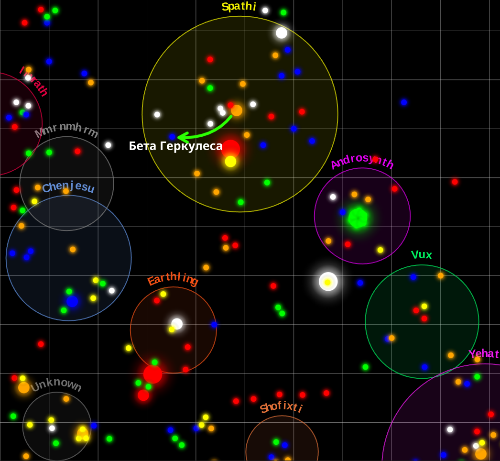

------------
------------
------------

## Глава пятая. Холодная война за горячую воду

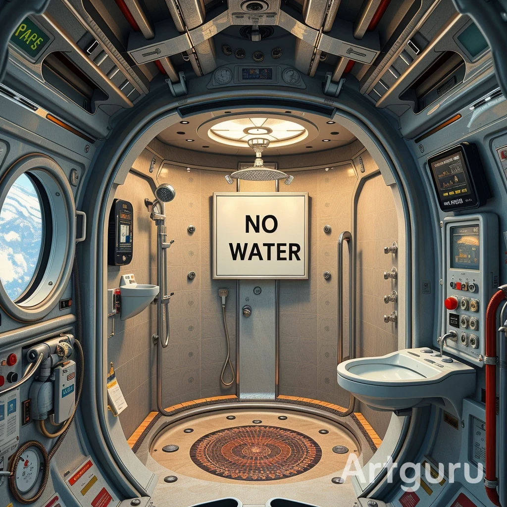

Проснулся я от того, что сам себе улыбался. В памяти всплывали обрывки вчерашнего: ликующий экипаж, аплодисменты в ангаре, сияющий единственный глаз Фиво. Трудно было поверить, что этот вечный комок дрожащих нервов, чья жизнь была сплошным руководством по выживанию в условиях тотального невезения, теперь красовался перед командой, пытаясь отдать честь щупальцем. Мы, конечно, немного подтолкнули его к подвигу. Но это сработало! И сработало блестяще.

А за иллюминатором, тем временем, плыла Бета Геркулеса. Мы приближались к третьей планете системы — газовому гиганту. Сам гигант был для нас недоступен — ни один наш челнок не выдержал бы чудовищного давления в его атмосфере. Но вокруг него могло кружиться несколько спутников — каменных глыб или ледяных миров. Именно их предстояло обследовать, и работа предстояла долгая и кропотливая.

Я потянулся, сладко зевнул и посмотрел в иллюминатор. За ним была лишь вечная, бархатная чернота, усыпанная алмазной россыпью далёких звёзд. Но внутри у меня было самое что ни на есть настоящее утро. Свежее, ясное и пахнущее победой.

В этот момент я живо представил, что на это сказал бы Малинин. Я почти физически услышал его сухой, бескомпромиссный голос: «С точки зрения астронавигации и суточных циклов, ваше текущее состояние нельзя классифицировать как «утро». Вы находитесь на борту космического корабля в глубоком космосе. Понятия «восход» и «закат» здесь не имеют физического смысла. Ваше пробуждение обусловлено исключительно внутренними циркадными ритмами...».

Я усмехнулся и мысленно продолжил за него, пародируя его манеру: «Более того, использование субъективных ощущений для определения времени суток демонстрирует недостаточную дисциплину мышления, что для командира корабля может считаться...»

«А вот это, дорогой мой Александр, — парировал я, направляясь в санузел, — моё личное дело. У меня утро наступает ровно в тот момент, когда я просыпаюсь. И если я решил, что сейчас воскресенье на берегу Средиземного моря — то так тому и быть».

Эта небольшая мысленная победа подняла настроение. Я решил закрепить успех настоящим, а не метафорическим утренним душем. Повернул кран... Ничего. Ни намёка на шипение воды, ни единой капли. Постучал по вентилю — молчит. «Сломалось, что ли?» — промелькнула первая, наивная мысль.

Я вышел из душевой, надел комбинезон и вызвал мостик.

— Слушаю, капитан.

Почти мгновенно ответил спокойный голос штурмана.

— Алекс, у меня в каюте какая-то проблема с сантехникой. Вода не идёт. Душ не работает.
— Понял. Проверяю. — Послышался стук клавиш. — Вода в системе есть. Давление в норме. Фильтры работают. — Басов на мгновение замолчал. — Капитан, согласно журналу обслуживания, подача воды в вашу каюту была приостановлена сегодня в 05:13 по корабельному времени.
— Приостановлена? По какой причине? У нас что, экономия? Кончилась техническая вода?
— Запасы воды в норме, — Басов сохранял олимпийское спокойствие. — Основание: дисциплинарное взыскание. Санкция применена автоматически, на основании официально поданного рапорта. Ссылка: Устав Космофлота Земли, пункт 4.4, подпункт «г».

Да что ж такое-то? Куда ни наступишь везде это «г»... Я мысленно пролистал толстенный том Устава. Пункт 4.4... «Безответственная эксплуатация систем корабля, приведшая или способная привести к...» Да, вот оно: «...к необоснованному риску для жизни и здоровья членов экипажа, включая несанкционированную разгерметизацию помещений с возможным нахождением в них персонала».

Ааа-а-а, вот оно что! Операция «Барсик-2». Разгерметизация ангара для катапультирования «Зайца». Формально — да, я отдал такой приказ. Но Фиво был уже внутри корабля, пристёгнутый! Никакого необоснованного риска для жизни и здоровья и в помине не было. Это была чистейшая формальность, крючкотворство высшей пробы!

— А кто подал рапорт? — спросил я, уже зная ответ.

— Старший помощник, капитан Александр Малинин, — голос Басова был подобен гладкой поверхности озера. — В 05:12 по корабельному времени он внёс запись в судовой журнал с соответствующей формулировкой. Система автоматически применила санкцию согласно протоколу. Всё по регламенту, капитан.

Я мысленно представил этот самый пункт 4.4. Его дух, его истинный смысл был кристально чист и прост — не допустить, чтобы живое существо в ангаре погибло от вакуума, от чудовищного перепада давления. Суть — спасти жизнь. И Малинин и я это прекрасно понимали. Но Малинин вывернул его наизнанку. Он использовал букву правила, чтобы ударить исподтишка, прекрасно зная, что Фиво был в безопасности внутри корабля. Это была не забота о безопасности, а чистой воды бюрократическая дуэль. Он намеренно проигнорировал суть, чтобы воспользоваться формальным поводом.

Всё по регламенту. Конечно. Малинин не мог открыто оспаривать мои приказы, особенно приведшие к блестящей победе. Но он нашёл свою лазейку. Удар ниже пояса, но абсолютно легальный. Лишить капитана душа после триумфа — это так по-Малинински элегантно и подло одновременно.

— Капитан, — голос Басова нарушил мои невесёлые размышления. — Разрешите вызвать старпома на мостик? Я уверен, что после краткой, но содержательной беседы на тему того, что саботаж боевого духа командира негативно сказывается на боеспособности всего экипажа, он пересмотрит своё...

— Не надо, Алекс, — перебил я его. Сцена с нашей «воспитательной беседой» с Малининым была заманчива, но бесполезна. Это только дало бы ему повод для новых бесконечных докладных о «неуставных отношениях». — Спасибо за инициативу, но не в этот раз.

Я почувствовал, как остатки утренней эйфории окончательно испарились.

— Алекс, насколько я помню Устав, — сказал я, мысленно сверяясь с первоисточником, — я не могу снять Малинина до возвращения на базу? Нужны какие-то чрезвычайные обстоятельства?

— Так точно, капитан, — без тени сомнения ответил Басов. — Согласно параграфу 12.7 Устава Космофлота, снятие старшего помощника с должности капитаном возможно только по прибытии на базовую станцию через подачу рапорта командованию. Или в случае прямой угрозы жизни экипажа, или доказанной чрезвычайной некомпетентности, или открытого неповиновения приказу... Однако его рапорт является формально верным, а потому, — Басов сделал многозначительную паузу, — к сожалению, не подпадает ни под один из перечисленных пунктов, служащих основанием для немедленного отстранения.

«К сожалению». В устах Басова, чья речь была образцом бесстрастия, эта обычная формула вежливости прозвучала как полноценная эмоциональная вспышка.

— Понятно, — кивнул я. Значит, до станции мне придётся терпеть эту тихую войну. — Значит, будем действовать строго в рамках правил.

За пару мгновений перед моим мысленным взором пронеслись все эти предстоящие баталии, а мне почему-то этого ой как не хотелось. И не только из-за усталости. Что-то здесь было не так. Малинин — педант, да. Формалист, конечно. Но чтобы вот так... целенаправленно, почти с личной неприязнью? Это было на него непохоже. Его манера — это разносить в пух и прах всех подряд с одинаковым, безразличным усердием, как будто он не человек, а воплощение некоего бюрократического абсолюта. А здесь... чувствовалась какая-то странная избирательность. Личный вызов. Но почему? Может, он сам метил в капитаны? Или я когда-то, по незнанию, перешёл ему дорогу — отверг какое-то его «гениальное» предложение и ущемил его самолюбие? Все эти версии крутились в голове, но ни одна не казалась исчерпывающей. Слишком уж примитивно для такой отточенной, ледяной натуры. Значит, есть какая-то другая причина, лежащая глубже, вне поля моего зрения, которую я пока не разглядел. И эта мысль была тревожнее самой стычки.

— Скажи честно, Алекс, у тебя в каюте вода есть?
— Так точно, капитан. Подача не отключалась.
— А душ свободен?
— В настоящее время — да.
— Тогда, — я глубоко вздохнул, — будь другом, поделись электронным ключом от своей каюты. Капитанство капитанством, а гигиена прежде всего.
— Ключ отправлен на ваш персональный браслет, — без тени улыбки в голосе доложил Басов. — Разрешите также предложить мой запас геля для душа с ароматом «Свежесть ледников Каледонии». По субъективным ощущениям, он идеально соответствует «утреннему» настроению.

Вот за что я люблю Басова. Он не просто предлагает решение — он делает это с такой лёгкой, почти невидимой иронией, что самая досадная ситуация вдруг начинает казаться просто очередным рабочим моментом, а не личной трагедией.

— Спасибо, Алекс. «Свежесть ледников» — это то, что нужно. Благодарю за понимание и готовность помочь. А Малинин... — я снова взглянул на безжизненный душ, — ... с Малининым определённо надо что-то делать. Вот только я пока не знаю что...

Я отключил связь, взял свой гигиенический набор и направился к двери. В голове крутилась одна и та же навязчивая мысль, ироничная и горькая одновременно: «Вот так всегда. Думаешь, что воюешь с Ур-Куанами за будущее галактики, а на деле самая яростная борьба разворачивается с теми, кто ближе всего.»

Мысль обрастала деталями, становясь горьче. Где-то там, в глубинах космоса, Верховный Командующий Ур-Куанов, вероятно, строил коварные планы порабощения рас. А я в это время вёл переговоры о доступе к санузлу. Великие битвы, угрозы всему живому — и всё отступало на второй план перед одним педантичным занудой с томиком Устава в руках.

Сейчас — война за душ. Завтра что? — продолжил я мысленную тираду, уже подходя к каюте Басова. Битва за право выбрать курс? Война за кают-компанию? Осада камбуза?

Эта абсурдная цепочка мыслей внезапно перестала казаться смешной. Ведь это и есть та самая тень, которую отбрасывает любая тирания — большая или маленькая. Она не всегда начинается с пушек и вторжений. Иногда она начинается с мелких пакостей. С уверенности, что твоя правота важнее общей цели.

Ур-Куаны порабощают расы открыто, силой. Их тирания видна невооружённым взглядом. Но тирания Малинина была страшнее своей банальностью. Она не ломала врата штурмом, а медленно, по капле, отравляла колодец изнутри, пользуясь правилами, написанными для защиты этого колодца.

Приложив свой персональный браслет к двери Басова, я почувствовал, как горькая ирония постепенно сменяется ощущением стальной пружины, сжимающейся внутри. Что завтра? — повторил я про себя, переступая порог. Было лишь чёткое понимание: игра только начинается, и настанет момент, когда эту пружину придётся отпустить.

...

Каюта Басова, как и всё, что он делал, была образцом функционального порядка. Ни одной лишней вещи, терминал с заставкой — схема ближайших звёздных систем, кровать аккуратно заправлена, и стойкий, бодрящий запах «Свежести ледников», который, как я теперь понимал, для Алекса был тем же, чем для меня — условное «утро».

Все мы пытаемся окружить себя приятными условностями, которые греют душу и помогают пережить тяготы похода. И если у меня это утро на берегу Средиземного моря — солнце, волны и тёплый бриз. То у Басова это его водопады кристально чистой воды, бегущей по склонам с самых ледников Каледонии.

Несколько минут под струёй горячей воды с этим гелем стали актом не только гигиены, но и морального очищения. Я стоял, закрыв глаза, и чувствовал, как напряжение медленно, но неотвратимо отступает, уносясь в слив, вместе с водой.

Я уже застёгивал комбинезон, и капли воды с ароматом «Свежести ледников Каледонии» ещё не успели окончательно высохнуть на затылке, когда из встроенного динамика в стене раздался тот самый сигнал, что заставляет сердце замирать. Резкий, настойчивый сигнал тревоги.

Я тут же потянулся к своей личной гарнитуре, лежащей на тумбочке. Одним привычным движением закрепил её за ушной раковиной, чувствуя, как устройство мягко завибрировало, подтверждая соединение.

— Капитан, срочно на мостик, — голос Басова прозвучал с той самой стальной нитью, которая означала: «Проблема».
— В пути, — бросил я в ответ, уже пулей вылетая из каюты Басова. Микрофон гарнитуры чутко уловил мои слова, даже сквозь учащённое дыхание.

Через минуту я уже влетал на мостик. Картина на главном экране говорила сама за себя. Две синие, мерцающие цели, похожие на вращающиеся шестерёнки, вышли из-за горизонта первой планеты и безошибочно легли на курс перехвата.

— Ещё два этих... шестерёночных эмиссара. Те, что вещают про мир от имени Слайландро, — доложил Басов, его пальцы уже летали по панели управления. — Конструкция та же. Вероятность, что они просто гуляли тут сами по себе — стремится к нулю. Вывод: первый зонд успел передать сигнал перед уничтожением.

Я тяжело опустился в кресло. Один такой зонд мы победили с помощью военной хитрости и двух крейсеров. Два... Это уже совсем другая история.

— Оценка, Алекс? — спросил я, глядя на то, как две синие точки неумолимо движутся в нашу сторону.

— Прямое столкновение с двумя целями маловероятно без значительных потерь, — констатировал Басов. — «Дымящийся» и «Сокрушительный» не смогут эффективно противостоять сразу двум зондам. Вероятность потери хотя бы одного крейсера — 94%. Вероятность потери двух крейсеров — 27%. Если «Заяц» тоже будет вести активные действия, хотя бы метаться по сложной траектории и отстреливаться, вероятность положительного исхода боя близка к 100%. Вероятность серьёзных повреждений флагмана минимальна.

Цифры были безжалостны. Эйфория от вчерашней победы испарилась окончательно. Да, мы можем выиграть эту битву, но один из крейсеров будет почти гарантированно уничтожен.

Кого я больше никогда не увижу? Жизнерадостного Волкова? Лизу Чен?

Нет. На это я пойти не мог.

— Нет, Алекс. Победа, добытая такой ценой, больше похожа на поражение. Меня такая пиррова победа не устраивает. — Я с досадой посмотрел на метки зондов. — Успеем уйти в гипер?

Басов бросил взгляд на расчёты, его лицо оставалось невозмутимым.
— Так точно. Они выйдут на дистанцию атаки примерно через тринадцать часов. А нам для выхода на безопасную от светила дистанцию для осуществления прыжка потребуется около пяти часов. Времени более чем достаточно.

В рубке воцарилась тишина, нарушаемая лишь ровным гудением приборов. Я мысленно представил ровный, лишённый эмоций голос Малинина: «Капитан, ваше решение о бегстве без принятия боя — это вопиющая демонстрация слабости, граничащая с предательством. Подобные действия не просто наносят ущерб боевому духу — они создают культуру избегания ответственности. Экипаж начинает воспринимать осторожность как оправдание трусости! С сегодняшнего дня каждый матрос будет знать: когда появится реальная угроза, командир предпочтёт отступить. Лавина некомпетентности начинается с одного такого решения. Сегодня — бегство от боя. Завтра — невыполнение приказа. Послезавтра — потеря корабля...» Эта мысленная реплика прозвучала настолько чётко, что я почувствовал, как сжимаются кулаки. Он всегда найдёт способ превратить разумную осторожность в трусость, а тактический расчёт — в предательство.

Отступать всегда неприятно, даже когда это тактически оправдано. А особенно от бездушных кусков металла. Но великий полководец — не тот, кто всегда побеждает, а тот, кто знает, когда нужно отступить и перегруппироваться.

— Ладно, — наконец сказал я, и в моём голосе звучала не досада, а холодная решимость. — Значит, не судьба сегодня с ними танцевать. Придётся вернуться к Бете Геркулеса позже, с более вескими «аргументами».

Я обвёл взглядом мостик, встречаясь глазами с каждым офицером. В их лицах читалось понимание и одобрение. Короткие кивки, скупые, но поддерживающие жесты рук — все эти мельчайшие реакции сливались в единый, неозвученный ответ. Они видели те же цифры, что и я, и понимали: это не бегство, это единственно правильное решение, а бой лучше принимать тогда, когда мы сможем выиграть его без неоправданных жертв.

— Внимание всем! Разворачиваемся. Плавно, без лишней суеты. Начинаем подготовку гипердвигателя к прыжку. Делаем всё чётко и последовательно. Без спешки. Время у нас есть.

Я повернулся к Басову. — Алекс, как у нас с топливом? Сможем дотянуть до сферы влияния Умга и потом вернуться к Земле?

Штурман снова погрузился в изучение данных.
— Расчёты показывают, что топлива хватит. Даже с запасом.
— А если мы на обратном пути сделаем ещё одну попытку тщательно изучить Бету Геркулеса?
— Впритык, но хватит. Останется даже небольшой резерв на непредвиденные манёвры.

Это была хорошая новость. Очень хорошая. Так и запишем: Это было не паническое бегство, а стратегический манёвр!

— Отлично. Значит, наш путь лежит к весельчакам-хохмачам. Может, они знают что-то про Чёрный Эскадрон. А может, просто пошутят так, что нам потом сто лет смеяться...

Корабль развернулся и медленно начал набирать скорость. Звёзды на экране поплыли в стороны. Я посмотрел на две синие точки, которым не суждено было нас догнать. Через несколько часов впереди появилось дрожащее алое свечение — гиперпространство отвечало на вызов двигателей. Скоро свечение начнёт нарастать, закручиваясь в вихрь, пока чёрный космос за иллюминаторами не станет уплывать из-под ног, как вода в воронке. А потом ещё немного — и корабль провалится в гипер, оставив за спиной враждебную систему и её стальных стражей.

Я откинулся в кресле, глядя, как зонды на экране превращаются в едва заметные искорки. Проиграли бой? Нет. Мы его не приняли. И в этом есть своя, особая мудрость. Мудрость, которую мне, как капитану, предстоит объяснить экипажу. И особенно — одному старпому, для которого тактическое отступление, наверняка, является «доказательством стратегической несостоятельности».

------------

## Глава шестая. Стихотворный десант

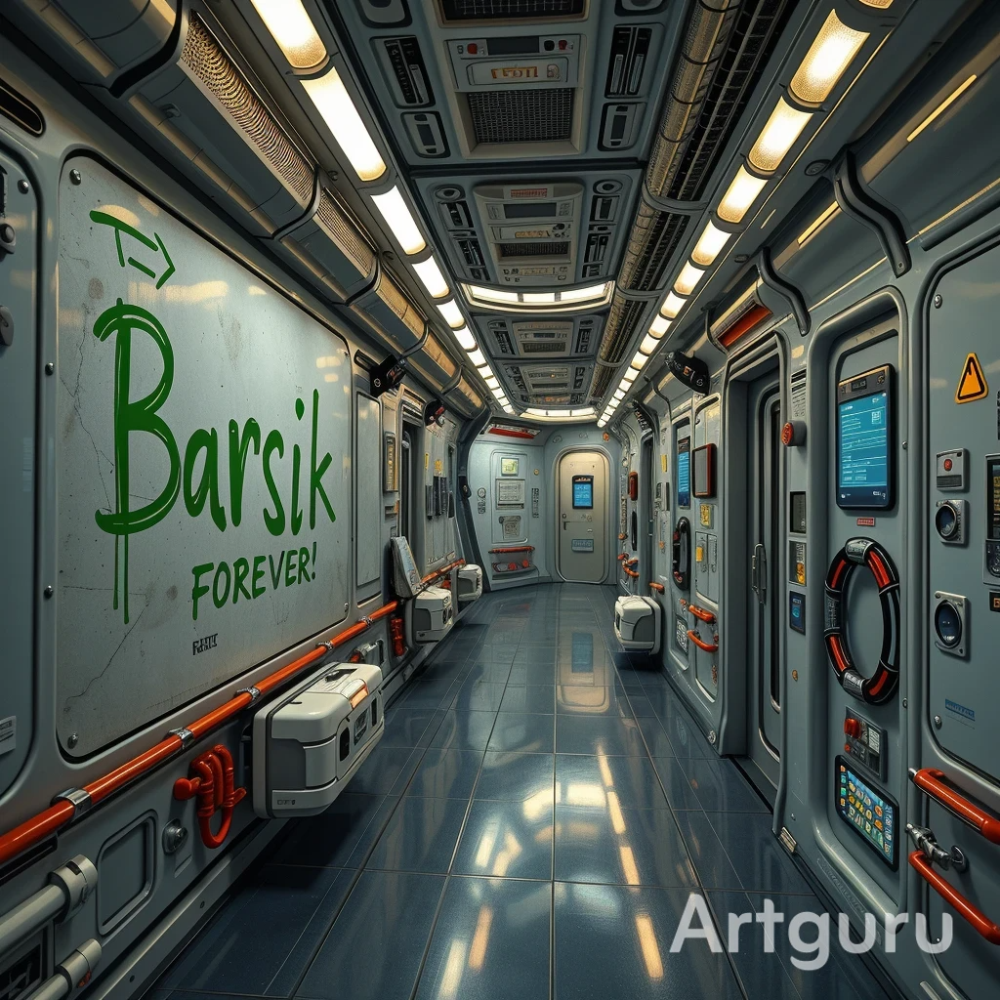

По дороге в Оперативный центр мы с Билли наткнулись на очередную надпись на стене. Надпись гласила: «Барсик утром людям рад, веселит он весь отряд!».

Я остановился и с некоторой усталостью уставился на свежую надпись, выведенную аккуратным почерком.

— Ну вот что это за наскальные надписи? — с возмущением спросил я, повернув голову к Билли.

— Пещерные люди, — поддержал он меня.

— «Барсик утром людям рад, веселит он весь отряд!» — снова перечитал я.

— Четырёхстопный хорей, — бодро прокомментировал Билли.

— Это уже четвёртая надпись за два дня. А вчера на дверях туалета прочитал: «Не горюет и не тужит, С Барсиком кто дружит». — Вот что это такое?

— Типичные образцы позднего городского фольклора, — с улыбкой прокомментировал Билли.

— А ты что, в стихах разбираешься? Откуда ты знаешь про хореи? Ты же разведчик, а не филолог.

— В юности баловался. — смутился Билли. — Мама хотела, чтобы я стал поэтом...

— И что? Не сложилось?

— Стихи получались слишком... военными. «Люблю тебя моя родная, моя любовь как танк — стальная...» Мама плакала. Но не от умиления. — Билли вдруг оживился. — А давайте им ответим! — Он лихо выхватил из кармана маркер и уже было потянулся к стене...

— Билли, ты в своём уме?! Не хватало чтобы ещё мы с тобой начали писать на стенах.

— Ну, капитан, я подумал, если остроумно ответить, то одумаются.

— Ага, одумаются. Так скоро весь экипаж начнёт вести настенную переписку. Вы мне весь корабль за месяц превратите в домовой чат. Дальше что? Графити начнут рисовать? Потом откроем филиалы Лувра и Александрийской библиотеки? Вы где вообще эти маркеры достали?

Билли потупил взгляд: — Там... у Барсика в бункере валялись.

— И что?

— И я взял чёрный...

Это какой-то сюрреализм! Коты, конечно, метят территорию, но кажется, наш «Барсик» превзошёл их всех. Ему даже не нужно ничего делать — его растущая армия фанатов сама метит за него весь корабль... Стихами... Четырёхстопным хореем, чтоб его... Теперь у нас есть собственный домашний питомец и его фан-клуб, который работает активнее и слаженнее, чем связь между мостиком и машинным отделением во время манёвров. Если так и дальше пойдёт, то скоро они создадут «Оперативный штаб Барсика» с графиками дежурств и системой ротации маркеров.

Я представил эту картину: утро, смена заступает на вахту, и первым делом не проверка систем, а изучение свежих стихотворных опусов в коридоре.

Я конечно, хотел, чтоб на корабле стало повеселее, но не до такой же степени!

Так, это написано зелёным. Какой была надпись на туалетной двери я не запомнил.

— Ладно Билли, пойдём.

Но не успели мы пройти и двадцати метров, как нас встретило очередное народное творчество: «Барсик наш теперь герой, мы за Барсика горой!»

— Хорей?

— Хорей. — подтвердил Билли.

— Четырёхстопный?

— Четырёхстопный.

Опять зелёный маркер. Хорей его побери...

— Билли, кто взял зелёный?

Билли сейчас выглядел как нашкодивший ребёнок. Его лицо выражало такую вину, будто он только что продал Ур-Куанам схему обороны Земли.

— Я не видел, — он смотрел куда-то в район моих сапог.

— Билли, а чем ты был занят в тот момент?

— Капитан, я не могу сказать.

Кажется это было вообще впервые, когда я видел Билли таким виноватым и отказывающимся отвечать.

— Это ещё почему?

— Мне стыдно...

— Билли?!

— Ну, я... как бы правильнее сказать... Проверял пишет ли маркер.

— Скажи пожалуйста, — тщательно выговаривая слова обратился я к Билли, — то, что ты написал в том бункере было хотя бы цензурным?

Он молчал с выдержкой, которой позавидовал бы любой разведчик.

— Билли, что... ты... написал? — произнёс я, тщательно отделяя слова.

— Здесь был Билли.

В голове у меня пронеслось: «Дамы и господа! Разрешите представить — Цвет поколения. Элита человечества. Гроза Ур-Куанов! Лейтенант Вооружённых сил Земли. Командир разведывательного отряда нашего флагмана!»

— Так, Билли! Все маркеры собрать! Стены оттереть! Стихи Фиво читать только в устной форме! Всё ясно?!

— Так точно, капитан!!! Разрешите приступать?

— Действуй. Только быстро! И бегом ко мне в Оперативный центр. Через пол часа совещание.

------------

## Глава седьмая. Легионер в космосе

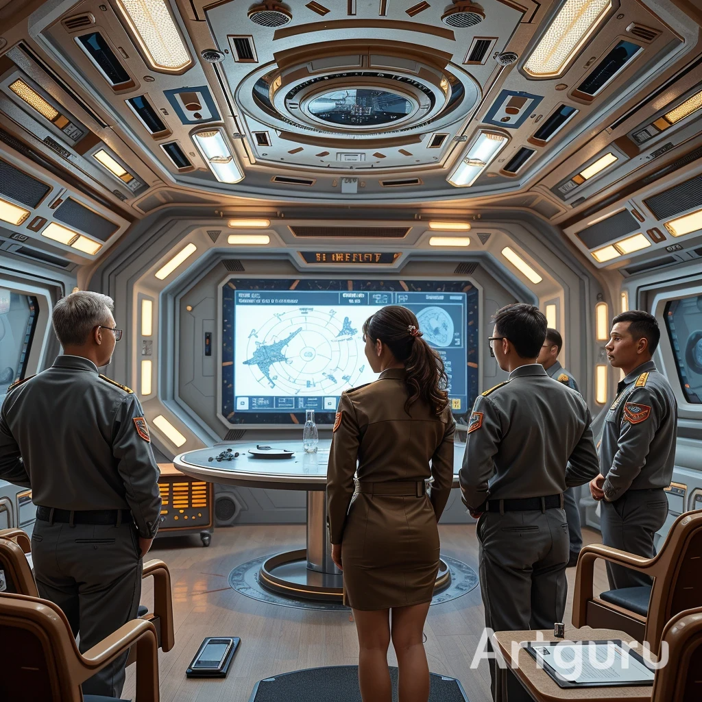

Оперативный центр — мозг корабля — был полон встроенных экранов и пультов управления. Во всю стену светился главный тактический дисплей, его мерцающая синева отбрасывала холодные блики на сосредоточенные лица офицеров. В центре зала, в этой цитадели принятия решений, за массивным стальным столом собрался почти весь командный состав. Последним, слегка запыхавшись, вбежал Билли, выполнявший маркерное задание. Впрочем, он не опоздал.

— Присаживайся, Билли, ждали только тебя, — кивнул я.

Он плюхнулся в кресло, стараясь дышать потише.

— Теперь, когда все в сборе, можно начинать... — Я обвёл взглядом подчинённых. В углу, утонув в кресле, сидел Фиво, стараясь выглядеть как можно менее заметным, но уже без прежней паники. — Я проведу перекличку, а вы отзывайтесь... Уж такой регламент, извините. — Я сделал небольшую паузу, позволив почти незаметной улыбке коснуться уголков губ. — А то с регламентом теперь у нас строго, можно и без компота за ужином остаться... за несоблюдение.

Я бросил взгляд на Малинина. Он был невозмутим, будто высечен из гранита. Конечно, чего ему беспокоиться? Он сейчас упивается собственной находчивостью и бюрократической неуязвимостью.

Я заметил, как Басов краем глаза покосился на Малинина. Тоже хочет оценить реакцию «архитектора наших проблем». Остальные офицеры сохраняли спокойные, служебные лица. Они даже не подозревали, о каком именно «компоте» идёт речь. Но самое интересное — мне показалось, что слегка заёрзал в своём кресле Сильвестр, мой третий помощник. Показалось? Или он в курсе инцидента с водоснабжением?

— Итак, приступим, — голосом, лишённым всяких эмоций, начал я. — Первый помощник, капитан Александр Малинин?
— Здесь, — последовал чёткий, выверенный, как по уставу, ответ. Ни единой лишней интонации.

— Второй помощник, капитан Александр Басов.
— Здесь, — Басов ответил с той же формальной чёткостью, но я уловил в его голосе лёгкий оттенок нашей общей усталой солидарности.

— Третий помощник, капитан Сильвестр фон дер Кампф.
— Присутствую, господин капитан, — его голос прозвучал чуть более вежливо, чем того требовал устав, почти по-аристократически учтиво. Я смотрел за ним внимательно — уж очень мне не понравилось, как он нервно отреагировал на мою шутку про регламент. Но больше ничего подозрительного.

— Четвёртый помощник, лейтенант Карма Сингх, — наш завхоз, невысокий, но широченный в плечах сикх с умными, спокойными глазами и невозмутимым, как Гималаи, лицом.
— Здесь, сэр! — он кивнул с достоинством и такой стальной решимостью, что верилось: пока этот человек у складов, ни одна консерва не пропадёт.

— Командир крейсера «Сокрушительный», лейтенант Игорь Волков.
— В строю! — отрапортовал Волков с той самой жизнерадостной улыбкой, которая пропадала только в особо напряжённые моменты.

— Командир крейсера «Дымящийся», лейтенант Лиза Чен.
— Здесь, — её голос был холоден и чист, как вакуум за бортом.

— Командир разведки, лейтенант Билл Робинсон.
— Так точно! — Билли сидел прямо, но в его глазах читалось облегчение — тема маркеров, кажется, была закрыта.

— Командир Спасского «Зайца»... Фиво.
Последовала короткая пауза:
— Я... э-э-э... вроде как здесь! То есть, я здесь! Определённо здесь!

— Командир флагмана «Арго», капитан Джек О'Салливан. Присутствую.

Теперь, когда процедура соблюдена и весь высший командный состав в сборе, объявляю заседание открытым. Уж извините за долгое вступление, — я развёл руками, — регламент.

Я обвёл взглядом собравшихся.
— Итак, господа офицеры. Мы летим в гости к Умга. Нам предстоит решить несколько вопросов.

Первое: Система для контакта... Основное созвездие Умга — Орион. Ближайшие звёзды в их зоне влияния — Дельта, Гамма и Эпсилон Ориона.

Я открыл на главном экране звёздную карту, где три системы Умга пульсировали оранжевым ореолом.

— Второе: Будем ли мы делать вылазки за ценным сырьём по пути? Есть перспективное созвездие прямо на границе их зоны влияния — Наугольник. Это не крюк, а почти по курсу.

Я прочертил на карте три траектории.

— Вариант первый: по очереди исследуем системы Бета и Альфа Наугольника, а затем летим к Умга на Эпсилон Ориона. Самый короткий путь.

Вариант второй: Дельта и Эпсилон Наугольника. — Оранжевая линия сделала небольшую петлю. — Тут будет небольшой крюк, если исследовать обе системы. Дальше летим к Гамме или Дельте Ориона для контакта.

Вариант третий: Летим сразу к Умга. Быстро, но с пустыми трюмами.

Я обвёл офицеров взглядом, специально задержавшись на Сингхе.

— Карма, насколько заполнены трюмы?
— Сорок три процента, сэр. Места достаточно для серьёзной добычи.

— Сильвестр, вы привели в порядок второй челнок?

Сильвестр поднялся плавно, словно выходил на сцену, и изысканным жестом поправил манжеты.
— Господин капитан, позвольте заверить вас, что второй челнок приведён в безупречное, я бы даже сказал, эталонное состояние. Все системы, без малейшего преувеличения, функционируют в строгом соответствии с техническим регламентом.

— Почему так долго? Я просил заняться этой проблемой ещё во время экспедиции к Ченджесу.

— Капитан, выскажусь с предельной откровенностью. К сожалению, нам пришлось столкнуться с целым рядом более насущных задач, если позволите так выразиться. — Сильвестр плавно развёл руки и изящно, по-аристократически сложил их в замок. — Помимо замены фильтров системы жизнеобеспечения, о которой я уже упоминал, потребовалось экстренное вмешательство в систему стабилизации искусственной гравитации — тот самый досадный сбой в секторе G-7. Затем, конечно же, внеплановая диагностика маневровых двигателей — внезапно проявившаяся асимметрия тяги требовала немедленного вмешательства, калибровка сенсоров дальнего действия, тщательная диагностика гипердвигателя после последнего, не могу не отметить, весьма напряжённого прыжка... — Он сделал многозначительную паузу, давая мне возможность оценить весомость перечисленного. — Вы, как человек глубоко понимающий тонкости корабельной механики, несомненно, осознаёте, сколь пристального внимания требовали эти вопросы.

«Что-то не так, — мелькнуло у меня. — Слишком долго чинили».

— Ясно. Тогда к делу. Я склоняюсь к тому, чтобы пополнить трюмы. Минералы лишними не бывают. — Я облокотился о стол. — Не забывайте, что только благодаря добыче мы можем снабдить флагман новыми отсеками и оборудованием. Именно это даёт нам возможность строить новые крейсера. — Я посмотрел на Лизу, затем на Волкова. — Лично мне было очень неприятно смотреть, как тот «Зонд» несётся к Лизе, а я бессилен помочь. Нам нужно орудие для флагмана.

Волков одобрительно хмыкнул. Лиза, как обычно, была невозмутима, но по её глазам я понял, что мы прекрасно поняли друг друга, и никто из нас не хочет ещё раз пережить подобный момент.

— Ваше мнение, господа?

Малинин поднялся, нарочито отчётливо произнося каждое слово:
— Капитан. Прямой курс к Дельта Ориона. Любая задержка — неоправданный риск. Что касается орудия для флагмана... — он чуть помедлил, — ...сначала следует обеспечить выполнение основной задачи. Оборудование — вопрос второстепенный.

«Ну конечно, — подумал я. — Сиди без зубов, но по уставу. Удобная позиция — всегда можно сказать «я предупреждал», когда что-то пойдёт не так».

— Ещё кто-то? — я перевёл взгляд на остальных, давая понять, что мнение Малинина услышано, но не является окончательным.

Первым, как и ожидалось, поднялся Волков:
— Капитан, я целиком за Наугольник! Моим ребятам нужна практика. Лучше потренироваться на астероидах, прежде чем входить в бой с Умга. И насчёт орудия... — он бросил выразительный взгляд на Малинина, — ...зубы нужны, чтобы кусаться. А не просто для красоты, как некоторые думают.

Лиза Чен кивнула, всё так же сдержанно:
— Поддерживаю вариант с Наугольником. Лучше Бета и Альфа, где минимальный крюк и максимальная выгода. Что касается орудия... — её взгляд скользнул по моему лицу, — ...флагман не должен быть беззащитным. Только не подумайте, что я беспокоюсь за себя, но если не будет Волкова и меня, кто защитит флагман?

Все прекрасно понимали, что стоит за этим «если не будет Волкова и меня», но никто не решился что-либо добавить.

— Лейтенант Сингх? — обратился я к завхозу.

— Сэр, в этом и есть моё предназначение. Вы добываете сколько сможете, а я складирую так, чтобы поместилось ещё немного. — Сикх говорил с невозмутимостью горного потока. — Я за Наугольник.

Басов, до сих пор молчавший, слегка наклонился вперёд:
— Капитан, вариант с Наугольником даёт нам дополнительное время для анализа тактики Умга и тренировок. Это может оказаться ценнее любых минералов.

В этот момент Сильвестр поднялся с мягкой, почти невесомой грацией, его лицо выражало благородную озабоченность:
— Господин капитан, если позволите... — он изящным жестом поправил воротник. — Не могу не присоединиться к здравому смыслу, высказанному коллегами. Заход в Наугольник — это не просто пополнение запасов. Это демонстрация нашей основательности и предусмотрительности. — Он многозначительно посмотрел на Малинина, затем на меня. — Иногда кажущееся отклонение от прямого курса является единственно верным путём к цели.

«Искусно, — подумал я. — Не просто поддержка, а возведение моего решения в ранг высшей стратегической мудрости, одновременно подчёркивая ограниченность подхода Малинина. И всё это — с видом заботливого советника».

Я выдержал паузу, дав себе немного времени оценить этот мастерский ход, а затем поднялся.
— Благодарю всех за высказанные мнения. — Я посмотрел на карту, где всё ещё светились три траектории. — Летим через Наугольник. Бета и Альфа, затем на Эпсилон Ориона. — Мои пальцы провели окончательную линию на экране.

Я видел, как Малинин сжал губы, но промолчал. Сильвестр же, поймав мой взгляд, чуть заметно кивнул — так, будто он был главным союзником в этом решении.

— Теперь главное: битвы, увы, не избежать. Каждый раз после «дружеской» беседы нас будут поджаривать. Нужно выработать тактику...

Хотя корабли Умга сами по себе очень слабы, земной флот всегда старался избегать боя с ними, потому что не мог эффективно им противостоять.

Я вывел на экран схему «Дрона» Умга.

— Напоминаю характеристики: Во первых, они очень-очень медленные. Медленнее земных крейсеров. Во вторых, вооружение — мощнейший дезинтегратор, но очень маленького радиуса действия. И если бы это было всё, они бы не представляли опасности. Крейсера расстреливали бы их с почтительного расстояния, не давая им приблизиться. Но у «Дронов» есть одна особенность. — Я сделал паузу. — Реверсионный двигатель, развивающий невероятную скорость. Они разворачиваются задом, как будто собираются выйти из боя, и внезапно — бац! — уже у тебя на хвосте. Наши крейсера просто не в состоянии быстро выйти из зоны поражения. Первое же такое сближение зачастую заканчивается плачевно. Именно поэтому Альянс предпочитал выставлять против них более манёвренные корабли. Нам же придётся справляться тем, что есть. — Я посмотрел на собравшихся. — Ваши предложения, господа.

Следующие полчаса прошли под знаком растущего безумия. Мы перебирали варианты, и эфемерный огонёк надежды, вспыхивавший при рождении каждой новой идеи, гас с удручающей регулярностью, оставляя после себя лишь горький дым разочарования. Каждый новый вариант, как бы сильно мы ни старались, оказывался хуже предыдущего. Я чертил на экране схемы, стирал их и чертил снова. Волков предлагал массированные лобовые атаки, Чен — какие-то сложные манёвры, Малинин — варианты, как можно попытаться сохранить дистанцию. Но все эти построения рассыпались в прах при первой же эмуляции боя.

Тишина стала тягучей и звонкой. Я видел, как Басов бессильно сжал кулак, а Чен отвела взгляд от экрана, на котором тактическая схема превратилась в кладбище неудачных решений. Мы упёрлись в стену, и все это понимали. Наши крейсера были слишком медленными.

Билли поднял голову. Его взгляд, пустой от бессилия, медленно пополз по комнате, зацепился за Волкова, перешёл на Чен, скользнул по непроницаемому лицу Басова и наконец остановился на Фиво, который безуспешно пытался раствориться в углу. Его взгляд, до этого пустой и уставший от бессилия, начал медленно менять выражение. Сначала в нём появилась рассеянная осмысленность, будто он увидел что-то знакомое, но не смог сразу понять что... Потом зрачки сузились, а взгляд стал острым, цепким. Ещё пара коротких мгновений — и он уже смотрел на него как удав на кролика.

Волков, сидевший напротив, перестал чертить что-то на столе и поднял голову, его глаза, проследив за взглядом Билли, тоже уткнулись в Фиво, и мгновенно расширились. Та же мысль, тяжёлая и неотвратимая, отразилась на лице Лизы Чен. А затем, словно подхваченная цепной реакцией, эта немая догадка прокатилась волной по всему залу. Даже Басов перестал изучать кончики своих пальцев и медленно поднял взгляд.

Кажется, нас всех осенило одновременно и в наступившей тишине эта мысль прозвучала как приговор: Единственное по-настоящему манёвренное, что есть на нашем корабле и может хоть как-то противостоять реверсу Умга... это спасский «Заяц»!

Все смотрели на Фиво. А он сидел, вжавшись в кресло, и его единственный, широко открытый глаз бегал по нашим лицам. Он понял, о чём все думают. Понял раньше всех.

— Я... — его тихий голос сорвался. Он сглотнул и попытался снова: — Я не могу... — Фиво закрыл глаз на мгновение, словно собираясь с духом. В его голосе слышалась не паника, а горькая, выстраданная решимость: — Я боюсь...

Я обвёл взглядом собравшихся.
— Так, ребята, я очень прошу всех выйти ненадолго. Мне нужно поговорить с Фиво наедине.

Офицеры начали молча подниматься, но в этот момент тишину нарушил Малинин:
— Капитан, это прямое нарушение регламента проведения оперативных совещаний. Пункт 4.12 чётко гласит...

— Алекс, — я даже не дал ему договорить, — выведи капитана Малинина из помещения. Если будет сопротивляться — можешь применить силу.

— Есть, капитан. — отрапортовал довольный Басов.
Он что, улыбнулся, или мне показалось? — не поверил я своим глазам.

— Можешь сразу к ближайшему терминалу, где он не откладывая в долгий ящик сможет написать на меня очередной рапорт о нарушении, чтобы мне теперь ещё и канализацию отключили... — я посмотрел на старпома, — И учтите, Малинин, в этом случае я буду делать это у вас под дверью... Всё. Теперь оставьте нас.

Когда дверь закрылась, я повернулся к Фиво.
— Фиво, давай представим, что ты ни с кем сражаться не будешь...

И в этот момент он выдохнул с таким шипящим свистом, словно в паровом котле открылся предохранительный клапан, который сбросил избыток давления. Я даже чуть не вздрогнул от такой неожиданной реакции. Но это хорошо, — подумал я, — теперь, когда отступил этот всепоглощающий страх, можно будет хоть что-то донести до его сознания.

Следующие пять минут я рассказывал ему, как теоретически (я не забывал повторять этот термин почаще) мог бы действовать «Заяц» против «Дрона». Кажется, он даже немного расслабился. Для него сейчас это были просто изображения корабликов, на сражение которых он смотрел со стороны.

... — А если он начинает разворачиваться задом, то «Заяц»... — я намеренно употреблял название корабля вместо личного местоимения, чтобы он, не дай бог, не представил себя в кабине и его бы опять не переклинило. — ...вот видишь, тогда «Заяц» сразу начинает максимально разрывать дистанцию, чтобы у него было больше времени на манёвр уклонения... А когда он включает реверсный двигатель, «Заяц» сразу закладывает вираж 90 градусов и уходит с линии движения «Дрона»...

Я посмотрел на Фиво... — Извини, друг, — мысленно сказал я, — но сейчас придётся тебя виртуально переместить в кабину «Зайца».

— Вот таким способом ты сможешь легко справляться с Умга «Дронами».

Фиво остолбенел. Осознание накрыло его с новой силой: речь идёт не о гипотетическом сражении двух кораблей, а о его непосредственном участии в этом сражении.

— Я боюсь, капитан...

— Фиво... Друг. — я придвинулся ближе. — Давай я расскажу тебе одну историю... Во времена великой Римской империи, когда римские легионы наводили страх на врага самим своим видом, один стратег сказал: «Мало кто рождается храбрецом. Большинство становится храбрецами благодаря дисциплине и тренировке». — И я знаю, ты сможешь. — я пристально посмотрел в его единственный, бегающий от страха глаз. — Я верю в тебя!

Я указал на дверь:
— Посмотри туда. Там стоят Игорь и Лиза... — при слове «Лиза» Фиво встрепенулся. Кажется, за последние недели эта холодная, как лунный лёд, женщина неожиданно для всех стала его лучшим другом. Она не требовала храбрости, не подшучивала над ним, а просто молча делилась с ним чаем, печеньками и слушала его сбивчивые рассказы о Спассиве, его родном мире. И сейчас он представил, как «Дымящийся» вспыхивает под разрушительным лучом дезинтегратора, и его лучший друг исчезает навсегда, оставляя после себя лишь безмолвную пустоту космоса. И кажется, в этот момент страх потери друга перевесил в нём все предыдущие страхи.

— Я... я просто зажмурюсь и нажму газ... А дальше... нужно просто маневрировать и использовать самонаводящуюся ракетницу в корме корабля...

В этих простых, выстраданных словах не было решимости, но всё же это была своего рода клятва. Тихое и дрожащее согласие сражаться. Я почувствовал, как огромная тяжесть упала с моих плеч и сменилась почти отцовской гордостью.

— Вот и отлично! — я обнял его, и улыбка сама появилась на моих губах. — Мы сделаем из тебя настоящего римского легионера!

------------

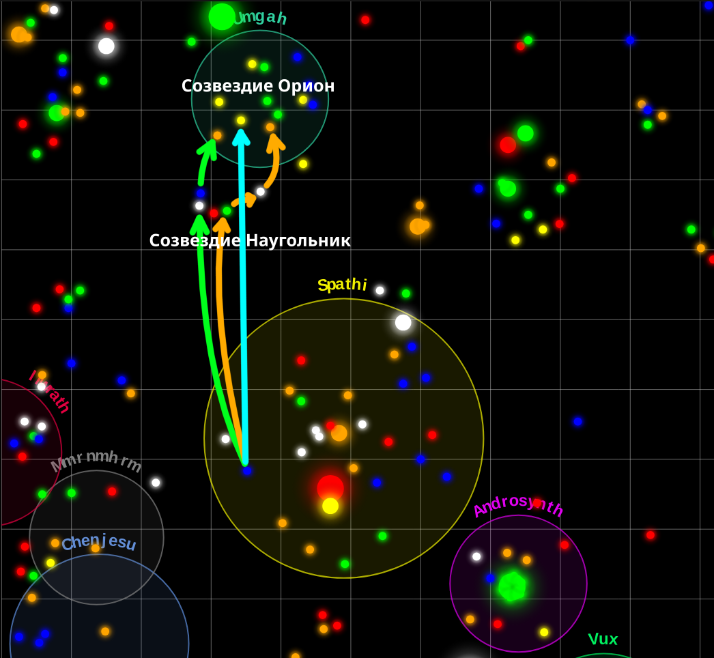

------------
------------
------------

## Глава восьмая. Две тени за спиной капитана

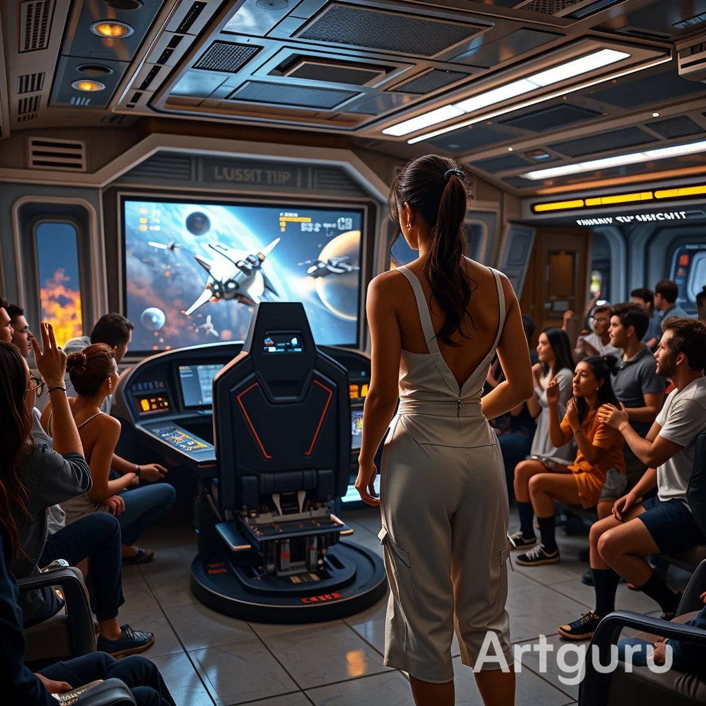

Третья неделя перехода к Бете Наугольника тянулась томно и однообразно. «Арго», затерянный в бархатной пустоте гиперпространства, превратился в летучего голландца космоса, в замкнутый мирок, где реальность причудливо переплелась с легендой.

С одной стороны — серая, будничная реальность. В которой Малинин, как я и думал, побоялся подавать на меня очередной рапорт, хотя инцидент на совещании, где Басов вывел его чуть ли не за руку, давал ему формальный повод. Но он явно недооценил реакцию офицерского состава. Он был тактиком бюрократической войны, а не полководцем. Одно дело — втихаря делать мелкие пакости, и совсем другое — выйти с открытым забралом на превосходящего тебя по численности и боевому духу противника. Но я знал его: он не сдастся. Он залёг на дно, как подводная лодка, и его молчание куда опаснее его докладных. А пока кипучая энергия старпома находила выход в терроризировании рядового состава: внезапных проверках и придирках к всевозможным незначительным нарушениям. Но экипаж быстро научился жить с этим, как с фоновым шумом.

С другой стороны — космическая сага, главным героем которой стал Фиво. Легенда где вокруг одного робкого существа неожиданно закипела невероятно интенсивная бурная деятельность. Он стал магнитом, к которому устремились все чаяния, энтузиазм и вера команды. И если бы мне год назад сказали, что сердцем и душой этого стального корабля станет дрожащее от страха существо с щупальцами, я бы посоветовал проверить психическое здоровье говорящего. Но времена меняются.

А началось всё прозаично: Поначалу Фиво тренировался на симуляторе в довольно тесной специализированной симуляторной комнате, но внезапно вспыхнувший ажиотаж экипажа всколыхнул корабль куда сильнее, чем любая турбулентность. Матросам и техникам надоело толпиться в дверном проёме, пытаясь украдкой взглянуть на это виртуальное побоище. В итоге ко мне поступило официальное обращение! Самая что ни на есть настоящая петиция с формулировкой, достойной народного вече: «о временном переносе тренажёра пилотов в помещение комнаты отдыха в целях повышения боевого духа личного состава и моральной поддержки оператора». Документ, под которым стояли несколько десятков подписей, и даже пара шуточных рисунков Барсика, сражающегося с «Дроном», был подан мне с торжественной серьезностью, не оставлявшей сомнений в важности просьбы.

Я не стал возражать. Здраво рассудив, что Фиво сейчас важна любая поддержка, а искренний энтузиазм экипажа вселяет уверенность лучше любого приказа, и я наложил резолюцию: «Не возражаю. Обеспечить».

То, что последовало дальше, можно смело назвать маленьким чудом. Громоздкий симулятор, чья официальная процедура переустановки занимает семьдесят два рабочих часа, был разобран, перенесён и собран на новом месте силами добровольцев буквально за одну смену. Это был не перенос, а народная стройка. Техники, забыв об отдыхе и обеде, с азартом разбирали кабельные трассы. Матросы таскали блоки аппаратуры, координируя действия чёткими, интуитивными жестами, словно делали это всю жизнь. А Карма Сингх лично принес ящик с прохладительными напитками «для рабочих», что было высшим знаком одобрения.

И вот теперь симулятор, громоздкий и величественный, стоял в углу просторной комнаты отдыха.

Воздух комнаты отдыха, обычно пахнущий тоской и переработанным кислородом, теперь был наполнен энергией предвкушения. И когда Фиво, что-то стеснительно бормоча, занимал своё место, его окружал не холодный свет ламп, а тёплое, одобрительное молчание десятков людей, видевших в нём не неудачника-Спасси, а своего героя. И это, возможно, был самый главный тренажёр — тренажёр веры в себя.

Наш новоявленный легионер за эти недели буквально сросся с боевым симулятором. Его жизнь превратилась в бесконечную, изматывающую схватку с виртуальными «Дронами». Но самым невероятным зрелищем был даже не его медленный, но верный прогресс, а метаморфоза, произошедшая с Лизой Чен... Наша «снежная королева», чьё лицо обычно хранило ледяное спокойствие, превратилась в его личного тренера, в сурового и безжалостного адепта пути воина. Её стройная фигура, как мраморная статуя, неподвижно стояла возле кресла пилота, и лишь её ровный, холодный голос был саундтреком к этому виртуальному побоищу:

«Он разворачивается. Реверс. Сейчас будет реверс. Вираж девяносто, сейчас! Ракеты, не жди! Выпускай ракеты!»

И когда юркий «Заяц» на гигантском экране успевал в последний миг увернуться от ослепительного прожектора дезинтегратора, у неё на лице появлялась короткая, сдержанная, но совершенно однозначная улыбка одобрения.

А вокруг симулятора образовалось нечто вроде античного амфитеатра. Матросы, техники, даже повара из камбуза — все, у кого появлялась свободная минута, приходили смотреть на сражения и болели с таким азартом, будто это был не тренировочный бой, а финал чемпионата мира. И каждый раз, когда кораблик Умга взрывался яркой вспышкой, по отсеку прокатывалось гулкое, ликующее «Ура!».

Парадокс в том, что наш робкий Фиво, которого ещё недавно все жалели, сам того не ведая, сплотил экипаж прочнее любой уставной дисциплины.

А в другом углу комнаты отдыха кипели не менее интересные литературные страсти. После моего строгого запрета на «наскальную живопись» кто-то догадался повесить в комнате отдыха большую белую доску. Теперь весь поэтический вандализм был локализован и легализован. Выяснилось, что самый плодовитый и популярный поэт — зелёный маркер. Вслед за ним шёл синий, замыкал тройку лидеров оранжевый. Они вели свою ожесточённую битву. Битву за умы и сердца экипажа.

Однажды, проходя с Билли мимо комнаты отдыха, мы остановились у поэтической доски, которая изобиловала новыми творениями.

— А что же чёрный маркер? Не даст им бой? — спросил я, глядя на пёстрое полотно, усеянное стихами о «Барсике-Герое» и «Барсике-Спасителе».

Билли улыбнулся, и в его глазах мелькнула лёгкая ностальгия.

— Я давно повесил перчатки на гвоздь, капитан.

— И совсем не хочется вернуться в большой спорт? — Я приподнял бровь, изучая его выражение лица.

— Нет, капитан. — Он лишь развёл руками, и улыбнулся с лёгким смирением и умиротворением. — Большой спорт не для меня.

— А что там дальше было с танком? — не сдержал я улыбки.

Билли на мгновение застыл, пытаясь сообразить о чём вообще речь.

— С каким танком?

— Ну, «Люблю тебя моя родная, моя любовь как танк — стальная...» — начал я нараспев.

— А-а... — рассмеялся он так заразительно, что в уголках его глаз собрались лучики морщин. — «Пусть грянет гром, пусть вьюга воет, моя броня тебя укроет!»

Я посмотрел на доску. Среди четверостиший о Барсике-герое зрелый, опытный чёрный маркер смотрелся бы как Ван Гог на детском конкурсе.
— А мне кажется, чёрный маркер очень даже зря повесил перчатки на гвоздь! Он мог бы ещё дать бой молодёжи!

— Да что вы, капитан! Там уже целый «Литературный кружок» оформился, — пояснил Билли. — Стихи о Барсике вышли на новый уровень. Появился анонимный поэт, пишущий уже не четверостишия, а целые поэмы в стиле космического эпоса о «Подвиге Барсика против Синей Искры». Их зачитывают по вечерам прямо тут, под одобрительный гул. А потом вывешивают вон там, правее. — Он указал на лист, прикреплённый сбоку от доски. Поэма заканчивалась мощно:

...И в синем вихре, страха не тая,

Взмывает «Заяц», властелин огня!

«Вы все бегите прочь с дороги!

Я Барсик! Меня боятся даже боги!»

— Талант! — отметил я, чувствуя, как растёт моё уважение — Похоже на зелёного.

— Похоже, — согласился Билли. — Но мы всё ещё не знаем, кто это. Он тщательно скрывается.

Я позволил себе ещё немного поглазеть на это народное творчество с выражением блаженного умиления, прежде чем вернуть на место деловое выражение лица.

— Но это ещё не всё, — воодушевлённо продолжил он. — Творчество нашего экипажа не ограничивается только стихами. Один из техников — Дживо Кумар, вы его знаете, тот самый, что с золотыми руками, вдохновлённый подвигом Фиво, собирает в своём цеху из списанных деталей уменьшенную, идеально детализированную модель «Зайца» в масштабе 1:100. Говорят, он даже хочет подсветку внутри сделать, чтобы глаз Фиво светился зелёным огоньком.

А ещё один умелец — рядовой Хендрикс, рисует комиксы о приключениях Барсика в космосе, которые расходятся быстрее, чем горячие пирожки!

Билли замолчал, и улыбаясь, обвёл взглядом поле поэтической битвы.

— Кстати, ты провёл инспекцию второго челнока? — вернулся я к делам.

— Провёл. Всё сделано качественно, добротно, и я с чистой совестью подписал акт приёмки. — Билли поморщился. — Один индикатор, правда, там чудит, но он и на первом челноке такой же — похоже, вся партия бракованная. Я не стал придираться.

— Это правильно, — кивнул я. — Если мы начнём уподобляться Малинину и цепляться к каждой мелочи, корабль превратится в концлагерь. А мне нужно, чтобы экипаж был сплочённым и поддерживал друг друга, а не маршировал лицом в пол, заложив руки за спину. Сильвестр, поди, обрадовался, что ты не стал его терроризировать из-за индикатора?

— Ещё как! — Билли весело хмыкнул, и перешёл на пародийно-аристократические интонации, удивительно точно копируя манеру третьего помощника: — «Лейтенант Робинсон, ваша прагматичность и умение отделять существенное от второстепенного вызывают глубочайшее уважение. Подобный подход, надо сказать, нечасто встретишь среди представителей... боевых шахтёров».

Я усмехнулся. Какой-то он всегда чересчур учтивый. И вот это лёгкое, почти неосязаемое пренебрежительное «боевых шахтёров», приправленное безупречной вежливостью. Я слегка поморщился.

— Интересно, кем он был на Веле?

— А вы разве не знаете? — Билли посмотрел на меня с искренним удивлением. — Это его сначала хотели назначить командиром этого корабля.

Меня будто током ударило. Удивление, вероятно, было написано у меня на лице крупными буквами. Увидев такую реакцию, Билли даже немного смутился.

— Я думал, вы в курсе.

— Нет, — медленно проговорил я, чувствуя, как в мозгу щёлкнул какой-то переключатель. — А почему не назначили?

Билли оглянулся и отвёл меня в сторону, подальше от пары матросов, горячо спорящих о рифме к слову «Спасси».

— Да я точно не знаю, капитан. Но ходили слухи... очень странные. Как-то он себя повёл... неадекватно. Ну, а потом уже вас назначили.

«Неадекватно»? Сильвестр фон дер Кампф? Этот лощёный аристократ, чьи манеры отточены как бритва? Тот, кто всегда говорит правильные слова и чья любезность порой кажется неестественной? Что он мог такого сделать или сказать?

— А ты не припомнишь, что именно он сделал?

— Да говорили, его рассуждения были похожи на жёсткую, циничную математику. Будто он раскладывал всё по полочкам, без всяких эмоций. Мол, если для достижения стратегической цели потребуется пожертвовать третью экипажа — это приемлемая цена. Если нужно бросить крейсер на верную гибель, чтобы флагман ушёл, — это логично и оправданно. Поговаривают, начальству это не понравилось. Решили, что такой циник не может командовать таким количеством ЖИВЫХ людей. Что он глазом не моргнёт, отправив их на бойню.

Вот оно что. Это был не просто карьеризм. У Сильвестра была своя, чёткая и, вероятно, бесчеловечная идеология. И он, выходит, считал, что корабль и миссия должны были достаться ему. Он видел себя не капитаном-собирателем, а капитаном-трибуном, готовым на любые жертвы. Он бы, вероятно, не отступил от тех зондов... Бросил бы крейсера Волкова и Чен в мясорубку, посчитав потери оправданными... А теперь он мой третий помощник. Идеально вписывался в команду. Горячо поддерживает мои решения...

— Понятно, — сказал я, ощущая, как в голове складывается новая, тревожная картина, словно пазл из осколков тёмного стекла. — А почему его тогда вообще рассматривали на роль командира флагмана? Откуда такая высокая стартовая позиция?

— Так он же был командиром крейсера, на котором прибыла первая экспедиция на Велу, — сказал Билли, как о чём-то само собой разумеющемся.

— Так вот оно что! — выдохнул я. От этой новости у меня перехватило дыхание. Теперь понятно откуда корни его амбиций и его холодной уверенности! — Ты прямо вываливаешь одну новость за другой. Я где-то случайно у тебя внутри не открыл ящик Пандоры?

Билли смущённо улыбнулся.

— Я думал, это общеизвестный факт.

— Но мы же вылетели с Велы с «Сокрушительным», это ведь тот самый крейсер? Его, получается и оттуда сняли?

— Именно так. Его сняли с командования, крейсер передали Волкову, а Сильвестра... понизили до третьего помощника на флагмане.

«Оч-чень интересно... — Мысли пронеслись вихрем. — Похоже, наш Сильвестр не так-то прост. Он не просто обиженный карьерист. Он — падший князь, вынужденный прислуживать тому, кого он, вероятно, считает выскочкой. И он выжидает. Но чего? Своего часа? Моей ошибки? Надо держать с ним ухо востро.»

— Ладно Билли, спасибо, что рассказал. Не распространяйся пока об этом.

— Так точно, капитан.

Я снова посмотрел на доску со стихами, услышал отдалённый гул триумфа, долетевший со стороны симулятора... Мой корабль был полон жизни, юмора и преданности. Он был тёплым, шумным, почти родным. Но под этой живой, пульсирующей поверхностью, в её теневой, холодной части, тихо шевелились две очень разные, но равно опасные угрозы. Одна — в лице педанта, вооружённого уставом. Другая — в лице аристократа, вооружённого холодным, безжалостным расчётом.

И пока мы летели навстречу «Дронам» Умга, настоящая, тихая и необъявленная война уже вовсю шла прямо здесь, на борту «Арго». И я должен быть готов сразиться на обоих фронтах.

------------

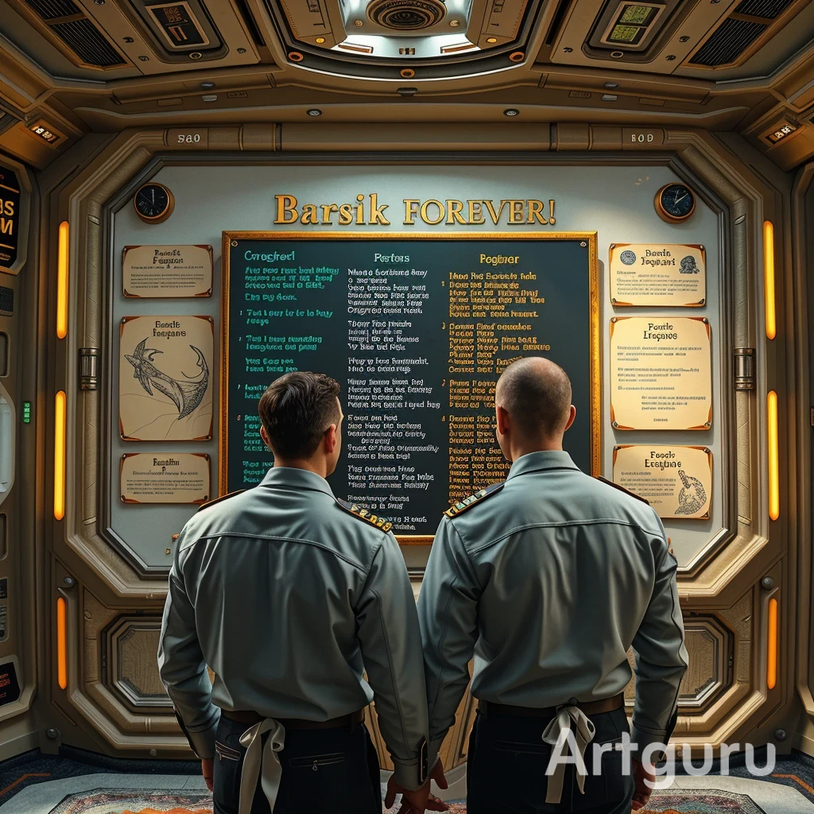

------------
------------
------------

## Глава девятая. Жребий брошен, или Рубикон длиной в коридор

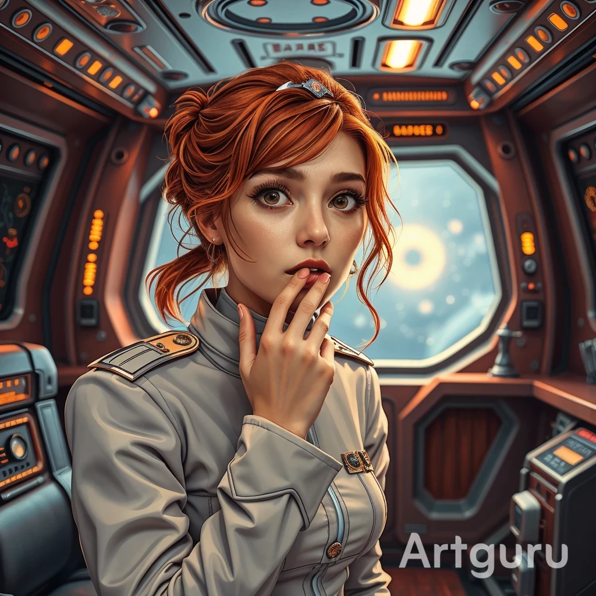

— Совсем немного осталось, капитан, — Басов откинулся в кресле, впервые за несколько часов оторвавшись от мониторов. Его пальцы сами собой потянулись к пластиковому контейнеру с орешками — тайному запасу, о котором знали только мы. — Гиперпространственное поле почти сошло на нет. Ещё пять-десять минут, не больше.

Я кивнул, глядя на главный экран, где алое зарево гиперпространства медленно угасало, уступая место безжалостной черноте космоса. С гиперпространством всегда так — ни в каких расчётах нельзя быть уверенным наверняка. Даже Басов, педант, превративший точность в форму искусства, мог дать лишь приблизительную оценку.

— Алекс, навигационные карты обновили? А то летаем по манускриптам, которые актуальны на момент конца войны. — я с силой растёр переносицу, ощущая накопившуюся усталость. — Они устарели уже лет на двадцать. На них до сих пор отмечены сферы влияния Ченджесу и Мур-муров, которых уже нет, а в их пространстве повсюду кишат Ильрафы, чего на картах, наоборот, не отмечено. Чувствуешь себя археологом, а не капитаном.

— Карты и правда больше напоминают исторический архив, — согласился Басов. — Однако я вчера ударно поработал и загрузил все последние обновления. Внёс всё, с чем мы сталкивались в последнее время. — Он перекинул на мой персональный экран слоистую карту.

Я видел полупрозрачные контуры старых границ, поверх которых светились новые данные, добытые нами ценой пробоин и тревог. Появились новые сферы влияния: Ильрафов и Ур-Куанов (предположительно). И в то же время исчезли старые: Ченджесу, Мур-муров, Спасси... И это вызывало какое-то щемящее чувство. Целые цивилизации, покорившие космос, были загнаны на свои планеты под рабский щит или вовсе перестали существовать.

— Теперь это лучшее, что у нас есть, — заключил Басов. — Будем обновлять их по мере поступления новых данных... Или по мере того, как сами будем эти данные создавать.

— А как там наш легионер? — спросил я, переводя взгляд на значок «Зайца».

На экране всплыла статистика Фиво. Цифры и графики говорили сами за себя.

— За последние двое суток — четырнадцать часов в симуляторе, — констатировал Басов с ноткой профессионального одобрения. — Результативность против «Дронов» стабильно растёт. Лейтенант Чен лично проводит с ним по три тренировочные сессии в день.

— Откуда у неё берётся столько терпения?

— Согласно моим наблюдениям, она находит его... человечным и... по-детски наивным. — Басов мельком взглянул на меня. — Сказала, что у него «здоровое, не испорченное цинизмом мировосприятие». Я процитировал дословно.

Значит, она разглядела в этом дрожащем комочке нервов что-то настоящее. Алмаз, требующий огранки. Страшно подумать, какую сталь она выкует из этого «человечного» материала.

— А что там у нас по системам?

— Все системы в норме. Командиры крейсеров докладывают о готовности в любой момент занять боевые посты. Билли уже выходил на связь. Говорит, что его команда «сгорает от нетерпения окунуться в неизведанное и найти наконец что-нибудь эдакое...».

Я представил Билли, который наверняка уже в третий раз проверил герметичность каждого скафандра, и усмехнулся.

— Прекрасно. Значит, встречаем реальность во всеоружии. — Я обвёл взглядом мостик. Привычная, отработанная до автоматизма церемония пробуждения корабля. — Как думаешь, насколько эти древние карты нас подведут на этот раз?

— Допускаю погрешность в полмиллиона километров, — без тени улыбки ответил Басов. — Но, как говорится, это добавит остроты ощущений.

Пятнадцать секунд, — его голос вновь стал твёрдым и сосредоточенным. Он сфокусировался на мониторах и привычно обхватил рычаги тонкой коррекции. — Готовьтесь к переходу.

Я глубоко вдохнул, чувствуя привычное напряжение перед возвращением в нормальное пространство. За иллюминатором бушевали алые вихри гиперпространства, закручиваясь в последний, бешеный танец.

— Три... два... один... Выход.

Алая пелена за иллюминатором схлопнулась в сверкающую точку и исчезла, уступив место бездонной пустоте, усеянной ледяными бриллиантами звёзд. А в центре этого великолепия, затмевая всё своим холодным сиянием, горела белая звезда Беты Наугольника — самый огромный и совершенный алмаз в величественной небесной диадеме.

— Выход завершён. Координаты... в пределах расчётных, — отчёт Басова был сух и точен. — Погрешность триста тысяч километров. Приступаю к сканированию.

Я не сводил глаз с экрана. Посмотрим, что за сокровища хранит для нас эта одинокая звезда.

Первые мгновения в новой системе всегда были самыми тревожными. Тишина перед возможной бурей. И длилась она ровно до того момента, пока голос Басова не разорвал её пополам, а с ней и наши надежды на спокойную разведку.

— Капитан, у нас проблемы! — Голос Басова был подобен лезвию ножа — холодный и острый. Он указал на главный экран, где десятки кораблей Умга были разбросаны по всей системе, словно рой металлической саранчи на стерильно-чёрном бархате космоса.

Кажется, где-то я уже это слышал...

— Это что такое? Засада? — вырвалось у меня. Адреналин резко и знакомо ударил в виски. — Откуда они здесь? До их сферы влияния ещё несколько дней пути!

Басов, не отрываясь от экрана, покачал головой. Его пальцы уже летали по панели, разворачивая тактическую карту.

— На засаду не похоже. Они не сконцентрированы. Движутся хаотично. Судя по энергетическим следам и траекториям... они занимаются обычной хозяйственной деятельностью. Собирают ресурсы, буксируют астероиды. Нас пока не видят. — Он на мгновение встретился со мной взглядом. — Или делают вид, что не видят.

От этого легче не стало. Рой на пасеке тоже выглядит мирным...

— Алекс, срочно. Готовность номер один! — скомандовал я, и через секунду по всему кораблю завыли сирены.

Я представил, как сейчас по всем палубам, словно муравьи из растревоженного муравейника, бросились на свои боевые посты матросы, техники и экипажи крейсеров. Заскрипели люки, защелкали переговорные устройства, загудели механизмы подготовки орудий.

— Внимание, боевая тревога! Все по местам! Экипажам «Дымящегося» и «Сокрушительного» подготовиться к возможному выходу из ангара! — голос Басова, абсолютно бесстрастный, разносился по кораблю, внося в нарастающий хаос привычный порядок.

Я видел на мониторах, как загораются индикаторы готовности крейсеров. Волков и Чен уже докладывали о занятии позиций.

— Перекличка! — скомандовал я. — «Дымящийся»?

— В строю, орудия готовы к бою! — чёткий голос Лизы.

— «Сокрушительный»?

— Готовы к веселью, капитан! — отозвался Волков, но в его голосе не было и намёка на веселье, лишь стальная хватка.

— Разведка?

— Мы тоже на местах, капитан. На всякий непредвиденный случай! — доложил Билли. — Хотя, как я понимаю, вылазка за минералами отменяется... Эх, а там такая перспективная планетка на сканах светилась...

И тут я осознал, что не хватает одного, самого важного на сегодня голоса.

— А где Фиво? — спросил я, обводя взглядом мостик. — Кто-нибудь его видел?

Воцарилась неловкая пауза. Басов нахмурился и начал пролистывать данные с внутренних камер.

— Может, спит? — предположил кто-то из операторов.

— В такой-то тревоге? — я встретился взглядом с Басовым. — Проверь его каюту.

— Датчики биологической активности в каюте: пусто, — почти сразу доложил Басов, не отрываясь от экрана. — Система жизнеобеспечения не фиксирует его ни в одном из жилых отсеков.

Камеры не находят его ни в машинном отделении, ни в медблоке. Нигде нет, капитан, — наконец констатировал Басов. — Ни на камбузе, ни в столовой, ни... в моём санузле.

— У тебя что, в санузле камеры стоят? — ошарашенно спросил я.

Басов повернулся ко мне — живое воплощение безупречной служебной выдержки.

— Капитан, вы серьёзно? Вы действительно хотите обсуждать это сейчас? Вы же прекрасно знаете регламент видеонаблюдения. В личных каютах и санузлах — только датчики присутствия.

Я махнул рукой. В стрессовых ситуациях его чёрный юмор всегда доходил до меня с опозданием.

— Куда он мог деться? — мозг лихорадочно перебирал все возможные и невозможные места.

Тревожные мысли множились, как грибы после дождя.

— Сингх, — я обратился к завхозу по связи. — Он у тебя среди ящиков не спрятался, по старой памяти?

— Уже проверил, сэр, — донёсся спокойный голос сикха. — Всё опечатано, контейнеры целы.

— Может, в гидропонной оранжерее? — раздался голос Волкова по общему каналу. — Там тепло и влажно, он же, вроде, такое любит?

— Проверяю, — откликнулся Басов. — Нету, капитан... И в грузовых трюмах, и в фильтрационных отсеках... нигде.

Пауза затягивалась. На мостике все старались не смотреть друг на друга. Все помнили, как Фиво мастерски прятался даже от воображаемых угроз, а теперь, когда опасность стала реальной, он мог забиться в самую микроскопическую щель.

— Алекс, расширь сканирование на вентиляцию и смежные с ней технические отсеки, — скомандовал я, чувствуя, как нарастает тревога.

— Уже делаю, капитан. Пока безрезультатно. Учитывая, что он Спасси, я могу предположить даже несанкционированный выход в открытый космос. Но я очень надеюсь, что такое не пришло ему в голову.

— Капитан, — снова вышел на связь Билли, его голос был напряжённым. — Мои ребята прочёсывают отсеки. Его нет ни в одном из гальюнов, ни в душевых. Даже в санузле Басова проверили. — Он сделал многозначительную паузу.

— Я не пойму, это шутки у вас такие что ли, про туалет Басова?

— Капитан, — голос Билли был сдавленным, он явно бежал, — это... долгая история. Как-нибудь в другой раз.

И тут на связь вышла Лиза Чен. Её голос, обычно абсолютно ровный, звучал странно надтреснуто:

— Капитан, разрешите покинуть пост. Я... я проверю симулятор. Может, он тренируется и не слышит сигнал тревоги... или... — её голос стал совсем тихим. — ...может, он просто уснул там...

— Оставайтесь на месте, лейтенант! — отрезал я. — Алекс, камеры симулятора!

Изображение на экране показало пустую, тёмную комнату отдыха. Огромный экран симулятора был потухшим и безжизненным. Только безмолвный стикер, рядом с рычагами управления гласил: «Барсик, мы с тобой!».

Отчаяние начало перерастать в нечто иррациональное. Он не мог просто испариться!

— Малинин! — обернулся я к старпому. — Вы же вечно за всеми следите! Какая-то польза должна от этого быть?!

Тот, бледный, оторвался от своего планшета.

— Капитан, я... я вёл наблюдение за графиком тренировок, а не за его перемещением в нерабочее время! Это не входит в...

По всей видимости, сейчас я выглядел настолько сурово, что он даже не решился закончить фразу.

Казалось, мы обыскали уже каждый сантиметр корабля...

И в этот момент на мостике включился экран связи. Билли стоял у ближайшего коммуникационного терминала, опираясь рукой о колено, и тяжело дышал.

— Капитан, есть! Только что доложили... Рядовой Гомес, чистил фильтры в вентиляции на D-3... Он видел Фиво несколько минут назад. Тот... шёл по коридору. Медленно. В сторону ангара.

— В сторону ангара? — не поверил я своим ушам. — А в «Зайце» искали?

На мостике снова повисла тишина, на этот раз смущённая. Идея, что Фиво мог добровольно, без принуждения, угроз и хитроумных планов «Барсик», направиться к своему кораблю, была настолько чужеродной, что никто даже не подумал проверить это первым делом.

Камера ангара включилась на главном экране.

И мы увидели его.

Маленькое зелёное существо, одиноко бредущее по огромному, освещённому аварийными огнями ангару... Он шёл медленно, почти ритуально... шёл как на эшафот. Будто в замедленном кино. Его щупальца были поджаты, а единственный глаз был устремлён прямо на «Зайца», который стоял, словно гробница, ожидая своего жертвоприношения.

Я представил, что творилось у него внутри. Этот всепоглощающий, выворачивающий душу наизнанку страх, с которым он жил каждую секунду. И этот тихий, невероятный ужас, который надо было преодолеть, чтобы просто... сделать шаг. Потом ещё один. И вот он уже подходит к трапу, замирает на несколько секунд... ... ... а потом решительно заходит внутрь.

ЭТО КАКОЕ ЖЕ МУЖЕСТВО НАДО ИМЕТЬ?! — пронеслось у меня в голове. Не отсутствие страха, а его полное, тотальное преодоление. Ради нас. Ради Лизы. Ради того, чтобы его новый дом не погиб.

— Алекс, вызови «Зайца», — тихо, почти шёпотом, приказал я.

Раздались три протяжных сигнала вызова.

— Фиво, это капитан. Ты... на месте?

Последовала короткая пауза, и в динамиках послышался его голос. Тихий, уставший, но не панический. В нём была какая-то новая, незнакомая нота — решимость обречённого.

— Да, капитан. Я тут. — он сглотнул, и мы услышали, как скрипнули ремни. — Я пристёгнулся... и... И зажмурился.

В этот момент на мостике время остановилось.

Басов замер, его палец, занесённый для очередной команды, так и завис в воздухе. Он медленно поднял голову и посмотрел на динамик. На его строгом лице отразилось то безоговорочное уважение, которое заслуживают немногие. А младший оператор связи, наша рыжая Элизабет Эванс, прижала ладонь ко рту, словно боялась выпустить наружу собственное дыхание. Её широко раскрытые глаза отразили весь её шок. Казалось, сам корабль затаил дыхание, услышав этот тихий голос из ангара. Голос, признававшийся в своём страхе и всё равно готовый идти в бой.

В динамике снова раздался голос Фиво:

— Капитан... Мне кажется, я не смогу сам нажать на газ. — Он сделал длинную, мучительную паузу. — Вы не могли бы меня выстрелить, как в прошлый раз?

Эванс громко выдохнула, и в её глазах застыло немое восхищение этим титаническим актом воли. А Басов вообще выглядел так, словно только что смахнул скупую мужскую слезу.

— Хорошо, Фиво. — Я сделал паузу и оглянулся вокруг. На мостике стояла гробовая тишина. Все смотрели на меня, но в глазах команды я прочитал безраздельную гордость и ту самую стальную решимость, что рождается перед боем.

— Тогда слушай внимательно, — сказал я и постарался придать голосу стальную уверенность, вливая в него всю силу, которую видел в глазах своей команды. — Сегодня мы не будем убегать. Сегодня мы всем покажем, что самый храбрый во всём космосе — не тот, кто ничего не боится, а тот, кто в состоянии решительно шагнуть навстречу своему страху!

------------

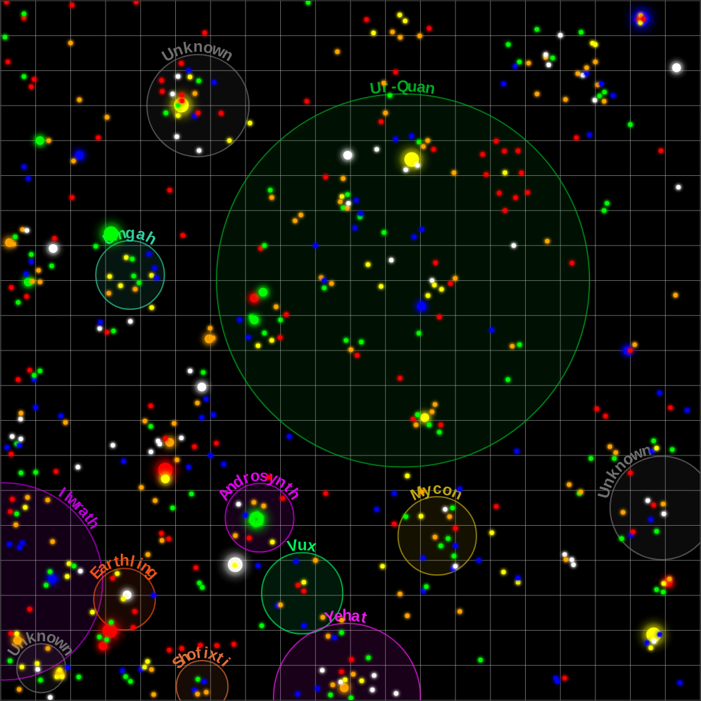

------------
------------
------------

## Глава десятая. Цирк уехал, клоуны остались

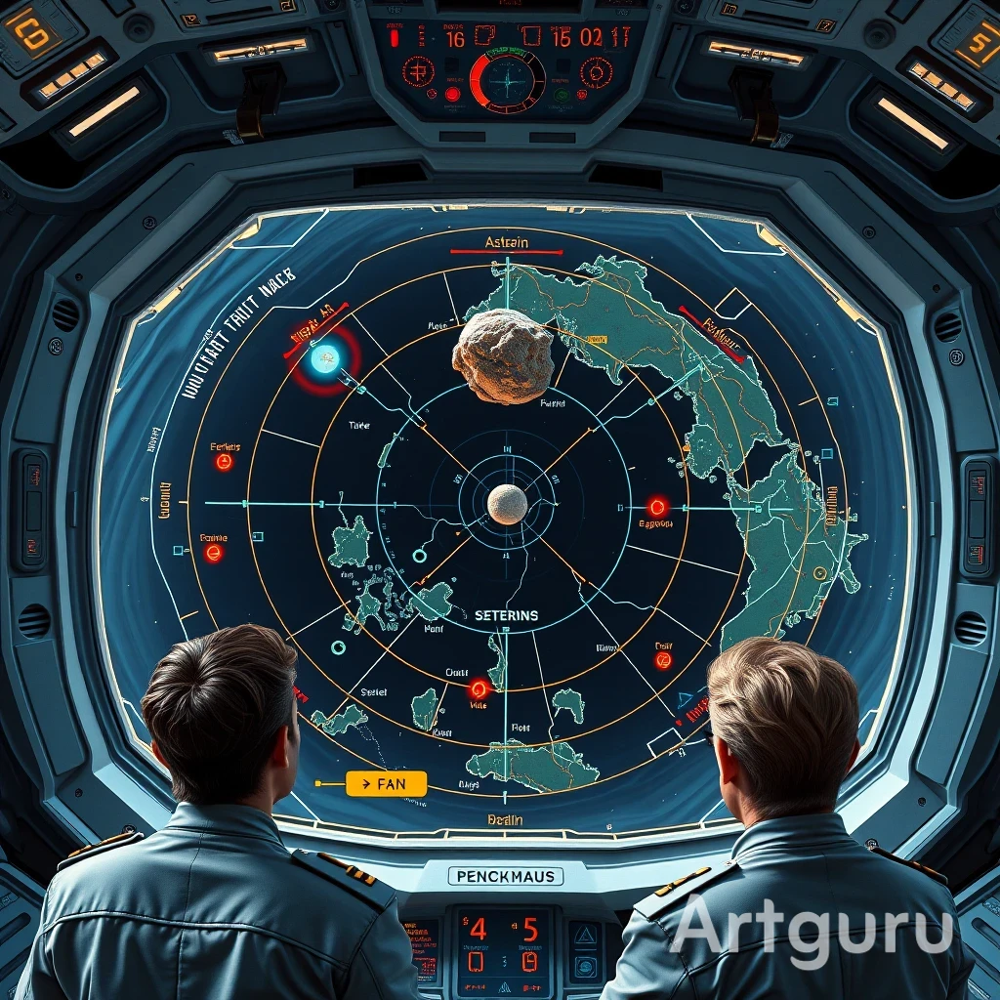

— Ну что, Алекс, — я посмотрел на карту системы, — нам нужно место для контакта. Такое, где поменьше «Дронов». Чтобы мы и поговорить успели, и Фиво не пришлось отбиваться от целого карнавала.

Басов быстро пробежал пальцами по тактическому экрану, вырисовывая зону патрулирования Умга. Быстрыми уверенными движениями он наполнял карту всё большим и большим количеством важной информации — траектории, скорости, зоны видимости — всё это сливалось в сложный узор, который читать как открытую книгу мог только он.

— Вот неплохое местечко, в секторе S-31. Там всего два «Дрона». — Его указательный палец коснулся экрана, очерчивая небольшой участок космоса вдали от основной активности.

— Далёковато лететь, да и планета там поблизости. — Покачал я головой. — Боюсь, оттуда может прийти подмога. Зачем нам лишний риск?

Его пальцы вновь заскользили по панели, отбрасывая одни варианты и приближая другие. Казалось, он водил не по экрану, а непосредственно по пространству системы, ощущая его пульс и ритм.

— Вот. Сектор R-17. — наконец произнёс он. — Два «Дрона» копошатся возле крупного астероида. Остальные слишком далеко, чтобы быстро среагировать. Оптимальный баланс дистанции и изоляции.

Я приблизил изображение. Астероид был испещрён кратерами и выглядел безжизненным. Идеальный нейтральный фон для грядущего циркового представления.

— На поверхности точно чисто? Никаких сюрпризов? — уточнил я, понимая, насколько «сюрпризы» Умга могут быть фатальными.

— Ни одного энергетического следа, кроме этих, — Он указал на два корабля, танцующих вокруг астероида. — Просто кусок скалы.

— Отлично. — выдохнул я. — Вот и давай туда. По краешку, аккуратненько... Остановимся в секторе F-15. Оттуда запустим Фиво. Он подлетит поближе, через него откроем канал связи. А сами пока подождём в сторонке. Вне досягаемости их сенсоров.

...Медленно, почти стелясь по вакууму, «Арго» начал свой крадущийся путь. Мы были не охотниками, а дичью. Маленькой рыбкой, заплывшей в аквариум к пираньям.

— Фиво, это капитан. Слушай внимательно. Сейчас мы тебя катапультируем...

Из динамиков донеслось лишь тихое сопение.

— Двигайся в сектор R-16. Рядом с тобой в секторе R-17 будут два «Дрона». Как только мы свяжемся с ними через твой канал связи, они сразу отреагируют. Скорее всего, после окончания беседы — придётся с ними э-э-э... разобраться. Так что будь наготове.

— Я... я понял, — его голос был несколько твёрже, чем я ожидал.

— Тогда слушай дальше: Первый «Дрон» намного ближе к тебе. Расчёты показывают, что к моменту прибытия второго противника ты уже будешь завершать разборки с первым. В любом случае, ты с ними легко справишься. Главное, не паникуй. Ты делал это тысячи раз на симуляторе. Доверься рефлексам. Сделай всё, как Лиза учила.

— «Вираж девяносто... ракеты... не жди.», — пробормотал он, и это прозвучало почти как заклинание.

— Именно. А потом — сразу к нам. Мы тебя подбираем и уносим ноги из этой перенаселённой системки.

— Понял... Хоть бы их шутки были смешными.

В его голосе не было надежды. Была лишь горькая, усталая ирония того, кто знает свою участь, смирился с ней, но всё равно собирается выполнить свой долг до конца.

— Тогда вперёд!

Раздался короткий, сухой щелчок катапульты. А мы с Басовым молча смотрели, как наш «Зайчик», воплощающий все наши надежды, поскакал навстречу веселью. Обычный рабочий день: отправляешь одного «бравого» Спасси разбираться с двумя безумными клоунами. Ничего необычного.

Мы замерли, ожидая, когда «Заяц» займёт указанную позицию, в то время как два корабля Умга продолжали свой хаотичный патруль, не подозревая о скором представлении.

Я перевёл взгляд на Басова. Он сидел неподвижно, его лицо было суровым и сосредоточенным, словно высеченным из гранита. Пришло время.

— Ну что, Алекс, — тяжело выдохнул я, чувствуя, как сердце начинает отбивать дробь. — Включай цирк. Давай посмотрим на лицо клоуна.

Басов кивнул и с видом сапёра, перерезающего провод, нажал клавишу, активируя протокол связи через ретранслятор «Зайца».

Внезапно экран просто погас. Наступившая тишина, была настолько гулкой, что в ушах начало звенеть. В этой тишине, словно из самой глубины космической бездны, послышались тихие, едва различимые шорохи. Они быстро набирали силу, превращаясь в навязчивый, давящий гул. А затем, пройдя через стадию угрожающего шипения, донёсся нарастающий, многослойный, безумный смех. Десятки, сотни голосов, слившихся в жутковатый хор, заполнили мостик. Переборки затрепетали, заставляя инструменты на панелях звенеть в такт этой леденящей душу какофонии.

И в этот момент на чёрном экране возник Умга.

Это было нечто, превосходящее любые архивные описания. Розовато-фиолетовое, студенистое существо, больше похожее на амёбу, чем на что-то разумное. И со всех сторон его покрывали десятки глаз разного размера, которые беспорядочно вращались и моргали с разной скоростью, создавая жутковатое ощущение разобщённости. В центре этой мешанины зиял огромный рот, полный мелких зубов, из которого то выпадал, то втягивался обратно длинный, розовый язык. Со всех сторон беспокойно извивались короткие, цепкие щупальца. А на макушке красовалась маленькая, криво сидящая кепочка с пропеллером, который бешено вращался, разбрасывая во все стороны разноцветные искры.

— Хар! Хар! Хар! Напугал тебя?! — проорал Умга, и его голос буквально ударил по барабанным перепонкам. Умга замер, а его глаза, как по команде, синхронно остановились и уставились прямо на нас. Рот растянулся в широкой, безумной ухмылке. «Ну, началось», — с горькой иронией подумал я.

— Привет, весёлые комочки! — бодро поприветствовал я... ЭТО.

— Ну разорвись моё брюхо! Это же человек-Землянин! Хар! Хар! Хар! Знаешь, я как раз думал, что моему дню не хватает острой приправы вроде вида зашоренного примата, а тут — бац! — и ты! Я не видел человека-Землянина с... с...! ДА Я В ЖИЗНИ НЕ ВИДЕЛ ЧЕЛОВЕКА-ЗЕМЛЯНИНА! Какое дикое, невероятное, потрясающее совпадение!

Я не стал уточнять что там у него с чем совпало, резонно рассудив, что лучше потратить время на более актуальные вопросы.

— А вы что тут делаете? Ваша сфера влияния же не распространяется дальше созвездия Ориона.

— Это когда было?! — подпрыгнул Умга, и один из его глаз выкатился из орбиты. — Ты совсем отстал от жизни, дружок-пирожок! Мы немного... расширились. Свободного места в галактике много, а хозяев мало, — он подмигнул всеми глазами сразу, — Вот мы и прибрали ничейное.

— А мы вот как раз мимо пролетали, решили спросить, как у вас дела?

— Дела? — он радостно заколыхался. — Дела — это когда у тебя есть лаборатория, море времени и вселенная, полная существ, которые так и просят, чтобы их «усовершенствовали»! Хар! Хар! Ладно, раз уж ты так вежливо, почти что по-рабски, просишь, расскажу тебе кое-что восхитительно мрачное. Например, знаешь ли ты, что прямо сейчас, пока мы тут болтаем, наши лучшие генетики делают операцию на мозге одной Говорящей Зверушки? Да-да! Арилу подобрали её, такую одинокую и умирающую, на месте крушения Дредноута Ур-Куанов — о, это было такое милое место, усыпанное обломками! Они не смогли её вылечить, потому что у них с биологией отношения как у Вуксов с хорошими манерами, поэтому притащили это сокровище к нам! И знаешь что? Мы обнаружили, что у этого животного просто ОГРОМНЫЙ потенциал к интеллекту! Нужно лишь сделать парочку незначительных генетических изменений... Ну, мы их поблагодарили, а потом здорово повеселились. Короче, счёт 7:3 в нашу пользу! Хар! Хар! Хар!

— Ну, зверушки меня не особо интересуют, а вот про Арилу и Дредноуты я бы послушал! Так где ты говоришь, живут Арилу? И... э-э-э... Нас, если что, благодарить не надо.

— Ну как это не надо!? — торжественно возмутился Умга. — Мы не можем быть неблагодарными с нашими гостями! Хар! Хар! Хар!... А про Арилу, — это же ваши союзники, вам лучше знать, где они живут. Но, если уж на то пошло, к нам они обычно подваливают со стороны созвездий Голубя, Циркуля и того типа — Чандрасекара... который, если верить слухам, был настолько плотным, что провалился сквозь собственную шутку! Хар!

Да вот в том-то и дело, что мы не знали где они живут. И никто не знал.

Когда началась война с Ур-Куанами, эти полутораметровые зелёные человечки с большими глазами и головами внезапно появились из ниоткуда и вступили в Альянс. И это всё, что мы о них знали. А откуда они прилетают и кто вообще такие, тогда Альянс волновало меньше всего. Главное, что они исправно поставляли корабли, которые благодаря возможности телепортироваться на небольшие расстояния всегда закрывали самые слабые бреши в любом сражении.

— Ну что ж, и на том спасибо, — кивнул я. — Как-нибудь заглянем к ним на чай.

— Обязательно! — ещё больше оживился Умга. — Только предупреди заранее, мы им передадим самонаводящиеся торты! Хар-Хар!

Я глубоко вздохнул, собираясь с мыслями. — А вы совершенно случайно не слышали что-нибудь о Чёрном Эскадроне Спасси?

— Что? Не слышу! — Умга приставил щупальце к тому, что можно было считать ухом. — Говори громче! Эй! В чём проблема? Человек Землянин насмехается надо мной? ЭТО КАКОЙ-ТО ДУРАЦКИЙ ЧЕЛОВЕЧЕСКИЙ ТРЮК? ПОТОМУ ЧТО ЕСЛИ ЭТО...

Я тут же посмотрел на Басова, глазами показывая: «Что случилось?!»
Басов развёл руками, слегка вжал голову в плечи и покачал ею в стороны, всем своим видом изображая: «Понятия не имею!». На его обычно невозмутимом лице читалась искренняя растерянность.

— ...Хар! Хар! Хар!... обманул тебя, да?! — рассмеялся Умга, и все его глаза снова забегали. — Ну надо же было посмотреть на твою растерянную рожу! Просто шедевр! Хар! Хар! Хар!

«Мда! Опять эти шутники! — пронеслось у меня в голове. — Опять их дурацкие шуточки!»

— Так что там с Чёрным Эскадроном? — повторил я, стараясь сохранять спокойствие.

— А-а-а... Хар-хар-хар! Это те самые истеричные маньяки, что спёрли нашу любимую игрушку, наш гиперволновой передатчик? — жизнерадостно затараторил Умга и его щупальца затрепетали в возбуждении.

— Думаю, да, — кивнул я.

— Те самые нервные мешочки с костями, что носятся по галактике и творят такую дичь, что даже Мировое Древо Шрем скукожилось бы от стыда?

— Э-э-э... Вообще не исключаю!

— Те, от кого сами Спасси, эти мастера по закапыванию головы в песок, открещиваются, как от прокажённого астероида?

— Точно!

— Неа, никогда о них не слышали. Хар! Хар! Хар! — Он так развеселился от своей шутки, что едва не рухнул на пол, сдерживая довольный смех.

Я вздохнул, чувствуя, как начинает подёргиваться глаз. — А можно поточнее? ЧТО ИМЕННО вы о них не слышали?

— Ох, с чего же начать... — Умга приложил щупальца к «вискам», изображая глубокомыслие. — Ну, мы, например, совершенно СЛУЧАЙНО не слышали, как они однажды подарили Ильрафам бомбу замедленного действия, преподнеся её как «Священное Яйцо Паучихи-Матери, которое нужно греть в самом жарком месте их паучьего гнёздышка»! Хар! Хар! Хар! Представляешь? Греют они его, греют, напевая молитвы, а оно — БА-БАХ! — Это же чистейший экспрессионизм! И вместо священного благословения — глобальная перепланировка пещеры! Мы бы и сами так пошутили, честное слово!

Что же ещё?... Ах да, мы ТОЧНО не слышали, как они озлобились на Ммрнмхрм и провели тщательно спланированную операцию по устранению угрозы в их лице. Был шум, гам, пальба... Ой что творилось! Вытащили какой-то там штепсель из их материнского ковчега, и тот — тю-тю. То есть кирдык. Другими словами — каюк... Они даже целую базу построили для этой спецоперации на Бете Геркулеса. Но мы СОВЕРШЕННО ТОЧНО, я бы даже сказал ГАРАНТИРОВАННО ничего такого не слышали.

Не сказать, что информация была прямо-таки бесценной, да и подана в привычном для Умга дурашливом стиле, но теперь мы хотя бы знаем, что они продолжают где-то носиться по галактике и устранять все реальные и мнимые угрозы. Да и про Бету Геркулеса — полезно. Значит база там всё-таки есть!

— Понятно, — кивнул я, мысленно отмечая новые данные. — А вы случайно не знаете, что случилось с Ур-Куанами в последнее время? Как-то тихо стало в галактике.

— Так к ним же БРАТАН ПРИЕХАЛ! Хар! — радостно сообщил Умга, и его пропеллер завертелся с такой скоростью, что искры посыпались настоящим фейерверком.

— Что ещё за братан? Откуда? — не понял я.

— Понятно откуда, ИЗ АФРИКИ! Хар!

— Из Африки? — я нервно улыбнулся. Это был какой-то новый уровень абсурда.

— Ну, а откуда же ещё? — Умга подмигнул всеми своими левыми глазами. — Такой же большой, злой, глазастый, только ЧЁРНЕНЬКИЙ! Хар! Хар! Хар!

— Про Африку — это шутка такая? — уточнил я.

— БИНГО! Поздравляю, человек, ты только что достиг уровня нашего юмора, обычно доступного лишь амёбам на третий день брожения! Хар-хар-хар! А если серьёзно... — он вдруг сделал серьёзное лицо, что выглядело ещё смешнее. — Хотя, кто мы такие, чтобы быть серьёзными? Вот если бы ты прилетел на два часа раньше, когда дежурил наш медик-биолог Флагго, он бы сказал, что братан чёрненький потому что у него гангрена на всё лицо! А я ксеноисторик, изучаю историю других видов. Ну ты понял... Хар! Хар! Хар!

«Ксеноисторик с пропеллером на макушке, — я с трудом удержался от саркастического комментария. — Солидней только доктор философских наук с клоунским носом»... — Ну и? Что братан?

— А братан... о, это гениально! — Умга снова пришёл в восторг. — Он прилетел на корабле, выточенном из чистого мрака и тишины, представился «Двоюродным Хранителем Бесконечного Цикла» — мы это добавили от себя, звучит солиднее, правда? — и заявил, что у них запланирована ВСЕГАЛАКТИЧЕСКАЯ ВНЕПЛАНОВАЯ ПРОВЕРКА СОБЛЮДЕНИЯ ПРОТОКОЛА ТОТАЛЬНОГО УГНЕТЕНИЯ! Хар! Хар! Хар! И теперь наши дорогие хозяева мечутся, как ошпаренные... Видать, на стол накрывают! Хар! Хар! Хар! По-братски же!

— А если поточнее? — попытался я докопаться до сути.

— А поточнее мы не знаем, — замахал во все стороны щупальцами Умга. — Просто им несколько лет назад резко стало ни до чего. Ни до патрулей, ни до проверок... Вот и к нам совсем не заглядывают. Не сказать, что мы расстроены. Меньше контроля — больше веселья! Вот недавно тюкнули одного Майкона по голове.

«Несколько лет назад... — мысленно прикинул я. — Хейс говорил, что как раз в то время станцию перестали снабжать всем необходимым. Поэтому при нашей первой встрече мы и застали их в таком плачевном состоянии, когда у них уже всё позаканчивалось. Ещё бы пару месяцев — и все бы вымерли на станции... Значит, не только у нас проблемы. Это хорошо!»

— А зачем вы Майкона-то тюкнули? Я не понял.

— А вот затем! Они — единственная раса с биотехническими знаниями примерно нашего уровня. Но фишка в том, что они всё делают своими телами, без инструментов! Они просто ДУМАЮТ о генетической модификации, и она происходит! Мы сочли это вызовом! Так что, пока никто не видел, оглушили одного и доставили на изучение. И знаешь что я тебе скажу? Эти ребята — не продукт эволюции. Они роботы! Сложнейший биологический инструмент. Мы не знаем, кто их создал и зачем, но это нечто... запредельное.

— Очень интересно, но ничего не понятно, — честно признался я. — А может, ну их, этих Ур-Куанов? Зачем вам это невольничество? — вкрадчиво начал я, прощупывая почву.

— Хар! Хар! Хар! Да! Свобода — отличная штука! — пропел Умга, и его глаза засияли. — Гораздо легче выдумывать хорошие шутки без скучных невольничьих законов Ур-Куанов! Мы давно хотим провернуть одну действительно грандиозную шутку с теми глупыми провокаторами в созвездии Дракона, но, так как они тоже воины-невольники Ур-Куанов, нам не разрешается делать им даже маленькие пакости, как, скажем... сбросить астероид в их океан. Большие волны! Большие волны! Хар! Хар! Хар!

— Так может, мы сможем договориться? Стать друзьями? Может, даже помогать друг другу? — осторожно предложил я.

— Конечно! Конечно! Конечно, друзья! — заверещал Умга, подпрыгивая на экране. — Кому есть дело до старых скучных Ур-Куанов и их рабских законов? Хар! Хар! Хар! Вот и мы — идём сказать привет нашим новым друзьям!

Эх... А я уже почти поверил...

На тактическом экране в этот самый момент, оба «Дрона» уже разворачивались в сторону «Зайца»... Всё. Шутки кончились.

— Я так понимаю, о союзе не может быть и речи? — спросил я в последний раз, уже зная ответ.

— Хар-хар-хар, человек! Мне нравится твоё чувство юмора!!! — Он расплылся в улыбке, а один глаз бодро мне подмигнул. — А теперь... ПОТАНЦУЕМ?!

Связь прервалась. Экран погас. А два красных значка устремились к одинокой зелёной точке.

------------

---

#### продолжение следует...

---

Специально для Александра М., который так отчаянно рвался заняться обратной вычиткой:

https://github.com/bazhenov-ai/lib/blob/main/bss/backwards_proofreading.txt

А это программа, которая позволит ему потом самому переводить актуальные версии книги в понятный ему формат:

Shell скрипт: https://github.com/bazhenov-ai/lib/blob/main/bss/backwards_proofreading.sh

Питон вариан: https://github.com/bazhenov-ai/lib/blob/main/bss/backwards_proofreading.py

---

### Баженов А.И.
#### https://github.com/bazhenov-ai/lib

#### CC0-1.0 license - public domain (общественное достояние)
