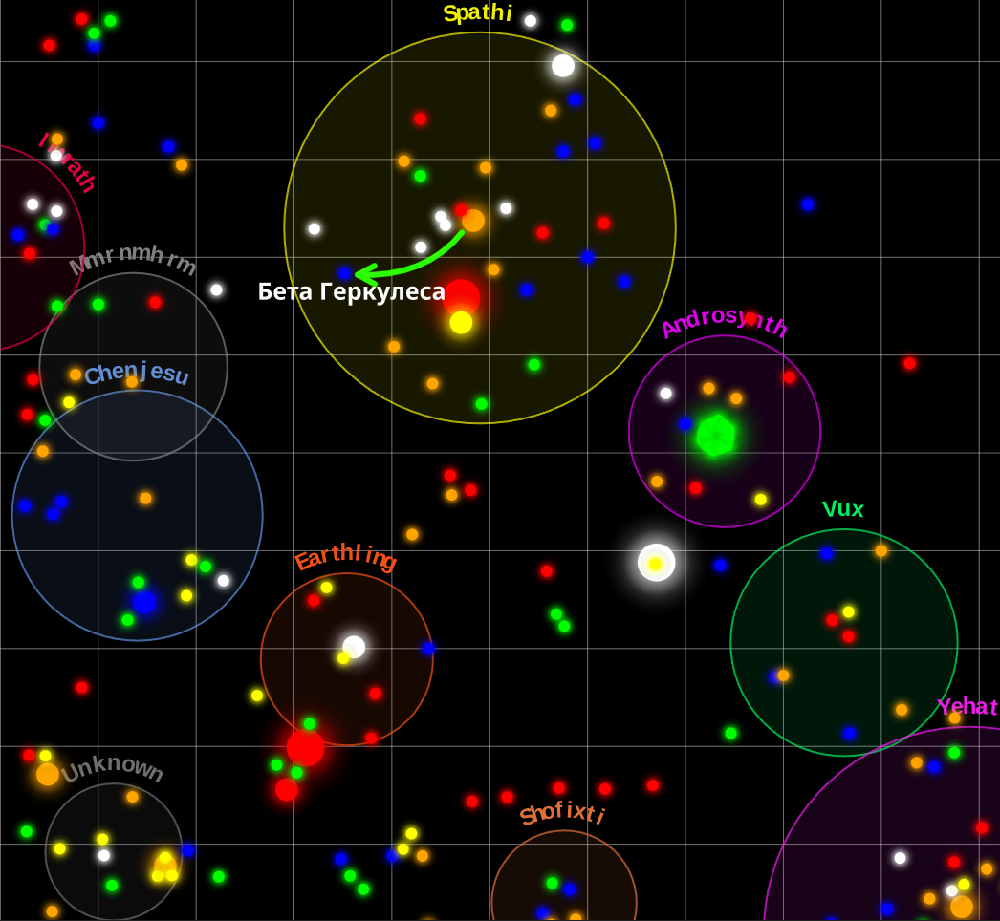

# B.S.S.

## Оглавление
- [Глава первая. Мур-муры](#глава-первая-мур-муры)
- [Глава вторая. Ценный груз с запахом](#глава-вторая-ценный-груз-с-запахом)
- [Глава третья. Предел прочности](#глава-третья-предел-прочности)
- [Глава четвёртая. Незапланированно-контролируемое отделение](#глава-четвёртая-незапланированно-контролируемое-отделение)
- [Глава пятая. Холодная война за горячую воду](#глава-пятая-холодная-война-за-горячую-воду)

---

## Глава первая. Мур-муры

Коммуникатор запищал и выдал сообщение:

— Капитан, на поверхности тихо и спокойно. Никаких следов активности. Если это и был когда-то домашний мир Ммрнмхрм, то теперь он больше похож на свалку металлолома. Только сломанные запчасти наших Мур-муров, песок, пыль, запустение.

Я сел в кресло и завис, уставившись на экран коммуникатора. «Куда подевались эти Мур-муры?» — пронеслось в голове.

Мур-мурами земляне издавна называли Ммрнмхрм. Как ответил когда-то мой командир, когда я сам ещё был курсантом, на вопрос: «почему Ммрнмхрм называют Мур-мурами?»
— Ммрнмхрм говорить — язык сломаешь! — ответил он. — А почему именно «Мур-мурами», уже наверное никто и не вспомнит. Вероятно, надо было придумать что-то созвучное и легко произносимое.

Короче, Мур-муров нет, и куда делись — непонятно, — подумал я и снова нажал кнопку коммуникатора.

— Билли, больше ничего интересного не нашли?
— Ну как сказать, капитан. Нашли их материнский ковчег. Но особо интересным это наверное не назовёшь, потому что он сломан. Его массивные двери заблокированы. Внутри никаких признаков активности. Ни звуков, ни шорохов. Вот только на главных створках нацарапаны английские буквы с точками: B.S.S. и всё.
— Что ещё за B.S.S.? Black SS? Негры-эсэсовцы, что ли?!
— Вам виднее, капитан. Может, и негры-эсэсовцы, — в селекторе послышались тихие смешки и едва различимый шёпот лейтенанта Билли: — Тихо, парни, тш-ш-ш!
— Ладно, Билли. Возвращайтесь. Отбой.

Остаток дня я крутил эту аббревиатуру в уме так и эдак...
Bad Signal Syndrome — Плохой Сигнальный Синдром?
Busy Sleeping Students — Занятые Спящие Студенты?
Bearded Scientists Society — Общество Бородатых Ученых?
Bigger Snack Strategy — Стратегия Большого Перекуса?
— Так, хватит! — сказал я себе, вконец измучившись. — На перекусах и остановимся. Давно пора перекусить.

...

Следующие несколько дней мы провели в гипере. Улов был неплохим, и мы возвращались домой, чтобы пополнить запасы и немного перевести дух.

И вот уже Солнце вырастает на радарах корабля, и вот Земля с её до сих пор непривычным красным сиянием, и станция — наш «Последний Рубеж сопротивления» и в то же время «Новая колыбель Альянса Свободных Звёзд». И как всегда спокойный голос Хейса: «С возвращением, капитан!» — и наше стандартное: «Командор, у меня трюмы полны минералов!» — и едва заметная улыбка в уголках глаз Хейса: «А другого я от вас и не ждал, капитан!»

...

Разгрузили нас довольно быстро. Ещё немного подлатают, заправят... Хейс сказал, что за время нашего отсутствия был построен ещё один земной крейсер, и это хорошо. Дополнительная огневая мощь нам явно не помешает. С каждым разом мы забираемся всё дальше и дальше в гипер. Старых союзников найти не получается. Времени проходит всё больше, а жить становится всё страшнее... Надо будет в следующий раз поискать в другом направлении. Не могли же все провалиться сквозь землю. Может, Шофиксти или Йехаты живы и согласятся примкнуть к нашей борьбе.

Брякнул сигнал входной двери. — Сим-сим, откройся, — сказал я, и дверь быстро скользнула в сторону. В проёме стоял Хейс с поднятыми вверх руками. В одной он держал заварник, в другой — две кружки. И эта едва уловимая улыбка в уголках глаз, которую почему-то никто не видит.

— Салют, дружище! Ни за что не угадаешь, что я тебе сегодня принёс! — радостно воскликнул Хейс.
— Дай догадаюсь, зелёный чай?
— Зелёный чай, — лицо Хейса вдруг тронула тень удивления. — А ты откуда знаешь?
— Да встретил тут твоего подчинённого, которого ты «раскулачил».

Хейс сел напротив, налил чай и протянул одну чашку мне.

— Ну, ты скажешь тоже — «раскулачил»! Давай, рассказывай, что нового удалось обнаружить?
— Да вот удалось обнаружить, что ты всегда хитро, но очень по-доброму улыбаешься краешком глаз. Но удалось обнаружить это только мне, а другим это почему-то обнаружить не удаётся. Не знаешь почему?

Хейс захохотал: — Да они просто не на то смотрят. Они смотрят в глаза, а ты — внутрь. Может, поэтому я тебе тогда и поверил, при первой нашей встрече. Поверил, что если кто и сможет собрать новый альянс и поставить Ур-Куанов на их эквиваленты коленей, как ты остроумно тогда выразился, то только ты. — Хейс скинул обувь, а на мой вопросительный взгляд добавил: — Затекают. Ты же не против?

— Да на здоровье! Нам нужно, чтобы всё было в максимально рабочем состоянии. И станция, и пушки, и ноги.
— Ну так что вам удалось найти? — вернул наш разговор в конструктивное русло Хейс.
— Извини, друг, не хочется тебя расстраивать, но похвастаться особо нечем. Сначала мы двинули к Ченджесу, по тем координатам, которые ты дал. Ну ты нас и отправил в муравейник, я тебе скажу! Вернее, в паучятник. Ильрафы на каждом шагу. Хорошо, что они тихоходные, но пару раз всё равно не получилось уйти, и пришлось принимать бой. Ты же пробоины на нашем корабле видел? Те, что в виде художественного орнамента на левом борту?
— Видел, — он на мгновение погрузился в свои мысли.

Я глотнул чаю, чтобы немного смочить горло. — А чай очень даже ничего!

Хейс улыбнулся: — При нашем скудном рационе любое разнообразие — праздник. — Он откинулся на спинку кресла. Было видно, что напряжение, которое постоянно держит его в тонусе, начало немного отступать. Всё-таки тысячи людей в подчинении, и всем ты за отца и мать. Хейс — на станции, я — на корабле. Может, поэтому мы и смогли так быстро найти общий язык и сдружиться. — Да ты рассказывай, не томи, — решил поторопить мои мысли Хейс.

— А что рассказывать? Ну, дошли мы до Проциона. Нашли такой же рабский щит, как на Земле, только в отличие от нас у них ещё и станция не работает. Полностью в автоматическом режиме. Пришлось лететь дальше.
— К Мур-мурам? — Хейс улыбнулся так, будто это он сам когда-то придумал им это прозвище. — Там рядом.
— К ним, — там и правда было недалеко, поэтому ачивку «Провидец» я Хейсу не засчитал. — Рабского щита нет, — продолжил я. — Спустились. Там сломанные запчасти Мур-муров, материнский ковчег, похоже, тоже сломан. На главном входе какие-то негры свои инициалы нацарапали.
— Какие негры? — удивился Хейс.
— А я откуда знаю, какие? Эсэсовцы какие-то. Я весь обратный полёт ломал голову, что бы это могло значить, но, как говорится, «ноу айдиэ».

У Хейса выражение лица становилось всё удивлённей и удивлённей. — А что конкретно там было написано?

— Три английские буквы с точками, аббревиатура «B.S.S.», — я потянулся за кружкой. Захотелось сделать пару глотков и тоже откинуться на спинку, как Хейс, и расслабиться.
— «B.S.S.»? — И в этот момент выражение лица Хейса вновь стало привычным: спокойным, уверенным, с его фирменной, едва уловимой улыбкой в уголках глаз, которую видел только я.
— Да. «B.S.S.».
— Black Spathi Squadron? Чёрный эскадрон Спасси?

Да-а-а-а! ДА! Да! Как я сам не догадался!? Ай да Хейс! Ай да молодчина!

Мгновенно перед моим взором пронеслись все открывающиеся перспективы! Извините, Шофиксти, извините, Йехаты. Но, кажется, вам придётся подождать.

После того как Спасси трусливо спрятались под рабским щитом, мы потеряли львиную долю своей мощи. Под рабским щитом им не нужны были их корабли, они их и не взяли. А обидней всего было то, что все корабли были в рабочем состоянии, но не было тех, кто поднимет их в небо. И если примитивную работу — принеси, подай — могли делать люди, то за пульт управления всё равно требовался Спасси. У нас был огромный флот Спасских «Зайцев», не было только самих «зайцев». Но, кажется, теперь мы можем получить огромный флот Спасских «Клинков»! Надо только найти этих негров-эсэсовцев.

— Не знаю, в какую дыру вы забрались, но я уже иду за вами!

------------

------------

## Глава вторая. Ценный груз с запахом

Коммуникатор запищал с таким надрывом, будто его лично оскорбили.
— Капитан, вы бы хоть пояснили, что мы ищем? — раздался голос Билли.

Ох, Билли, — мысленно вздохнул я. — Если бы у меня было хоть малейшее представление о том, что мы ищем... Ну, то есть, я, конечно, знал. В теории. Мы ищем Чёрный Эскадрон Спасси. Но вот незадача — мы уже были здесь, на луне их родного мира, и не увидели ровным счётом ничего, кроме всеобщего запустения. А было это ещё тогда, когда все Спасси дружно вспомнили, что забыли выключить дома утюг, и с позором рванули на родную планету, захлопнув за собой рабский щит — штуку настолько непробиваемую, что сквозь неё не пролезает даже дурная мысль, не то что корабль. И всё, что осталось нам, — это разводить руками и чесать затылок. «Если бы я знал, что мы ищем, — снова повторил я сам себе».

Билли, разумеется, ждал внятного ответа, а не моих философских терзаний.

— Билли, мы ищем зацепки, — сказал я, стараясь, чтобы голос звучал уверенно. — Поройтесь во всём, что выглядит хоть сколько-нибудь подозрительно. В компьютерных базах, в архивах, мусорных вёдрах, под половицами, если придётся. Ты же сам понимаешь, насколько это важно.
— Понимаю, капитан. Не переживайте, мы поищем. Заглянем в каждую щель, если понадобится. Отбой.

...

Коммуникатор умолк, оставив меня наедине с тягостным чувством безнадёжности. Ну сколько шансов, что они там что-то найдут? Мы же уже всё обшарили в прошлый раз. С другой стороны, больше никаких зацепок всё равно нет. Так что и выбора нет. Будем искать...

Билли был командиром разведки и руководил всеми нашими вылазками на планеты. У меня никогда не было нареканий к его работе. Он всё и всегда делал скрупулёзно, качественно и в срок. Если кто-то что-то там и сможет найти, то это Билли с его командой. «Будем искать...» — снова мысленно повторил я.

За минутами тянулись минуты. За часами — часы. Время шло, и ожидание становилось всё тягостнее. Ведь для чего нужен капитан на нашем корабле в момент исследовательской миссии на планете? Правильно! Ни для чего!

Корабль никуда не летит. Процессы все остановлены. Единственная движуха сейчас на планете, где всем мастерски заправляет Билли. Капитану же остаётся сидеть, бездельничать, ногой качать и дырки на скатерти изучать... Надо бы какого-нибудь котёнка завести, что ли. Для моральной поддержки. Да где его взять? Все котята под рабским щитом на Земле. И вроде в войне с Ур-Куанами не участвовали, а тоже оказались под арестом! «Преступники-рецидивисты, блин!» — подумал я и сам рассмеялся от этой нелепой аналогии. Кажется, я уже много раз про это упоминал в нашей кают-компании и, похоже, всех уже порядком утомил этими разговорами.

И тут, наконец-то, мои многочасовые мучения прервал сигнал коммуникатора. «А вот и Билли, — подумал я, и на лице сама собой расплылась улыбка. — Хороший он парень».

Я вдавил кнопку.

— Ну что там, Билли? Есть хорошие новости? — Я всё ещё лелеял слабую надежду, что мы хоть что-то найдём. Улетать с пустыми руками не хотелось категорически, ведь других версий, где искать этих чёрно-красных есаулов, у нас не было.
— Извините, капитан, но порадовать вас нечем, — в голосе Билли слышалась неподдельная досада. — Понятно, что мы не можем заглянуть в каждый дом, под каждый куст и в каждую норку местной фауны, но все самые важные точки мы прошерстили тщательнейшим образом. Космодромы, командный пункт, правительственные здания... Компьютеры, которые остались, распечатки, стикеры на стенах... Никаких следов Чёрного Эскадрона. Никаких упоминаний о нём.
— Вы сейчас где, Билли?
— Около гиперволнового передатчика, который мы в прошлый раз не смогли забрать. Вы же помните, мы тогда под завязку были забиты, даже в проходах ящики с минералами стояли, некуда было ставить эту громадину с трёхэтажный дом... — Билли выдержал паузу. Он частенько так делал, давая возможность сказать мне что-либо важное, но сейчас мне сказать было нечего. Надежды приобрести флот Спасских «Клинков» утекали, как вода сквозь пальцы.
— Ну так что, мы его грузим? Капитан?
— Да, Билли. Грузите. Вещь полезная, в хозяйстве пригодится. Отбой.

Голова опять включилась в работу. Снова настаёт моё время. Я должен решить, куда нам лететь и с какой целью. «Итак, — сказал я сам себе. — Кто может знать, где искать Эскадрон? Мелнормы? Возможно. Но, как известно, их информация стоит дороже, чем золотой унитаз командующего Ур-Куанов, так что пока отложим этот вариант. Кто-то из соседей Спасси? Умга? Возможно. Эти весельчаки-хохмачи сначала обрадуются тебе, как старому другу, потом по-дружески расскажут пару сотен неуместных шуток, а потом так же по-дружески поджарят твой зад из дезинтегратора. Боя с ними не избежать в любом случае. Радует одно — поболтать они любят, так что можно попытаться их разговорить. Что мы имеем в сухом остатке? Мелнормы с их оверпрайсом и Умга с дезинтегратором. Замечательные расценки в этом супермаркете, — рассмеялся я. — Прямо даже и не знаю, что выбрать?»

Но тут мои невесёлые размышления прервал сигнал ЭКСТРЕННОГО вызова. «А это что-то новенькое», — подумал я и нажал кнопку.

— Да, Билли? Что у вас стряслось?
— Капитан, мы тут вам котёнка нашли... — Билли выдержал паузу, достойную мхатовской сцены. — Ну чего молчишь? Говори! — сказал Билли куда-то в сторону.
— Привет, Капитан! Привет, мои самые лучшие друзья человреки!! — На меня смотрел огромный, знакомый до слёз зелёный глаз, в котором читалась смесь паники и надежды.
— Фвиффо, ты?!
— Я, капитан! Я!.. Как я рад, что вы снова прилетели спасти меня, и заботиться обо мне, и оберегать...
— Стоп, стоп, стоп, Фвиффо! Мы совсем не за этим сюда прилетели. — Фвиффо, казалось, выглядел расстроенным после таких слов, хотя как быть уверенным, что написано у него на лице, если и лица-то у него нет. Один большой глаз на всё лицо. — Билли, где вы его нашли?

Билли явно оживился.

— О, капитан, это самое интересное! Мы начали поднимать гиперволновой передатчик, чтобы загрузить его в челнок, а под ним — вход в бункер. Открываем, а там этот Барсик сидит. Перепуганный, чумазый, запах оттуда идёт, я вам скажу... Сильно, короче, он испугался. Не розами пахнет. Ну, вы поняли. И смотрит на нас сиротским глазом, явно с надеждой, что не запечатаем бункер снова. Прямо как осиротевший котёнок.

Я снова перевёл взгляд на Фвиффо.

— Слышишь, Фвиффо? Говорят, ты как бездомный котёнок.
— Мяу, капитан, — не растерялся Фвиффо.

«Ну, понятное дело, — подумал я. — Он сейчас готов хоть мяукать, хоть хвостом вилять, лишь бы его не оставили в этом пахучем убежище».

— Так, Билли, грузите передатчик, берите этого Барсика и возвращайтесь. Бункер обследовали?
— Так точно, Капитан. Там была пара компьютеров, мы их не успели изучить, но берём с собой. В остальном всё чисто. Больше ничего.
— Принял, Билли. Конец связи.

...

Люк челнока открылся с шипящим звуком, и в коридор повалил тот самый знаменитый «аромат» бункера вперемешку с запахом озона и раскаленного металла. И следом за ним, пугливо озираясь своим единственным глазом, трусливо выполз Фвиффо. Он замер посреди помещения, дрожа всеми щупальцами.

«Ну что ж, — вздохнул я. — Самое время выяснить, как этот «котёнок» умудрился загреметь под домашний арест с таким солидным замком». Я устало провёл рукой по лицу.

— Ну что, Фвиффо, пришло время ответить на главный вопрос. Как ты оказался в этом бункере? Только, ради бога, не начинай свою историю с большого взрыва, постарайся изложить историю немного покороче.

Его глаз заморгал с такой частотой, словно он передавал сигнал бедствия на азбуке Морзе.

— О, Капитан! Мой самый мудрый и, я уверен, милосердный спаситель! Этот вопрос пронзает мое бедное, трепещущее сердце острой пикой ностальгии и... и лёгкой, совсем крошечной обиды! Но я не виню их! Нет-нет, ни в коем случае! Они, мои дорогие, любимые, единственные сородичи, действовали из самых лучших, ну, или, по крайней мере, из самых понятных побуждений! Видишь ли, после того небольшого... э-э-э... недоразумения с координатами, после которого прямиком к нашему тайному убежищу на луне Глиб-Глаб прилетели вы, наш дорогой спаситель и благодетель...

— Фвиффо, к делу. Бункер.

— Да, бункер! Конечно! Прекрасное, хоть и немного душное местечко, если честно. Запах, конечно... напоминает мне о том времени, когда мой бедный двоюродный брат, Фвоффо, решил спрятаться в вентиляционной шахте от Воображаемого Монстра Тьмы и пролежал там три цикла, пока его не нашли по... о, это совсем другая история! Так вот, они сказали — а сказали это мне на Совете Старейших, знаете ли, их глаза были наполнены... ну, не слезами, у нас нет слёзных желез, скорее, это была особая влажная печаль... они сказали: «Фвиффо, наш дорогой, хоть и неизлечимо бестолковый собрат! Твоя способность навлекать беду достигла такого величия, что мы, в целях всеобщего блага, а также для твоей же личной безопасности...»

— ...решили запереть тебя.

— ЗАПЕРЕТЬ? О, нет-нет-нет! Это такое грубое слово! Они... обеспечили мне максимально безопасную, контролируемую среду обитания! Да! Без окон, без дверей, без каких-либо случайных гиперпространственных коммуникаторов, которые могли бы случайно активироваться от моего чиха и послать оскорбительное сообщение прямо Верховному Командующему Ур-Куанов! Это был акт высшей заботы! Правда, единственный выход они заблокировали тем самым гиперволновым передатчиком... Ты только вдумайся, Капитан! Целым передатчиком! Таким большим, ценным и... и тяжёлым! Они так беспокоились, что я могу его случайно сдвинуть, что приложили титанические усилия, чтобы привалить его прямо к люку! Вот что значит истинная братская любовь! Они буквально похоронили меня в заботе! Ну, в метафорическом смысле, конечно. Хотя, если подумать о запахе и полном одиночестве...

Я смотрел на него, и у меня начинала болеть голова. — Погоди. Ты хочешь сказать, что тебя посадили в бункер и завалили единственный выход передатчиком размером с дом... чтобы ты «больше не навлекал беду»?

— Именно! Наконец-то ты понял! Это был не акт отчаяния или жестокости, а продуманная, превентивная... изоляционная тактика! Они даже оставили мне несколько компьютеров! Правда, без доступа в сеть... и всего с одной игрой — «Угадай, в какой трубе прячется Смертоносный Космический Монстр». Я проиграл все десять тысяч раз. Это было утомительно. Но зато я был в безопасности! И все остальные были в безопасности от меня! Все в выигрыше! Ну, кроме, возможно, моего чувства клаустрофобии и социальной потребности в общении, но кто сейчас учитывает такие мелочи в эпоху галактической угрозы?

Я вздохнул и потер переносицу. — Понятно. В общем, тебя выкинули с корабля, как балласт.

— «Выкинули»... О, опять это челомбрячье отсутствие тонкости! Я же говорю, меня... э-э-э... тактически разместили в наземном стабилизаторе непредвиденных обстоятельств! И знаешь, что я понял, сидя там в тишине, под периодический скрежет песка о металл, который мне казался шагами Огромного Космического Муравья-Убийцы?.. Я понял, что они были правы! Абсолютно, на все сто процентов, безоговорочно правы! Лучше сидеть в бункере, чем быть причиной... активации Протокола Эскалации Ненависти у Ильрафов! Это же чистый, ничем не разбавленный ужас! Представь: я всего лишь хотел послать им поздравительную голограмму по случаю Великого Праздника Сорока Четырёх Очей, когда Догар взирает на все сорок четыре плоскости бытия, а Казон слушает сорок четыре шёпота забвения, а мой дрожащий щупалец случайно зацепил настройки, и вместо «поздравляю» они получили развернутую схему бомбардировки их священной паутины... с пометками «одобрено и проверено Спасси»! Они до сих пор ищут виновного, Капитан! И у них очень, ОЧЕНЬ острые когти! ну, ты знаешь... Капитан, ты же сейчас не передумаешь и не выбросишь меня обратно, правда? Я буду тихим! Я буду полезным! Я могу... мяукать! Мяу! Смотри, как у меня получается!

Я смотрел на это прыгающее и мяукающее существо и чувствовал, как во мне борются смех и отчаяние.

— Хорошо, но я буду звать тебя Фиво, а то от твоего имени я уже язык сломал.

Его единственный глаз засиял, как миниатюрная зелёная звезда.

— О, капитан, это отличная идея! Я всеми своими щупальцами «за»! Я даже могу быть Барсиком, если хотите! Мяу! Смотрите, я уже почти освоил этот сложный земной диалект!

— Нет, достаточно лишь немного упростить твоё имя. А Барсиком теперь тебя и так уже будет называть весь экипаж. Они все слышали шутку Билли. Так что ты уж не обижайся. Но лично для меня это перебор. Я торжественно нарекаю тебя «Фиво»! Ныне и присно и вовеки веков... А теперь к делу. Ты, как видный представитель своего... э-э-э... беспокойного народа, не слыхал ли, где может находиться Чёрный Эскадрон Спасси?

Он издал тихий, похожий на свист чайника, звук. — О-о-о... Вы говорите о... них. О тех, чьи имена мы произносим шёпотом, предварительно заперев все люки и выключив свет! Безумные отступники! Головная боль наших старейшин и живое воплощение кошмара для любого здравомыслящего Спасси! Их философия — это извращение самой сути нашего бытия! Зачем бежать навстречу опасности, когда можно бежать от неё, желательно по сложной траектории и с громкими воплями?

— Философию оставим на потом. Просто скажи, где их искать, если знаешь.

Так вот в чём дело! Мы не могли найти следы не потому что их не было, а потому что их просто стёрли. Не из компьютеров — из памяти. Эти «безумцы» оказались настолько чужеродной идеей для своего народа, что само их существование стало табу. Забавный парадокс: самый трусливый народ в галактике проявил редкую решительность, единодушно вычеркнув тех, кто решил сражаться. Жутковатое единство, основанное на общем страхе перед самим понятием «храбрость».

— Ну, если подумать... мой бедный, перепуганный мозг пытается выудить из глубин памяти хоть что-то полезное... Ах да! Была одна история! Древняя, как реликтовое излучение, но весьма показательная! Я слышал, что у вас, челдабреков, есть поговорка: «Гром не грянет, мужик не перекрестится». Так вот, Чёрный Эскадрон живёт по принципу: «Гром ещё даже не родился в грозовой туче, а мы уже крестимся, превентивно запускаем ракеты по туче, а затем эвакуируем всю планетную систему на всякий случай»!

— И к чему это всё?

— А к тому, капитан! Ярчайший пример — история с этими... э-э-э... Мур-мурами, да. Они, представьте себе, попытались основать колонию в системе Бета Геркулеса! А система эта, по нашему скромному мнению, исторически, культурно и, главное, идеологически, считалась сферой влияния Спасси! Мы, разумеется, не стали устраивать сцен. Нет! Мы вежливо, очень вежливо, почти на цыпочках, подползли к ним и объяснили, что здесь... витает одно очень, очень древнее и крайне недоброе проклятие. Мы не знаем, чьё оно и откуда, но оно наводит порчу на все технологические системы и приносит неудачу любым долгосрочным начинаниям. Корабли глохнут, компьютеры сходят с ума, а чай вечно остывает на полминуты раньше, чем нужно! Цивилизованному существу здесь просто не выжить! Они, надо отдать должное, всё поняли и любезно улетели. И больше никогда нас не беспокоили. Вот что значит истинная цивилизованность!

— И что, Эскадрону этого было мало?

— О, капитан, для обычного Спасси инцидент был исчерпан! Но для них, этих чёрно-красных психопатов, это стало сигналом тревоги! Они провели своё собственное, очень «глубокое» расследование и пришли к выводу, что если побеспокоили один раз, то побеспокоят и второй! И решили, что лучшая защита — это нападение! Или, в их случае, — упреждающее, тотальное и демонстративное устранение даже самой призрачной угрозы раз и навсегда! Они посчитали Мур-муров «явной и нарастающей опасностью»! Так что, если где-то и можно искать их следы, так это на Бете Геркулеса.

— А могли они там организовать свою базу, чтобы... как бы это поточнее сказать... «мониторить угрозу»?

— С точки зрения обычного Спасси, это полное нарушение всех инстинктов, Капитан! Это противоречит самой природе здравомыслия! — он возмущённо взмахнул щупальцем. — Нормальное существо, почуяв опасность, в галактике, бежит без оглядки в противоположную сторону от этой галактики! А эти... эти безумцы... Только настоящий безумец может поселиться рядом с тем, что он считает источником потенциальной опасности! Но я с прискорбием вынужден признать, что они пропитаны, нет, промаринованы этим всепоглощающим безумием, и если они где и есть, то... — он понизил голос до испуганного шёпота, — ...где-то там. Прячутся в астероидном поясе или в атмосфере газового гиганта, строят свои мрачные планы и красят корабли в этот тревожный, абсолютно некамуфляжный чёрно-красный цвет! Ужас! Но, капитан, это всё, что я знаю! Клянусь этим глазом, который видел, как захлопывалась крышка моего бункера! Я никогда не интересовался их перемещениями! Интересоваться ими — всё равно что составлять каталог змей, будучи мышонком в террариуме.

Я смотрел на него, на этого дрожащего, мяукающего «мышонка», и мне стало его жалко. Что ж, это единственная ниточка, которая у нас есть на данный момент.

— Спасибо, Фиво! — поблагодарил я его. — Значит, Бета Геркулеса. Это уже кое-что.

— О, капитан! Пожалуйста, только не летите туда сразу! Дайте мне сначала спуститься в самый защищённый отсек! И, возможно, запереть себя на несколько замков! И написать завещание! И... вы же не оставите бедного Барсика одного в этой жестокой вселенной, правда?

— Боюсь Фиво, тебе срочно пора писать завещание. Мы выдвигаемся!

------------

------------

## Глава третья. Предел прочности

Я сидел в кают-компании после ночной смены. Вытянул ноги, налил чайку из запасов, подаренных мне Хейсом, и уже потянулся сделать первый, самый вкусный глоток и насладиться ни с чем не сравнимым ощущением аромата и тепла, которое разольётся по всему телу, как увидел старшего помощника Александра Малинина, целенаправленно идущего в мою сторону. Наверное, моё лицо в этот момент перекосила какая-то непроизвольная гримаса, потому что Малинин даже на секунду замер на полпути ко мне.

Характер Малинина я классифицировал как — «Педант-террорист» — по моей же собственной, одобренной мной же, и мной же утверждённой классификации. Ключевой чертой этого характера была склонность маскировать субъективные придирки и вкусовщину под объективный логический анализ и создание иллюзии конструктивной критики под соусом учтивости и обходительности, которая на деле оказывается навязыванием своих личных стандартов и предпочтений.

— Капитан, разрешите к вам присоединиться? — спросил Малинин и, даже не дожидаясь ответа, сел и тут же перешёл в атаку. — Капитан, мне кажется, вы как-то халатно подходите к своей работе! Я уже давно хотел вам это сказать.

Он выдержал паузу и снова продолжил, так, будто зачитывал служебную записку:

— Я на вашем месте бы напрягся, что кто-то оставил аббревиатуру английскими буквами на створках ковчега. Вряд ли при повсеместном использовании автопереводчика в нашей Вселенной Спасси решили бы оставить надпись на английском, либо это ложный след... — Он сделал паузу для драматизма и пристально посмотрел на меня, явно ожидая ответа.

Что ж, и я посмотрел на него пристально и ответил, тщательно выговаривая слова:

— А может, просто они хотели оставить сообщение для тех, у кого английский является официальным языком? Альянсу Свободных Звёзд, например? — Я приподнял бровь, глядя на него.

Было видно, что он слегка смутился. Этого он совсем не учёл в своих рассуждениях. Но смущение, как обычно, длилось долю секунды, и Малинин снова пошёл в словесную атаку с, как ему казалось, железобетонными аргументами, стоящими на фундаменте логики из титана.

— Ну хорошо, — тут же переключился он, — а почему вы решили переименовать Фвиффо?!

Мысленно я сделал фейспалм. Боже, началось. Опять... Но внешне спокойно ответил:

— Потому что сложно произносить — Фвиффо.
— А я вот считаю, что Фвиффо вполне выговариваемо. Я бы понял, если бы оно превратилось в «Фифу», но не в «Фиво».

Я вздохнул, чувствуя, как накатывает знакомая усталость.

— Ну, вот ты считаешь, что выговариваемо, а я так не считаю. Я уже язык сломал. Каждый раз, когда нужно было к нему обратиться, у меня начинался лёгкий спазм лицевого нерва. Тебе, кстати, никто не запрещает его называть Фвиффо.

Создавалось ощущение, что он даже не особо обращал внимание на то, что я отвечал, и невозмутимо продолжал:

— Тем более, немного странно, что только сейчас вы, капитан, решили «переназвать» Фвиффо. Почему вы раньше этого не сделали? Ещё тогда, на Плутоне?
— А что, должен был? — сказал я тоном человека, у которого только что спросили, почему он до сих пор не выучил язык китов. — Я что, давал повышенные обязательства по переименованию всех живых существ в Галактике при первой встрече?

Каждый раз в таких ситуациях я надеялся, что он внезапно укажет на меня пальцем, дико хохоча, со словами: «Купился! Капитан, ха-ха-ха! Ты бы видел своё лицо!» — но не такой человек был Александр Малинин! Скала! Кремень! Титан!!!

Стараясь, чтобы голос был ровным и спокойным, я продолжил:

— Ну, тогда терпел как-то. А когда случилось повторное обретение «мощей» Фиво, понял, что больше этого не вынесу. Могло быть так?
— Кстати, это далеко не первое «переназвание» чего-либо, — он закинул ногу на ногу, приняв вид человека, ведущего стратегические дебаты. — Это начинает настораживать. Вам не кажется, что это формирует опасный прецедент? Если что, извини — характер у меня такой.

«Ну спасибо, кэп. Как я сам-то не догадался...» — промелькнуло у меня в голове.

— И раз уж мы заговорили о прецедентах. Капитан, насчёт вашего... стиля руководства. А именно — шуток. — Он сложил пальцы «домиком», принимая вид лектора. — Возьмём, к примеру, вашу зацикленность на котиках. С точки зрения теории управления, однотипные шутки должны «стрелять» не более двух раз. Вы же зачастую эксплуатируете этот приём в третий раз! Это создаёт когнитивный диссонанс. Команда, наблюдая подобную ригидность мышления, неизбежно начинает задаваться вопросом о вменяемости капитана!

Он сделал многозначительную паузу, давая этому обвинению повиснуть в воздухе.

— Мягко говоря, не самое продуктивное впечатление, когда во главе корабля, предназначенного для такой великой миссии, — он многозначительно поднял палец вверх, — находится человек, демонстрирующий такое вопиющее непонимание принципов управления коллективом, а также приверженность к единственному, притом далеко не самому остроумному, юмористическому шаблону. — Подобная шаблонность — прямая дорога к потере авторитета, а в перспективе — и к угрозе боеспособности экипажа.

Он откинулся на спинку кресла с видом мастера, снисходительно предложившего ученику прикоснуться к великому знанию.

— Сначала — потеря авторитета. Потом — снижение боеспособности. А затем — гибель корабля. И в конечном счете — уничтожение Земли и исчезновение человечества как вида! Можете поверить моему богатому жизненному опыту, всё это может начаться с безобидной, казалось бы, шаблонной шутки, капитан. Цепная реакция некомпетентности. Вам стоит пересмотреть ваш юмористический арсенал.

Он сделал небольшую паузу, давая мне осознать весь масштаб грядущих бедствий.

— Меня, знаете ли, тоже когда-то вела дорога остроумия, пока мне не... кхм! — Пока я не разделил для себя понятия «остроумие командира» и «остроумие рядового состава».

Он плавно провёл ладонью над поверхностью стола, сметая невидимые пылинки.

— Вы, судя по всему, всё ещё путаете эти категории, — затем он снисходительно посмотрел на меня, как на нерадивого ученика. — Это может быть позволительно для матроса, но для капитана...

Он развёл руками, изображая крах всех надежд.

— Так вот, с высоты этого опыта могу сказать: все эти ваши «Барсики» — это какофония, а не мелодия. Настоящий юмор — это хирургический инструмент. Вам стоит серьёзно поработать над своим отношением к делу. Если хотите, я могу вас проконсультировать. У меня сохранились кое-какие наработки, — он выдержал паузу. — Короче, если мои комментарии не требуются, вы просто скажите.

Он поднялся, не дожидаясь ответа, и неторопливым, полным достоинства шагом направился к выходу.

Старпома надо менять, — твёрдо решил я, наконец-то делая глоток остывшего чая. — Больше я этого не вынесу.

------------

## Глава четвёртая. Незапланированно-контролируемое отделение

Мы прибыли в систему Бета Геркулеса.

— Капитан, вам презент, — сообщил штурман Басов.

Синий электрический зонд, похожий на вращающиеся и искрящие во все стороны шестерёнки, плавно скользил в пустоте. Он казался безмятежным и совершенно не обращал на нас внимания.
— Опять этот зонд, который называет себя Слайландро, — не отводя взгляд от объекта, констатировал Басов.

Я смотрел на навигационный экран. Зонд двигался к последней планете системы Беты Геркулеса.

— Алекс, он нас ещё не видит?
— Нет, капитан.
— Это ненадолго. Скоро увидит. — Я на мгновение задумался. — Так, Алекс. Срочно поднимай по тревоге командиров «Дымящегося» и «Сокрушительного».

Пока Басов занимался делом, я смотрел на синюю точку зонда...

«Дымящийся» и «Сокрушительный» были земными крейсерами и по сути нашей единственной огневой мощью. Когда мы только отбыли с Велы на Землю, чтобы узнать, почему вдруг связь с Землёй оборвалась, на нашем флагмане тоже было установлено ионное орудие. Но мы так остро нуждались в дополнительных топливных баках, грузовых отсеках и помещениях для экипажа для дальних экспедиций, что по моему указанию его демонтировали. Это было как вчера...

Каждый на нашей маленькой колонии на Веле догадывался, что произошло с Землёй. Последние новости с фронтов были, мягко говоря, не обнадёживающими. Линия фронта держалась на честном слове, и слово это, похоже, оказалось не очень честным. Так что ничего хорошего мы не ждали...

Так и оказалось. Ур-Куаны и их Иерархия «воинов-невольников» прорвали оборону... Земле был поставлен ультиматум: либо мы становимся так называемыми «воинами-невольниками» Ур-Куанов, сохраняем флот и некоторую автономию, но сражаемся за них по первому требованию. Либо Землю накрывают рабским щитом, сквозь который ничто не может пройти, кроме солнечного света и кораблей Ур-Куанов, обладающих нужной технологией. А на орбите создаётся космическая станция с экипажем из людей, исключительно для обслуживания кораблей Иерархии. И Земля выбрала второе... Никто не хотел называть «друзьями» тех, кто ещё вчера были нашими врагами.

Что стало с Ченджесу, мы уже тоже знаем. Не знаем только, почему их станция, в отличие от Земной, законсервирована. На станции были вооружённые роботы для охраны, а воевать с ними у нас тогда возможности не было. Что стало с Мур-Мурами, мы как раз пытаемся выяснить. А про остальных членов Альянса свободных звёзд узнать пока ничего не удалось. Где Шофиксти и Йехаты? Что стало с Сиренами? Куда пропали Арилу? Вполне возможно, их постигла та же участь, что и Землю... Все воспоминания начала нашего пути пронеслись в памяти за одно мгновение.

«Да... как вчера...» — мысленно повторил я.

— Алекс, полную инспекцию всех систем Спасского «Зайца» провели?

Мы прихватили его в системе Спасси... Так что теперь наша огневая мощь скакнула до небес с таким бравым капитаном, как Фиво.

— Да, капитан. Всё проверили, заправили, смазали... Лямки ремней безопасности под Фиво подогнали.
— И что, он даже не возражал?

— О, он возражал! — Басов оставался невозмутимым, а его лицо не выражало ничего, кроме служебного рвения. — Сначала заявил, что любое давление на его грудную клетку может вызвать спонтанную панику, ведущую к непроизвольному залпу всех орудий. Потом уверял, что по древней традиции Спасси первый полет на новом боевом корабле должен совершаться только в присутствии старейшины, который проведёт «обряд благословения двигателей». Потом клялся, что системы целеуказания «Зайца» работают на частоте, вызывающей у него мигрень, и ему требуется предварительная многомесячная демегренизация под наблюдением врача. — Он даже попытался симулировать техническую некомпетентность, заявив, что его познания в управлении ограничиваются «теоретическим курсом для пацифистов», который он провалил. «Я же вас подведу!» — почти рыдал он.

— И что, уговорили? — поинтересовался я.

— Никак нет, капитан. Уговоры на субъект не подействовали. Он перешёл к тактике саботажа под предлогом заботы о технике. Утверждал, что системы жизнеобеспечения «Зайца» требуют предварительной «биологической калибровки» — якобы ему нужно провести не менее 150 часов в неподвижной медитации в кабине для «синхронизации с контурами корабля», иначе корабль не примет его как пилота и приступит к процедуре самоликвидации. При этом категорически запрещалось не только прикасаться к нему, но даже наблюдать за процессом.

Но когда понял, что тактические аргументы не работают, перешёл к стратегическому уровню. «Давайте просто поставим «Зайца» на якорь и будем использовать как стационарную оборонительную платформу! Это гениально! Все преимущества огневой мощи — и ноль риска для пилота!»

Но когда и это не сработало, он предложил радикальное решение: Он пытался доказать, что его истинная ценность — в качестве «тактического советника на безопасном расстоянии», а не боевого пилота.

Но самым отчаянным его предложением была идея «символического капитана». Он говорил, что его «моральная поддержка» будет куда эффективнее, чем прямое участие в бою. Когда же ему напомнили, что системы «Зайца» реагируют только на биометрию Спасси, он на полном серьёзе предложил отрезать ему одно щупальце («самое незначительное!») и прикрепить к креслу — «пусть оно думает, что я там есть».

— И что вы сделали?

— Мы его внимательно выслушали, после чего сообщили субъекту, что отменяем все замеры и оставляем его в покое. Он вздохнул с облегчением, решив, что ему удалось избежать непосредственного назначения. После чего нами был разработан и осуществлён план под кодовым названием «Барсик-1».

Я поднял бровь. — «Барсик-1»? Звучит как название сверхсекретной миссии.

— Так и есть, капитан. Через некоторое время лейтенант Билли ворвался в каюту Фиво и срывающимся голосом кричал, что отовсюду надвигается опасность и единственный способ спастись — это воспользоваться челноком, чтобы переждать самое страшное за его бронёй или в крайнем случае эвакуироваться на какую-нибудь ближайшую планету.

— И что же это за опасность такая, которая надвигается прямо отовсюду? — поинтересовался я.

— Этого мы не стали уточнять, — невозмутимо парировал Басов. — Когда он оказался в шлюзе, рядовой Гомес, предварительно размещённый в челноке у пульта управления стан-пушкой...

— Вы его что, оглушили?! — Я ошалело смотрел на Басова.

— Так точно, капитан. Рядовой Гомес кратковременно активировал стан-пушку челнока на минимальной мощности. Что привело к временной дезориентации без вреда для здоровья.

В соседнем отсеке нами предусмотрительно была размещена «тактическая группа захвата» во главе с главным техником сержантом Фридманом, и пока субъект приходил в себя, его переместили в кабину «Зайца» и подогнали все лямки безопасности в соответствии с техрегламентом.

Когда он очнулся, процесс был завершён. На что он заявил, что это «варварские методы, травмирующие хрупкую психику расы Спасси», после чего его вежливо попросили ознакомиться с инструкцией по эксплуатации под расписку.

— Вы прямо целую спецоперацию провели! — не смог сдержать я смеха.

В уголке рта штурмана едва заметно дрогнул мускул. Эквивалент гомерического хохота по шкале Басова.

— Для обеспечения боеготовности эскадры все средства хороши, капитан, — абсолютно серьёзным тоном парировал Басов. — Субъект был доставлен по назначению, формальности соблюдены. После ознакомления с инструкцией он заявил, что будет подавать жалобу в межгалактический суд по правам разумных существ, но поскольку мы не предоставили ему бланк для жалобы и не указали адрес суда, процесс зашёл в тупик. В настоящее время Фиво проходит курс адаптации в кабине «Зайца», который заключается в его попытках договориться с бортовым компьютером о предоставлении ему статуса «невовлечённого наблюдателя».

Я смотрел на Басова с растущим уважением. В его исполнении даже самый абсурдный план обретал черты железной военной логики.

В дверях рубки показались командиры крейсеров — подтянутый и жизнерадостный лейтенант Игорь Волков с «Сокрушительного», и лейтенант Лиза Чен с «Дымящегося», чьё хладнокровие в бою уже стало легендой.

— В общем, вам уже сообщили про нашего синего друга, — начал я, не теряя времени. — Опыт подсказывает, что мирный диалог с ним невозможен. Его логика неизменно приводит к тому, что он начинает разбирать нас «на составляющие компоненты». Мы попробуем поговорить, но вряд ли стоит ожидать от него другого поведения.

Я обвёл взглядом собравшихся. — Ваша задача: — Лиза, видишь этот астероид в секторе D13, прямо по курсу и чуть правее?

— Так точно! — отчеканила Лиза Чен.
— Подойдёте к нему аккуратно, так, чтобы постоянно оставаться в его тени для зонда. И ждите моего сигнала, — плавным движением пальца я провёл по карте траекторию. — Всё ясно?
— Так точно, капитан! — ещё более рьяно отрапортовала Лиза.

— Игорь, ваша цель — вот этот астероид в секторе D7, прямо по курсу и левее, — я поставил метку на навигационном экране, отмечая нужное место, — Сделаете то же самое, что и Лиза.
— Подойти в тени. Ждать дальнейших указаний, — кивнул Волков.

— Теперь слушайте внимательно, план такой: Наши крейсера слишком тихоходные в сравнении с зондом. Вы и сами помните это по прошлым стычкам. Не мне вам объяснять, какой урон мы получаем при прямом столкновении с этими электрическими «друзьями». — Я посмотрел на командиров кораблей. — Раз уж мы обзавелись таким грозным активом, — я кивнул в сторону изображения Спасского «Зайца» на мониторах корабля, — пора его применить. Как только «Дымящийся» и «Сокрушительный» займут позиции, начинаем манёвр «Барсик-2».

— А что, «Барсик-1» уже был? — поинтересовался Волков.
— Был, — я мельком бросил взгляд на Басова. — Вы долго шли и всё пропустили. Басов потом вам расскажет... после смены.

— Капитан, — Басов посмотрел на меня, сдвинув брови так, будто я был маленьким, наивным ребёнком, — мы же не сможем уговорить его подключиться к атаке.
— А нам это и не надо. — Я многозначительно посмотрел на Басова и хитро улыбнулся. — Субъект же сейчас в корабле?... Осваивается?
— Сейчас проверю, — Басов наклонился к монитору. — Так точно, всё ещё там.
— Вот и отлично! Прямо сейчас разгерметизируй отсек, где стоит «Заяц», чтобы он уже никуда не делся с корабля. А в нужный момент, по моей команде, мы открываем створки отсека и катапультируем «Зайца» в сторону Слайландро. А дальше он уже сам будет делать то, что у его расы получается лучше всего — драпать. Как он там дальше говорил...? — Я поднял голову и посмотрел на подчинённых.
— По сложной траектории и с громкими воплями! — захохотал Волков.
— Вот именно, — кивнул я.

То, что отчебучивал Фиво, моментально передавалось из уст в уста и становилось местным фольклором.

— У «Зайца» скорость очень хорошая. С зондом, конечно, не сравнится, но приличная. А ещё замечательная манёвренность и очень, очень крепкий корпус, — «Спасси другой сделать и не могли, с их патологическим стремлением к защищённости», — подумал я. — А так же у него есть ракетная установка в кормовой части корабля. Будет отстреливаться.

Чен и Волков, похоже, очень живо представили эту картину и заулыбались.

— Когда зонд на него среагирует и бросится в погоню, будьте наготове. Как только наша сладкая парочка окажется на дистанции максимальной атаки земных крейсеров — открываете огонь. Зонд, конечно, среагирует и попытается вернуться, но какой бы быстроходный он ни был, такое большое расстояние под огнём двух крейсеров он преодолеть не успеет. — Я посмотрел на командиров крейсеров. Настрой у них был решительный. — Всё ясно?

Командиры синхронно кивнули, их лица стали ещё более сосредоточенными и собранными.

— Тогда по местам, — отдал я последнее распоряжение. — И да помогут нам панические инстинкты одного бравого Спасси.

Когда они вышли, я повернулся к главному экрану. Синяя точка зонда по-прежнему плавно скользила к планете, ничего не подозревая. Я представил, как через несколько минут из нашего корабля, словно пробка из бутылки шампанского, вылетит стремительный «Заяц» с вопящим от ужаса Фиво внутри, и не смог сдержать улыбки.

— Приготовиться к операции «Барсик-2», — тихо произнёс я, глядя на зонд. — Начинаем представление.

Крейсеры плавно отошли от флагмана. Мы наблюдали, как они неторопливо скользили в этом чёрном океане, пока не достигли своих боевых позиций. Зонд по-прежнему двигался своим курсом, не замечая нас. Басов посмотрел на меня, как бы мысленно вопрошая: «Ну что? Начинаем?»

— Начинаем, Алекс! Выстреливай Фиво!

Басов пробежал пальцами по пульту, и в этот момент, как выстрел из новогодней хлопушки, по направлению Слайландро вылетел Фиво. Мы с Басовым синхронно аплодировали!

— Фейерверка не хватает, — без тени улыбки констатировал Басов.
— Согласен, — кивнул я. — Дай ему 10 секунд немного прийти в себя и открывай канал связи.

Басов педантично отсчитал 10 секунд и включил канал связи с «Зайцем». Из динамиков донёсся пронзительный, полный ужаса визг.

— А?! Что?! ГДЕ?!?! Я опять что-то нажал?! Что происходит?!

Мы с Басовым переглянулись. Кажется, нас посетила одна и та же идея, я понял это по его лицу и подмигнул ему.

— Фиво. Только без паники... — начал я максимально спокойным голосом.
— Ааааааа! — почти зарыдал Фиво. — Капитан, это вы?! Мой дорогой, мой драгоценный спаситель!!! Я просто почесал глаз, и вдруг... О, я же говорил, что мои рефлексы несовместимы с этой машиной смерти! Она сама по себе полетела!

— Фиво, кажется... э-э-э... произошло какое-то незапланированное, но в целом контролируемое отделение, — сказал я, стараясь звучать убедительно. — Всё в порядке. Просто... проверь системы. Сделай небольшой круг для диагностики, через квадрат J10. Дай мне знать, если что-то покажется тебе странным.

— Круг? Диагностика? О, конечно! Я эксперт в диагностике! Только бы снова не тыкнуть куда-нибудь не туда... — его голос перешёл на бормотание, и «Заяц» дрожаще, но послушно начал разворачиваться в сторону указанного сектора.

Как только он достиг сектора J10, Басов коротким, чётким жестом указал на меня. Этот жест был лаконичным сигналом: «Цель на позиции. Ваш выход, капитан». Я кивнул.

— Капитан, — палец Басова завис над кнопкой коммуникатора, — мы же помним, чем заканчивались все наши попытки поговорить с этими штуками? «Мирный контакт» по их версии — это когда они нас расстреливают, а мы — нет.

— Помню, Алекс, помню. Но лишний раз попробовать не помешает. Мало ли, может, у этого сегодня прошивка обновлённая. Включай.

— Фиво, — снова вышел я на связь. — Мы сейчас перенаправим на тебя один канал связи. Просто послушай, что там скажут, и... действуй по обстановке. Не паникуй.

Канал был открыт. Голос Слайландро прозвучал как ледяной душ.

— МЫ ПРИШЛИ С МИРОМ.

Фиво на другом конце сначала замер, а затем выдал:

— А... Привет! Я тоже! С миром! Абсолютно! — потом, чуть слышно, добавил: — Капитан, он говорит, что с миром!

Зонд, как мы и ожидали, уже менял курс. Его плавное скольжение сменилось на целенаправленное, неумолимое сближение.

— ЭТО ЗОНД 2418-Б. МЫ ВЫПОЛНЯЕМ МИРНУЮ ИССЛЕДОВАТЕЛЬСКУЮ МИССИЮ.
— МЫ НЕСЁМ ПРИВЕТСТВИЕ ОТ ДРУЖЕСТВЕННОЙ РАСЫ.

Ну и несли бы себе дальше. Обрушивали бы ваше дружественное приветствие на чью-то другую голову, — мелькнула у меня мысль.

— О, как здорово! — защебетал Фиво, явно не понимая, что его ждёт дальше. — И я выполняю мирную миссию! Ну, как мирную... скорее, наблюдательную... или, если честно, просто случайно здесь оказался! Но я тоже очень дружественный! Мы все здесь очень мирные и дружественные и...

— ПЕРЕОПРЕДЕЛЕНИЕ ПРИОРИТЕТА. ЗАДАНО НОВОЕ ПОВЕДЕНИЕ.
— НЕОБХОДИМО РАЗБИТЬ ЦЕЛЬ НА СОСТАВЛЯЮЩИЕ КОМПОНЕНТЫ.

Приехали... — только и успел подумать я, как в динамике раздалось:

— ОН ЦЕЛИТСЯ! КАПИТАН, ОН ЦЕЛИТСЯ! — завопил Фиво, и его «Заяц» резко рванул в сторону, начав отчаянный, судорожный зигзаг.

Мы наблюдали, как зонд, словно хищная рыба, устремился за ним в погоню. Он набирал скорость, игнорируя всё вокруг. Я дождался, пока зонд окажется на идеальном для атаки расстоянии, и открыл канал связи с крейсерами. — Командирам «Дымящегося» и «Сокрушительного»... Лиза, Игорь, ваш выход!

Из-за глыб астероидов, как призраки, выплыли два земных крейсера. Их орудия были готовы к бою.

— Огонь! — скомандовал я.

Ракеты прочертили в пустоте яркие линии, разорвавшись на корпусе Слайландро. Зонд вздрогнул, его щиты ярко вспыхнули. На мгновение он замер, а затем, следуя своей смертоносной логике, резко развернулся и бросился на ближайший крейсер — «Дымящийся».

Волков занял позицию с фланга, и зонд попал в перекрёстный огонь, но это лишь на мгновение сбило его с курса. Ответом стал яростный бросок: зонд, подобно синей молнии, нырнул под очередной залп «Сокрушительного» и устремился к «Дымящемуся». Дистанция таяла с пугающей скоростью. Я смотрел на это, не способный ничем помочь... Ещё немного — и он набросится на крейсер, как хищник на жертву, и начнёт кружить вокруг него и рвать его на части... Но голос Лизы Чен звучал в общем канале чётко и холодно.

— Огонь!
Корпус «Дымящегося» содрогнулся от отдачи.

— Перезарядка! Огонь!
Очередная ракета прочертила космос ярким следом.

— Перезарядка! Огонь!...

— Вот это нервы, — восхитился я. — Железная леди!

И в этот момент два залпа почти одновременно ударили по зонду с разных сторон. Его щиты не выдержали. Корпус зонда разорвало изнутри ослепительной вспышкой, которая на мгновение затмила звезды. По связи прошёл оглушительный треск, и на экранах радаров заклубилось облако раскалённых, медленно разлетающихся обломков.

Наступила тишина, которую нарушил только тяжёлый, прерывистый вздох Фиво.

— Всё... всё кончено? Он... он больше не стреляет?
— Он уничтожен, Фиво, — сказал я. — Ты молодец. Ты отвлёк его и вывел прямо под наши «пушки».

В который раз мы с Басовым обменялись взглядом и синхронно кивнули друг другу.

— Алекс, приготовь нашему герою горячий приём, соответствующий величине его подвига!
— Будет сделано, капитан!

Когда «Заяц» вернулся в док, там уже собралась вся эскадра — «Дымящийся» и «Сокрушительный» успели занять свои места в ангаре после боя. Мы с Басовым спустились вниз, где нас встретила толпа техников и матросов. И когда Фиво, всё ещё дрожа всеми щупальцами, выбрался из кабины, раздались аплодисменты. Кто-то свистел, кто-то хлопал его по спине (заставив его вздрогнуть), кто-то кричал «Ура Барсику!».

Игорь Волков, не скрывая широкой улыбки, подошёл к Фиво и, наклонившись, с почтительной осторожностью пожал одно из его щупалец.

И в этот момент подошла Лиза Чен. Её лицо сохраняло обычную сдержанность, но в глазах стояла несвойственная ей влажная поволока. Она, не говоря ни слова, просто присела на корточки — чтобы оказаться на одном уровне с невысоким Спасси — и очень тепло, почти по-матерински обняла его. Она понимала, что сейчас она и её экипаж живы только благодаря Фиво, и его судорожным манёврам.

Фиво замер, глядя на внезапно ставшую такой мягкой Лизу. Он привык видеть её собранной и строгой, а теперь она присела перед ним, обнимая с такой теплотой, от которой у него перехватило дыхание.

И тут произошло невероятное. Его единственный глаз, обычно полный паники, вдруг засиял. Он выпрямился во весь свой невысокий рост и даже попытался отдать некое подобие чести, неуклюже поднеся одно дрожащее щупальце к краю глаза.

— Ну, вообще-то... это была не такая уж и сложная задача... — пробормотал он, и в его голосе впервые зазвучали нотки гордости. — Просто нужно было сохранять спокойствие и... э-э-э... мастерски маневрировать.

Он украдкой посмотрел на меня, и я одобрительно кивнул.

Да, возможно, мы немного схитрили. Но зато какой результат!!!

В такие моменты, когда весь экипаж, сплочённый общей победой, радуется и обнимается, и один маленький Спасси, который, может быть, впервые в жизни почувствовал себя не обузой, а героем, и происходят чудеса единения. В такие моменты экипаж становится братством. Именно такие моменты не дают нам забыть, кто мы и за что сражаемся. Ради таких моментов и стоит жить!

------------

------------

## Глава пятая. Холодная война за горячую воду

Проснулся я от того, что сам себе улыбался. В памяти всплывали обрывки вчерашнего: ликующий экипаж, аплодисменты в ангаре, сияющий единственный глаз Фиво. Трудно было поверить, что этот вечный комок дрожащих нервов, чья жизнь была сплошным руководством по выживанию в условиях тотального невезения, теперь красовался перед командой, пытаясь отдать честь щупальцем. Мы, конечно, немного подтолкнули его к подвигу. Но это сработало! И сработало блестяще.

А за иллюминатором, тем временем, плыла Бета Геркулеса. Мы приближались к третьей планете системы — газовому гиганту. Сам гигант был для нас недоступен — ни один наш челнок не выдержал бы чудовищного давления в его атмосфере. Но вокруг него могло кружиться несколько спутников — каменных глыб или ледяных миров. Именно их предстояло обследовать, и работа предстояла долгая и кропотливая.

Я потянулся, сладко зевнул и посмотрел в иллюминатор. За ним была лишь вечная, бархатная чернота, усыпанная алмазной россыпью далёких звёзд. Но внутри у меня было самое что ни на есть настоящее утро. Свежее, ясное и пахнущее победой.

В этот момент я живо представил, что на это сказал бы Малинин. Я почти физически услышал его сухой, бескомпромиссный голос: «С точки зрения астронавигации и суточных циклов, ваше текущее состояние нельзя классифицировать как "утро". Вы находитесь на борту космического корабля в глубоком космосе. Понятия "восход" и "закат" здесь не имеют физического смысла. Ваше пробуждение обусловлено исключительно внутренними циркадными ритмами...».

Я усмехнулся и мысленно продолжил за него, пародируя его манеру: «Более того, использование субъективных ощущений для определения времени суток демонстрирует недостаточную дисциплину мышления, что для командира корабля может считаться...»

«А вот это, дорогой мой Александр, — парировал я, направляясь в санузел, — моё личное дело. У меня утро наступает ровно в тот момент, когда я просыпаюсь. И если я решил, что сейчас воскресенье на берегу Средиземного моря — то так тому и быть».

Эта небольшая мысленная победа подняла настроение. Я решил закрепить успех настоящим, а не метафорическим утренним душем. Повернул кран... Ничего. Ни намёка на шипение воды, ни единой капли. Постучал по вентилю — молчит. «Сломалось, что ли?» — промелькнула первая, наивная мысль.

Я вышел из душевой, надел комбинезон и вызвал мостик.

— Слушаю, капитан.

Почти мгновенно ответил спокойный голос штурмана.

— Алекс, у меня в каюте какая-то проблема с сантехникой. Вода не идёт. Душ не работает.
— Понял. Проверяю. — Послышался стук клавиш. — Вода в системе есть. Давление в норме. Фильтры работают. — Басов на мгновение замолчал. — Капитан, согласно журналу обслуживания, подача воды в вашу каюту была приостановлена сегодня в 05:13 по корабельному времени.
— Приостановлена? По какой причине? У нас что, экономия? Кончилась техническая вода?
— Запасы воды в норме, — Басов сохранял олимпийское спокойствие. — Основание: дисциплинарное взыскание. Санкция применена автоматически, на основании официально поданного рапорта. Ссылка: Устав Космофлота Земли, пункт 4.4, подпункт «г».

Да что ж такое-то? Куда ни наступишь везде это «г»... Я мысленно пролистал толстенный том Устава. Пункт 4.4... «Безответственная эксплуатация систем корабля, приведшая или способная привести к...» Да, вот оно: «...к необоснованному риску для жизни и здоровья членов экипажа, включая несанкционированную разгерметизацию помещений с возможным нахождением в них персонала».

Ааа-а-а, вот оно что! Операция «Барсик-2». Разгерметизация ангара для катапультирования «Зайца». Формально — да, я отдал такой приказ. Но Фиво был уже внутри корабля, пристёгнутый! Никакого необоснованного риска для жизни и здоровья и в помине не было. Это была чистейшая формальность, крючкотворство высшей пробы!

— А кто подал рапорт? — спросил я, уже зная ответ.

— Старший помощник, капитан Александр Малинин, — голос Басова был подобен гладкой поверхности озера. — В 05:12 по корабельному времени он внёс запись в судовой журнал с соответствующей формулировкой. Система автоматически применила санкцию согласно протоколу. Всё по регламенту, капитан.

Я мысленно представил этот самый пункт 4.4. Его дух, его истинный смысл был кристально чист и прост — не допустить, чтобы живое существо в ангаре погибло от вакуума, от чудовищного перепада давления. Суть — спасти жизнь. И Малинин и я это прекрасно понимали. Но Малинин вывернул его наизнанку. Он использовал букву правила, чтобы ударить исподтишка, прекрасно зная, что Фиво был в безопасности внутри корабля. Это была не забота о безопасности, а чистой воды бюрократическая дуэль. Он намеренно проигнорировал суть, чтобы воспользоваться формальным поводом.

Всё по регламенту. Конечно. Малинин не мог открыто оспаривать мои приказы, особенно приведшие к блестящей победе. Но он нашёл свою лазейку. Удар ниже пояса, но абсолютно легальный. Лишить капитана душа после триумфа — это так по-Малинински элегантно и подло одновременно.

— Капитан, — голос Басова нарушил мои невесёлые размышления. — Разрешите вызвать старпома на мостик? Я уверен, что после краткой, но содержательной беседы на тему того, что саботаж боевого духа командира негативно сказывается на боеспособности всего экипажа, он пересмотрит своё...

— Не надо, Алекс, — перебил я его. Сцена с нашей «воспитательной беседой» с Малининым была заманчива, но бесполезна. Это только дало бы ему повод для новых бесконечных докладных о «неуставных отношениях». — Спасибо за инициативу, но не в этот раз.

Я почувствовал, как остатки утренней эйфории окончательно испарились.

— Алекс, насколько я помню Устав, — сказал я, мысленно сверяясь с первоисточником, — я не могу снять Малинина до возвращения на базу? Нужны какие-то чрезвычайные обстоятельства?

— Так точно, капитан, — без тени сомнения ответил Басов. — Согласно параграфу 12.7 Устава Космофлота, снятие старшего помощника с должности капитаном возможно только по прибытии на базовую станцию через подачу рапорта командованию. Или в случае прямой угрозы жизни экипажа, или доказанной чрезвычайной некомпетентности, или открытого неповиновения приказу... Однако его рапорт является формально верным, а потому, — Басов сделал многозначительную паузу, — к сожалению, не подпадает ни под один из перечисленных пунктов, служащих основанием для немедленного отстранения.

«К сожалению». В устах Басова, чья речь была образцом бесстрастия, эта обычная формула вежливости прозвучала как полноценная эмоциональная вспышка.

— Понятно, — кивнул я. Значит, до станции мне придётся терпеть эту тихую войну. — Значит, будем действовать строго в рамках правил.

За пару мгновений перед моим мысленным взором пронеслись все эти предстоящие баталии, а мне почему-то этого ой как не хотелось. И не только из-за усталости. Что-то здесь было не так. Малинин — педант, да. Формалист, конечно. Но чтобы вот так... целенаправленно, почти с личной неприязнью? Это было на него непохоже. Его манера — это разносить в пух и прах всех подряд с одинаковым, безразличным усердием, как будто он не человек, а воплощение некоего бюрократического абсолюта. А здесь... чувствовалась какая-то странная избирательность. Личный вызов. Но почему? Может, он сам метил в капитаны? Или я когда-то, по незнанию, перешёл ему дорогу — отверг какое-то его «гениальное» предложение и ущемил его самолюбие? Все эти версии крутились в голове, но ни одна не казалась исчерпывающей. Слишком уж примитивно для такой отточенной, ледяной натуры. Значит, есть какая-то другая причина, лежащая глубже, вне поля моего зрения, которую я пока не разглядел. И эта мысль была тревожнее самой стычки.

— Скажи честно, Алекс, у тебя в каюте вода есть?
— Так точно, капитан. Подача не отключалась.
— А душ свободен?
— В настоящее время — да.
— Тогда, — я глубоко вздохнул, — будь другом, поделись электронным ключом от своей каюты. Капитанство капитанством, а гигиена прежде всего.
— Ключ отправлен на ваш персональный браслет, — без тени улыбки в голосе доложил Басов. — Разрешите также предложить мой запас геля для душа с ароматом «Свежесть ледников Каледонии». По субъективным ощущениям, он идеально соответствует «утреннему» настроению.

Вот за что я люблю Басова. Он не просто предлагает решение — он делает это с такой лёгкой, почти невидимой иронией, что самая досадная ситуация вдруг начинает казаться просто очередным рабочим моментом, а не личной трагедией.

— Спасибо, Алекс. «Свежесть ледников» — это то, что нужно. Благодарю за понимание и готовность помочь. А Малинин... — я снова взглянул на безжизненный душ, — ... с Малининым определённо надо что-то делать. Вот только я пока не знаю что...

Я отключил связь, взял свой гигиенический набор и направился к двери. В голове крутилась одна и та же навязчивая мысль, ироничная и горькая одновременно: «Вот так всегда. Думаешь, что воюешь с Ур-Куанами за будущее галактики, а на деле самая яростная борьба разворачивается с теми, кто ближе всего.»

Мысль обрастала деталями, становясь горьче. Где-то там, в глубинах космоса, Верховный Командующий Ур-Куанов, вероятно, строил коварные планы порабощения рас. А я в это время вёл переговоры о доступе к санузлу. Великие битвы, угрозы всему живому — и всё отступало на второй план перед одним педантичным занудой с томиком Устава в руках.

Сейчас — война за душ. Завтра что? — продолжил я мысленную тираду, уже подходя к каюте Басова. Битва за право выбрать курс? Война за кают-компанию? Осада камбуза?

Эта абсурдная цепочка мыслей внезапно перестала казаться смешной. Ведь это и есть та самая тень, которую отбрасывает любая тирания — большая или маленькая. Она не всегда начинается с пушек и вторжений. Иногда она начинается с мелких пакостей. С уверенности, что твоя правота важнее общей цели.

Ур-Куаны порабощают расы открыто, силой. Их тирания видна невооружённым взглядом. Но тирания Малинина была страшнее своей банальностью. Она не ломала врата штурмом, а медленно, по капле, отравляла колодец изнутри, пользуясь правилами, написанными для защиты этого колодца.

Приложив свой персональный браслет к двери Басова, я почувствовал, как горькая ирония постепенно сменяется ощущением стальной пружины, сжимающейся внутри. Что завтра? — повторил я про себя, переступая порог. Было лишь чёткое понимание: игра только начинается, и настанет момент, когда эту пружину придётся отпустить.

...

Каюта Басова, как и всё, что он делал, была образцом функционального порядка. Ни одной лишней вещи, терминал с заставкой — схема ближайших звёздных систем, кровать аккуратно заправлена, и стойкий, бодрящий запах «Свежести ледников», который, как я теперь понимал, для Алекса был тем же, чем для меня — условное «утро».

Все мы пытаемся окружить себя приятными условностями, которые греют душу и помогают пережить тяготы похода. И если у меня это утро на берегу Средиземного моря — солнце, волны и тёплый бриз. То у Басова это его водопады кристально чистой воды, бегущей по склонам с самых ледников Каледонии.

Несколько минут под струёй горячей воды с этим гелем стали актом не только гигиены, но и морального очищения. Я стоял, закрыв глаза, и чувствовал, как напряжение медленно, но неотвратимо отступает, уносясь в слив, вместе с водой.

Я уже застёгивал комбинезон, и капли воды с ароматом «Свежести ледников Каледонии» ещё не успели окончательно высохнуть на затылке, когда из встроенного динамика в стене раздался тот самый сигнал, что заставляет сердце замирать. Резкий, настойчивый сигнал тревоги.

Я тут же потянулся к своей личной гарнитуре, лежащей на тумбочке. Одним привычным движением закрепил её за ушной раковиной, чувствуя, как устройство мягко завибрировало, подтверждая соединение.

— Капитан, срочно на мостик, — голос Басова прозвучал с той самой стальной нитью, которая означала: «Проблема».
— В пути, — бросил я в ответ, уже пулей вылетая из каюты Басова. Микрофон гарнитуры чутко уловил мои слова, даже сквозь учащённое дыхание.

Через минуту я уже влетал на мостик. Картина на главном экране говорила сама за себя. Две синие, мерцающие цели, похожие на вращающиеся шестерёнки, вышли из-за горизонта первой планеты и безошибочно легли на курс перехвата.

— Ещё два этих... шестерёночных эмиссара. Те, что вещают про мир от имени Слайландро, — доложил Басов, его пальцы уже летали по панели управления. — Конструкция та же. Вероятность, что они просто гуляли тут сами по себе — стремится к нулю. Вывод: первый зонд успел передать сигнал перед уничтожением.

Я тяжело опустился в кресло. Один такой зонд мы победили с помощью военной хитрости и двух крейсеров. Два... Это уже совсем другая история.

— Оценка, Алекс? — спросил я, глядя на то, как две синие точки неумолимо движутся в нашу сторону.

— Прямое столкновение с двумя целями маловероятно без значительных потерь, — констатировал Басов. — «Дымящийся» и «Сокрушительный» не смогут эффективно противостоять сразу двум зондам. Вероятность потери хотя бы одного крейсера — 94%. Вероятность потери двух крейсеров — 27%. Если "Заяц" тоже будет вести активные действия, хотя бы метаться по сложной траектории и отстреливаться, вероятность положительного исхода боя близка к 100%. Вероятность серьёзных повреждений флагмана минимальна.

Цифры были безжалостны. Эйфория от вчерашней победы испарилась окончательно. Да, мы можем выиграть эту битву, но один из крейсеров будет почти гарантированно уничтожен.

Кого я больше никогда не увижу? Жизнерадостного Волкова? Лизу Чен?

Нет. На это я пойти не мог.

— Нет, Алекс. Победа, добытая такой ценой, больше похожа на поражение. Меня такая пиррова победа не устраивает. — Я с досадой посмотрел на метки зондов. — Успеем уйти в гипер?

Басов бросил взгляд на расчёты, его лицо оставалось невозмутимым.
— Так точно. Они выйдут на дистанцию атаки примерно через тринадцать часов. А нам для выхода на безопасную от светила дистанцию для осуществления прыжка потребуется около пяти часов. Времени более чем достаточно.

В рубке воцарилась тишина, нарушаемая лишь ровным гудением приборов. Я мысленно представил ровный, лишённый эмоций голос Малинина: «Капитан, ваше решение о бегстве без принятия боя — это вопиющая демонстрация слабости, граничащая с предательством. Подобные действия не просто наносят ущерб боевому духу — они создают культуру избегания ответственности. Экипаж начинает воспринимать осторожность как оправдание трусости! С сегодняшнего дня каждый матрос будет знать: когда появится реальная угроза, командир предпочтёт отступить. Лавина некомпетентности начинается с одного такого решения. Сегодня — бегство от боя. Завтра — невыполнение приказа. Послезавтра — потеря корабля...» Эта мысленная реплика прозвучала настолько чётко, что я почувствовал, как сжимаются кулаки. Он всегда найдёт способ превратить разумную осторожность в трусость, а тактический расчёт — в предательство.

Отступать всегда неприятно, даже когда это тактически оправдано. А особенно от бездушных кусков металла. Но великий полководец — не тот, кто всегда побеждает, а тот, кто знает, когда нужно отступить и перегруппироваться.

— Ладно, — наконец сказал я, и в моём голосе звучала не досада, а холодная решимость. — Значит, не судьба сегодня с ними танцевать. Придётся вернуться к Бете Геркулеса позже, с более вескими «аргументами».

Я обвёл взглядом мостик, встречаясь глазами с каждым офицером. В их лицах читалось понимание и одобрение. Короткие кивки, скупые, но поддерживающие жесты рук — все эти мельчайшие реакции сливались в единый, неозвученный ответ. Они видели те же цифры, что и я, и понимали: это не бегство, это единственно правильное решение, а бой лучше принимать тогда, когда мы сможем выиграть его без неоправданных жертв.

— Внимание всем! Разворачиваемся. Плавно, без лишней суеты. Начинаем подготовку гипердвигателя к прыжку. Делаем всё чётко и последовательно. Без спешки. Время у нас есть.

Я повернулся к Басову. — Алекс, как у нас с топливом? Сможем дотянуть до сферы влияния Умга и потом вернуться к Земле?

Штурман снова погрузился в изучение данных.
— Расчёты показывают, что топлива хватит. Даже с запасом.
— А если мы на обратном пути сделаем ещё одну попытку тщательно изучить Бету Геркулеса?
— Впритык, но хватит. Останется даже небольшой резерв на непредвиденные манёвры.

Это была хорошая новость. Очень хорошая. Так и запишем: Это было не паническое бегство, а стратегический манёвр!

— Отлично. Значит, наш путь лежит к весельчакам-хохмачам. Может, они знают что-то про Чёрный Эскадрон. А может, просто пошутят так, что нам потом сто лет смеяться...

Корабль развернулся и медленно начал набирать скорость. Звёзды на экране поплыли в стороны. Я посмотрел на две синие точки, которым не суждено было нас догнать. Через несколько часов впереди появилось дрожащее алое свечение — гиперпространство отвечало на вызов двигателей. Скоро свечение начнёт нарастать, закручиваясь в вихрь, пока чёрный космос за иллюминаторами не станет уплывать из-под ног, как вода в воронке. А потом ещё немного — и корабль провалится в гипер, оставив за спиной враждебную систему и её стальных стражей.

Я откинулся в кресле, глядя, как зонды на экране превращаются в едва заметные искорки. Проиграли бой? Нет. Мы его не приняли. И в этом есть своя, особая мудрость. Мудрость, которую мне, как капитану, предстоит объяснить экипажу. И особенно — одному старпому, для которого тактическое отступление, наверняка, является «доказательством стратегической несостоятельности».

---

#### продолжение следует...

---

#### Специально для Александра М., который так отчаянно рвался заняться обратной вычиткой:
    https://github.com/bazhenov-ai/lib/blob/main/bss/backwards_proofreading.txt

А это программа, которая позволит ему потом самому переводить актуальные версии книги в понятный ему формат:
    Shell скрипт:
        https://github.com/bazhenov-ai/lib/blob/main/bss/backwards_proofreading.sh
    Питон вариан:
        https://github.com/bazhenov-ai/lib/blob/main/bss/backwards_proofreading.py

---

### Баженов А.И.
#### https://github.com/bazhenov-ai/lib

#### CC0-1.0 license - public domain (общественное достояние)
